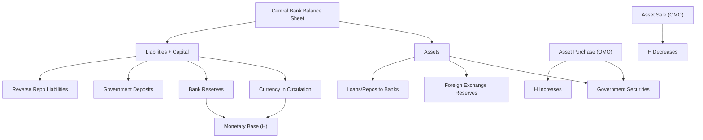

## Central Bank Balance Sheet Mechanics

### Overview

The central bank's balance sheet is the accounting framework through which all its policy operations — open market operations, discount lending, foreign exchange intervention, and unconventional measures like quantitative easing — are recorded and understood. Every policy action that changes the monetary base necessarily appears as offsetting entries on the central bank's assets and liabilities, making balance-sheet mechanics the operational foundation for understanding money supply determination.

### Structure of the Central Bank Balance Sheet

**Key Points**

As with any balance sheet, total assets must equal total liabilities plus capital:

$$\text{Assets} = \text{Liabilities} + \text{Capital}$$

**Typical Assets:**

- **Domestic securities**: government bonds and other securities acquired via open market operations
- **Foreign exchange reserves**: foreign currency-denominated assets (foreign government bonds, deposits at foreign central banks)
- **Loans to banks**: discount window advances, repurchase agreements (repos), emergency lending facilities
- **Gold and other reserve assets**: historically significant, now a minor share for most central banks

**Typical Liabilities:**

- **Currency in circulation**: banknotes and coins issued by the central bank, held by the public and banks (vault cash)
- **Bank reserves**: deposits that commercial banks hold at the central bank
- **Government deposits**: the treasury's operating account, often held at the central bank
- **Reverse repo liabilities**: short-term borrowing from banks or money market funds via reverse repurchase agreements
- **Capital/equity**: the central bank's own net worth (typically small relative to total balance sheet size)

A simplified representation:

| Assets | Liabilities |
| --- | --- |
| Government securities | Currency in circulation |
| Foreign exchange reserves | Bank reserves |
| Loans to banks (discount window/repo) | Government deposits |
| Other assets | Reverse repo liabilities / Capital |

**Key Points**

- Currency + bank reserves together constitute the **monetary base** ($H$) — meaning $H$ is definitionally tied to specific line items on the liability side of this balance sheet
- Changes in any asset item, holding other liabilities constant, mechanically translate into changes in $H$ — this is the accounting logic underlying all base-money creation

### Diagrammatic Representation

### T-Account Mechanics: Open Market Purchase

**Key Points**

When the central bank purchases $100 million in government securities from a commercial bank via open market operation:

**Central Bank T-Account:**

| Assets | Liabilities |
| --- | --- |
| +$100m Government securities | +$100m Bank reserves |

**Commercial Bank T-Account:**

| Assets | Liabilities |
| --- | --- |
| −$100m Securities, +$100m Reserves | (no change) |

The commercial bank simply swaps one asset (securities) for another (reserves) — but the reserves are newly created central bank liabilities, so system-wide bank reserves and the monetary base both rise by $100 million.

### T-Account Mechanics: Discount Window Lending

**Example**

A commercial bank facing a temporary liquidity shortfall borrows $50 million from the central bank's discount window.

**Central Bank T-Account:**

| Assets | Liabilities |
| --- | --- |
| +$50m Loans to banks | +$50m Bank reserves |

**Commercial Bank T-Account:**

| Assets | Liabilities |
| --- | --- |
| +$50m Reserves | +$50m Borrowing from central bank |

This directly injects $50 million into the monetary base, distinct from an outright asset purchase since the loan is a temporary liability of the bank that must eventually be repaid (unwinding the reserve injection when repaid).

### Autonomous Factors and Reserve Management

**Key Points**

- Not all changes in bank reserves stem from deliberate central bank policy actions — **autonomous factors** are balance-sheet items that shift for operational or seasonal reasons, requiring the central bank to offset them if it wants to hit a specific reserve or interest-rate target
- Common autonomous factors include:
  - **Currency demand fluctuations**: seasonal increases in public currency demand (e.g., holiday periods) drain reserves from the banking system as banks convert reserve deposits into physical cash to meet withdrawal demand
  - **Government deposit flows**: when tax payments flow into the government's account at the central bank, reserves are drained from commercial banks; when the government spends, reserves flow back in
  - **Foreign exchange settlement flows**: central bank FX operations (even non-policy-driven ones, such as facilitating client transactions in some frameworks) can shift reserve levels
- Central banks typically conduct routine, high-frequency open market operations (sometimes daily) specifically to **offset** these autonomous factors and keep reserve conditions consistent with the desired policy stance (e.g., a target short-term interest rate)

### Balance Sheet Size and Quantitative Easing

**Key Points**

- Under conventional monetary policy, central bank balance sheets are typically managed to a size just sufficient to implement the desired short-term interest rate, with modest, steady growth reflecting trend currency demand
- Under **quantitative easing (QE)**, the central bank deliberately and substantially expands its balance sheet by purchasing large quantities of government bonds and, in some cases, other assets (mortgage-backed securities, corporate bonds), financing these purchases by crediting the sellers' banks with new reserves
- [Inference] This mechanically expands both the asset side (securities holdings) and liability side (bank reserves) of the central bank balance sheet by the same amount, often by very large multiples of pre-crisis balance sheet size, as observed at several major central banks following the 2008 financial crisis and the COVID-19 pandemic — though the precise scale and design of QE programs has varied considerably across central banks and episodes
- Because QE-created reserves have, in various episodes, been held substantially as excess reserves by banks rather than fully re-lent, the relationship between balance-sheet expansion and broad money/credit growth has often been weaker and more variable than the simple money-multiplier model would predict (see Money Multiplier Model)

### Balance Sheet Contraction ("Quantitative Tightening")

**Key Points**

- The reverse process — reducing central bank asset holdings, either by selling securities outright or allowing them to mature without reinvestment ("passive runoff") — is often termed **quantitative tightening (QT)**
- QT mechanically reduces both securities holdings (assets) and bank reserves (liabilities), shrinking the monetary base and reversing, in balance-sheet terms, the expansion generated by QE

### Worked Example: Net Effect of Combined Operations

**Example**

Suppose in a given week the central bank:

1. Purchases $200 million in government securities (OMO) → reserves +$200m
2. Observes government tax receipts of $80 million flow into the treasury's central bank account (autonomous factor, reserves drained) → reserves −$80m
3. Extends $30 million in discount window loans → reserves +$30m

Net change in bank reserves (and hence monetary base, holding currency in circulation constant):

$$\Delta R = +200 - 80 + 30 = +\$150\text{ million}$$

The central bank might respond to this net injection with a smaller subsequent reverse operation if its actual target was a net change of, say, +$100 million, illustrating the routine, continuous balance-sheet management role central banks perform to hit reserve or rate targets.

### Comparison: Conventional vs. Unconventional Balance Sheet Operations

| Feature | Conventional OMO | Quantitative Easing |
| --- | --- | --- |
| Typical scale | Small, routine, fine-tuning | Large-scale, deliberate expansion |
| Asset maturity targeted | Short-term securities | Often longer-term securities, broader asset classes |
| Primary goal | Hit short-term interest rate target | Lower long-term yields, ease broader financial conditions |
| Frequency | Often daily/weekly | Programmatic, announced over extended periods |

### Criticisms and Limitations

- [Inference] The balance-sheet identity itself is an accounting fact and not in dispute, but the **behavioral consequences** of balance-sheet expansion (how much it affects bank lending, broad money, inflation, and output) are empirically contested, particularly regarding the size and reliability of the money multiplier during periods of large-scale reserve expansion, as evidenced by mixed findings across different QE episodes and countries
- Balance sheet mechanics describe *how* reserves and the base change, but do not by themselves determine *whether* banks choose to lend out the resulting reserves — that depends on loan demand, bank risk appetite, and capital constraints, factors external to the balance-sheet accounting itself

**Related Topics**

- High-powered money and the monetary base
- The money multiplier model
- Open market operations: mechanics and implementation
- Quantitative easing and quantitative tightening
- Autonomous factors and reserve forecasting in central bank operations
- Interest on excess reserves and the floor/corridor systems of rate control