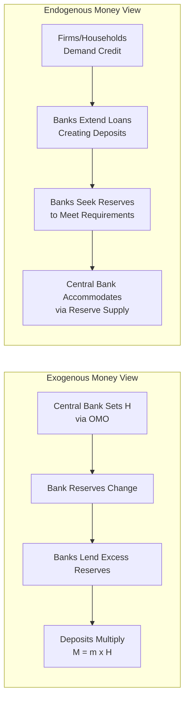

## Endogenous Versus Exogenous Money Supply Debates

### Overview

The endogenous-exogenous money debate concerns the fundamental question of **causality** in money supply determination: does the central bank exogenously set the money supply (or the monetary base), with the banking system mechanically multiplying it into broader aggregates — or does the money supply arise endogenously from the credit-creation decisions of banks responding to loan demand, with the central bank accommodating the resulting reserve needs? This is not merely a technical dispute but a foundational divide with significant implications for monetary policy design and macroeconomic theory.

### The Exogenous Money View

**Key Points**

- Associated with mainstream monetarist and traditional textbook treatments (Friedman, and the standard money-multiplier model)
- Money supply is treated as a **policy-determined variable**: the central bank sets the monetary base $H$ through open market operations, and the banking system multiplies this into broad money via the multiplier $m$: $M^s = m \times H$
- Causality runs: **Central bank action → Monetary base → Bank reserves → Loans and deposits → Broad money supply**
- This view underpins monetarist policy prescriptions (e.g., fixed money growth rules), since it presumes the central bank has effective control over the quantity of money in the economy
- The money supply is typically treated as **exogenous** in macroeconomic models built on this view — i.e., independent of the demand for money or the level of economic activity, at least in the short run, and set as a policy instrument

### The Endogenous Money View

**Key Points**

- Associated primarily with the **post-Keynesian** school of thought (e.g., Basil Moore, Nicholas Kaldor, and various circuit theorists), though elements of the view have also been articulated by some central bank research and communications
- Argues that banks extend credit in response to creditworthy loan demand from firms and households, **creating deposits simultaneously** with the loan (a bank loan is recorded as both a new asset for the bank and a new deposit liability, without needing pre-existing reserves)
- Banks then seek any required reserves **after the fact** — from the interbank market or, if necessary, from the central bank — meaning the central bank's role becomes largely **accommodative**: providing reserves to meet the needs generated by prior bank lending decisions, rather than pre-determining the quantity of loans/deposits that can be created
- Causality runs: **Loan demand → Bank lending decision → Deposit creation → Reserve demand → Central bank accommodates via reserve supply**
- Under this view, the central bank's primary lever of control is not the *quantity* of reserves/base money but the **price** of reserves — i.e., the interest rate it sets, which then influences the cost and hence demand for bank credit

### Diagrammatic Comparison of Causal Chains

### Key Points of Contention

**1. Direction of Causality Between Reserves and Loans**

**Key Points**

- Exogenous view: reserves constrain lending (banks cannot lend beyond what their reserve position permits)
- Endogenous view: lending decisions come first based on profitable opportunities and creditworthy demand; reserves are obtained afterward, since central banks generally do not want to see interbank rates spike due to reserve scarcity and will typically supply the reserves needed to maintain their target rate

**2. Nature of the Money Multiplier**

**Key Points**

- Exogenous view treats $m$ (in $M = m \times H$) as a relatively stable, largely mechanical coefficient reflecting fixed behavioral ratios
- Endogenous view treats the observed statistical relationship between $H$ and $M$ as running in reverse — money and credit growth "cause" reserve growth (since reserves must accommodate the deposits created by prior lending), rather than reserve growth causing money growth — implying the multiplier is not usefully thought of as a stable, policy-controllable parameter

**3. Role of Interest Rates vs. Quantities in Policy**

**Key Points**

- [Inference] Proponents of the endogenous view have argued that most modern central banks, in practice, operate primarily by setting a short-term interest rate target (e.g., a federal funds rate target or equivalent) and passively supply whatever quantity of reserves is needed to hit that rate, rather than fixing a reserve quantity and letting the rate be market-determined — a description that is consistent with a widely cited 2014 Bank of England quarterly bulletin article explaining money creation in the modern economy, though the broader theoretical implications drawn from this operational description remain a matter of debate among economists
- This operational observation is sometimes used by endogenous-money proponents to argue that the "money multiplier" story, while a useful pedagogical simplification, does not accurately describe the sequence of causation in actual central bank operations

### Empirical and Institutional Evidence Cited in the Debate

**Key Points**

- **In favor of endogenous money**: studies of bank balance sheets showing loans typically expand before, not after, corresponding reserve or deposit expansion at the aggregate level; central bank operational frameworks (particularly floor systems with abundant reserves) where reserve supply is deliberately made non-binding on bank lending decisions
- **In favor of exogenous money / multiplier relevance**: episodes where deliberate, large-scale central bank balance sheet actions (such as quantitative easing) were followed, with varying lags and magnitudes across episodes, by changes in broader monetary and credit aggregates, suggesting the central bank's balance sheet actions are not entirely irrelevant to the quantity of money and credit in the economy — though the strength and reliability of this relationship, as discussed in the Money Multiplier Model and High-Powered Money topics, has been empirically weaker than the simple textbook multiplier would predict, particularly during and after 2008

### A Middle Ground: Interest Rate Endogeneity with Base Money Relevance

**Key Points**

- [Inference] Many contemporary monetary economists occupy a middle position: acknowledging that modern central banks typically implement policy via interest rate targets (making short-run reserve supply largely accommodative and hence supporting a partly endogenous description of reserve dynamics), while still maintaining that central bank interest rate decisions have real and significant effects on bank lending volumes, credit conditions, and ultimately broader monetary aggregates over time — meaning the debate is not necessarily "either/or" but concerns the relative emphasis placed on quantity-based versus price-based channels of monetary transmission
- This middle-ground view is broadly consistent with most modern central banks' explicit framing of their own operations as interest-rate-centered rather than reserve-quantity-centered, a description that has become increasingly standard in central bank communications since around the 1990s–2000s shift toward inflation targeting and interest-rate-based policy frameworks

### Comparison Table: Exogenous vs. Endogenous Money Views

| Feature | Exogenous Money View | Endogenous Money View |
| --- | --- | --- |
| Primary causal driver | Central bank sets base money quantity | Bank credit creation in response to loan demand |
| Central bank's key lever | Quantity of reserves ($H$) | Price of reserves (interest rate) |
| Money multiplier | Stable, meaningful, policy-relevant | Statistical artifact; reversed causality |
| Theoretical lineage | Monetarism, traditional textbook IS-LM | Post-Keynesian economics, circuit theory |
| Policy implication | Money supply targeting can be effective | Interest rate targeting is the operationally accurate description |

### Worked Illustration of the Debate

**Example**

Consider a firm that approaches its bank for a $1 million loan to fund inventory expansion.

- **Endogenous money interpretation**: the bank, assessing the loan as creditworthy and profitable, approves it immediately, crediting the firm's deposit account with $1 million. The loan and deposit are created simultaneously through a balance-sheet entry, *before* the bank has sourced any additional reserves. The bank then manages its reserve position afterward — borrowing in the interbank market or from the central bank if needed to meet reserve requirements or settle payments arising from the new deposit being spent.
- **Exogenous money interpretation**: the bank's capacity to make this loan is fundamentally traced back to it having sufficient excess reserves (ultimately sourced from central bank base-money creation) to support the additional deposit liability under the prevailing reserve/capital framework; absent adequate reserves in the system, the loan could not have been extended by the banking system as a whole, even if this particular bank temporarily borrows reserves from another.

Both descriptions are consistent with the immediate balance-sheet mechanics of the individual loan; the disagreement concerns the ultimate systemic constraint and the direction of causation over a longer horizon.

### Criticisms and Ongoing Debate

- [Inference] Critics of the strict endogenous money view argue that even if reserves are accommodated in the short run, the central bank's interest rate policy still ultimately constrains the *volume* of profitable lending opportunities (by affecting borrowing costs), meaning the central bank retains substantial indirect control over money and credit growth, even without directly rationing the quantity of reserves
- Critics of the strict exogenous/multiplier view point to the historically poor empirical fit of stable money-multiplier relationships (see Empirical Estimation and Stability of Money Demand, and the "missing money" episodes), and cite explicit central bank descriptions of their own operations (e.g., the 2014 Bank of England explanation of money creation) as evidence against the reserves-constrain-lending causal story
- [Unverified] This remains an active area of theoretical and empirical disagreement among monetary economists rather than a settled question, with different schools of thought continuing to emphasize different aspects of the money creation process

**Related Topics**

- The money multiplier model
- Fractional reserve banking and deposit creation
- Central bank balance sheet mechanics
- Post-Keynesian monetary theory and circuit theory of money
- Interest rate targeting versus monetary aggregate targeting
- Friedman's restatement of the quantity theory (exogenous money foundations)