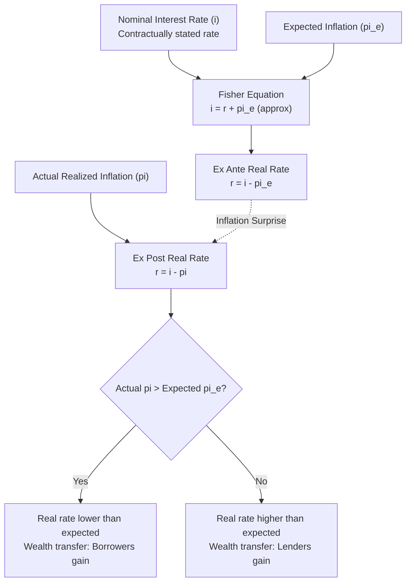

## Nominal and Real Interest Rates

### Overview

The distinction between nominal and real interest rates is foundational to monetary economics, separating the observable, contractually stated rate of return on an asset from the rate of return after accounting for the erosion of purchasing power due to inflation. This distinction underlies the analysis of savings, investment decisions, monetary policy transmission, and the interpretation of interest rate data.

### Definitions

**Key Points**

- **Nominal interest rate ($i$)**: the rate of return on an asset measured in current-dollar (money) terms, as stated in the loan contract or observed in financial markets — this is the rate typically quoted by banks, bond markets, and financial media
- **Real interest rate ($r$)**: the rate of return measured in terms of purchasing power — i.e., the nominal rate adjusted for the erosion of money's value due to inflation
- The real interest rate reflects the actual increase in **purchasing power** a lender/saver gains, or a borrower forgoes, over the period of the loan

### The Fisher Equation

The relationship between nominal rates, real rates, and expected inflation was formalized by Irving Fisher (1930).

**Exact Fisher Equation:**

$$(1 + i) = (1 + r)(1 + \pi^e)$$

where $\pi^e$ is the expected rate of inflation over the relevant period.

Expanding:

$$1 + i = 1 + r + \pi^e + r\pi^e$$

**Approximate Fisher Equation** (commonly used since the cross-term $r\pi^e$ is typically small):

$$\boxed{i \approx r + \pi^e}$$

Rearranged to solve for the real rate:

$$r \approx i - \pi^e$$

**Key Points**

- The approximation is reasonably accurate when both $r$ and $\pi^e$ are small (e.g., single-digit percentages); it becomes progressively less accurate as either variable grows large, since the omitted cross-term $r\pi^e$ becomes non-negligible

### Ex Ante vs. Ex Post Real Interest Rates

**Key Points**

- **Ex ante real rate**: calculated using *expected* inflation at the time the financial contract is agreed upon — $r^{ex\,ante} = i - \pi^e$. This is the rate relevant to a lender/borrower's decision-making at the time the loan is made, since actual future inflation is not yet known
- **Ex post real rate**: calculated using *actual, realized* inflation after the fact — $r^{ex\,post} = i - \pi$. This measures the real return that was actually achieved once the loan period has passed
- The two diverge whenever inflation expectations turn out to be wrong (inflation surprises); this divergence has significant distributional consequences between borrowers and lenders

### Diagrammatic Representation

### Worked Example

**Example**

A one-year bond offers a nominal interest rate of $i = 6\%$. At the time of purchase, investors expect inflation of $\pi^e = 3\%$ over the coming year.

**Ex ante real rate (approximate):**

$$r^{ex\,ante} \approx 6\% - 3\% = 3\%$$

**Exact calculation:**

$$1 + r = \frac{1+i}{1+\pi^e} = \frac{1.06}{1.03} \approx 1.0291 \implies r \approx 2.91\%$$

Note the small difference between the exact (2.91%) and approximate (3%) calculations, illustrating the minor imprecision of the approximation.

Suppose actual inflation over the year turns out to be $\pi = 5\%$ (higher than expected). The **ex post real rate**:

$$r^{ex\,post} \approx 6\% - 5\% = 1\%$$

The lender earned a real return of only 1%, far below the 3% they anticipated when agreeing to the loan — a wealth transfer from lender to borrower caused by the unexpected inflation surprise.

### Distributional Effects of Inflation Surprises

**Key Points**

- **Unexpected inflation ($\pi > \pi^e$)**: benefits borrowers (who repay in currency worth less than anticipated) at the expense of lenders (who receive repayment with less purchasing power than expected)
- **Unexpected disinflation ($\pi < \pi^e$)**: benefits lenders (who receive repayment with more purchasing power than anticipated) at the expense of borrowers
- [Inference] This redistributive channel is frequently cited as one reason why unanticipated inflation volatility is considered economically costly even setting aside its effects on relative prices and resource allocation, since it introduces arbitrary wealth transfers unrelated to the underlying productivity or risk characteristics of the loan

### The Real Interest Rate and the Term Structure

**Key Points**

- Nominal interest rates observed in bond markets across different maturities compound both real interest rate expectations and inflation expectations over the corresponding horizon
- **Inflation-indexed bonds** (e.g., U.S. Treasury Inflation-Protected Securities, TIPS; UK Index-Linked Gilts) provide a direct, market-based estimate of the real interest rate, since their principal and/or coupon payments are adjusted for realized inflation, removing inflation risk from the security
- The **breakeven inflation rate** — the difference between a nominal bond's yield and an inflation-indexed bond's yield of the same maturity — is commonly used by market participants and central banks as a proxy for the market's expected inflation rate $\pi^e$: $\pi^e \approx i_{nominal} - r_{indexed}$

### The Real Interest Rate in Monetary Policy Analysis

**Key Points**

- Central banks typically set a **nominal** policy interest rate as their operational instrument, but the rate that actually influences real economic decisions — consumption, saving, investment — is the **real** interest rate, since it reflects the true cost of borrowing/return to saving in terms of goods and services rather than currency units
- This distinction underlies the **Taylor Rule** and related monetary policy frameworks, which typically specify the policy nominal rate as a function of the deviation of inflation from target and the output gap, implicitly targeting a desired real interest rate path
- The **neutral (or natural) real interest rate**, $r^*$, is the real rate consistent with the economy operating at full employment/potential output with stable inflation — a theoretical benchmark against which the actual real policy rate is often compared to assess whether monetary policy is accommodative or restrictive

### Nominal Rate Cannot Fall Below Zero (The Zero Lower Bound) — Implication for Real Rates

**Key Points**

- [Inference] Since nominal interest rates have historically been considered constrained from falling much below zero (the "zero lower bound," though some central banks have since experimented with modestly negative nominal policy rates), the real interest rate that can be achieved through nominal-rate policy is bounded below by roughly $r \geq -\pi^e$ (approximately) when $i$ is at or near its floor
- This means that during periods of very low expected inflation (or expected deflation), central banks may be unable to lower the real interest rate sufficiently to stimulate a depressed economy through conventional nominal-rate policy alone, motivating the use of unconventional tools (quantitative easing, forward guidance, in some cases negative nominal rates) aimed at influencing real rates through channels other than the conventional nominal policy rate

### Comparison: Nominal vs. Real Rate Perspectives

| Feature | Nominal Interest Rate | Real Interest Rate |
| --- | --- | --- |
| Measured in | Current currency units | Purchasing power (goods/services) |
| Directly observable | Yes (quoted in markets/contracts) | No (must be inferred/calculated) |
| Relevant for | Financial contracts, loan agreements | Savings and investment decisions, economic welfare |
| Affected by inflation surprises | No (fixed by contract) | Yes (ex post rate deviates from ex ante) |
| Policy instrument | Central bank's direct lever | Central bank's ultimate target of influence |

### Criticisms and Complications

- [Inference] The approximate Fisher equation assumes a simple additive relationship and can be materially inaccurate in high-inflation environments, where the multiplicative exact form should be used instead for precise calculations
- Measuring "expected inflation" is inherently challenging since it is not directly observable; various proxies are used (survey-based inflation expectations, breakeven rates from indexed bonds, econometric forecasting models), each with known limitations and potential biases
- The Fisher equation as presented assumes no risk premium differences between comparing nominal and real assets; in practice, inflation-indexed bonds may carry a liquidity premium or other risk premia relative to nominal bonds, meaning the simple breakeven-rate calculation of expected inflation is only an approximation of true market inflation expectations

**Related Topics**

- The Fisher effect and its empirical validity
- Term structure of interest rates and yield curve theories
- Taylor Rule and monetary policy rate-setting frameworks
- The neutral/natural real interest rate ($r^*$) and its estimation
- Zero lower bound and unconventional monetary policy
- Inflation-indexed bonds (TIPS) and breakeven inflation rates