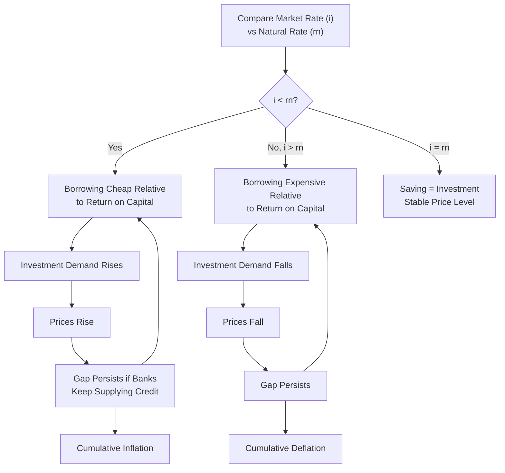

## Wicksell's Natural Rate of Interest and the Cumulative Process

### Overview

Knut Wicksell (1898), in *Interest and Prices*, developed a theory explaining how divergences between the **natural rate of interest** (a real, non-monetary equilibrium concept) and the **market (bank) rate of interest** (the actual rate charged on loans in the banking system) generate self-reinforcing, cumulative movements in the price level. This framework predates, and heavily influenced, later monetary business cycle theory and remains foundational to modern discussions of the "neutral" or "natural" real interest rate in central banking.

### The Natural Rate of Interest

**Key Points**

- The **natural rate of interest** ($r_n$) is defined as the rate of interest that would equate the demand for and supply of real capital (savings and investment) in a barter economy, or equivalently, the rate that would prevail if loans were made purely in the form of real capital goods rather than money
- Equivalently, it is the real return on newly produced capital goods — the marginal productivity of capital
- The natural rate is a **real** concept, determined by real (non-monetary) forces: the productivity of capital, time preference/thrift of savers, and the technological state of the economy
- Wicksell's natural rate is the rate at which **saving equals investment** and, correspondingly, the rate consistent with a **stable price level** (no tendency for cumulative inflation or deflation)

### The Market (Bank/Money) Rate of Interest

**Key Points**

- The **market rate** ($i$, sometimes denoted $r_m$) is the actual nominal interest rate charged by banks on loans, determined by the banking system's credit supply and demand conditions
- In Wicksell's framework, the banking system has some latitude to set this rate independently of the natural rate in the short run, since the money/credit supply is elastic (banks can expand credit through the fractional reserve system) rather than being tied to a fixed stock of real savings

### The Cumulative Process Mechanism

**Key Points**

When the market rate diverges from the natural rate, Wicksell argued this sets off a self-reinforcing, cumulative process rather than a one-time price-level adjustment.

**Case 1: Market Rate Below Natural Rate ($i < r_n$)**

1. Borrowing becomes artificially cheap relative to the return available on real capital investment
2. Entrepreneurs increase borrowing to fund investment, since the expected return on capital ($r_n$) exceeds the cost of borrowed funds ($i$)
3. Aggregate demand for investment goods rises, bidding up prices
4. As prices rise, and provided the banking system continues to supply credit at the low rate, the process **repeats and cumulates** — prices continue rising as long as the gap between $r_n$ and $i$ persists
5. This is a **continuing inflationary process**, not a one-time price jump, precisely because bank credit is elastic and can keep financing the excess investment demand round after round

**Case 2: Market Rate Above Natural Rate ($i > r_n$)**

1. Borrowing costs exceed the return available on real investment
2. Investment demand falls, as fewer projects are profitable at the elevated borrowing cost
3. Aggregate demand weakens, exerting downward pressure on prices
4. A **cumulative deflationary process** ensues, continuing as long as the gap persists

**Case 3: Market Rate Equals Natural Rate ($i = r_n$)**

- Saving equals investment at this rate, aggregate demand is consistent with the economy's productive capacity, and the price level remains stable — Wicksell's condition for monetary equilibrium

### Diagrammatic Representation

### The Role of Elastic Bank Credit

**Key Points**

- The cumulative process critically depends on the banking system's ability to expand credit **elastically** — i.e., without being rigidly constrained by a fixed stock of reserves or specie (gold) in the short run
- [Inference] Wicksell developed this analysis partly in the context of a "pure credit economy" (a hypothetical system with no commodity money constraint at all), in which the cumulative process could in principle continue indefinitely without a self-correcting mechanism, in contrast to a gold-standard-constrained banking system, where credit expansion would eventually be checked by reserve losses (e.g., through gold outflows as rising domestic prices reduce export competitiveness) — the pure-credit-economy case is more of a theoretical limiting construct that clarifies the driving mechanism than a literal description of any historical banking system Wicksell observed
- Under an unconstrained pure-credit economy, the cumulative process would only halt once the banking system itself deliberately raised the market rate back into alignment with the natural rate

### Worked Example

**Example**

Suppose the natural rate of interest, reflecting the real productivity of capital, is $r_n = 5\%$. The banking system, however, is currently supplying credit at a market rate of $i = 3\%$.

- At $i = 3\%$, businesses find that projects yielding even modest real returns (say, 4%) are profitable to finance via bank borrowing, since the cost of funds (3%) is below the return (4%), even though such projects would not have been undertaken if borrowing cost the natural rate of 5%
- This excess investment demand, financed by newly created bank credit rather than pre-existing real savings, bids up the prices of capital goods and, more broadly, general prices as the additional spending circulates through the economy
- If the central bank/banking system does not raise $i$ toward $r_n$, this process continues: each period, the artificially cheap credit continues financing investment beyond what real saving would support, and prices continue their cumulative rise
- The process only stops (price stability restored) once the market rate is raised to meet or exceed the natural rate, choking off the excess credit-financed investment demand

### Wicksell's Natural Rate and Modern Monetary Policy: $r^*$

**Key Points**

- Wicksell's natural rate concept is the direct intellectual ancestor of the modern **neutral** or **natural real interest rate**, commonly denoted $r^*$, used extensively in contemporary central banking analysis (e.g., in Taylor-rule-style policy frameworks and models such as Laubach-Williams estimates of $r^*$)
- The modern usage retains Wicksell's core insight: monetary policy can be assessed as "accommodative" or "restrictive" based on whether the actual real policy rate is below or above this unobservable natural/neutral benchmark rate, with implications for inflationary or disinflationary pressure analogous to Wicksell's cumulative process
- [Inference] Unlike Wicksell's relatively simple original formulation, modern estimation of $r^*$ typically involves complex statistical/econometric models (e.g., the Laubach-Williams model) that treat it as a slowly time-varying, unobserved variable to be estimated from macroeconomic data, reflecting the practical difficulty of directly measuring a theoretical construct like the natural rate

### Comparison: Wicksell's Framework vs. Later Monetary Theories

| Feature | Wicksell's Cumulative Process | Later Quantity-Theory Approaches |
| --- | --- | --- |
| Core mechanism | Gap between natural and market interest rates | Direct link between money supply growth and prices |
| Role of credit | Central — elastic bank credit drives the process | Often treated as a passive conduit for money supply changes |
| Price level dynamics | Cumulative, self-reinforcing process | Often modeled as more direct/proportional response to money growth |
| Modern legacy | Natural/neutral real rate ($r^*$) concept | Money growth targeting frameworks |

### Criticisms and Legacy

- [Inference] Wicksell's framework has been criticized for lacking a fully specified equilibrating mechanism in the pure-credit-economy case — without some constraint (rising market rates, reserve losses, or changing inflation expectations feeding back into behavior), the model as originally stated does not clearly explain why or when the cumulative process would end on its own, a gap later monetary theorists (including those developing the Wicksellian natural-rate tradition within New Keynesian economics) have sought to address with more complete general-equilibrium formulations
- The concept heavily influenced the Austrian School's business cycle theory (Hayek, Mises), which built on the natural-versus-market-rate divergence to explain "malinvestment" during credit-fueled booms, though the Austrian elaboration differs from Wicksell's own emphasis on price-level dynamics
- Wicksell's natural rate concept also directly informs the New Keynesian DSGE modeling tradition, where the "natural rate of interest" is formally defined as the real interest rate that would prevail under flexible prices, and the gap between this and the actual real rate drives the output gap and inflation dynamics in New Keynesian Phillips curve models

**Related Topics**

- Nominal and real interest rates (Fisher equation)
- The neutral/natural real interest rate ($r^*$) and Laubach-Williams estimation
- New Keynesian DSGE models and the natural rate of interest
- Austrian business cycle theory and malinvestment
- Taylor Rule and monetary policy rate-setting frameworks
- Quantity theory of money and price-level determination