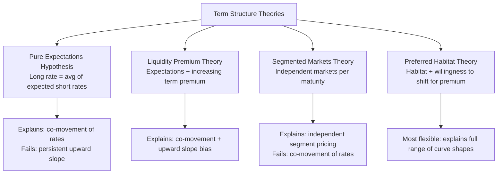

## The Term Structure of Interest Rates

### Overview

The term structure of interest rates describes the relationship between the interest rate (or yield) on a bond and its time to maturity, holding constant other characteristics such as credit risk. Graphically represented as the **yield curve**, the term structure carries information used by investors, firms, and central banks to assess market expectations of future interest rates, inflation, and economic activity. Several competing theories attempt to explain why the term structure takes different shapes at different times.

### The Yield Curve: Basic Shapes

**Key Points**

- **Normal (upward-sloping) yield curve**: long-term rates exceed short-term rates — the most commonly observed shape historically, often associated with expectations of economic expansion
- **Inverted (downward-sloping) yield curve**: short-term rates exceed long-term rates — historically often preceded economic recessions in many market observations, though the reliability and lead time of this signal vary across episodes and countries
- **Flat yield curve**: short- and long-term rates are approximately equal, sometimes observed during transitional periods between normal and inverted curve regimes
- **Humped yield curve**: intermediate-term rates exceed both short- and long-term rates, a less common shape

### Theory 1: The Expectations Hypothesis (Pure Expectations Theory)

**Key Points**

- Holds that the interest rate on a long-term bond equals the **average of the short-term interest rates** that investors expect to occur over the life of the long-term bond
- Underlying assumption: bonds of different maturities are **perfect substitutes** for investors, so investors are indifferent between holding a single long-term bond or a sequence of short-term bonds, provided the expected returns are equal

**Formal statement** for an $n$-period bond:

$$i_{n,t} = \frac{i_{1,t} + i^e_{1,t+1} + i^e_{1,t+2} + \dots + i^e_{1,t+n-1}}{n}$$

where $i_{n,t}$ is today's rate on an $n$-period bond, and $i^e_{1,t+k}$ is the expected one-period rate $k$ periods from now.

**Key Points**

- Under this theory, an upward-sloping yield curve implies markets expect short-term rates to **rise** in the future; an inverted curve implies markets expect short-term rates to **fall**
- Criticism: the pure expectations hypothesis cannot easily explain why yield curves are upward-sloping more often than downward-sloping historically, since this would require short-term rates to be expected to rise more often than not, which seems an implausible persistent bias in expectations

### Theory 2: The Liquidity Premium Theory (Preferred Habitat-Adjacent)

**Key Points**

- Modifies the pure expectations hypothesis by acknowledging that investors generally require compensation — a **liquidity/term premium** — for holding longer-maturity bonds, since these carry greater interest-rate risk (price sensitivity to rate changes) and reduced liquidity relative to short-term instruments
- Formal statement adds a maturity-increasing premium term $l_{n,t}$:

$$i_{n,t} = \frac{i_{1,t} + i^e_{1,t+1} + \dots + i^e_{1,t+n-1}}{n} + l_{n,t}, \quad l_{n,t} \text{ increasing in } n$$

- This theory explains the empirical tendency toward upward-sloping curves even when short-term rates are expected to remain flat, since the liquidity premium itself pushes long-term rates above the pure expectations average
- An inverted curve under this theory represents a particularly strong signal, since it requires expected future short rates to fall by *more* than enough to offset the positive liquidity premium — historically interpreted by many market participants as a signal of anticipated economic slowdown, though the reliability of this signal is not absolute

### Theory 3: The Segmented Markets Theory

**Key Points**

- Holds that bonds of different maturities are **not substitutes at all** for investors; instead, distinct investor clienteles (e.g., banks preferring short maturities for liquidity management, pension funds and insurers preferring long maturities to match long-duration liabilities) operate in effectively separate markets
- Under this theory, the interest rate for each maturity segment is determined independently by the supply and demand conditions specific to that segment, with no necessary connection to expectations of future short-term rates
- Criticism: this theory alone struggles to explain why interest rates of different maturities tend to **move together** over time (a well-documented empirical regularity), since fully segmented markets would predict largely independent rate movements across maturities

### Theory 4: The Preferred Habitat Theory

**Key Points**

- A hybrid that combines elements of expectations and segmented markets theories: investors have preferred maturity "habitats" (as in segmented markets) but are willing to venture outside their preferred habitat **if adequately compensated** by a sufficient risk/term premium (as in liquidity premium theory)
- Formal statement resembles the liquidity premium theory but interprets the premium $l_{n,t}$ as reflecting the compensation needed to induce investors out of their preferred habitat, and this premium need not be strictly increasing in maturity in all cases (unlike the liquidity premium theory's assumption) — different maturity segments could in principle command different-sized premiums depending on relative supply/demand imbalances in each segment
- This is generally regarded as the most flexible and empirically accommodating of the major term structure theories, since it can, in principle, generate the full range of observed yield curve shapes (upward, flat, inverted, humped) depending on the relative expectations and preferred-habitat imbalances across segments at any given time

### Diagrammatic Representation

### Yield Curve Shapes (SVG)

<svg xmlns="http://www.w3.org/2000/svg" viewBox="0 0 650 400">
<text x="325" y="25" font-size="16" font-weight="bold" text-anchor="middle" fill="#1a1a1a">Yield Curve Shapes (svg_diagram)</text>

<line x1="80" y1="340" x2="590" y2="340" stroke="#333" stroke-width="2" />
<line x1="80" y1="340" x2="80" y2="60" stroke="#333" stroke-width="2" />

<text x="335" y="375" font-size="14" text-anchor="middle" fill="`#1a1a1a`">Maturity</text>

<text x="35" y="200" font-size="14" text-anchor="middle" fill="`#1a1a1a`" transform="rotate(-90 35 200)">Yield</text>

<path d="M 100 300 Q 300 200, 550 100" fill="none" stroke="#2563eb" stroke-width="2.5" />
<text x="500" y="90" font-size="11" fill="#2563eb" font-style="italic">Normal</text>

<path d="M 100 220 Q 300 220, 550 220" fill="none" stroke="#059669" stroke-width="2.5" />
<text x="500" y="235" font-size="11" fill="#059669" font-style="italic">Flat</text>

<path d="M 100 130 Q 300 200, 550 300" fill="none" stroke="#dc2626" stroke-width="2.5" />
<text x="500" y="315" font-size="11" fill="#dc2626" font-style="italic">Inverted</text>
</svg>

### Worked Example: Expectations Hypothesis Calculation

**Example**

Suppose the current one-year interest rate is $i_{1,t} = 4\%$. The market expects the one-year rate next year to be $5\%$, and the one-year rate the year after to be $6\%$.

Under the pure expectations hypothesis, the current rate on a **three-year bond**:

$$i_{3,t} = \frac{4\% + 5\% + 6\%}{3} = 5\%$$

Since $i_{3,t} (5\%) > i_{1,t} (4\%)$, the yield curve is upward-sloping — consistent with the market expecting short-term rates to rise over the coming years.

If a **liquidity premium** of $0.5\%$ (increasing modestly with maturity, say $0.5\%$ for the 3-year bond) is added under the liquidity premium theory:

$$i_{3,t} = 5\% + 0.5\% = 5.5\%$$

The observed 3-year rate would be higher still, reflecting both the expectations component and the compensation for holding a longer-maturity, less liquid instrument.

### The Yield Curve as a Recession Predictor

**Key Points**

- [Inference] A number of empirical studies, particularly using U.S. Treasury data, have found that yield curve inversions (e.g., the 10-year minus 2-year, or 10-year minus 3-month spread turning negative) have historically preceded U.S. recessions with a lead time that has varied across cycles (commonly cited as ranging from several months to roughly two years), and this relationship has been actively studied and cited by Federal Reserve researchers and other analysts — however, the lead time is variable, false signals have occurred, and the underlying causal mechanism (versus mere correlation/predictive association) remains a subject of ongoing research rather than a settled, mechanically reliable rule
- Under the liquidity premium theory, an inversion is interpreted as reflecting a sufficiently strong market expectation of falling future short-term rates (often associated with anticipated monetary easing in response to a weakening economy) to overcome the normally positive term premium

### Comparison Table: Term Structure Theories

| Theory | Bonds are substitutes? | Explains co-movement of rates? | Explains typical upward slope? | Flexibility |
| --- | --- | --- | --- | --- |
| Pure Expectations | Perfect substitutes | Yes | No | Low |
| Liquidity Premium | Substitutes + risk premium | Yes | Yes | Moderate |
| Segmented Markets | Not substitutes | No | Not directly | Low |
| Preferred Habitat | Substitutes if compensated | Yes | Yes | High |

### Policy and Market Relevance

- Central banks and market participants extract implied market expectations of future short-term rates (and by extension, future monetary policy) from the shape of the yield curve, making it a closely watched indicator in monetary policy analysis and financial market commentary
- The term structure also plays a role in the transmission mechanism of monetary policy: central banks typically directly control only very short-term rates, but investment and borrowing decisions by firms and households are often more sensitive to medium- and long-term rates, meaning the pass-through from short-rate policy changes to the broader term structure (influenced by expectations and premia) is a key channel of policy effectiveness

**Related Topics**

- Nominal and real interest rates and the Fisher equation
- Wicksell's natural rate of interest and the cumulative process
- Yield curve inversion as a recession indicator: empirical literature
- Bond pricing and duration/interest rate risk
- Central bank forward guidance and its effect on the term structure
- Taylor Rule and the transmission of policy rates to market rates