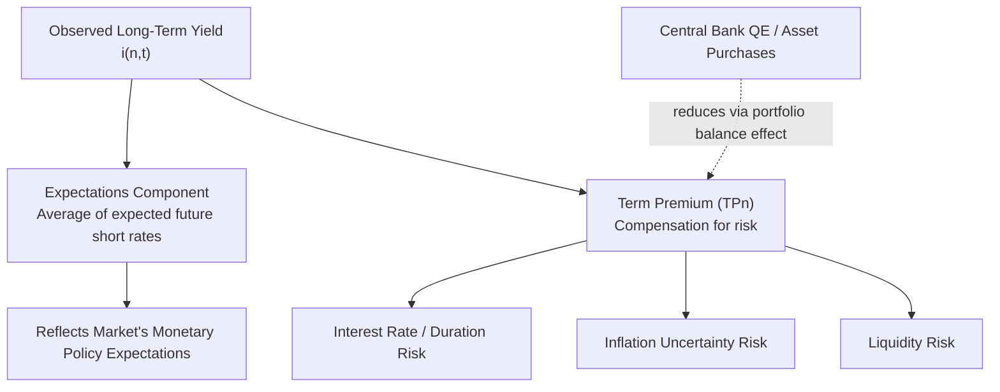

## The Expectations Hypothesis and Term Premia

### Overview

The expectations hypothesis and the concept of term premia together provide the theoretical decomposition of long-term interest rates into two components: the market's expectation of the average path of future short-term rates, and a compensation (premium) demanded by investors for bearing the risks associated with holding longer-maturity instruments. This decomposition is central to interpreting the term structure and extracting the market's implied expectations about future monetary policy.

### The Pure Expectations Hypothesis: Formal Statement

**Key Points**

- The pure expectations hypothesis (PEH) asserts that the yield on a long-term bond is determined **solely** by the market's expectation of the average short-term rate over the life of that bond, with **no risk premium** required
- For an $n$-period bond, the yield is the arithmetic average of the current and expected future one-period rates:

$$i_{n,t} = \frac{1}{n}\sum_{k=0}^{n-1} i^e_{1,t+k}$$

- An equivalent, and often more intuitive, way to express this is via the **no-arbitrage condition**: an investor should be indifferent between holding a single $n$-period bond, or a strategy of rolling over a sequence of one-period bonds — the expected return from both strategies must be equal in the absence of any premium

### The Term Premium: Definition

**Key Points**

- The **term premium** ($TP_n$) is defined as the difference between the actual observed yield on an $n$-period bond and the yield implied purely by the expectations component:

$$TP_{n,t} = i_{n,t} - \frac{1}{n}\sum_{k=0}^{n-1} i^e_{1,t+k}$$

- Rearranged, the observed long-term rate decomposes as:

$$i_{n,t} = \underbrace{\frac{1}{n}\sum_{k=0}^{n-1} i^e_{1,t+k}}_{\text{Expectations component}} + \underbrace{TP_{n,t}}_{\text{Term premium}}$$

- The term premium compensates investors for risks not captured by pure rate expectations, primarily:
  - **Interest rate risk**: longer-maturity bonds experience larger price swings for a given change in yields (higher duration), exposing holders to greater capital-loss risk if they need to sell before maturity
  - **Inflation risk**: longer horizons carry greater uncertainty about the path of future inflation eroding real returns
  - **Liquidity risk**: some longer-maturity securities may be less liquid (harder to sell quickly without a price concession) than shorter-maturity instruments, depending on the specific market

### Why the Term Premium Is Typically Positive (But Not Always)

**Key Points**

- [Inference] Under normal circumstances, most investors are risk-averse and require additional compensation for the greater price risk associated with longer-duration bonds, which is the standard economic rationale for expecting $TP_n > 0$ on average and increasing with maturity $n$ — consistent with the liquidity premium theory of the term structure
- However, the term premium is not a fixed constant — it varies over time with changes in macroeconomic uncertainty, the risk appetite of investors, and central bank policies (e.g., large-scale asset purchase programs have, in various empirical studies, been associated with a *reduction* in estimated term premia, since central bank bond purchases can remove duration risk from the market, a channel sometimes referred to as "portfolio balance effects")
- [Unverified] The term premium can, in principle, turn negative during periods of unusually high demand for the safety and liquidity of long-term government bonds (a "flight to quality/duration"), though the frequency and magnitude of such episodes is a matter for empirical estimation specific to the time period and market examined, rather than a fixed theoretical prediction

### Diagrammatic Representation

### Empirical Estimation of Term Premia

**Key Points**

- Since expected future short-term rates are not directly observable, the term premium cannot be measured directly from raw yield data alone; it must be **estimated** using structural models
- Common approaches include:
  - **Affine term structure models**: assume interest rates follow specific stochastic processes and use no-arbitrage restrictions to decompose observed yields into expectations and premium components
  - **Survey-based approaches**: use surveys of professional forecasters' expected future short-term rates as a direct proxy for the expectations component, with the residual attributed to the term premium
  - [Inference] Prominent published estimates, such as the Adrian-Crump-Moench (ACM) term premium model maintained by the Federal Reserve Bank of New York, are widely referenced by market participants and researchers, though different modeling approaches can produce meaningfully different term premium estimates for the same period, reflecting model uncertainty inherent in this type of decomposition

### Worked Example

**Example**

Suppose the observed yield on a 5-year government bond is $i_{5,t} = 4.2\%$. Based on survey data of professional forecasters' expected future short-term (1-year) rates over the next five years:

| Year | Expected 1-year rate |
| --- | --- |
| Year 1 (current) | 3.0% |
| Year 2 | 3.4% |
| Year 3 | 3.8% |
| Year 4 | 4.0% |
| Year 5 | 4.3% |

Average expected short-rate path (the expectations component):

$$\frac{3.0 + 3.4 + 3.8 + 4.0 + 4.3}{5} = \frac{18.5}{5} = 3.7\%$$

Implied term premium:

$$TP_{5,t} = 4.2\% - 3.7\% = 0.5\%$$

This 0.5 percentage-point term premium represents the additional compensation investors demand for holding the 5-year bond rather than following the expected sequence of one-year rates, attributable to interest-rate, inflation, and liquidity risk over the 5-year horizon.

### Using the Expectations-Term Premium Decomposition to Interpret Monetary Policy Expectations

**Key Points**

- Central banks and market analysts routinely decompose observed long-term yields into their expectations and term-premium components to isolate what the bond market is signaling about **future policy rate paths**, separate from compensation for risk
- A rise in long-term yields driven primarily by a rising expectations component suggests the market anticipates future policy tightening (or a stronger growth/inflation outlook warranting higher future short rates); a rise driven primarily by a rising term premium instead suggests increased risk compensation demands (e.g., due to fiscal concerns, inflation uncertainty, or reduced central bank bond-buying) without necessarily reflecting a change in the expected policy rate path
- This distinction has practical importance since the two components carry different economic implications despite producing an observationally similar rise in the headline long-term yield

### Comparison: Pure Expectations Hypothesis vs. Liquidity Premium Theory (Term Premium Framework)

| Feature | Pure Expectations Hypothesis | Liquidity Premium Theory (with Term Premium) |
| --- | --- | --- |
| Risk premium assumed | Zero | Positive, typically increasing with maturity |
| Yield curve slope explanation | Purely reflects expected rate path | Reflects expected rate path + risk compensation |
| Predicted average curve shape | No inherent bias toward upward slope | Naturally upward-sloping on average |
| Empirical fit | Generally poor fit to persistent upward-sloping curves | Better accommodates observed historical patterns |

### Criticisms and Complications

- [Inference] Empirical tests of the pure expectations hypothesis using regression-based approaches have frequently found evidence against the strict PEH prediction (e.g., regression coefficients that should equal 1 under PEH are often found to be smaller, sometimes even negative, in various sample periods and countries) — this is commonly interpreted as evidence for the existence of a time-varying term premium rather than a rejection of the expectations component's relevance altogether
- Estimated term premia are model-dependent, meaning different published estimates (e.g., different affine term structure model specifications) can disagree meaningfully on the magnitude and even the sign of the term premium in a given period, introducing genuine uncertainty into any specific numerical estimate cited
- Quantifying the *drivers* of term premium changes (e.g., attributing a specific premium movement to fiscal risk versus inflation uncertainty versus central bank balance sheet policy) is considerably more difficult than simply decomposing yields into expectations and premium components, and remains an active area of empirical research

**Related Topics**

- The term structure of interest rates and competing theories
- Affine term structure models and no-arbitrage bond pricing
- Quantitative easing and portfolio balance effects on term premia
- Nominal and real interest rates and the Fisher equation
- Central bank forward guidance and market expectations of policy rates
- Yield curve inversion as a business cycle indicator