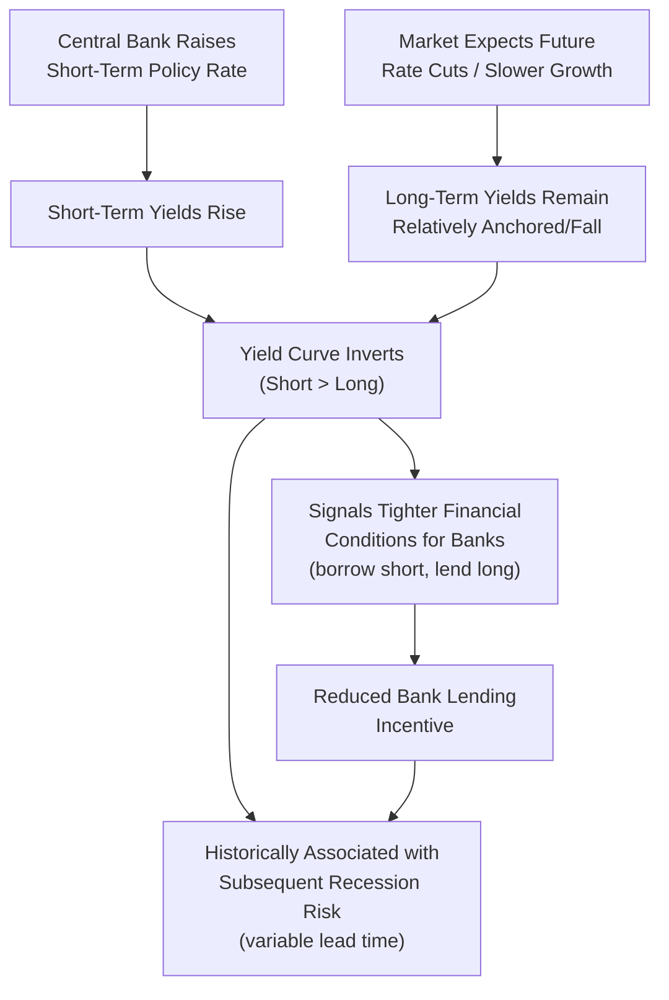

## The Yield Curve as a Business Cycle Indicator

### Overview

Beyond its theoretical role in term structure economics, the yield curve — particularly the spread between long-term and short-term interest rates — is widely used in applied macroeconomics as a leading indicator of future economic activity, most notably as a predictor of recessions. This application draws on both the expectations-based theory of the term structure and a substantial body of empirical research examining the historical relationship between yield curve inversions and subsequent economic downturns.

### The Core Empirical Regularity

**Key Points**

- The most widely studied yield curve indicator is the spread between a long-term government bond yield (commonly the 10-year Treasury in U.S. studies) and a short-term rate (commonly the 3-month Treasury bill or the 2-year Treasury note): $\text{Spread} = i_{10yr} - i_{short}$
- A **positive spread** (normal, upward-sloping curve) is typically associated with expectations of continued or strengthening economic growth
- A **negative spread** (curve inversion, where short-term rates exceed long-term rates) has historically preceded recessions in a number of documented episodes, particularly in U.S. data covering the postwar period
- [Inference] Research published by Federal Reserve economists (e.g., work associated with the Federal Reserve Bank of New York's recession probability model based on the term spread) has found this indicator to have had a statistically notable track record in U.S. data over recent decades, though the lead time between inversion and the onset of recession has varied considerably across episodes (commonly cited as ranging from roughly six months to two years), and the indicator has produced occasional false signals, meaning it should be interpreted probabilistically rather than as a deterministic rule

### Theoretical Rationale: Why Would Inversion Predict Recession?

**Key Points**

Two complementary theoretical channels are typically offered:

**1. Expectations Channel**

- Under the expectations hypothesis (and its term-premium-augmented variants), a long-term rate below the short-term rate implies the market expects short-term rates to **fall substantially** in the future
- Market participants typically expect central banks to cut short-term rates in response to (or in anticipation of) an economic slowdown, making an inversion a market-based signal that a **critical mass of investors is pricing in future monetary easing**, which itself is often a response to anticipated or emerging economic weakness

**2. Monetary Policy Tightness Channel**

- An inverted curve often arises mechanically when a central bank has raised short-term policy rates significantly to combat inflation (pushing up the short end of the curve) while long-term rates remain relatively anchored (reflecting expectations of eventual disinflation and lower future rates)
- [Inference] This pattern is sometimes interpreted as an indicator that monetary policy has become sufficiently restrictive relative to the natural/neutral rate (see Wicksell's natural rate concept) to slow the economy meaningfully, potentially into recession, though this causal channel operates jointly with, rather than as a strict alternative to, the pure expectations channel above

### Diagrammatic Representation

### The Bank Lending Channel

**Key Points**

- A complementary mechanical explanation relates to bank profitability: commercial banks typically fund themselves with short-term liabilities (deposits, short-term borrowing) and lend at longer-term rates (mortgages, business loans)
- An inverted yield curve compresses or eliminates this **net interest margin**, reducing the profitability of new lending and potentially causing banks to tighten credit standards or reduce loan origination
- [Inference] This credit-supply channel is sometimes cited as a *causal* mechanism through which yield curve inversion could contribute to an economic slowdown, rather than merely serving as a passive *signal* reflecting market expectations formed independently — though disentangling the causal contribution of this channel from the informational (expectations-signal) role of the inverted curve is empirically challenging and remains debated in the literature

### Historical Track Record (U.S. Context)

**Key Points**

- [Inference] Widely cited retrospective analyses have noted that yield curve inversions (particularly the 10-year minus 3-month or 10-year minus 2-year spreads) preceded each U.S. recession over an extended historical stretch of the postwar period, a pattern often summarized in financial commentary as the indicator having "correctly predicted" most or all recessions in that sample — however, such historical track-record claims should be treated with appropriate caution, since the number of historical recession episodes is small (limiting statistical power), the indicator has also produced instances that some researchers characterize as false or ambiguous signals, and past predictive performance in a given sample does not guarantee continued reliability going forward
- [Unverified] Given constraints on current information, readers should verify the most recent yield curve behavior and any associated recession-probability model outputs directly from primary sources (e.g., Federal Reserve research pages, Treasury yield data) rather than relying on a fixed historical characterization, since curve shape and associated forecasts change frequently with market conditions

### Worked Example: Interpreting a Hypothetical Inversion

**Example**

Suppose the 10-year Treasury yield is $3.8\%$ and the 3-month Treasury bill yield is $5.2\%$, giving a spread:

$$\text{Spread} = 3.8\% - 5.2\% = -1.4\%$$

This negative spread of 140 basis points signals that the market's average expectation of future short-term rates over the next decade (adjusted for any term premium) is well below the current level of short-term rates — consistent with a market expectation that the central bank will need to substantially lower short-term rates at some point during that horizon, plausibly in response to an anticipated economic slowdown that would prompt monetary easing.

### Limitations and Caveats

**Key Points**

1. **Variable lead time**: even when historically followed by a recession, the time lag between inversion and the recession's actual onset has varied substantially across episodes, limiting the indicator's precision as a short-term forecasting tool
2. **False signals**: [Inference] some historical inversions have not been followed by a recession within a conventionally expected timeframe, or have been followed by only a mild slowdown rather than a full recession, illustrating that the signal is probabilistic rather than deterministic
3. **Changing structural factors**: [Inference] some researchers have argued that structural changes in bond markets — including large-scale central bank asset purchases affecting long-term yields (term premium compression via quantitative easing) and increased foreign demand for long-term government bonds as a safe asset — may have altered the historical relationship between curve shape and the business cycle in ways not fully reflected in older historical data, meaning the indicator's reliability going forward is not guaranteed to match its historical track record exactly
4. **Choice of spread matters**: different spread definitions (10-year minus 3-month vs. 10-year minus 2-year, for example) have sometimes given divergent signals at the same point in time, and researchers do not universally agree on which specific spread has the best predictive properties

### Comparison: Yield Curve Indicator vs. Other Leading Indicators

| Feature | Yield Curve Spread | Other Common Leading Indicators (e.g., PMI, jobless claims) |
| --- | --- | --- |
| Data frequency | Daily/continuous market data | Typically monthly, with reporting lags |
| Basis | Market-based forward-looking expectations | Survey-based or administrative data |
| Lead time | Historically variable, often 6 months–2 years | Generally shorter lead time |
| Susceptible to policy distortion | Yes (e.g., QE effects on term premium) | Less directly, though also subject to revisions |

### Policy Relevance

- Central bank policymakers and staff economists routinely monitor yield curve spreads as one input (among many) into their macroeconomic outlook and risk assessments, though it is generally treated as one indicator within a broader dashboard rather than a sole decisive signal for policy decisions
- The relationship between the yield curve and recession risk also feeds back into monetary policy design discussions, since aggressive short-term rate hikes that invert the curve can be interpreted (through the lens of Wicksellian and New Keynesian natural-rate frameworks) as evidence that the policy rate has moved meaningfully above the natural/neutral rate, a state associated with disinflationary or recessionary pressure in those theoretical frameworks

**Related Topics**

- The term structure of interest rates and competing theories
- The expectations hypothesis and term premia
- Wicksell's natural rate of interest and the cumulative process
- Federal Reserve recession probability models based on the term spread
- Quantitative easing and its effects on long-term yields and term premia
- Bank net interest margins and the credit channel of monetary policy transmission