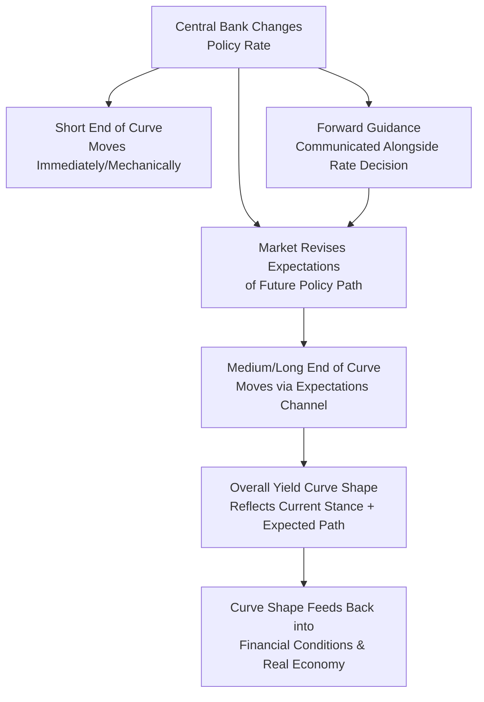

## Central Bank Policy Rates and the Yield Curve

### Overview

Central banks directly control only a very short-term interest rate — the policy rate — yet economic decisions by firms and households are influenced predominantly by rates further out along the yield curve (mortgage rates, corporate borrowing costs, long-term investment hurdle rates). Understanding how policy rate changes transmit through and reshape the entire yield curve is therefore essential to understanding monetary policy transmission.

### The Policy Rate as the Anchor of the Short End

**Key Points**

- Central banks implement monetary policy primarily by targeting a specific very-short-term interest rate: the federal funds rate in the U.S., the Bank Rate in the UK, the deposit facility/main refinancing rate in the Eurozone, and analogous instruments elsewhere
- This policy rate is achieved operationally through control of bank reserve supply and/or the interest paid on reserves (see Reserves, Excess Reserves, and Interbank Markets), directly anchoring the very short end (overnight to a few months) of the yield curve
- Changes to the policy rate mechanically and near-immediately move short-maturity market rates that are close substitutes for central bank reserves (e.g., overnight interbank rates, short-term Treasury bill yields), since arbitrage keeps these closely aligned with the policy rate

### Transmission to Longer Maturities: The Expectations Channel

**Key Points**

- Under the expectations hypothesis (and its term-premium-augmented variants, see The Expectations Hypothesis and Term Premia), longer-maturity yields reflect the market's expectation of the **average path** of future short-term rates over the relevant horizon, plus a term premium
- A policy rate change therefore affects long-term yields primarily through its effect on expectations of the **future path** of policy, not merely the current level:

$$i_{n,t} = \frac{1}{n}\sum_{k=0}^{n-1} i^e_{1,t+k} + TP_{n,t}$$

- **Key implication**: if a central bank raises its policy rate but the market interprets this as a one-off adjustment with no further hikes expected (and possibly cuts to follow), long-term yields may move only modestly, or even fall, despite the short-rate increase — since the average expected future short-rate path used to price the long bond may not rise by much, or could even decline
- Conversely, if a rate hike signals a sustained tightening cycle, expectations of future short rates rise across the curve, pulling up longer-maturity yields substantially more than the initial move alone would suggest

### Diagrammatic Representation

### Forward Guidance and the Long End of the Curve

**Key Points**

- Central banks increasingly use **forward guidance** — explicit communication about the likely future path of policy rates — as a tool to directly influence expectations of future short rates, and hence the longer end of the yield curve, without necessarily moving the current policy rate itself
- [Inference] This tool became particularly prominent during and after the 2008 global financial crisis and subsequent episodes when policy rates in several major economies approached the zero lower bound, limiting the scope for further conventional rate cuts; forward guidance was used by multiple central banks as a substitute channel to ease financial conditions by lowering expected future short rates and, through the expectations channel, longer-term yields as well — though the specific design and communicated commitments of forward guidance programs varied across central banks and episodes
- Forward guidance can take various forms, including **calendar-based guidance** (committing to a rate path until a specific date) or **state-contingent guidance** (committing to a rate path conditional on economic outcomes, e.g., until unemployment or inflation reach specified thresholds)

### Quantitative Easing and the Long End: The Portfolio Balance Channel

**Key Points**

- When policy rates reach their effective lower bound and forward guidance alone is judged insufficient, central banks have used **large-scale asset purchases (quantitative easing)** to directly influence longer-term yields, primarily by purchasing longer-maturity government bonds (and in some programs, other assets)
- The **portfolio balance channel**: by removing a substantial quantity of long-duration securities from the market, the central bank reduces the aggregate duration/interest-rate risk that private investors must bear, which — under the term-premium framework — tends to compress the term premium component of long-term yields, independent of any change in expected future short rates
- This channel operates *directly* on the long end of the curve rather than working solely through altering expectations of the future short-rate path, distinguishing it conceptually from conventional policy rate changes and forward guidance

### Worked Example: Decomposing a Long-Rate Response to a Policy Announcement

**Example**

Suppose the central bank raises its policy rate by 25 basis points, and prior to the announcement, the 10-year yield was $3.50\%$.

**Scenario A — "Hawkish surprise" (signals more hikes to come):**

The market revises its expected future short-rate path upward across the curve. The 10-year yield rises to $3.75\%$ — a 25 basis point increase, roughly matching the size of the current move, reflecting the market pricing in a sustained tightening cycle rather than a one-off adjustment.

**Scenario B — "Dovish hike" (signals this is likely the final hike in the cycle):**

Despite the current 25 basis point increase, the market interprets this as the peak of the tightening cycle, with rate cuts anticipated to follow within the next year. The average expected future short-rate path used to price the 10-year bond may barely change, or could even fall, keeping the 10-year yield near $3.50\%$ or pushing it slightly lower — illustrating that the *current* policy move and the *long-end response* can diverge substantially depending on the accompanying signal about future policy.

### The Yield Curve as a Summary of Market-Perceived Policy Stance

**Key Points**

- The overall shape of the yield curve at any point in time can be interpreted as the market's summary judgment of the entire expected future policy rate path (plus term premia), making it a continuously updated, market-based gauge of policy expectations that central bank communications teams and analysts monitor closely
- A flattening curve (short rates rising relative to long rates, or long rates falling relative to short rates) is often interpreted as the market pricing in a policy tightening cycle that is expected to be relatively short-lived or to eventually induce an economic slowdown requiring future easing (see The Yield Curve as a Business Cycle Indicator)
- A steepening curve (long rates rising relative to short rates) can reflect either improving growth/inflation expectations (a "healthy" steepening) or rising term premia due to fiscal or inflation-uncertainty concerns (a less benign "bear steepening"), illustrating that curve movements require decomposition (expectations vs. term premium) for accurate interpretation rather than reading the shape change alone

### Comparison: Tools for Influencing Different Segments of the Curve

| Tool | Primary Curve Segment Affected | Mechanism |
| --- | --- | --- |
| Conventional policy rate changes | Very short end (immediate) | Direct mechanical control via reserve market |
| Forward guidance | Medium to long end | Shifts expectations of future short-rate path |
| Quantitative easing / asset purchases | Long end (targeted maturities) | Portfolio balance effect on term premium |
| Yield curve control (where employed) | Specific targeted maturity point | Central bank commits to buy/sell to defend a yield target |

### Criticisms and Complications

- [Inference] The clean separation between "expectations channel" (forward guidance) and "portfolio balance channel" (QE) is a useful analytical simplification, but empirical work attempting to separately identify and quantify the two channels' effects has found it genuinely difficult to fully disentangle them in practice, since QE announcements themselves often carry embedded signals about the future policy rate path, and vice versa
- The transmission from policy rate changes to longer-term yields depends heavily on the credibility of central bank communication and the state of prevailing market expectations, meaning historically estimated "pass-through" relationships between policy moves and long-end yield changes are not fixed parameters and can vary considerably across different monetary policy regimes and periods
- [Unverified] Yield curve control — an approach in which a central bank commits to defending a specific yield target at a chosen maturity through unlimited bond purchases if necessary — has been employed by at least one major central bank in a modern context; readers should verify current usage and specific country practices, since adoption and continuation of such frameworks are subject to change and were evolving as of this material's knowledge cutoff

**Related Topics**

- The term structure of interest rates and competing theories
- The expectations hypothesis and term premia
- The yield curve as a business cycle indicator
- Forward guidance as an unconventional monetary policy tool
- Quantitative easing and portfolio balance effects
- Reserves, excess reserves, and interbank markets (policy rate implementation mechanics)