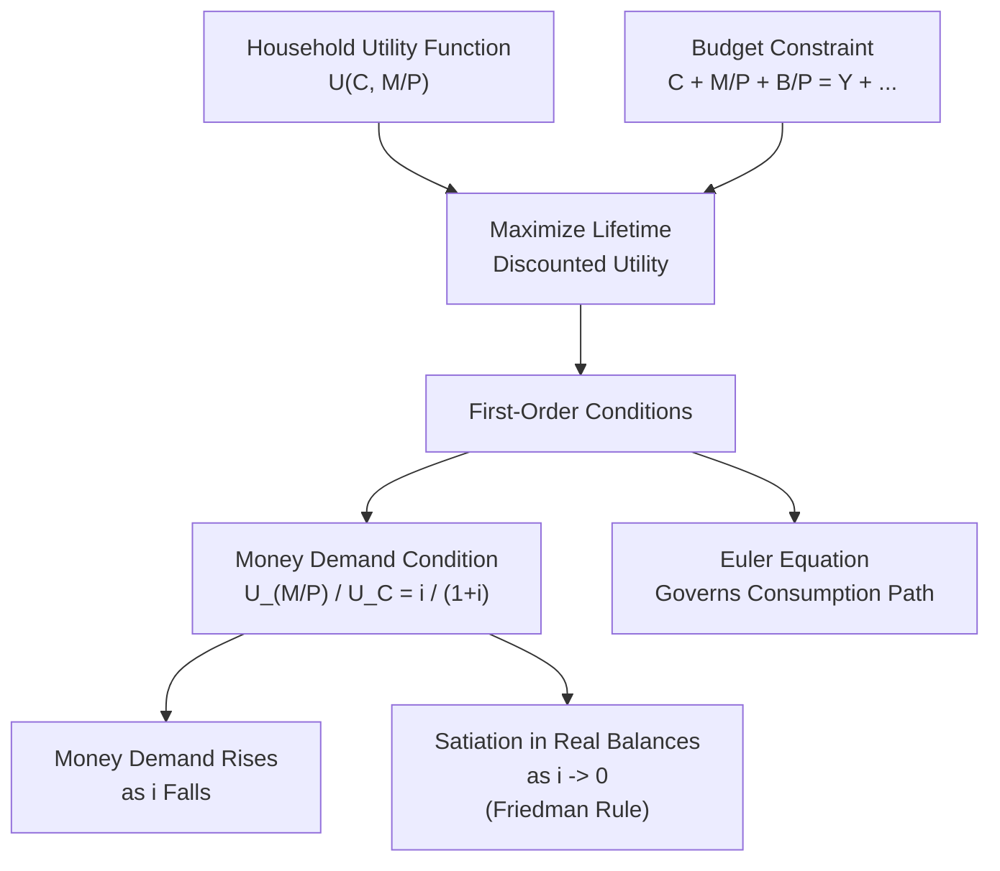

## Money-in-the-Utility-Function Models

### Overview

Money-in-the-utility-function (MIU) models provide microeconomic foundations for the demand for money by placing real money balances directly as an argument in a representative agent's utility function, alongside consumption. This approach, developed prominently by Miguel Sidrauski (1967) and extended in subsequent monetary general equilibrium literature, treats holding money as directly yielding utility — capturing the transactions and liquidity services money provides — without needing to explicitly model the underlying transactions technology (in contrast to cash-in-advance or shopping-time models).

### Core Modeling Assumption

**Key Points**

- The representative household's utility function is specified to depend on both consumption and real money balances:

$$U = U(C_t, M_t/P_t)$$

where $C_t$ is consumption, $M_t$ is nominal money holdings, and $M_t/P_t$ is real money balances

- Standard assumptions on the utility function: $U_C > 0$ (positive marginal utility of consumption), $U_{M/P} > 0$ but with diminishing marginal utility ($U_{M/P,M/P} < 0$), reflecting that money provides liquidity services subject to satiation
- The justification for including real balances directly in utility is typically that money reduces transactions costs or "shopping time" in ways not explicitly modeled — the utility specification is a **reduced-form shortcut** standing in for these underlying frictions

### The Household's Optimization Problem

**Key Points**

The representative infinitely-lived household chooses sequences of consumption, money holdings, and bond holdings to maximize lifetime discounted utility subject to a budget constraint.

**Objective function:**

$$\max \sum_{t=0}^{\infty} \beta^t U(C_t, M_t/P_t)$$

where $\beta \in (0,1)$ is the subjective discount factor.

**Budget constraint** (in real terms), for a household receiving income $Y_t$, holding money $M_t$, and bonds $B_t$ paying nominal interest $i_t$:

$$C_t + \frac{M_t}{P_t} + \frac{B_t}{P_t} = Y_t + \frac{M_{t-1}}{P_t} + \frac{(1+i_{t-1})B_{t-1}}{P_t}$$

### First-Order Conditions and the Money Demand Function

**Key Points**

Deriving the first-order conditions with respect to consumption, money, and bonds, and combining them, yields the household's optimality condition governing money holdings — the marginal rate of substitution between real money balances and consumption equals the nominal interest rate (the opportunity cost of holding money rather than bonds):

$$\frac{U_{M/P}(C_t, M_t/P_t)}{U_C(C_t, M_t/P_t)} = \frac{i_t}{1+i_t}$$

**Key Points**

- This condition has an intuitive interpretation: money is held up to the point where the marginal utility benefit of an additional unit of real balances (relative to consumption) just equals its opportunity cost — the interest forgone by not holding that wealth in interest-bearing bonds instead
- This first-order condition is the MIU model's **microfounded money demand function**, playing the analogous role to the Keynesian liquidity preference function or the Baumol-Tobin square-root formula, but derived here directly from utility maximization rather than inventory-theoretic cost minimization or Keynesian behavioral postulates
- As $i_t \to 0$, the right-hand side approaches zero, implying $U_{M/P} \to 0$ — a **satiation** point in real balances is approached as the opportunity cost of holding money vanishes, a result with direct relevance to Friedman's optimum quantity of money analysis (see below)

### Diagrammatic Representation

### Separability Assumptions and Their Implications

**Key Points**

A frequently invoked simplifying assumption is that utility is **additively separable** between consumption and real money balances:

$$U(C_t, M_t/P_t) = u(C_t) + v(M_t/P_t)$$

- Under additive separability, real money balances and consumption do not directly interact in the marginal utility calculus, meaning changes in real balances do not shift the marginal utility of consumption (and vice versa)
- [Inference] This has an important implication for monetary neutrality/superneutrality results in these models: under additive separability, the steady-state real allocations (consumption, capital, output) are typically shown to be **independent of the money growth rate** in standard Sidrauski-type models, a property termed **superneutrality of money** — money growth affects only nominal variables (inflation, nominal interest rates) in the long run, not real variables, under this specific separability assumption
- If instead utility is **non-separable** (money and consumption are complements or substitutes in utility), monetary policy (money growth) can have long-run real effects even in this otherwise flexible-price framework, since changes in real balances would directly shift the marginal utility of consumption and hence the consumption-savings/investment margin

### The Friedman Rule in the MIU Framework

**Key Points**

- Milton Friedman's proposal for the **optimal rate of monetary expansion** ("the Friedman Rule") argues that the socially optimal policy is to set the nominal interest rate to **zero** ($i_t = 0$), which requires the money supply to contract at a rate equal to the rate of time preference (approximately equal to the negative of the real interest rate) — i.e., a steady **deflation** at the real rate
- Rationale within the MIU framework: since holding money is essentially costless to produce (near-zero marginal cost for the central bank to create additional nominal balances) but yields positive marginal utility to households as long as $i_t > 0$, welfare is maximized by driving the private opportunity cost of holding money to zero — satiating agents with real balances up to the point where $U_{M/P} = 0$, consistent with the first-order condition above as $i_t \to 0$
- [Inference] This is often cited as a canonical result of monetary optimal-policy theory derived using MIU-style models, though the Friedman Rule's practical policy relevance is widely debated, since sustained deflation raises other well-documented economic concerns (e.g., interaction with nominal rigidities, the zero lower bound on nominal rates constraining conventional monetary policy responses to shocks, and debt-deflation dynamics) not captured within the basic frictionless MIU framework itself

### Worked Example: Deriving Money Demand from a Specific Utility Function

**Example**

Suppose utility takes the additively separable, log-linear form:

$$U(C_t, M_t/P_t) = \ln C_t + \gamma \ln(M_t/P_t)$$

where $\gamma > 0$ is a parameter reflecting the relative weight placed on real balances in utility.

Marginal utilities:

$$U_C = \frac{1}{C_t}, \quad U_{M/P} = \frac{\gamma}{M_t/P_t}$$

Applying the money demand first-order condition:

$$\frac{\gamma / (M_t/P_t)}{1/C_t} = \frac{i_t}{1+i_t}$$

Solving for real money balances:

$$\frac{M_t}{P_t} = \gamma C_t \left(\frac{1+i_t}{i_t}\right)$$

This yields a money demand function with unit income (consumption) elasticity and a term that goes to infinity as $i_t \to 0$ (satiation) and shrinks as $i_t$ rises — qualitatively consistent with standard money demand properties (positive income elasticity, negative interest elasticity), now derived explicitly from an optimizing household's first-order conditions rather than assumed as a behavioral postulate.

### Comparison: MIU Models vs. Other Microfoundation Approaches

| Feature | Money-in-Utility (MIU) | Cash-in-Advance (CIA) | Baumol-Tobin |
| --- | --- | --- | --- |
| How money enters | Directly in utility function | Constraint requiring cash for purchases | Cost-minimization over transaction trips |
| Underlying friction modeled explicitly | No (reduced-form) | Yes (timing constraint on purchases) | Yes (fixed transaction cost) |
| Typical use | General equilibrium/DSGE monetary models | General equilibrium models emphasizing liquidity constraints | Partial equilibrium transactions demand |
| Ease of analytical tractability | Generally high | Moderate (constraint can bind or not) | High, but partial equilibrium only |

### Criticisms and Alternative Formulations

- [Inference] The central criticism of MIU models is that placing money directly in the utility function is a modeling convenience rather than a description of any genuine underlying mechanism — money does not literally provide utility the way a consumption good does; it is valuable only insofar as it facilitates transactions, a friction the MIU approach deliberately sidesteps rather than explicitly models, in contrast to cash-in-advance or shopping-time models which attempt to derive money demand from an explicit transactions technology
- Because the utility-function specification is somewhat arbitrary (any functional form satisfying the stated general properties can technically be used), results such as superneutrality can be sensitive to the specific separability assumptions chosen, meaning conclusions drawn from MIU models should be understood as conditional on the particular utility specification employed
- Despite these criticisms, MIU models remain widely used in monetary DSGE modeling due to their analytical tractability and their ability to generate a money demand function consistent with standard qualitative properties, making them a common workhorse specification in academic and central-bank research models

**Related Topics**

- Cash-in-advance constraint models of money demand
- Shopping-time models of money demand
- The Friedman Rule and the optimal rate of inflation/deflation
- Superneutrality of money and long-run monetary neutrality
- Sidrauski's monetary growth model
- Baumol-Tobin inventory-theoretic model (alternative microfoundation approach)