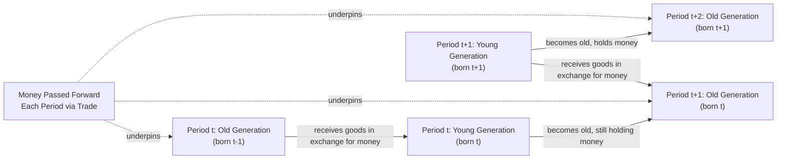

## Overlapping Generations Models of Money

### Overview

Overlapping generations (OLG) models, pioneered by Paul Samuelson (1958) and extended significantly by Neil Wallace and others, provide a fundamentally different microfoundation for money's value than money-in-utility or cash-in-advance approaches. Rather than assuming money directly yields utility or is required by a transactions constraint, OLG models explain money as a solution to a **fundamental trading friction**: the absence of double coincidence of wants across generations who are alive at different, only partially overlapping, points in time. Money in this framework derives its value purely from the collective belief that future generations will accept it — a "bubble" sustained by self-fulfilling expectations rather than any intrinsic usefulness or legal mandate.

### The Basic OLG Structure

**Key Points**

- Time is divided into discrete periods; in each period, a new generation of agents is "born," lives for **two periods** (young and old), and then dies
- At any point in time, exactly two generations coexist: the young (born this period) and the old (born last period) — hence "overlapping" generations
- Each agent receives an **endowment** of a perishable good when young, and typically no endowment when old (or a different endowment pattern), creating an inherent lifecycle savings problem: young agents wish to save some of their endowment for consumption when old, but the good itself is perishable and cannot be physically stored

### The Fundamental Problem: The Absence of a Store of Value

**Key Points**

- Without any durable asset, the young generation in each period has no way to transfer purchasing power into old age — they cannot save the perishable endowment good directly, and there is no productive capital or other durable asset for them to invest in
- A trade between generations that could solve this problem — young agents transferring goods to the current old in exchange for a promise of goods when the young themselves become old — is not enforceable through ordinary bilateral exchange, since the old generation making such a promise will have died by the time repayment is due, and infinitely many future generations exist beyond any given point, so no natural terminal condition forces repayment
- This is the essential friction that fiat money (or any other bubble asset) can resolve

### How Money Solves the Problem

**Key Points**

- Suppose an initial old generation is endowed with a fixed stock of intrinsically **worthless** pieces of paper ("fiat money"), which has no use in consumption or production
- If, and only if, the current young generation *believes* that the next generation will accept this money in exchange for goods, they will be willing to trade part of their endowment to the current old in exchange for the money now, planning to pass it forward when they themselves are old
- This creates a **social contrivance**: money is valued purely because each generation expects the next generation to value it — a self-fulfilling expectational equilibrium, not because money possesses any inherent usefulness
- In effect, OLG money achieves an outcome analogous to a **pay-as-you-go social security-like transfer system**, allowing intergenerational trade that would otherwise be impossible

### Diagrammatic Representation

### The Household's Optimization Problem

**Key Points**

A representative young agent in period $t$, with endowment $y_1$ when young and $y_2$ when old (often $y_2 = 0$ in the simplest version), chooses consumption when young ($c_{1,t}$) and old ($c_{2,t+1}$), along with real money holdings $m_t = M_t/P_t$, to maximize lifetime utility:

$$\max U(c_{1,t}, c_{2,t+1})$$

**subject to:**

$$c_{1,t} + m_t = y_1$$

$$c_{2,t+1} = y_2 + m_t \cdot \frac{P_t}{P_{t+1}}$$

**Key Points**

- The term $P_t/P_{t+1}$ represents the **real rate of return on money** — the inverse of the (gross) inflation rate between periods $t$ and $t+1$
- If prices rise over time (inflation), the real value of money held from youth to old age falls, reducing the effective return to saving via money; if prices fall (deflation), money's real return is positive
- Combining the two budget constraints (eliminating $m_t$) yields a single lifetime budget constraint expressing the trade-off between consumption when young and old, with the real return on money playing the role that the interest rate plays in standard lifecycle consumption models

### Monetary Equilibrium and the Price Level

**Key Points**

- In the simplest version with a **constant, fixed stock of fiat money** $M$ (no money creation), a **monetary equilibrium** exists in which the price level is determined by market clearing: total money demanded by the young must equal the fixed money supply, and this pins down $P_t$ each period
- A key and famous property of the basic OLG monetary model is the existence of **multiple equilibria**:
  1. A **monetary equilibrium** in which money has positive value ($P_t$ finite and money is traded) — a "bubble" equilibrium sustained by expectations
  2. A **non-monetary (autarkic) equilibrium** in which money has zero value ($P_t \to \infty$, or equivalently the price of goods in terms of money is infinite) — money is simply never accepted because no one expects anyone else to accept it, and this belief is self-fulfilling too, since if money has no value, no rational agent would give up goods for it
- [Inference] This multiplicity of equilibria is often highlighted as one of the model's most theoretically striking features, illustrating that in this framework the value of fiat money is not pinned down by any fundamental (like a gold-standard commodity backing) but rests entirely on self-fulfilling beliefs — an insight with broader relevance to theories of asset-price bubbles and the foundations of fiat currency value more generally

### Worked Example: Two-Period Endowment Economy

**Example**

Suppose each generation is endowed with $y_1 = 100$ units of the perishable good when young and $y_2 = 0$ when old. The fixed money stock is $M = 1{,}000$ units, held entirely by the initial old generation.

In a **stationary monetary equilibrium** (where the price level is constant over time, $P_t = P$ for all $t$, implying a real return on money of exactly 1, i.e., zero inflation), each young agent optimally chooses to save some fraction of their endowment as real money balances, say $m^* = 30$ units of goods' worth, consuming $c_1 = 100 - 30 = 70$ when young and $c_2 = 30$ when old (since with zero inflation, real balances carry over one-for-one).

If instead the government were to double the money supply to $M = 2{,}000$ while nothing else about preferences or endowments changes, in the simplest **neutral** version of this model, the price level would double proportionally ($P' = 2P$), leaving real money balances and the real allocation ($c_1, c_2$) **unchanged** — an OLG illustration of the classical **neutrality of money** with respect to a one-time, unanticipated proportional change in the nominal money stock.

### Introducing Money Growth: Inflationary Finance and Seigniorage

**Key Points**

- If the government/central bank injects new money over time (e.g., to finance government spending), this generates ongoing inflation in the OLG framework, since the growing nominal money stock chasing the same (or slower-growing) endowment stream raises the price level over time
- This connects OLG models directly to the analysis of the **inflation tax** and seigniorage (see Cash-in-Advance Constraint Models): the government captures real resources by issuing new money, effectively taxing existing money holders through the resulting erosion of the real value of their existing balances
- [Inference] OLG models have been extensively used in the monetary economics literature to study the welfare costs and revenue-raising properties of inflationary finance, government debt dynamics, and the conditions under which sustained money growth is or is not consistent with a stable monetary equilibrium — providing an alternative, general-equilibrium lens on questions also addressed via CIA and MIU frameworks

### Comparison: OLG Models vs. Other Microfoundation Approaches

| Feature | OLG Models | Money-in-Utility (MIU) | Cash-in-Advance (CIA) |
| --- | --- | --- | --- |
| Source of money's value | Self-fulfilling intergenerational expectations | Direct utility argument (assumed) | Transactions constraint (assumed) |
| Underlying friction modeled | Lack of double coincidence of wants across generations | Not explicitly modeled | Timing of purchases relative to money holding |
| Equilibrium multiplicity | Yes — monetary and non-monetary equilibria coexist | Typically unique interior equilibrium | Typically unique given constraint |
| Primary theoretical use | Studying money's fundamental value and intergenerational transfers | General DSGE monetary policy analysis | Transactions demand and inflation tax analysis |

### Criticisms and Theoretical Significance

- [Inference] Critics have noted that the two-period lifecycle structure of the basic OLG model is a significant abstraction from realistic economic life, and the model's simplest versions do not naturally incorporate the wide range of alternative assets (bonds, capital, other stores of value) that compete with money for a role as a savings vehicle in real economies — extensions incorporating capital and other assets have been developed but add substantial complexity
- Despite these simplifications, OLG models are widely regarded in the monetary theory literature as providing the clearest and most rigorous illustration of the proposition that fiat money's value rests fundamentally on **self-fulfilling collective belief** rather than any intrinsic backing, a foundational insight distinguishing this approach from the transactions-cost-based rationales (MIU, CIA) emphasized elsewhere in monetary microfoundations
- The multiple-equilibria result (monetary vs. non-monetary) has also been influential in broader discussions of sunspot equilibria and self-fulfilling expectations in macroeconomics beyond the specific context of money

**Related Topics**

- Money-in-the-utility-function models
- Cash-in-advance constraint models
- Seigniorage and the inflation tax
- Fiat money versus commodity money: theories of the origin of money
- Samuelson's consumption-loan model and intergenerational transfers
- Sunspot equilibria and self-fulfilling expectations in macroeconomics