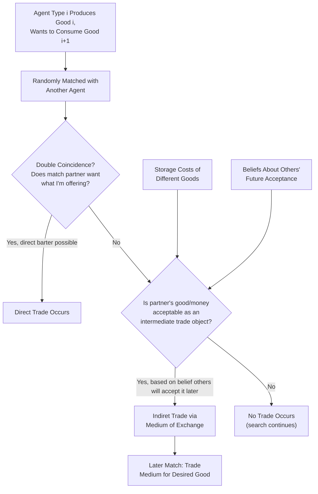

## Search-Theoretic Models of Money and the Kiyotaki-Wright Framework

### Overview

Search-theoretic models of money, pioneered by Nobuhiro Kiyotaki and Randall Wright (1989, 1993), provide microfoundations for money by explicitly modeling the **decentralized, bilateral matching process** through which trade occurs, rather than assuming a centralized (Walrasian) market where all trades clear simultaneously. This approach directly addresses the classical question of why money emerges as a generally accepted medium of exchange by modeling the **absence of double coincidence of wants** as a genuine, frictional trading problem — showing how money can arise endogenously as a solution, rather than being introduced by assumption (as in money-in-utility models) or via an intergenerational structure (as in OLG models).

### The Double Coincidence of Wants Problem

**Key Points**

- In a barter economy, a trade between two agents can only occur if each agent happens to possess a good the other wants — the **double coincidence of wants**
- When individuals are highly specialized (each produces one type of good but wants to consume a different type), the probability of two randomly matched agents satisfying double coincidence can be very low, making barter trade highly inefficient
- Money can, in principle, solve this problem by serving as a generally acceptable intermediate good: an agent can trade their produced good for money (even if they don't want money to consume), then later trade that money for the good they actually want to consume from a different agent

### The Kiyotaki-Wright Search Model: Basic Structure

**Key Points**

- The economy consists of a large number of infinitely-lived agents, each specialized in producing one of several types of goods (commonly modeled with three goods/types in the simplest version) but wanting to consume a **different** type of good than they produce
- Agents are randomly and bilaterally matched pairwise each period in a **decentralized search process** (no centralized market/auctioneer)
- Upon meeting, a pair of agents can trade only if each finds the good/object offered by the other acceptable — either because it is what they wish to consume, or because they anticipate being able to trade it away later to acquire their desired consumption good
- Agents choose **storage/inventory strategies**: since holding goods (or money) may be costly (storage costs differ across goods), agents must decide what to hold and what to accept in trade, based on their expectations of what other agents will accept in the future

### Diagrammatic Representation

### Fundamental vs. Speculative Equilibria

**Key Points**

The Kiyotaki-Wright framework, in its canonical formulations, distinguishes between different types of equilibria based on which objects agents choose to accept in trade:

**1. Fundamental Equilibrium**

- Agents accept a good as a medium of exchange only if it has genuinely lower storage costs than the goods they produce, making it individually rational to hold regardless of whether others also accept it
- Money's emergence in this case is driven purely by its own intrinsic storage-cost advantage

**2. Speculative Equilibrium**

- [Inference] A central and much-cited theoretical result of the Kiyotaki-Wright framework is that an object can become **more** widely accepted as a medium of exchange than its own intrinsic storage-cost characteristics alone would justify, purely because agents believe other agents will accept it — a self-reinforcing, expectations-driven outcome analogous in spirit to the self-fulfilling belief structure found in OLG monetary models, though arising here from an explicitly decentralized matching/search process rather than an intergenerational trading structure
- This result demonstrates that the emergence of a generally accepted medium of exchange can depend on **strategic complementarities** in acceptance decisions: an object becomes more useful to hold as a medium of exchange the more other agents are expected to accept it, potentially generating multiple self-fulfilling equilibria over which object serves as money

### The Role of Acceptability and Network Effects

**Key Points**

- The value and usefulness of a candidate medium of exchange in this framework depends fundamentally on its **acceptability** — how widely other agents in the economy are willing to take it in trade
- This creates a **network externality**-like property: an individual agent's decision to accept a particular object as payment is more attractive the more other agents in the economy are also expected to accept it, since this increases the probability of successfully re-trading it later for the agent's desired consumption good
- [Inference] This network-effect logic is often cited as providing a rigorous microeconomic rationale for why economies tend to **converge on a single (or very few) generally accepted medium/media of exchange** rather than several different, narrowly accepted objects circulating simultaneously, since broader acceptance is self-reinforcing once a threshold of adoption is reached

### Worked Example: A Simplified Three-Good Economy

**Example**

Consider a simplified economy with three types of agents and three goods, where agent Type 1 produces Good 1 but wants Good 2, Type 2 produces Good 2 but wants Good 3, and Type 3 produces Good 3 but wants Good 1 — a cyclical structure with no direct double coincidence of wants between any two types.

Suppose Good 3 has the lowest storage cost of the three goods. In a **fundamental equilibrium**:

- Type 1 agents, upon meeting Type 3 agents (who hold Good 3, which Type 1 doesn't directly want to consume), may still accept Good 3 in trade if they judge it easy to store and likely to be re-tradeable later for Good 2 from a Type 2 agent
- Good 3 thus circulates as a medium of exchange purely because of its low storage cost, facilitating trade that would otherwise require chains of lucky double-coincidence matches

If, instead, Good 1 (with higher storage costs) somehow became widely believed to be acceptable by all agent types — perhaps due to historical convention or coordination — a **speculative equilibrium** could emerge in which Good 1 circulates as the medium of exchange despite not having the lowest intrinsic storage cost, purely sustained by the self-fulfilling belief that others will accept it.

### Extensions: Fiat Money in Search Models

**Key Points**

- The basic Kiyotaki-Wright framework can be extended to include an object with **no intrinsic consumption value or storage-cost advantage at all** — pure fiat money — and shown, under the right belief structure, to still emerge as a valued medium of exchange in equilibrium, purely on the basis of universal acceptance beliefs
- [Inference] This provides a search-theoretic parallel to the OLG result that fiat money's value can rest entirely on self-fulfilling expectations, but grounded in an explicit decentralized trading/matching microstructure rather than an intergenerational overlapping-lifecycle structure — offering a complementary theoretical lens on the same fundamental question of how intrinsically worthless money acquires value

### Later Developments: The Lagos-Wright Framework

**Key Points**

- [Inference] Subsequent search-theoretic monetary literature, notably the framework developed by Ricardo Lagos and Randall Wright (2005), addressed a key tractability limitation of the original Kiyotaki-Wright model — namely, that tracking the evolving distribution of money holdings across heterogeneous agents in a pure search setting is analytically very demanding — by alternating decentralized search-and-match markets with periodic centralized (Walrasian) markets, allowing agents' money holdings to be reset to a common level periodically and greatly simplifying aggregation, while preserving the essential search-theoretic microfoundation for money's role as a medium of exchange
- This Lagos-Wright framework became a widely used workhorse model in subsequent monetary search theory, enabling richer quantitative applications while retaining the foundational search-theoretic insight regarding money's origin in trading frictions

### Comparison: Search-Theoretic Models vs. Other Microfoundation Approaches

| Feature | Search-Theoretic (Kiyotaki-Wright) | OLG Models | Money-in-Utility (MIU) |
| --- | --- | --- | --- |
| Trading structure | Decentralized, bilateral random matching | Sequential generational trade | Centralized (implicit Walrasian) market |
| Source of money's value | Acceptability beliefs + storage-cost advantages | Intergenerational self-fulfilling belief | Direct utility argument (assumed) |
| Explains emergence of money as medium of exchange | Yes, endogenously from matching frictions | Not directly (assumes money exists) | Not directly (assumes money exists) |
| Tractability for policy analysis | Historically challenging (addressed by Lagos-Wright) | Relatively tractable | Highly tractable |

### Criticisms and Significance

- [Inference] The original Kiyotaki-Wright framework has been praised for rigorously formalizing long-standing informal discussions (dating back to economists such as Carl Menger) of money's origin as a solution to the double coincidence of wants problem, providing microfoundations for why money emerges *and* for which objects are more or less likely to serve this role based on intrinsic characteristics like storage cost and divisibility
- Critics have noted that the basic model's stark simplifications (small number of goods/types, exogenous storage costs, restrictive matching technology) limit its direct quantitative applicability to real-world monetary policy questions, motivating the development of more tractable extensions such as Lagos-Wright for applied macro-monetary analysis
- The multiplicity of equilibria (fundamental vs. speculative) in these models, similar to the OLG framework, underscores a broader theme in monetary microfoundations: that the value and use of money as a medium of exchange often cannot be fully pinned down by intrinsic characteristics alone, but depends significantly on coordinated beliefs and conventions among trading agents

**Related Topics**

- Overlapping generations models of money
- Money-in-the-utility-function models
- The Lagos-Wright search-theoretic monetary framework
- Menger's theory of the origin of money
- Network effects and coordination in the choice of a medium of exchange
- Cash-in-advance constraint models (alternative transactions-based microfoundation)