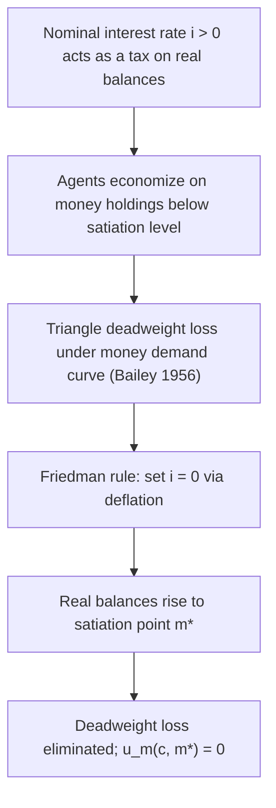

## The Optimum Quantity of Money and the Friedman Rule

### Overview

The optimum quantity of money (OQM) problem asks how a monetary authority should set policy to maximize social welfare when money is costly to hold in real terms but costless to produce. Milton Friedman's celebrated answer — the **Friedman rule** — states that the nominal interest rate should be driven to zero, achieved by deflating the money supply at a rate equal to the rate of time preference (equivalently, the real interest rate). This eliminates the private opportunity cost of holding money, satiating agents with real balances at the point where the marginal utility of money is zero (or where the marginal cost of producing money, essentially zero, is equated to its marginal value).

### The Core Intuition

Money is intrinsically costless to produce (the marginal cost of creating an additional unit of fiat currency is approximately zero), yet holding money is privately costly because it is dominated in return by interest-bearing assets. This wedge — the nominal interest rate $i$ — is a tax on real money balances. Since a benevolent planner would never want to impose a positive tax on a good with zero marginal production cost, welfare is maximized when this implicit tax is eliminated, i.e., when $i = 0$.

This is a direct application of the classical public finance logic that Ramsey/Pigou-style optimal taxation says: **do not tax goods with zero social marginal cost.** Money is precisely such a good.

### Money-in-the-Utility-Function (MIUF) Framework

**Setup**

Consider a representative agent with lifetime utility:

$$\sum_{t=0}^{\infty} \beta^t u(c_t, m_t)$$

where $c_t$ is consumption, $m_t = M_t/P_t$ is real money balances, $\beta \in (0,1)$ is the discount factor, and $u$ is increasing and concave in both arguments, with $u_m > 0$ but $u_{mm} < 0$ (diminishing marginal utility of real balances).

**Budget Constraint**

$$c_t + m_t + b_t = y_t + \frac{m_{t-1}}{1+\pi_t} + \frac{(1+i_{t-1})b_{t-1}}{1+\pi_t} + \tau_t$$

where $b_t$ denotes real bond holdings, $\pi_t$ is the inflation rate, $i_t$ is the nominal interest rate, and $\tau_t$ are lump-sum transfers.

**First-Order Conditions**

The household's optimization yields the standard Euler equation for bonds:

$$u_c(c_t, m_t) = \beta(1+r_t)\, u_c(c_{t+1}, m_{t+1})$$

and the money-demand condition, obtained by comparing the marginal utility of holding an extra unit of money for one period versus the marginal utility of holding a bond:

$$\frac{u_m(c_t, m_t)}{u_c(c_t, m_t)} = \frac{i_t}{1+i_t} \approx i_t$$

This is the **key equation**: the marginal rate of substitution between money and consumption equals the nominal interest rate — the opportunity cost of holding money instead of an interest-bearing asset.

**The Satiation Result**

Since $u_m > 0$ strictly for finite $m$, the only way to set $u_m = 0$ (full satiation in real balances) is to drive $i_t \to 0$. From the Fisher relation,

$$1 + i_t = (1+r_t)(1+\pi_t)$$

setting $i_t = 0$ requires

$$1 + \pi_t = \frac{1}{1+r_t}$$

In steady state with $r$ equal to the household's rate of time preference $\rho$ (from $\beta = 1/(1+\rho)$), this becomes:

$$\pi^* \approx -r \approx -\rho$$

**This is the Friedman rule: the optimal inflation rate is negative, equal to minus the real interest rate**, so that the money stock contracts over time (deflation) at the real rate of return on capital/bonds.

### Why Deflation, Not Just Zero Inflation

A common misconception is that "sound money" means zero inflation. The Friedman rule shows this is generally *not* optimal. Since holding money yields zero nominal return, price stability ($\pi = 0$) still leaves a positive real return gap between money ($r_m = -\pi \approx 0$) and bonds ($r_b = r > 0$), so $i = r - \pi > 0$ still taxes money holdings. Only deflation at rate $\pi = -r$ equalizes the real return on money with the real return on bonds, eliminating the wedge entirely.

### Diagrammatic Intuition: Money Demand and Deadweight Loss

The following SVG (svg_diagram) illustrates the money-demand curve and the welfare triangle eliminated by the Friedman rule:

<svg xmlns="http://www.w3.org/2000/svg" viewBox="0 0 640 420" font-family="Helvetica, Arial, sans-serif">
<title>Money Demand and the Friedman Rule Welfare Triangle (svg_diagram)</title>
<line x1="70" y1="360" x2="600" y2="360" stroke="black" stroke-width="2" />
<line x1="70" y1="360" x2="70" y2="30" stroke="black" stroke-width="2" />
<text x="610" y="365" font-size="14">m (real balances)</text>
<text x="30" y="30" font-size="14">i</text>
<path d="M 100 60 Q 300 120 560 350" stroke="#1f77b4" stroke-width="2.5" fill="none" />
<text x="420" y="150" font-size="13" fill="#1f77b4">Money demand: i = L(m)</text>
<line x1="70" y1="120" x2="600" y2="120" stroke="#888" stroke-dasharray="4,3" />
<text x="600" y="115" font-size="12" text-anchor="end" fill="#888">i₀ (initial policy rate)</text>
<line x1="70" y1="360" x2="70" y2="360" stroke="#888" stroke-dasharray="4,3" />
<line x1="205" y1="360" x2="205" y2="120" stroke="#888" stroke-dasharray="4,3" />
<text x="205" y="378" font-size="12" text-anchor="middle">m₀</text>
<line x1="70" y1="357" x2="600" y2="357" stroke="#2ca02c" stroke-width="2.5" />
<text x="600" y="350" font-size="12" text-anchor="end" fill="#2ca02c">i = 0 (Friedman rule)</text>
<line x1="560" y1="360" x2="560" y2="30" stroke="#2ca02c" stroke-dasharray="4,3" />
<text x="560" y="378" font-size="12" text-anchor="middle" fill="#2ca02c">m* (satiation)</text>
<path d="M 205 120 Q 380 180 560 355 L 560 120 Z" fill="#ff7f0e" fill-opacity="0.25" stroke="#ff7f0e" stroke-width="1.5" />
<text x="360" y="220" font-size="13" fill="#d95f02">Deadweight loss</text>
<text x="360" y="238" font-size="13" fill="#d95f02">eliminated by</text>
<text x="360" y="256" font-size="13" fill="#d95f02">Friedman rule</text>
</svg>

### Bailey's Welfare Triangle and the Harberger Approach

An alternative, complementary derivation (Bailey, 1956; Harberger-style partial-equilibrium public finance) treats money as a good with a downward-sloping demand curve $m(i)$. The area under this curve between $i=0$ and the actual nominal rate approximates the consumer-surplus loss from inflation, analogous to the deadweight loss from taxing any good:

$$\text{DWL} \approx \int_0^{i} m(x)\, dx$$

Since money's marginal production cost is zero, the socially efficient "price" of holding money is zero, i.e., $i=0$. This triangle-loss logic gives the same Friedman rule prescription without needing an explicit dynamic general equilibrium model, though it does not capture general equilibrium feedback (e.g., effects on capital accumulation or labor supply) that the MIUF or shopping-time frameworks incorporate.

### Alternative Microfoundations

**Key Points**

- **Money-in-the-utility-function (MIUF):** As derived above; money enters utility directly, often justified as a reduced form for the liquidity/transaction services money provides (Sidrauski, 1967).
- **Shopping-time / transactions-cost models:** Money reduces the time cost of purchasing consumption goods, $h_t = h(c_t, m_t)$, with $h_m < 0$. The Friedman rule again emerges because satiating money holdings minimizes total shopping time, and the marginal cost of producing money remains zero (McCallum and Goodfriend, 1987).
- **Cash-in-advance (CIA) constraints:** Agents must hold money in advance to purchase goods, $M_t \geq P_t c_t$. Under a strict CIA constraint, the Friedman rule makes the constraint slack (since $i=0$ means holding "excess" money is costless), restoring the flexible-price allocation.
- **Overlapping generations (OLG) models (Samuelson, 1958):** Money serves as a bubble/store of value across generations; the optimal monetary policy again relates to the golden-rule rate of return, though the OLG environment can generate additional considerations (e.g., dynamic inefficiency) not present in infinite-horizon representative-agent models.
- **Search-theoretic models (Kiyotaki-Wright; Lagos-Wright):** Money facilitates trade under limited commitment and anonymity. The Friedman rule remains optimal in many of these environments, though holdup and bargaining frictions can modify the exact welfare cost of inflation [Inference: the precise welfare cost estimates are sensitive to bargaining protocol assumptions within these models].

### Formal Statement of the Friedman Rule

$$i_t = 0 \quad \forall t \quad \Longleftrightarrow \quad \frac{M_{t+1}}{M_t} = \frac{1}{1+r}$$

The money supply growth rate equals the reciprocal of the gross real interest rate, implying the money stock **shrinks** over time at rate $r/(1+r) \approx r$, generating steady deflation equal to the real rate of return.

### The Ramsey/Optimal Taxation Perspective

Phelps (1973) challenged Friedman's result by embedding money in a second-best environment where the government must finance a fixed stream of expenditure using distortionary labor-income taxes *and* the inflation tax (seigniorage). In this setting, the **inverse-elasticity rule** of optimal taxation applies: if labor supply is also distorted, it may be second-best optimal to also tax money (i.e., $i^* > 0$) rather than push all distortion onto labor income, so as to spread deadweight loss across multiple tax bases.

**This is the central tension in the literature:**

| Framework | Prescription | Why |
| --- | --- | --- |
| Friedman (1969), first-best/lump-sum taxes available | $i = 0$ | No reason to tax a zero-marginal-cost good |
| Phelps (1973), only distortionary taxes available | $i^* > 0$ possibly | Ramsey logic: spread distortions across tax bases |
| Chari, Christiano, Kehoe (1996) | Friedman rule often restored | Under a broad class of calibrated models, taxing money is a poor substitute for taxing labor because money demand can be highly elastic, and cross-effects between the inflation tax base and labor tax base tend to favor $i=0$ even in second-best settings [Inference: this restoration result is calibration- and model-specific, and is not a general theorem] |
| Correia and Teles (1996, 1999) | Conditions for exact restoration | Show technical conditions (e.g., homotheticity/separability of the utility or transactions technology) under which the Friedman rule remains optimal even with distortionary taxation |

### Chari-Christiano-Kehoe (1996) Result

Chari, Christiano, and Kehoe examined a wide class of monetary business-cycle models with distortionary income taxation and found that the Friedman rule remained approximately optimal across many specifications, provided that the cross-partial derivative between consumption/leisure and real balances satisfied certain restrictions (roughly, that money demand does not become highly *inelastic* as $i \to 0$, and that the utility function is not "too far" from separable between money and other margins). This significantly rehabilitated Friedman's prescription within modern Ramsey-taxation environments, though it is **not a universal result** — it depends on functional form and parameter restrictions. [Inference: whether Friedman-rule optimality survives depends sensitively on the assumed cross-elasticities, which are difficult to pin down empirically.]

### Practical and Institutional Objections

**Key Points**

- **Zero lower bound (ZLB) and liquidity trap concerns:** Driving nominal rates to zero (or negative, to generate deflation) constrains conventional monetary policy's ability to respond to negative demand shocks, since nominal rates cannot easily go far below zero (though negative-rate policy has been implemented in several economies, e.g., ECB, Bank of Japan, Swiss National Bank, circa 2014–2022, with limits due to cash storage/currency substitution).
- **Fiscal-monetary interactions:** Sustained deflation reduces seigniorage revenue, which must be replaced by other (distortionary) tax instruments — this is exactly the Phelps critique.
- **Price stickiness:** In New Keynesian models with nominal rigidities, the Friedman rule interacts with the **Divine Coincidence** — output-gap stabilization and inflation stabilization can conflict with the deflationary requirement of the Friedman rule, since implementing the Friedman rule generally requires committing to expected deflation, which can be difficult to coordinate expectations around and may cause debt-deflation dynamics if agents are financially constrained. [Inference: the welfare cost of deviating from the Friedman rule is typically found to be quantitatively small (Lucas 2000; Cooley and Hansen 1989) relative to core business-cycle stabilization objectives, informing the standard central-bank preference for low, stable positive inflation like the common ~2% targets, rather than deflation.]
- **Financial stability concerns:** Persistent deflation raises real debt burdens (debt-deflation, per Fisher 1933), potentially destabilizing highly leveraged economies — an effect outside typical frictionless Friedman-rule models.
- **Implementation via interest on reserves:** A modern mechanism to implement something close to a "Friedman rule" outcome without literal price-level deflation is to **pay interest on money/reserves at the market rate**, eliminating the opportunity-cost wedge $i - i_m$ directly (Friedman 1960's original suggestion; see also Goodfriend 2000 and the modern "floor system" of reserve remuneration used by major central banks post-2008). This achieves satiation in the relevant sense (zero *net* nominal opportunity cost of holding reserves) without requiring deflation in the general price level.

### Quantitative Welfare Cost Estimates

Various calibration exercises estimate the welfare cost of deviating from the Friedman rule (i.e., the cost of positive trend inflation relative to $i=0$):

- Bailey (1956) and Friedman's own back-of-envelope estimates suggested costs on the order of a small fraction of a percent of GDP for moderate inflation rates.
- Lucas (2000), using a log-log money demand specification calibrated to U.S. data, estimated the welfare cost of 10% inflation (relative to the Friedman rule) at roughly 1% of GDP-equivalent consumption, with the cost of going from 0% to 10% inflation being substantially smaller than the cost of going from the Friedman rule (negative inflation) to 0%. [Unverified: exact magnitudes vary by money-demand specification (log-log vs. semi-log) and dataset/period used; Lucas himself presents both specifications with differing implied costs.]
- These estimates are sensitive to the interest elasticity of money demand: more elastic money demand implies larger welfare losses from a given nominal interest rate.

### Worked Example

Suppose the representative agent's period utility is separable and takes the form:

$$u(c,m) = \ln c + \chi \ln m$$

with real interest rate $r = 0.03$ (3% annually) and $\beta = 1/(1+\rho)$ with $\rho = r$ in steady state.

**Step 1 — Money demand condition:**

$$\frac{u_m}{u_c} = \frac{\chi/m}{1/c} = \frac{\chi c}{m} = i$$

so equilibrium real balances are:

$$m = \frac{\chi c}{i}$$

**Step 2 — Observe the singularity at $i=0$:** as $i \to 0^+$, $m \to \infty$ under this particular (log) specification, meaning satiation is reached only in the limit. [Inference: this is a well-known feature of the log-log specification and is one reason some researchers prefer money-demand functions bounded above, e.g., satiation at finite $m^*$, for realism at low interest rates — this is a modeling-choice caveat rather than a claim about real-world central bank behavior.]

**Step 3 — Friedman rule inflation target:** with $r = 0.03$, the optimal inflation rate is:

$$\pi^* \approx -0.03 \ (\text{i.e., } -3\%\text{ deflation per year})$$

**Step 4 — Money growth rule:** the central bank should contract the nominal money stock at rate $\mu^* = \pi^* \approx -3\%$ per year (holding output growth aside), so that:

$$\frac{M_{t+1} - M_t}{M_t} \approx -0.03$$

### Relation to the Golden Rule and Dynamic Efficiency

The Friedman rule is sometimes conflated with, but is analytically distinct from, the **golden rule of capital accumulation**. The golden rule concerns the capital stock that maximizes steady-state consumption ($f'(k^*) = n + \delta$, i.e., marginal product of capital equals population growth plus depreciation), a real-sector condition. The Friedman rule concerns the *nominal* return on money relative to the real return on other assets. In OLG monetary models, both concepts can interact: if the economy is dynamically efficient ($r > n$), the Friedman rule requires deflation; if dynamically inefficient ($r < n$), money can play a role in restoring efficiency, and the relevant optimal money growth condition changes accordingly [Inference: this OLG dynamic-inefficiency channel is a distinct mechanism from the standard infinite-horizon MIUF argument and is more of a special/edge case in modern calibrated economies, which are typically believed to be dynamically efficient].

### Summary Table

| Concept | Symbol | Friedman Rule Value |
| --- | --- | --- |
| Nominal interest rate | $i$ | $0$ |
| Optimal inflation rate | $\pi^*$ | $-r$ (deflation at the real rate) |
| Money growth rate | $\mu^*$ | $\approx -r$ |
| Marginal utility of money | $u_m$ | $0$ (satiation) |
| Real balances | $m$ | $m^*$ (satiation level, possibly $\to \infty$ under some specifications) |

### Next Steps

- Cagan money demand and hyperinflation dynamics
- Seigniorage and the inflation tax Laffer curve
- Cash-in-advance vs. money-in-utility equivalence results
- Ramsey optimal taxation with distortionary labor taxes (Chamley-Judd, Phelps 1973)
- New Keynesian Phillips curve and the "Divine Coincidence"
- Zero lower bound and unconventional monetary policy
- Interest on reserves and the "floor system" of monetary implementation
- Fiscal theory of the price level and monetary-fiscal interactions
- Search-theoretic monetary models (Kiyotaki-Wright, Lagos-Wright)
- Time consistency and the inflation bias (Kydland-Prescott, Barro-Gordon)