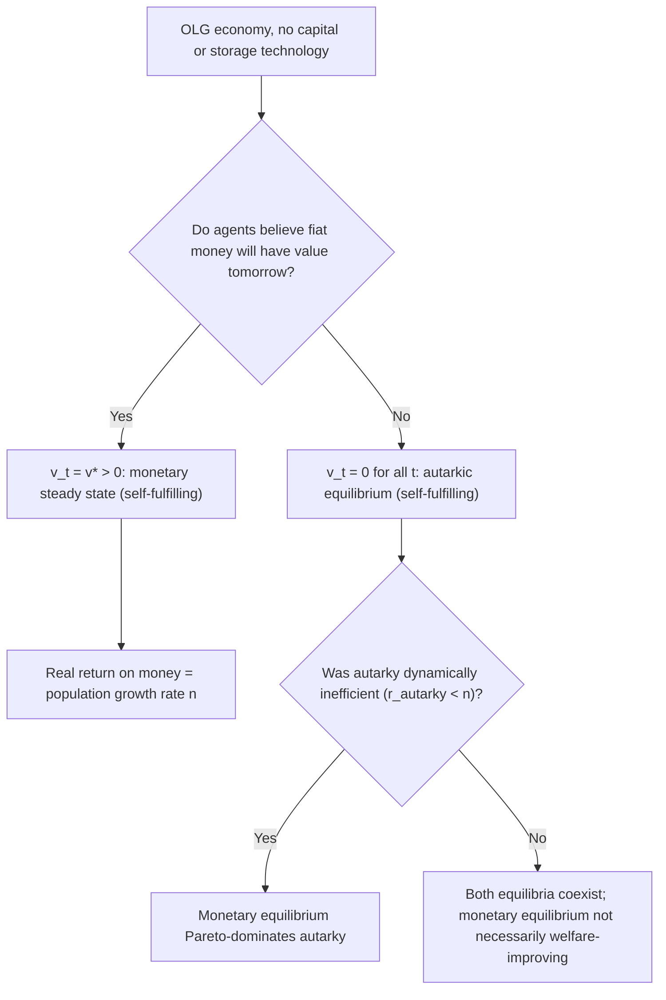

## Fiat Money Value and Rational Bubbles

### Overview

Fiat money is intrinsically worthless — it is not backed by any commodity and has no use in consumption or production. Yet in equilibrium it commands a positive price in terms of goods. The **rational bubble** approach to monetary economics explains this apparent puzzle: fiat money is valued purely because agents expect it to be valued in the future, making its positive price a **self-fulfilling, rational speculative bubble** on an intrinsically useless asset. This framework, rooted in overlapping-generations (OLG) models (Samuelson, 1958; Wallace, 1980), stands as a distinct microfoundation from money-in-the-utility-function or cash-in-advance approaches and raises deep questions about existence, uniqueness, and stability of monetary equilibria.

### The Core Puzzle

**Key Points**

- Fiat money has zero fundamental (intrinsic) value: it cannot be consumed, is not a productive input, and pays no dividend.
- A rational, infinitely-lived representative agent in a standard finite-horizon setting would never accept fiat money in the last period of their life, since it would be worthless afterward — backward induction then unravels acceptance at every earlier date (a Hahn-style non-existence problem, and closely related to the **backward induction paradox**).
- For fiat money to have positive value, the economy needs either (a) an infinite horizon with no "last trader," or (b) an overlapping-generations structure with an infinite sequence of new agents, or (c) money delivering direct utility/liquidity services (MIUF/CIA), which sidesteps the bubble question by assumption.
- The rational bubble approach focuses on cases (a) and (b): value arises purely from **self-fulfilling expectations**, not from any fundamental.

### Samuelson's OLG Model: Baseline Setup

**Environment**

- Two-period-lived overlapping generations, one new generation born each period $t = 1, 2, \dots$
- Each agent receives an endowment $y_1$ when young and $y_2$ when old, with $y_1 > y_2$ (motivating a desire to save).
- No capital, no storage technology, no outside store of value except fiat money.
- Population grows at rate $n$: $N_t = (1+n) N_{t-1}$.

**The Problem Without Money**

Young agents want to transfer consumption to old age, but with no durable good and no capital, there is no technology for the young to save via. The **autarkic equilibrium** (each agent consumes their own endowment each period) is generally **Pareto suboptimal** if the economy is dynamically inefficient.

**Introducing Fiat Money**

Suppose $M$ units of unbacked paper money exist, held by the initial old generation. If young agents believe money will have positive value $p_t$ (price of goods in terms of money, so $1/p_t$ is the value of money in goods) next period, they will trade goods for money when young, then sell money for goods when old.

**Individual optimization:**

$$\max_{c_1, c_2} u(c_1) + \beta u(c_2)$$

subject to:

$$c_1 = y_1 - \frac{m_t}{p_t}, \qquad c_2 = y_2 + \frac{m_t}{p_{t+1}}$$

where $m_t$ is nominal money held. The real return on money between $t$ and $t+1$ is:

$$1 + r_t^m = \frac{p_t}{p_{t+1}}$$

**Market-Clearing / Perfect-Foresight Dynamics**

In a symmetric equilibrium with all young agents behaving identically, the real value of money supply must satisfy:

$$\frac{M}{p_t} = N_t \cdot s(r_t^m)$$

where $s(\cdot)$ is per-capita real saving demand. Combined with population growth and constant $M$, this generates a first-order difference equation governing the real value of money $v_t \equiv M/p_t$:

$$v_{t+1} = (1+n)\, s\!\left(\frac{v_t}{v_{t+1}}\right)$$

This equation typically admits **two steady states**:

1. $v_t = 0$ for all $t$: **the autarkic (non-monetary) equilibrium**, where fiat money is valueless — always a valid equilibrium since $p_t \to \infty$ is self-consistent (nobody expects money to have value, so nobody accepts it, confirming the belief).
2. $v_t = v^* > 0$: **the monetary steady state**, where money has constant positive real value, and the real return on money equals the population growth rate: $1 + r^m = 1+n$.

### The Golden Rule Connection

At the monetary steady state, the real return to holding money equals $n$ (the biological/population growth rate), which is precisely the **golden rule** rate of return in this simple exchange economy (with no capital, the golden rule return equals the growth rate of the economy). This means:

- If the non-monetary (autarkic) equilibrium is **dynamically inefficient** (the implied autarkic interest rate is below the population growth rate $n$), then introducing valued fiat money is **Pareto-improving**: it allows the young to "store" value at the (relatively higher) return $n$, which the storage-free autarky equilibrium doesn't offer them.
- This is Samuelson's classic result: fiat money can solve a dynamic inefficiency problem, acting as an mechanism transferring resources across generations without any resource backing.

### Diagram: Monetary vs. Non-Monetary Steady States

### Existence, Multiplicity, and Indeterminacy

**Key Points**

- **Non-uniqueness:** Both the $v=0$ and $v=v^*$ equilibria are simultaneously valid rational-expectations equilibria of the same economy under the same fundamentals — a canonical example of **multiple self-fulfilling equilibria**.
- **Sunspot equilibria:** Beyond the two steady states, the model can also support equilibria with **stochastic fluctuations in the value of money driven purely by extrinsic uncertainty (sunspots)** unrelated to fundamentals (Azariadis, 1981; Cass and Shell, 1983), since agents' beliefs about $p_{t+1}$ are themselves self-fulfilling.
- **Speculative hyperinflationary paths:** The difference equation for $v_t$ can also admit equilibrium *paths* along which $v_t \to 0$ asymptotically but never in finite time — the value of money erodes gradually to zero even though $v_t > 0$ at every finite date, satisfying all individual optimality and market-clearing conditions at each date. These are termed **speculative equilibria**.
- **Indeterminacy of the price level:** Because $M$ is fixed in nominal terms and $p_0$ (the initial price level) is not pinned down by fundamentals alone in the pure fiat-money OLG model, the *initial* value of money is itself indeterminate absent some selection device (e.g., a policy rule, a fiscal backstop, or an equilibrium selection refinement).

### Formal Definition of a Rational Bubble

In a general asset-pricing framework, let $q_t$ denote the price of an asset with fundamental value:

$$q_t^f = \sum_{j=1}^{\infty} \frac{E_t[d_{t+j}]}{(1+r)^j}$$

where $d_{t+j}$ are dividends. A **rational bubble** component $b_t$ satisfies:

$$q_t = q_t^f + b_t, \qquad b_t = \frac{E_t[b_{t+1}]}{1+r}$$

For fiat money, $d_t = 0$ for all $t$ (no dividend), so $q_t^f = 0$ identically, and **the entire value of money is bubble**:

$$q_t = b_t, \qquad b_t = \frac{E_t[b_{t+1}]}{1+r}$$

This martingale-like condition (the bubble must grow at rate $r$ in expectation) is the formal statement of "fiat money value is a rational bubble."

### Conditions for a Rational Bubble to Exist

**Transversality and No-Ponzi Conditions**

In infinite-horizon representative-agent models (as opposed to OLG), the transversality condition:

$$\lim_{t\to\infty} \beta^t u'(c_t) \, b_t = 0$$

together with the requirement that $b_t \geq 0$ (money cannot have negative value) and finite aggregate resources, places strong restrictions on when bubbles can persist. Tirole (1985) showed that in a *representative-agent, infinite-horizon* economy with a bubble asset in fixed positive supply, **a necessary condition for a bubble to exist is that the bubbleless (fundamental) economy's interest rate exceeds the growth rate of the economy** — i.e., that the economy is **dynamically efficient in the absence of the bubble, but the bubble itself must grow slower than or equal to the interest rate**, and crucially the aggregate endowment/economy must be growing, or the bubble must be able to grow at rate $r$ without violating resource or transversality constraints.

**Tirole's Key Results**

- In an economy with a *constant* aggregate endowment (no growth), a bubble on an asset in **fixed positive supply** cannot exist in a representative-agent infinite-horizon economy with rational expectations, because the bubble would need to grow at rate $r > 0$ forever, eventually exceeding the (bounded) size of the economy, violating feasibility.
- In an OLG economy, this constraint is relaxed because **new agents are continually born to "buy into" the bubble** — there is no requirement that a single infinitely-lived agent hold an ever-growing bubble asset relative to their own resources; the bubble is instead "passed along" across generations.
- This is why OLG (or equivalently, models with borrowing/debt constraints creating effectively finite planning horizons in a "OLG-like" sense — Woodford 1990; Kocherlakota 1992) is the natural habitat for monetary rational bubbles, while standard infinite-horizon representative-agent models with complete markets and no borrowing constraints generically rule out bubbles on assets in fixed supply, **unless the economy exhibits sufficiently fast growth** (bubbles can exist on a growing economy if the bubble's required growth rate is still consistent with resource feasibility — see Blanchard and Weil, 2001; Farhi and Tirole, 2012 on their extensions with growth and financial frictions).

### Government Policy and Backing

**Key Points**

- Fiat money's role as a rational bubble is sometimes contrasted with a "fiscal backing" or "valuation equation" view (the **Fiscal Theory of the Price Level**, Sims 1994; Woodford 1995; Cochrane), in which money/government debt is valued because it represents a claim on the government's *primary surplus* stream — i.e., money and debt are not purely bubbles but are backed (at least partially) by expected future fiscal surpluses.
- These two views are not always mutually exclusive: fiat money value can partly reflect a "bubble" component and partly reflect an implicit claim on future taxation/seigniorage, and disentangling the two empirically is difficult. [Inference: the relative weight of "pure bubble" versus "fiscally backed" explanations for actual currency value is a live and largely unresolved debate in the literature, sensitive to model specification and identification assumptions.]
- A government that commits to accepting its own fiat money in payment of taxes provides a **minimal floor** of fundamental value (a "backing" via tax liabilities), which some argue is sufficient to pin down the value of money even without invoking pure bubble logic (the "tax-backing" or "chartalist" argument, associated with Lerner, and more formally with Starr, 1974).

### Hyperinflation as Bubble Collapse

**Key Points**

- If fiat money's value rests purely on self-fulfilling expectations, a coordinated shift in beliefs (a "sunspot" shock or a collapse of confidence) can cause the bubble to burst, driving $v_t \to 0$ — this maps naturally onto historical hyperinflations, where the *proximate* trigger is often a loss of confidence in the currency's future value rather than (or in addition to) a change in fundamentals like money growth rates.
- Standard monetarist accounts (Cagan, 1956) explain hyperinflation via excessive money supply growth interacting with inflationary expectations in a semi-log money demand function; the rational-bubble view offers a complementary, expectations-driven channel for why confidence collapses can be **self-fulfilling and discontinuous**, rather than a smooth function of money growth alone. [Inference: distinguishing empirically between "fundamentals-driven" (Cagan-style) and "bubble-collapse" (self-fulfilling) explanations for a specific historical hyperinflation episode is generally difficult, since both can generate similar reduced-form price paths.]

### Worked Example: Two-Period OLG with Log Utility

**Setup**

- $u(c) = \ln c$, $y_1 = 10$, $y_2 = 2$, population growth $n = 0$ (constant population), no discounting distortion beyond standard $\beta$.
- Savings function from log utility with no bequest motive: $s(r^m) = \frac{\beta}{1+\beta} y_1 - \frac{1}{1+\beta}\frac{y_2}{1+r^m}$ (derived from maximizing $\ln c_1 + \beta \ln c_2$ subject to the two-period budget constraint).

**Step 1 — Autarky interest rate:** in the absence of any store of value, the "notional" autarky return is implicitly defined by agents being unable to transfer resources at all; the relevant comparison is whether the **golden-rule** return $n = 0$ exceeds or falls short of the return that would prevail if saving *were* possible via a bond market.

**Step 2 — Monetary steady state:** setting $v_{t+1} = v_t = v^*$ (since $n=0$) requires $1+r^m = 1$, i.e., the real return to money is zero, and:

$$v^* = s(0) = \frac{\beta}{1+\beta}\, y_1 - \frac{1}{1+\beta}\, y_2$$

With $\beta = 0.9$: $v^* = \frac{0.9}{1.9}(10) - \frac{1}{1.9}(2) = 4.7368 - 1.0526 = 3.684$.

**Step 3 — Interpretation:** since $v^* > 0$, a monetary steady state exists in which each young agent holds real money balances worth 3.684 units of the good, trading it to the old for consumption; this equilibrium coexists with the always-valid autarkic equilibrium $v=0$.

**Step 4 — Welfare comparison:** whether the monetary equilibrium Pareto-dominates autarky depends on whether the "autarky-implied" real rate (which, with $y_1 > y_2$ and no smoothing possible, leaves agents worse off relative to the smoothed consumption path available under $v^*$) falls below the golden-rule rate $n=0$ — in this parameterization, since money allows consumption smoothing unavailable in autarky, the monetary equilibrium is generally welfare-improving for this generation structure. [Inference: this is a standard qualitative result for this class of parameterizations; the exact welfare ranking should be verified analytically or numerically for any specific calibration rather than assumed.]

### Illustration: The Bubble Equation

<svg xmlns="http://www.w3.org/2000/svg" viewBox="0 0 640 380" font-family="Helvetica, Arial, sans-serif">
<title>Fiat Money Value as a Rational Bubble (svg_diagram)</title>
<rect x="20" y="20" width="600" height="90" rx="8" fill="#eef4fb" stroke="#1f77b4" stroke-width="1.5" />
<text x="320" y="50" font-size="15" text-anchor="middle" fill="#1f77b4">Asset price: q_t = fundamental value + bubble</text>
<text x="320" y="75" font-size="14" text-anchor="middle">q_t = q_t^f + b_t</text>
<text x="320" y="95" font-size="13" text-anchor="middle" fill="#555">For fiat money: dividends d_t = 0 for all t, so q_t^f = 0</text>
<rect x="20" y="140" width="600" height="90" rx="8" fill="#fff3e6" stroke="#d95f02" stroke-width="1.5" />
<text x="320" y="170" font-size="15" text-anchor="middle" fill="#d95f02">Entire value of money is bubble</text>
<text x="320" y="195" font-size="14" text-anchor="middle">q_t = b_t</text>
<text x="320" y="215" font-size="13" text-anchor="middle" fill="#555">b_t = E_t[b_(t+1)] / (1+r) (must grow at rate r in expectation)</text>
<rect x="20" y="260" width="600" height="100" rx="8" fill="#f0f9ee" stroke="#2ca02c" stroke-width="1.5" />
<text x="320" y="290" font-size="15" text-anchor="middle" fill="#2ca02c">Existence requires:</text>
<text x="320" y="315" font-size="13" text-anchor="middle">OLG structure (new buyers each period), OR</text>
<text x="320" y="335" font-size="13" text-anchor="middle">sufficient aggregate growth in infinite-horizon economy</text>
</svg>

### Comparison Across Microfoundation Approaches

| Approach | Why Money Has Value | Bubble Element? |
| --- | --- | --- |
| MIUF (Sidrauski) | Direct utility from liquidity services | No — value from assumed preferences |
| CIA constraint | Required for transactions | No — value from transactions technology |
| Search-theoretic (Kiyotaki-Wright) | Facilitates trade under anonymity/lack of commitment | Partial — value emerges endogenously from trading frictions, not assumed utility |
| OLG rational bubble (Samuelson-Wallace) | Pure self-fulfilling expectations | Yes — entirely a bubble on a zero-dividend asset |
| Fiscal Theory of the Price Level | Backed by expected future primary surpluses | No — value from fiscal claims, though can combine with bubble elements |

### Related Topics / Next Steps

- Overlapping generations models and dynamic (in)efficiency
- The Fiscal Theory of the Price Level
- Cagan's model of hyperinflation and money demand
- Sunspot equilibria and self-fulfilling prophecies in macroeconomics
- Bubbles on real assets: Tirole (1985) and extensions with growth (Blanchard-Weil, Farhi-Tirole)
- Search-theoretic monetary models (Kiyotaki-Wright, Lagos-Wright)
- Government debt as a bubble: the "safe asset shortage" literature
- Backward induction and the "money in finite-horizon economies" problem
- The Friedman rule and the optimum quantity of money (contrast with bubble-based valuation)
- Dynamic inefficiency and the golden rule of capital accumulation