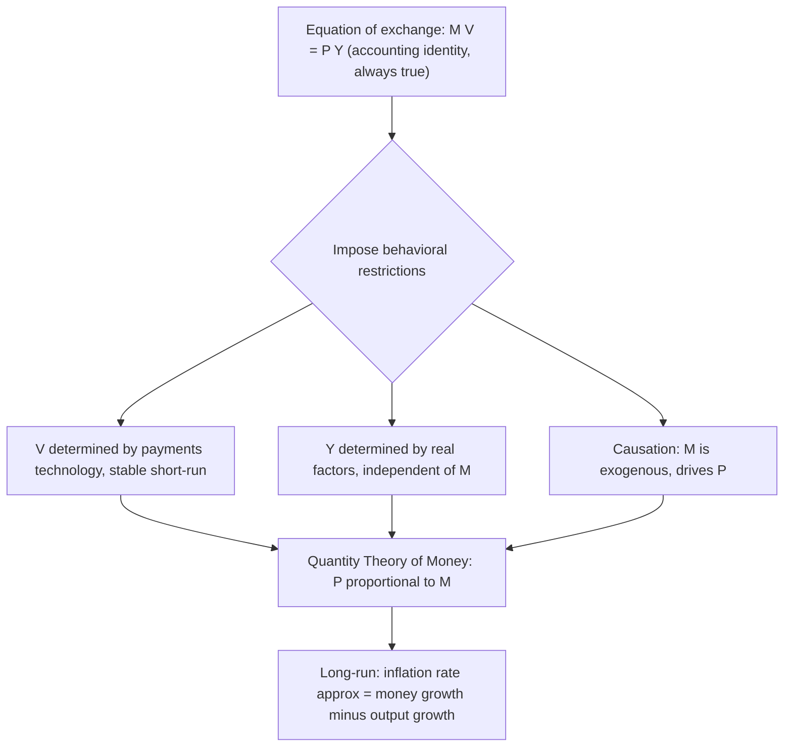

## The Equation of Exchange and the Quantity Theory of Money

### Overview

The **equation of exchange** is an accounting identity linking the money stock, its velocity of circulation, the price level, and real transactions/output. The **quantity theory of money (QTM)** transforms this identity into a substantive economic theory by imposing behavioral assumptions — chiefly, that velocity and real output are determined independently of the money supply in the long run — yielding the classical proposition that **the price level is proportional to the money stock**. This is among the oldest and most foundational propositions in monetary economics, tracing to Hume, developed formally by Fisher (1911) and the Cambridge School (Marshall, Pigou), and later revived and refined by Friedman (1956, 1968) in the monetarist tradition.

### The Equation of Exchange: Fisher's Transactions Version

**Definition**

$$MV = PT$$

where:

- $M$ = nominal money stock
- $V$ = **transactions velocity of money** — the average number of times a unit of money changes hands in transactions over the period
- $P$ = general price level (price index over all transacted goods)
- $T$ = real volume of transactions (total quantity of goods and services exchanged)

This is a **tautology/identity by construction**: $V$ is *defined* as $V \equiv PT/M$, so the equation cannot be false. It becomes a testable theory only once independent restrictions are placed on $V$ and $T$.

### Income Version of the Equation of Exchange

Since aggregate transactions data ($T$) are difficult to measure (they include intermediate-goods transactions, financial-asset trades, etc.), the more commonly used modern form substitutes real income/output $Y$ for transactions $T$:

$$MV = PY$$

where now $V$ is the **income velocity of money** — the average number of times a unit of money is used in transactions generating final income/output over the period — and $PY$ is nominal GDP.

$$V \equiv \frac{PY}{M} = \frac{\text{Nominal GDP}}{M}$$

### The Cambridge Cash-Balance Approach

An alternative but algebraically equivalent formulation, associated with Marshall and Pigou, emphasizes the **demand for money** rather than its circulation speed:

$$M^d = k P Y$$

where $k = 1/V$ is the **Cambridge k**, representing the fraction of nominal income the public wishes to hold as money balances. Setting money supply equal to money demand ($M = M^d$) recovers:

$$M = kPY \iff MV = PY, \quad V = 1/k$$

This formulation is significant because it reframes the QTM as a theory of **money demand** (a stock concept, portfolio choice) rather than pure circulation mechanics (a flow concept), directly anticipating Keynes's liquidity preference theory and, later, Friedman's restatement of the QTM as a theory of the demand for money.

### From Identity to Theory: The Classical Restrictions

To convert $MV = PY$ from a definitional identity into a substantive quantity theory, classical economists imposed three key assumptions:

**Key Points**

1. **Velocity ($V$) is stable/constant in the short-to-medium run**, determined by structural features of the payments system (banking practices, payment frequency, degree of monetization) that change only slowly over time and are unaffected by $M$.
2. **Real output/transactions ($Y$ or $T$) is determined independently of the money supply**, fixed at (or converging to) its full-employment level by real factors — technology, labor, capital, preferences (this is the **classical dichotomy**: real variables are determined in the real sector, nominal variables in the monetary sector).
3. **Causation runs from $M$ to $P$**: money supply is the *exogenous* driving variable.

Under these three assumptions, $MV=PY$ with $V$ and $Y$ fixed implies:

$$P = \frac{V}{Y} \cdot M \quad \Longrightarrow \quad P \propto M$$

**This is the central proposition of the quantity theory: the price level moves proportionally with the money stock.** Equivalently, in growth rates:

$$\hat{P} = \hat{M} + \hat{V} - \hat{Y}$$

With $\hat{V} \approx 0$ in the long run, this reduces to $\hat{P} \approx \hat{M} - \hat{Y}$ — **inflation equals money growth minus real output growth** in the long run — a relationship frequently invoked in monetarist policy discussions and central-bank communications about the long-run drivers of inflation.

### Diagram: From Identity to Theory

### The Classical Dichotomy and Monetary Neutrality

The QTM is the formal expression of the **classical dichotomy**: the economy is conceptually separable into a real sector (determining relative prices, real output, employment via real factors like technology and factor endowments) and a monetary/nominal sector (determining only the absolute price level). This implies:

- **Money is neutral:** a change in the money supply changes all nominal prices proportionally but leaves all real variables (real output, relative prices, employment, real interest rates) unchanged.
- **Money is superneutral** (a stronger property) if even the *rate of change* of the money supply (i.e., the inflation rate) has no effect on real variables in steady state — a property that does *not* hold in most models with money in the utility function or with a Mundell-Tobin effect (see below), where trend inflation can affect real money balances and, through portfolio-substitution channels, capital accumulation.

### The Quantity Theory in the Classical (Real-Balance) Framework

A cleaner modern restatement separates a nominal money-market equilibrium condition from an underlying real theory of money demand:

$$\frac{M}{P} = L(Y, i)$$

where $L(\cdot)$ is real money demand, increasing in real income $Y$ (transactions motive) and decreasing in the nominal interest rate $i$ (opportunity-cost motive). The strict QTM is the special case where $L(Y,i) = kY$ — money demand depends *only* on real income, with **no interest-rate sensitivity**, implying $V = 1/k$ is a constant. Keynes's later liquidity-preference theory relaxed this by allowing $L$ to depend on $i$, breaking the strict proportionality between $M$ and $P$ and introducing potential instability in $V$.

### Quantity Theory Under Flexible vs. Sticky Prices

**Key Points**

- Under **fully flexible prices** (the classical/neoclassical benchmark), the QTM's proportionality result holds essentially immediately: any change in $M$ is absorbed entirely by $P$, with $Y$ pinned down at its natural/full-employment level by the labor market and production function.
- Under **sticky prices** (Keynesian short run, or New Keynesian models with nominal rigidities), a monetary expansion in the short run raises $Y$ (or lowers unemployment) as well as $P$, and the strict quantity-theoretic proportionality between $M$ and $P$ holds only asymptotically, as prices fully adjust in the long run. This distinction — QTM as a **long-run** proposition, not necessarily a short-run one — is standard in modern macroeconomics and is explicitly endorsed even by many New Keynesian economists who reject short-run monetary neutrality.
- The **quantity theory as a long-run anchor** remains embedded in most modern DSGE and New Keynesian models via the long-run vertical Phillips curve / natural rate hypothesis: money is neutral in the long run, non-neutral in the short run due to nominal rigidities (Lucas, 1972; and the broader New Keynesian synthesis).

### Friedman's Restatement (1956)

Milton Friedman's "The Quantity Theory of Money: A Restatement" reframed the QTM not as a theory of prices directly, but as a **stable theory of the demand for money**, modeled as one application of the general theory of asset demand:

$$\frac{M^d}{P} = f\left(y_p,\ r_b,\ r_e,\ \frac{1}{P}\frac{dP}{dt},\ w,\ u\right)$$

where $y_p$ is **permanent income** (rather than current income — a key Friedmanite innovation carried over from his permanent-income hypothesis of consumption), $r_b$ and $r_e$ are returns on bonds and equities (substitute assets), the inflation-rate term captures the return on real goods relative to money, $w$ is the ratio of human to non-human wealth, and $u$ captures tastes/other factors.

**Key implications of Friedman's restatement:**

- Money demand is a **stable function of a small number of variables**, chiefly permanent income — this stability is the empirical linchpin of monetarism, since if $M^d/P$ is stable and predictable, controlling $M$ gives reliable control over nominal spending/prices.
- This is a *demand-side* microfoundation for the Cambridge $k$ (or equivalently $1/V$), converting the classical QTM from an assumption about mechanical circulation into a testable proposition about a stable structural money-demand relationship — bringing it into the same methodological framework as any other economic demand theory.

### Empirical Status: The Long-Run and Cross-Country Evidence

**Key Points**

- The strongest and most widely replicated empirical support for the QTM comes from **cross-country, long-run, and especially high-inflation/hyperinflation episodes**, where the correlation between money growth and inflation is very high and the proportionality prediction holds up well (McCandless and Weber, 1995, examining over 100 countries, found a near-one-for-one long-run relationship between money growth and inflation, particularly for the highest-inflation subsample).
- The relationship is **considerably weaker or unstable at low/moderate inflation rates and over shorter horizons**, where velocity movements, financial innovation, and changes in money demand can substantially decouple $M$ growth from $P$ growth over periods of several years.
- **Velocity has NOT been empirically stable** over many historical episodes in advanced economies — a well-documented breakdown occurred in the U.S. in the early 1980s, when financial deregulation and innovation caused unpredictable shifts in M1 velocity, contributing to the Federal Reserve's move away from strict monetary-targeting regimes (Volcker-era monetarist experiment, 1979–1982, and its aftermath). [Unverified: the precise causes and full extent of 1980s velocity instability are debated in the empirical literature and depend on the specific monetary aggregate and time period examined.]
- Modern central banks generally do **not** target monetary aggregates directly (having largely abandoned monetarist money-growth targeting rules by the 1980s–1990s in favor of interest-rate rules, e.g., inflation targeting via Taylor-rule-type frameworks), reflecting the empirical judgment that short-to-medium-run velocity instability makes strict quantity-theoretic money-supply control an unreliable lever for short-run price stabilization, even though the long-run quantity-theoretic logic (money growth drives inflation over long horizons) remains broadly accepted as a background proposition.

### Worked Example

Suppose an economy has:

- Nominal GDP this year: $PY = \$20$ trillion
- Money stock (M2): $M = \$5$ trillion

**Step 1 — Compute velocity:**

$$V = \frac{PY}{M} = \frac{20}{5} = 4$$

Money turns over 4 times per year in generating nominal income.

**Step 2 — Suppose the central bank expands $M$ by 8% over the next year, and real output $Y$ grows by 3%, with velocity remaining stable ($\hat V = 0$).**

$$\hat P = \hat M + \hat V - \hat Y = 8\% + 0\% - 3\% = 5\%$$

**Step 3 — Interpretation:** under strict quantity-theoretic assumptions, the model predicts approximately 5% inflation over the coming year.

**Step 4 — Sensitivity check:** if instead velocity *falls* by 2% (e.g., due to increased money hoarding/precautionary demand — a plausible scenario during financial stress), predicted inflation drops to:

$$\hat P = 8\% - 2\% - 3\% = 3\%$$

illustrating why velocity instability undermines the reliability of using $\hat M$ alone to forecast $\hat P$ [Inference: this stylized example illustrates the mechanics of the identity; actual short-run inflation dynamics in real economies are also affected by expectations, supply shocks, and nominal rigidities not captured in this simple framework].

### Illustration: Money, Velocity, Prices, and Output

<svg xmlns="http://www.w3.org/2000/svg" viewBox="0 0 640 300" font-family="Helvetica, Arial, sans-serif">
<title>The Equation of Exchange: M V = P Y (svg_diagram)</title>
<rect x="40" y="40" width="130" height="80" rx="8" fill="#eef4fb" stroke="#1f77b4" stroke-width="1.5" />
<text x="105" y="75" font-size="20" text-anchor="middle" fill="#1f77b4">M</text>
<text x="105" y="95" font-size="11" text-anchor="middle">Money stock</text>
<text x="185" y="90" font-size="24" text-anchor="middle">×</text>
<rect x="210" y="40" width="130" height="80" rx="8" fill="#fff3e6" stroke="#d95f02" stroke-width="1.5" />
<text x="275" y="75" font-size="20" text-anchor="middle" fill="#d95f02">V</text>
<text x="275" y="95" font-size="11" text-anchor="middle">Velocity</text>
<text x="355" y="90" font-size="24" text-anchor="middle">=</text>
<rect x="380" y="40" width="130" height="80" rx="8" fill="#f0f9ee" stroke="#2ca02c" stroke-width="1.5" />
<text x="445" y="75" font-size="20" text-anchor="middle" fill="#2ca02c">P</text>
<text x="445" y="95" font-size="11" text-anchor="middle">Price level</text>
<text x="525" y="90" font-size="24" text-anchor="middle">×</text>
<rect x="550" y="40" width="70" height="80" rx="8" fill="#f5eefb" stroke="#7f3fbf" stroke-width="1.5" />
<text x="585" y="75" font-size="20" text-anchor="middle" fill="#7f3fbf">Y</text>
<text x="585" y="95" font-size="11" text-anchor="middle">Output</text>
<line x1="60" y1="150" x2="600" y2="150" stroke="#888" stroke-dasharray="5,4" />
<text x="330" y="145" font-size="12" text-anchor="middle" fill="#888">Classical restrictions: V stable, Y set by real factors</text>
<rect x="150" y="180" width="340" height="70" rx="8" fill="#fdeeee" stroke="#c1272d" stroke-width="1.5" />
<text x="320" y="210" font-size="16" text-anchor="middle" fill="#c1272d">Result: P proportional to M</text>
<text x="320" y="232" font-size="12" text-anchor="middle">(P̂ = M̂ + V̂ - Ŷ, with V̂ ≈ 0)</text>
</svg>

### Related Concepts and Refinements

| Concept | Relation to QTM |
| --- | --- |
| **Mundell-Tobin effect** | Higher expected inflation raises the opportunity cost of holding money, inducing portfolio substitution toward capital, potentially raising the real capital stock — a channel that breaks strict superneutrality and modifies the simple QTM's real/nominal separation |
| **Real balance effect (Pigou effect)** | Changes in $P$ alter the real value of nominal money holdings, directly affecting consumption/aggregate demand — a channel by which money can matter for real activity even under otherwise classical assumptions |
| **Neutrality vs. superneutrality** | QTM implies neutrality (level of $M$ doesn't affect real variables); superneutrality (growth rate of $M$ doesn't affect real variables) is a stronger, separate property that can fail even when neutrality holds |
| **Modern Quantity Theory (Friedman)** | Recasts QTM as a stable money-demand function rather than a mechanical identity restriction |
| **Fiscal Theory of the Price Level** | Alternative long-run price-level theory emphasizing government solvency/fiscal backing rather than money-supply control as the anchor for $P$ |

### Related Topics / Next Steps

- The Cambridge cash-balance approach vs. Fisherine transactions approach
- Friedman's permanent income hypothesis and its role in money demand
- The Mundell-Tobin effect and superneutrality
- Velocity instability and the collapse of monetarist targeting (1979-1982 Volcker experiment)
- Hyperinflation, Cagan's model, and cross-country quantity-theoretic evidence
- The classical dichotomy and monetary neutrality
- New Keynesian Phillips curve and short-run non-neutrality of money
- The optimum quantity of money and the Friedman rule
- Inflation targeting and modern central bank operating frameworks
- The Fiscal Theory of the Price Level as an alternative anchor for P