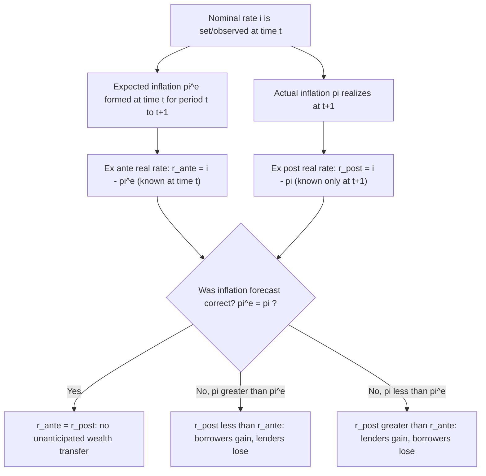

## The Fisher Equation and Real Versus Nominal Interest Rates

### Overview

The **Fisher equation**, developed by Irving Fisher (1896, 1930), formalizes the relationship between the **nominal interest rate**, the **real interest rate**, and **expected inflation**. It is one of the most fundamental relationships in monetary economics, underpinning the transmission mechanism between monetary policy (which directly affects nominal rates) and the real economy (which responds to real rates), and forming the basis of the **Fisher effect** — the long-run proposition that nominal interest rates move one-for-one with expected inflation, leaving real rates unaffected by monetary policy in the long run.

### Definitions

- **Nominal interest rate ($i$):** the rate of return on an asset measured in units of currency — the contractual rate stated on a bond, loan, or deposit.
- **Real interest rate ($r$):** the rate of return measured in units of purchasing power (goods) — the nominal rate adjusted for the erosion of purchasing power due to inflation.
- **Expected inflation rate ($\pi^e$):** the anticipated percentage change in the price level over the relevant holding period.

### The Exact Fisher Equation

An investor lending one unit of the good today (or equivalently, one unit of money worth $P_t$ in goods) at nominal rate $i$ receives $(1+i)$ units of money next period, worth $(1+i)/P_{t+1}$ in goods. The real return $r$ is defined by:

$$1 + r = \frac{1+i}{1+\pi^e}$$

where $\pi^e = E_t[(P_{t+1} - P_t)/P_t]$ is expected inflation. Rearranging:

$$r = \frac{1+i}{1+\pi^e} - 1 = \frac{i - \pi^e}{1+\pi^e}$$

This is the **exact (non-linearized) Fisher equation**.

### The Approximate Fisher Equation

For small values of $i$ and $\pi^e$ (the cross term $r \cdot \pi^e$ or $i \cdot \pi^e$ becomes negligible), a first-order Taylor approximation yields the widely used linear form:

$$i \approx r + \pi^e$$

or equivalently:

$$r \approx i - \pi^e$$

**This is the standard "Fisher equation" as typically cited: the nominal interest rate equals the real interest rate plus expected inflation.**

### Derivation of the Approximation

Starting from the exact relation $(1+r)(1+\pi^e) = 1+i$, expand the left side:

$$1 + r + \pi^e + r\pi^e = 1 + i$$

$$r + \pi^e + r\pi^e = i$$

When $r$ and $\pi^e$ are both small (e.g., a few percent), the cross-product term $r \pi^e$ is second-order small (e.g., $0.03 \times 0.02 = 0.0006$, i.e., 0.06 percentage points) and is dropped, yielding $i \approx r + \pi^e$. **The approximation error grows with the level of both $r$ and $\pi^e$**, and can matter materially in high-inflation environments.

### Diagram: Ex Ante vs. Ex Post Real Rates

### Ex Ante Versus Ex Post Real Rates

**Key Points**

- The **ex ante real rate** ($r^{ante} = i - \pi^e$) is the real rate anticipated by agents *at the time the nominal contract is signed*, based on their inflation expectations — this is the rate relevant for forward-looking economic decisions (investment, saving, consumption smoothing).
- The **ex post real rate** ($r^{post} = i - \pi$) is calculated *after the fact*, using the inflation rate that actually materialized — this is the rate relevant for accounting/realized-return purposes.
- These two coincide only under **perfect foresight** or, more realistically, only *on average* under rational expectations (where forecast errors are zero-mean but not necessarily zero in any given realization).
- **Unanticipated inflation redistributes wealth between borrowers and lenders**: if actual inflation exceeds expected inflation ($\pi > \pi^e$), the ex post real rate falls below what lenders anticipated, effectively transferring real wealth from creditors to debtors (since debtors repay in currency that has lost more purchasing power than anticipated) — this is a classical mechanism linking inflation surprises to redistributive and balance-sheet effects, historically significant for debtors like indebted farmers (19th century) or governments financing debt via inflation surprises (debt monetization/financial repression channels).

### The Fisher Effect: Long-Run Neutrality

The **Fisher effect** is the empirical/theoretical proposition that, in the long run, a permanent increase in expected inflation (driven by faster money growth, per the quantity theory) is fully reflected in a **one-for-one increase in the nominal interest rate**, leaving the real interest rate unchanged:

$$\frac{\partial i}{\partial \pi^e} = 1, \qquad \frac{\partial r}{\partial \pi^e} = 0$$

This is the interest-rate counterpart of monetary neutrality/superneutrality from the quantity theory: since $r$ is determined by real factors (time preference, marginal product of capital, growth) independent of the money supply/inflation in the classical long run, the entire adjustment to a change in $\pi^e$ must fall on $i$.

**Key Points**

- Empirical support for the *long-run* Fisher effect (a positive, close-to-one-for-one relationship between inflation and nominal rates across countries and over long time spans) is relatively robust, especially in cross-country and low-frequency data (Mishkin, 1992; Fama, 1975 for early evidence, though findings were later revisited).
- **Short-run evidence is much weaker and often shows the opposite sign** — nominal rates frequently do *not* rise immediately or proportionally with a rise in expected inflation, partly because monetary policy itself typically reacts to inflation with a *more than one-for-one* nominal rate response specifically in order to raise the *real* rate and tighten policy (the **Taylor principle** — see below), which is fundamentally a short-run *deviation* from Fisherian neutrality by design.
- The distinction between short-run non-neutrality (real rates *do* respond to monetary policy shocks in the short run, due to sticky prices) and long-run Fisherian neutrality (real rates are policy-invariant in the long run) is standard in modern New Keynesian macroeconomics.

### The Taylor Principle and the "Neo-Fisherian" Debate

**Key Points**

- Standard New Keynesian models require monetary policy to satisfy the **Taylor principle**: the nominal rate should respond to inflation **more than one-for-one** ($\partial i/\partial \pi > 1$) in the short run, in order for the *real* interest rate to rise when inflation rises — this is what gives conventional monetary policy its stabilizing, inflation-fighting power, and it is a deliberate short-run departure from a passive Fisherian one-for-one response.
- This has generated the so-called **"Neo-Fisherian" debate**: some researchers (notably associated with work by Cochrane and others post-2010s) have argued that, given the long-run Fisher relationship, a *central bank permanently raising* the nominal policy rate could, under certain model specifications and equilibrium-selection assumptions, ultimately raise long-run inflation rather than lower it (essentially inverting the conventional short-run transmission channel), since $\pi^e$ must eventually rise to satisfy $i \approx r + \pi^e$ if $r$ is pinned down by real factors. [Speculation: this Neo-Fisherian prescription remains contested and is not the mainstream operating assumption of central banks; its validity depends heavily on model specification, equilibrium selection (standard adaptive/backward-looking learning dynamics tend to generate the conventional, not Neo-Fisherian, short-run response), and the treatment of the fiscal side (whether fiscal policy is "active" or "passive" in the Leeper 1991 sense).] Mainstream central-bank practice and the bulk of New Keynesian modeling continues to rely on the conventional Taylor-principle transmission mechanism for short-to-medium-run policy.

### The Fisher Equation in General Equilibrium: Linking to the Euler Equation

In a standard consumption-based asset-pricing/DSGE framework, the real interest rate is pinned down by the consumption Euler equation:

$$u'(c_t) = \beta(1+r_t)\, E_t[u'(c_{t+1})]$$

For the common CRRA (constant relative risk aversion) utility specification $u(c) = c^{1-\sigma}/(1-\sigma)$, log-linearizing gives:

$$r_t \approx \rho + \sigma\, E_t[\Delta \ln c_{t+1}]$$

where $\rho = -\ln\beta$ is the rate of time preference and $\sigma$ is the coefficient of relative risk aversion (inverse of the intertemporal elasticity of substitution). Combining with the Fisher equation:

$$i_t \approx \rho + \sigma\, E_t[\Delta \ln c_{t+1}] + \pi^e_t$$

This shows explicitly that the nominal rate consistent with equilibrium consumption growth is a function of time preference, expected consumption growth, risk aversion, *and* expected inflation — the real block ($\rho, \sigma, E_t\Delta \ln c_{t+1}$) and the nominal block ($\pi^e_t$) are additively separable under this standard specification, reflecting the classical dichotomy/Fisherian neutrality embedded in the model's long-run/flexible-price behavior.

### Measuring Expected Inflation and Real Rates in Practice

**Key Points**

- **TIPS/inflation-indexed bonds:** in markets with both nominal and inflation-protected government bonds (e.g., U.S. Treasury Inflation-Protected Securities, UK index-linked gilts), the **breakeven inflation rate** — the difference between the nominal yield and the real (TIPS) yield on comparable-maturity bonds — provides a market-based, real-time estimate of $\pi^e$ (plus an inflation risk premium and liquidity premium, which must be netted out for a "pure" expectations measure).
- **Survey-based measures:** inflation expectations from surveys of professional forecasters (e.g., the Survey of Professional Forecasters, the Michigan Survey of Consumers) provide an alternative, non-market-based estimate of $\pi^e$, often diverging from breakeven measures, particularly at short horizons or during periods of market stress/illiquidity in inflation-linked bond markets.
- **Ex post real rates** are trivially computed once realized inflation is known, but are backward-looking and not directly useful for forward-looking decisions; they are commonly used in historical/empirical analysis of realized returns.
- The choice of inflation measure (CPI, PCE, GDP deflator) and expectations proxy materially affects computed real rates, and different real-rate series can diverge notably during episodes of high inflation-expectations uncertainty. [Inference: no single "true" real interest rate is directly observable; all empirical real-rate series involve some combination of assumptions about expectations formation and price index choice.]

### Worked Example

Suppose a one-year nominal government bond yields $i = 6\%$, and survey-based expected inflation over the coming year is $\pi^e = 3.5\%$.

**Step 1 — Exact Fisher equation:**

$$r = \frac{1+i}{1+\pi^e} - 1 = \frac{1.06}{1.035} - 1 = 0.02415 = 2.415\%$$

**Step 2 — Approximate Fisher equation:**

$$r \approx i - \pi^e = 6\% - 3.5\% = 2.5\%$$

**Step 3 — Compare approximation error:** the approximation (2.5%) overstates the exact real rate (2.415%) by about 8.5 basis points — small at these moderate levels, but the gap widens substantially at higher inflation (e.g., at $i=40\%, \pi^e=35\%$, the exact real rate is $(1.40/1.35)-1 = 3.70\%$ versus the linear approximation of $5\%$ — a much larger discrepancy), which is why **high-inflation-economy analysis should generally use the exact formula.**

**Step 4 — Ex post real rate:** if actual inflation over the year turns out to be $4.2\%$ instead of the expected $3.5\%$, the ex post real rate is:

$$r^{post} = \frac{1.06}{1.042} - 1 \approx 1.727\%$$

lower than the ex ante real rate of $2.415\%$ — lenders received a lower real return than anticipated because inflation surprised to the upside, illustrating the debtor-creditor wealth transfer discussed above.

### Illustration: Fisher Equation Components

<svg xmlns="http://www.w3.org/2000/svg" viewBox="0 0 640 320" font-family="Helvetica, Arial, sans-serif">
<title>Fisher Equation: Nominal Rate Decomposition (svg_diagram)</title>
<rect x="40" y="40" width="560" height="60" rx="8" fill="#eef4fb" stroke="#1f77b4" stroke-width="1.5" />
<text x="320" y="76" font-size="18" text-anchor="middle" fill="#1f77b4">Nominal rate i ≈ real rate r + expected inflation π^e</text>
<line x1="150" y1="100" x2="150" y2="140" stroke="#555" />
<line x1="490" y1="100" x2="490" y2="140" stroke="#555" />
<rect x="60" y="140" width="220" height="80" rx="8" fill="#f0f9ee" stroke="#2ca02c" stroke-width="1.5" />
<text x="170" y="170" font-size="15" text-anchor="middle" fill="#2ca02c">Real rate r</text>
<text x="170" y="190" font-size="11" text-anchor="middle">Time preference, expected</text>
<text x="170" y="205" font-size="11" text-anchor="middle">consumption growth, risk aversion</text>
<rect x="360" y="140" width="220" height="80" rx="8" fill="#fff3e6" stroke="#d95f02" stroke-width="1.5" />
<text x="470" y="170" font-size="15" text-anchor="middle" fill="#d95f02">Expected inflation π^e</text>
<text x="470" y="190" font-size="11" text-anchor="middle">Driven by money growth</text>
<text x="470" y="205" font-size="11" text-anchor="middle">(quantity theory, long run)</text>
<rect x="150" y="250" width="340" height="55" rx="8" fill="#fdeeee" stroke="#c1272d" stroke-width="1.5" />
<text x="320" y="282" font-size="13" text-anchor="middle" fill="#c1272d">Long run: monetary policy shifts i via π^e, r policy-invariant</text>
</svg>

### The Mundell-Tobin Effect: A Qualification to Strict Fisherian Neutrality

**Key Points**

- The **Mundell-Tobin effect** provides a channel by which higher expected inflation *can* affect the real rate, breaking strict Fisherian neutrality: higher $\pi^e$ raises the opportunity cost of holding money, inducing agents to substitute toward interest-bearing/productive capital, raising the capital stock and thereby *lowering* the marginal product of capital (and hence the equilibrium real rate) in the long run.
- Under this channel, the nominal rate rises by *less* than one-for-one with expected inflation ($\partial i/\partial \pi^e < 1$), since part of the inflation increase is absorbed by a fall in $r$ rather than a full pass-through to $i$ — a testable deviation from the strict Fisher effect.
- Empirically, the magnitude of the Mundell-Tobin effect is generally considered small in most calibrated models and is not the dominant force in observed nominal-rate/inflation co-movements, though it remains a standard qualification taught alongside the baseline Fisher effect. [Inference: empirical identification of the Mundell-Tobin effect specifically (as opposed to other channels affecting real rates) is difficult given the many confounding influences on real interest rates over long historical samples.]

### Related Topics / Next Steps

- The quantity theory of money and long-run inflation determination
- The Taylor rule and modern monetary policy rules
- The Neo-Fisherian debate and equilibrium selection in New Keynesian models
- TIPS breakeven inflation and market-based inflation expectations
- The Mundell-Tobin effect and superneutrality
- Consumption Euler equations and the intertemporal elasticity of substitution
- Debt-deflation dynamics and unanticipated inflation (Fisher 1933)
- Term structure of interest rates and the expectations hypothesis
- The optimum quantity of money and the Friedman rule
- Rational expectations and the Lucas critique in monetary policy analysis