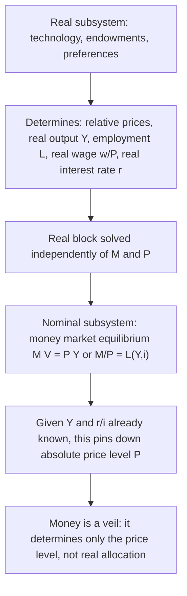

## Classical Dichotomy and Monetary Neutrality

### Overview

The **classical dichotomy** is the proposition that the economy can be analyzed as two separable systems: a **real sector**, in which real variables (output, employment, relative prices, the real interest rate) are determined entirely by real factors (technology, preferences, factor endowments), and a **nominal/monetary sector**, in which the money supply determines only the absolute price level and other nominal variables. **Monetary neutrality** is the direct implication of this dichotomy: changes in the money supply affect nominal variables proportionally but leave all real variables unchanged. These twin concepts form the theoretical core of classical and neoclassical monetary theory and serve as the benchmark against which Keynesian and New Keynesian departures (via nominal rigidities) are typically framed.

### Formal Statement of the Classical Dichotomy

Consider an economy with $n$ goods. Let $p_i$ denote the nominal (money) price of good $i$, and let relative prices be $p_i/p_j$. The classical dichotomy asserts that the equilibrium values of all **real variables** — relative prices $p_i/p_j$, quantities produced/consumed $q_i$, employment $L$, the real wage $w/P$, the real interest rate $r$ — are determined by a subsystem of equations involving **only real variables** (technology, endowments, preferences), independent of the absolute price level $P$ or the money stock $M$. A separate, second subsystem — typically the equation of exchange or an LM-type money-market equilibrium condition — then determines the **absolute price level** $P$ (or equivalently, the money price of any single good) given the already-determined real allocation.

**Key Points**

- The **real subsystem** consists of: production functions, labor supply/demand conditions, goods-market clearing, and the consumption/savings (Euler) equation determining the real interest rate — none of these equations contain $M$ or $P$ individually, only relative prices and real quantities.
- The **nominal subsystem** consists of the quantity-theoretic or money-demand relationship, e.g., $MV = PY$ or $M/P = L(Y,i)$, which — taking $Y$ and $i$ (hence $r$, given $\pi^e$) as already determined by the real subsystem — pins down $P$ uniquely given $M$.
- **Causal ordering:** the dichotomy implies a recursive (block-recursive) solution structure — solve the real block first, then "plug in" to solve the nominal block — rather than a fully simultaneous system where real and nominal variables jointly determine each other.

### Diagram: The Recursive Structure of the Classical Dichotomy

### Monetary Neutrality: Formal Definition

**Monetary neutrality** holds if a change in the *level* of the money stock $M$ (e.g., a one-time, fully anticipated, proportional change) leaves all real variables unchanged and causes all nominal variables to change proportionally:

$$M \to \lambda M \implies P \to \lambda P,\ w \to \lambda w,\ \text{all nominal prices} \to \lambda \times (\text{nominal prices})$$

while

$$Y, L, r, \frac{w}{P}, \frac{p_i}{p_j} \ \text{unchanged}$$

This is sometimes called the **"money is a veil"** proposition — nominal magnitudes are simply a numeraire/unit-of-account convention with no independent effect on real economic activity, analogous to the irrelevance of choosing meters versus feet for measuring distance.

### Superneutrality: A Stronger Property

**Superneutrality** is the stronger claim that even the **growth rate** of the money supply (i.e., the steady-state inflation rate) has no effect on real variables:

$$\hat{M} \to \hat{M}' \implies \pi \to \pi', \quad \text{but } Y, L, K, r \ \text{unchanged in steady state}$$

**Key Points**

- Neutrality concerns a one-time change in the *level* of $M$; superneutrality concerns changes in the *growth rate* of $M$ (hence the *trend inflation rate*).
- Superneutrality is a materially stronger condition and **fails in most standard monetary growth models** even when simple neutrality holds — the classic counterexample is the **Mundell-Tobin effect** (see below), where higher trend inflation induces portfolio substitution from real money balances toward physical capital, raising the steady-state capital stock and thus violating superneutrality even though a one-time proportional change in the money level remains neutral.
- Superneutrality also generally fails in money-in-the-utility-function models whenever real money balances enter non-separably with consumption or leisure in the utility function, since changes in trend inflation then alter the marginal utility of consumption/leisure trade-offs even in steady state.

### Why the Dichotomy Requires Flexible Prices

The classical dichotomy's recursive structure — solve real variables first, then nominal — is **only valid under fully flexible prices and wages**, where markets clear continuously (Walrasian equilibrium at every instant). If prices or wages are sticky (cannot adjust instantaneously to clear markets), then:

$$\text{Nominal shocks} \to \text{immediate changes in real variables (output, employment)}$$

because firms/workers facing fixed nominal prices/wages respond to nominal demand shocks by adjusting real quantities (production, hours) rather than prices, breaking the clean separation of real and nominal blocks. **This is precisely the mechanism by which Keynesian and New Keynesian models generate short-run monetary non-neutrality** — nominal rigidities (menu costs, staggered price/wage-setting à la Calvo or Taylor contracts, informational frictions) prevent the instantaneous price adjustment the classical dichotomy requires.

### Money Illusion and Its Role

**Key Points**

- **Money illusion** — the (irrational, in classical models) tendency of agents to respond to nominal rather than real changes — is explicitly assumed *absent* in classical models: rational agents are assumed to correctly perceive that a proportional change in all nominal prices and their own nominal income leaves their real purchasing power and real decisions unaffected.
- If agents *did* suffer from money illusion (e.g., misperceiving a nominal wage increase as a real wage increase even when the price level has risen proportionally), the classical dichotomy would break down even with flexible prices, since real labor-supply decisions would then respond to purely nominal changes.
- Some behavioral/experimental economics literature (e.g., Shafir, Diamond, and Tversky, 1997) documents empirical evidence of money illusion in individual decision-making, posing a challenge to the strict rationality assumptions underlying the classical dichotomy, though the aggregate macroeconomic significance of such illusion remains debated. [Inference: whether documented individual-level money illusion translates into macroeconomically significant aggregate non-neutrality, independent of standard nominal-rigidity channels, is not a settled question in the literature.]

### Patinkin's Critique and the Integration Problem

Don Patinkin's *Money, Interest, and Prices* (1956) raised an influential internal critique of the naive classical dichotomy: if the real subsystem (e.g., Walrasian excess-demand functions for goods) is specified as depending **only on relative prices**, and money enters *only* via the separate quantity-theoretic equation, then the system is **generally overdetermined or exhibits a "invalid dichotomy"** — specifically, if real excess-demand functions are homogeneous of degree zero in *all* nominal prices and the money stock jointly (a standard assumption), then doubling $M$ alone, holding all nominal goods prices fixed, changes real money balances $M/P$, which — if real money balances affect real excess demands (a **real-balance effect**, or **Pigou effect**) — would generically shift the real equilibrium, invalidating strict separability.

**Patinkin's resolution:** for the classical dichotomy to hold *validly and consistently*, real excess-demand functions must be **homogeneous of degree zero in money prices alone** (not in $M$ and prices jointly) — equivalently, real money balances $M/P$ must **not** enter the real excess-demand functions at all (i.e., no real-balance effect on the *goods market* side), which requires a fairly specific (and somewhat restrictive) structure, typically achieved by assuming money enters the utility function separably from goods, or via a strict "money is a distinct veil" cash-in-advance-type structure where real money balances have no independent wealth effect on real consumption/labor-supply choices. **This is a well-known technical subtlety**: a naive statement of the classical dichotomy (real block solved with relative prices only, ignoring $M/P$ entirely) can be internally inconsistent unless specific homogeneity/separability conditions are imposed. [Inference: the practical macroeconomic significance of the real-balance effect for aggregate demand is generally considered to be quantitatively small in modern calibrated models, but it remains theoretically important for establishing the internal consistency of the classical dichotomy as a modeling device.]

### The Neoclassical Synthesis and Modern DSGE Treatment

**Key Points**

- Modern **New Keynesian DSGE models** are explicitly built to nest the classical dichotomy as a **long-run/flexible-price limiting case**: absent nominal rigidities (the "flexible-price equilibrium" or "natural rate" allocation), the model collapses to a classical real business cycle-type structure exhibiting the dichotomy and full monetary neutrality.
- Nominal rigidities (Calvo pricing, Rotemberg quadratic adjustment costs, staggered Taylor contracts) are then layered on top, generating a **short-run** wedge between actual output and the flexible-price "natural" level of output — the **output gap** — through which monetary policy has real effects in the short run, while the model still typically preserves **long-run neutrality/superneutrality asymptotically** as prices fully adjust.
- This "long-run classical, short-run Keynesian" structure is the standard organizing principle of the **neoclassical synthesis** (originally associated with Samuelson, Solow, Tobin in the 1950s-60s, and revived in modern form by the New Keynesian program from the late 1980s onward).

### Empirical Tests of Monetary Neutrality

**Key Points**

- Long-run neutrality is typically tested via **long-horizon regressions** or structural VAR (vector autoregression) methods examining whether permanent innovations to the money supply have a permanent effect on the level of real output in the long run — the influential methodology of King and Watson (1997) and related work generally finds support for long-run neutrality (money supply shocks do not have permanent real output effects), though results are sensitive to identification assumptions (e.g., long-run restrictions à la Blanchard-Quah) and the specific monetary aggregate used.
- **Short-run non-neutrality** is very well documented in the structural VAR and event-study literature on monetary policy shocks (e.g., Christiano, Eichenbaum, and Evans, 1999, and many successors): unanticipated monetary policy tightening/loosening produces significant, persistent (multi-quarter to multi-year) real effects on output and employment before dissipating — consistent with short-run non-neutrality due to nominal rigidities, converging toward neutrality only in the long run.
- Some evidence on **superneutrality** specifically (effect of trend inflation on long-run real output/capital) suggests a small negative relationship between trend inflation and long-run growth in some cross-country studies, potentially consistent with a (quantitatively modest) Mundell-Tobin-type or Tobin-effect-adjacent channel, though causal identification here is difficult given the many confounders correlated with high trend inflation across countries (institutional quality, financial development, macroeconomic volatility). [Unverified: cross-country growth-inflation empirical results are highly sensitive to sample composition, particularly the inclusion/exclusion of high-inflation outlier economies, and are not uniformly replicated across studies.]

### Worked Example: Testing the Dichotomy in a Simple Model

Consider a two-good endowment economy (apples, bananas) with a representative agent maximizing $u(q_A, q_B)$ subject to a nominal budget constraint $p_A q_A + p_B q_B = p_A \bar{q}_A + p_B \bar{q}_B$ (endowments $\bar q_A, \bar q_B$).

**Step 1 — Real subsystem:** the tangency condition (relative price equals marginal rate of substitution) is:

$$\frac{p_A}{p_B} = \frac{u_A(q_A, q_B)}{u_B(q_A, q_B)}$$

This condition, together with market clearing $q_A = \bar q_A, q_B = \bar q_B$ (a pure endowment economy — trade doesn't change the aggregate, but relative price is still pinned down for any interior allocation problem), depends **only on the relative price** $p_A/p_B$, never on $M$ or the absolute level of $p_A, p_B$ individually.

**Step 2 — Introduce money:** suppose money enters via a separate quantity-theoretic relation, $M \bar V = P (\bar q_A + \bar q_B)$ with $P$ some price index — say $P = p_A$ (using apples as numeraire). This single additional equation, taking the already-determined relative price $p_A/p_B$ and real quantities as given, pins down the **absolute** level of $p_A$ (and hence $p_B = p_A \cdot (p_B/p_A)$) uniquely given $M$.

**Step 3 — Verify neutrality:** if $M$ doubles, the quantity-theoretic relation implies $P$ (i.e., $p_A$) doubles; since $p_B/p_A$ was already fixed by the real subsystem, $p_B$ doubles too — **all nominal prices double, relative price $p_A/p_B$ is unchanged, real allocations $q_A = \bar q_A, q_B = \bar q_B$ are unchanged.** This confirms neutrality in this simple flexible-price endowment economy.

**Step 4 — Introduce a nominal rigidity:** now suppose $p_A$ is fixed by a pre-existing nominal contract and cannot adjust this period. A doubling of $M$ then forces the *entire* adjustment onto $p_B$ (or, more realistically, onto real quantities if quantities rather than $p_B$ must adjust to clear the market) — relative prices and/or real allocations are now affected by a purely nominal shock, **breaking the classical dichotomy** precisely because of the assumed price stickiness.

### Illustration: Real and Nominal Blocks

<svg xmlns="http://www.w3.org/2000/svg" viewBox="0 0 640 340" font-family="Helvetica, Arial, sans-serif">
<title>Classical Dichotomy: Recursive Block Structure (svg_diagram)</title>
<rect x="40" y="30" width="560" height="110" rx="8" fill="#eef4fb" stroke="#1f77b4" stroke-width="1.5" />
<text x="320" y="55" font-size="16" text-anchor="middle" fill="#1f77b4">Real block (flexible prices)</text>
<text x="320" y="78" font-size="12" text-anchor="middle">Technology, endowments, preferences</text>
<text x="320" y="98" font-size="12" text-anchor="middle">Determines: relative prices, Y, L, w/P, r</text>
<text x="320" y="120" font-size="12" text-anchor="middle" fill="#c1272d">No dependence on M or P</text>
<line x1="320" y1="140" x2="320" y2="185" stroke="#555" stroke-width="2" marker-end="url(#arrow)" />
<rect x="40" y="190" width="560" height="110" rx="8" fill="#fff3e6" stroke="#d95f02" stroke-width="1.5" />
<text x="320" y="215" font-size="16" text-anchor="middle" fill="#d95f02">Nominal block (money market)</text>
<text x="320" y="238" font-size="12" text-anchor="middle">Takes Y, r as given from real block</text>
<text x="320" y="258" font-size="12" text-anchor="middle">M V = P Y or M/P = L(Y,i)</text>
<text x="320" y="280" font-size="12" text-anchor="middle" fill="#c1272d">Determines absolute price level P only</text>
</svg>

### Departures from Strict Neutrality: Summary Table

| Channel | Mechanism | Breaks Neutrality? | Breaks Superneutrality? |
| --- | --- | --- | --- |
| **Nominal price/wage rigidity** | Prices can't adjust instantly to nominal shocks; quantities adjust instead | Yes (short run) | Yes (short run) |
| **Mundell-Tobin effect** | Higher trend inflation induces portfolio substitution from money to capital | No (one-time M change still neutral) | Yes |
| **Real-balance/Pigou effect** | Real money balances enter goods-market excess demand directly | Potentially Yes, unless separability assumed (Patinkin) | Potentially Yes |
| **Money illusion** | Agents respond to nominal rather than real magnitudes | Yes, if present | Yes, if present |
| **Non-separable MIUF preferences** | Real balances and consumption/leisure are non-separable in utility | No (level neutrality can still hold) | Yes |

### Related Topics / Next Steps

- The equation of exchange and the quantity theory of money
- The Fisher equation and real versus nominal interest rates
- Patinkin's real-balance effect and the integration of money into value theory
- The Mundell-Tobin effect and superneutrality
- Nominal rigidities: Calvo pricing and staggered contracts
- The New Keynesian Phillips curve and short-run non-neutrality
- Money illusion: theory and behavioral evidence
- Long-run neutrality tests: structural VAR approaches (King-Watson)
- The neoclassical synthesis and its modern DSGE formulation
- The optimum quantity of money and the Friedman rule