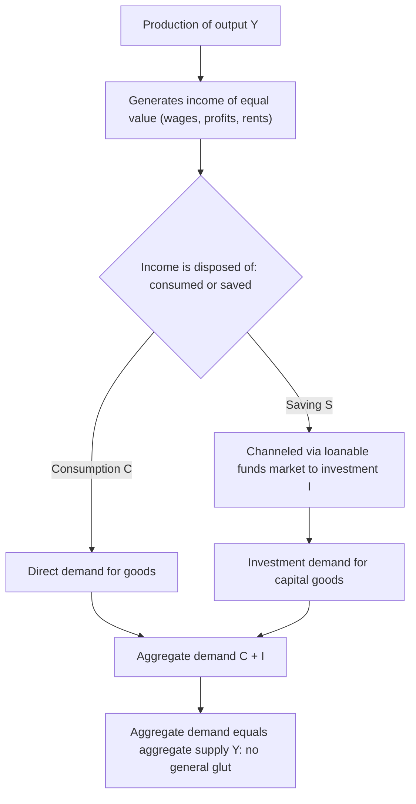

## Say's Law and Classical Monetary Equilibrium

### Overview

**Say's Law**, associated with Jean-Baptiste Say (1803) and central to classical economic thought through the 19th and early 20th centuries, is most commonly summarized as the proposition that **"supply creates its own demand."** In its classical monetary context, Say's Law asserts that the very act of producing goods generates income exactly sufficient to purchase the economy's total output, ruling out the possibility of a general glut (a generalized deficiency of aggregate demand relative to aggregate supply). This proposition underpins the classical presumption of continuous full-employment equilibrium and was the principal target of Keynes's *General Theory* (1936), making it a pivotal fault line between classical/neoclassical and Keynesian monetary theory.

### Formal Statements of Say's Law

**Key Points — Multiple Distinct Versions**

Economists (notably Baumol, 1977, in his influential taxonomic survey) distinguish several logically distinct propositions that have all been called "Say's Law" at various points, which is important because they carry different implications and different degrees of validity:

1. **The identity version:** aggregate demand and aggregate supply are *definitionally* equal at all times, because every act of production simultaneously generates income equal in value to that production, and all income is, by identity, either spent or saved-and-invested (with saving and investment definitionally equal). This is closest to a national-income accounting tautology.
2. **The equilibrium/equality version:** aggregate demand *tends toward* equality with aggregate supply, not as a definitional identity but as an *equilibrium condition* achieved through price/interest-rate adjustment — i.e., markets clear, but only via an adjustment process, not by definitional necessity at every instant.
3. **The "vent-for-surplus" or composition version:** an excess supply of any *individual* good is always matched by excess demand for some *other* good (Say's original point was primarily about the impossibility of a *general* glut across *all* markets simultaneously, not the impossibility of a partial/sectoral glut in any one market).

### The Classical Argument Against General Gluts

The core classical logic: since production of goods and services *is* the source of income (wages, profits, rents paid to factors of production equal the value of output produced), and since rational agents will always find *some* use for the income they earn — either current consumption or saving that is channeled via financial markets into investment — **aggregate expenditure (consumption + investment) must equal aggregate income (= aggregate output value)** in equilibrium. A "general glut" — excess supply of goods *and* excess supply of labor simultaneously across the entire economy — was considered a logical impossibility (or at most a fleeting, self-correcting disequilibrium) under this view.

### Diagram: The Say's Law Circular Flow Argument

### The Role of the Interest Rate: The Loanable Funds Mechanism

The crucial classical linchpin making Say's Law function as an *equilibrating* (not merely definitional) mechanism is the **loanable funds market**: the interest rate is the price that equilibrates desired saving $S(r)$ (increasing in $r$) with desired investment $I(r)$ (decreasing in $r$).

$$S(r) = I(r)$$

If households wish to save more than firms wish to invest at the prevailing interest rate (a potential source of deficient aggregate demand, since saved-but-not-invested income would represent a "leakage" from the expenditure stream), classical theory holds that the interest rate **falls**, discouraging saving and encouraging investment, until the two are brought back into equality — **the flexible interest rate ensures that whatever is saved is automatically channeled into investment demand, preventing any shortfall in aggregate demand.** This is the specific mechanism by which classical economists argued Say's Law holds as an *equilibrium* tendency (version 2 above) even if not a strict identity (version 1) at every instant.

### Say's Law and Monetary Equilibrium: The Role of Money

**Key Points**

- Say's Law is most straightforwardly valid in a **pure barter economy** or in a monetary economy where money is used **purely as a medium of exchange with no independent demand for money as a store of value/precautionary buffer** — i.e., **Walras's Law plus the assumption that money is never "hoarded"** implies that excess supply of goods in the aggregate is impossible, since any income not spent on goods must (by assumption) flow immediately into other goods or into investment via the loanable-funds mechanism.
- **The critical classical vulnerability, identified centrally by Keynes:** if agents can and do choose to hold money *as an asset* — hoarding cash rather than spending on consumption or channeling savings into investment via bonds/capital — this creates a "leakage" from the income-expenditure circuit that Say's Law logic does not accommodate. An increase in desired money holdings (a fall in velocity, or a rise in "liquidity preference" in Keynesian terms) can, in this view, generate a **genuine deficiency of aggregate demand** relative to aggregate supply, i.e., a general glut, **even if the interest rate is theoretically free to adjust**, because in Keynes's view the interest rate is determined in the *money* market (liquidity preference, equating money supply to money demand) rather than being free to equilibrate the *loanable funds* (saving-investment) market, especially once the economy approaches the **zero lower bound / liquidity trap**, where further interest-rate declines cannot induce sufficient investment or discourage sufficient saving/hoarding.
- This is the essence of the **Keynesian critique of Say's Law**: a monetary economy with an independent demand for money as a store of value (not just a medium of exchange) can experience persistent, demand-deficient unemployment — a possibility Say's Law, in its classical formulation, effectively assumes away.

### Walras's Law: The Related but Distinct General Equilibrium Concept

**Key Points**

- **Walras's Law** is a distinct (though related) proposition from general equilibrium theory: the sum of the value of excess demands across *all* markets in an economy (including the money market) must equal zero, as an *accounting identity* following from individual budget constraints — if $n-1$ markets are in equilibrium, the $n$-th market must also be in equilibrium.
- Walras's Law is a **rigorous, always-true mathematical identity** in any economy with well-defined budget constraints, whereas Say's Law (particularly in its "general gluts are impossible" equilibrium-tendency form) is a **substantive economic claim about market-clearing dynamics**, not a pure identity — this distinction is important, as they are sometimes conflated.
- Applying Walras's Law to a monetary economy: if the goods market, labor market, and bond market are all simultaneously in excess supply (the classic depression/general-glut scenario), Walras's Law implies there must be a corresponding **excess demand for money** (hoarding) to make the aggregate accounting identity hold — precisely the mechanism Keynes emphasized as the source of general gluts, and precisely the channel that a strict Say's Law (in its classical, no-hoarding form) rules out by assumption.

### Say's Law, Classical Full Employment, and the Labor Market

**Key Points**

- Combined with the classical assumption of **flexible nominal wages** (and flexible prices generally), Say's Law underpins the classical presumption that the labor market always clears at full employment: any unemployment is either frictional/voluntary or a temporary disequilibrium that flexible wages rapidly eliminate.
- Involuntary, persistent unemployment was therefore considered largely **theoretically impossible** in the strict classical framework (absent specific frictions like minimum wages, union bargaining power, or informational lags) — a position Keynes directly challenged by arguing that nominal wage/price rigidity (downward stickiness in particular) combined with a liquidity-trap-constrained interest rate could produce **persistent involuntary unemployment as an equilibrium outcome**, not merely a transitional disequilibrium.
- This debate — whether general gluts/involuntary unemployment are a logical impossibility (classical) or a genuine equilibrium possibility under specific conditions (Keynesian) — is one of the foundational methodological divides in the history of macroeconomic thought and remains echoed in modern debates over the effectiveness of price/wage flexibility as a self-correcting mechanism during severe demand-side recessions.

### The Classical Dichotomy Connection

Say's Law is closely linked to, but conceptually distinct from, the **classical dichotomy** (covered separately): the classical dichotomy concerns the separability of real and nominal variables in *determining relative prices and the price level*, whereas Say's Law concerns whether aggregate expenditure automatically matches aggregate output at the *macro* level (i.e., whether there can be a shortfall of aggregate demand). Both propositions jointly support the classical view that a market economy, left to its own devices with flexible prices, wages, and interest rates, tends automatically toward full-employment general equilibrium, with no systemic role for demand-management (fiscal or discretionary monetary) policy to correct chronic underemployment — a policy conclusion that stands in sharp contrast to the Keynesian program.

### Illustration: Say's Law vs. the Keynesian Critique

<svg xmlns="http://www.w3.org/2000/svg" viewBox="0 0 640 360" font-family="Helvetica, Arial, sans-serif">
<title>Say's Law vs. Keynesian Critique: The Role of Hoarding (svg_diagram)</title>
<rect x="30" y="30" width="280" height="290" rx="8" fill="#eef4fb" stroke="#1f77b4" stroke-width="1.5" />
<text x="170" y="60" font-size="15" text-anchor="middle" fill="#1f77b4">Classical (Say's Law holds)</text>
<text x="170" y="90" font-size="12" text-anchor="middle">All income spent on C or I</text>
<text x="170" y="115" font-size="12" text-anchor="middle">Flexible r equates S and I</text>
<text x="170" y="140" font-size="12" text-anchor="middle">No hoarding of money</text>
<text x="170" y="165" font-size="12" text-anchor="middle">Flexible wages clear labor market</text>
<rect x="60" y="190" width="220" height="100" rx="6" fill="#f0f9ee" stroke="#2ca02c" stroke-width="1.5" />
<text x="170" y="220" font-size="14" text-anchor="middle" fill="#2ca02c">Result:</text>
<text x="170" y="245" font-size="13" text-anchor="middle">Aggregate demand</text>
<text x="170" y="263" font-size="13" text-anchor="middle">= Aggregate supply</text>
<text x="170" y="281" font-size="12" text-anchor="middle" fill="#2ca02c">Full employment</text>
<rect x="330" y="30" width="280" height="290" rx="8" fill="#fff3e6" stroke="#d95f02" stroke-width="1.5" />
<text x="470" y="60" font-size="15" text-anchor="middle" fill="#d95f02">Keynesian critique</text>
<text x="470" y="90" font-size="12" text-anchor="middle">Money held as store of value</text>
<text x="470" y="115" font-size="12" text-anchor="middle">r set in money market, may</text>
<text x="470" y="133" font-size="12" text-anchor="middle">hit zero lower bound</text>
<text x="470" y="158" font-size="12" text-anchor="middle">Rise in liquidity preference</text>
<text x="470" y="176" font-size="12" text-anchor="middle">= leakage / hoarding</text>
<rect x="360" y="190" width="220" height="100" rx="6" fill="#fdeeee" stroke="#c1272d" stroke-width="1.5" />
<text x="470" y="220" font-size="14" text-anchor="middle" fill="#c1272d">Result:</text>
<text x="470" y="245" font-size="13" text-anchor="middle">Aggregate demand</text>
<text x="470" y="263" font-size="13" text-anchor="middle">less than Aggregate supply</text>
<text x="470" y="281" font-size="12" text-anchor="middle" fill="#c1272d">General glut possible</text>
</svg>

### Worked Example: Loanable Funds Equilibration

Suppose desired saving and investment (as functions of the real interest rate $r$, in percent) are:

$$S(r) = 200 + 40r, \qquad I(r) = 500 - 30r$$

**Step 1 — Classical equilibrium:** set $S(r) = I(r)$:

$$200 + 40r = 500 - 30r \implies 70r = 300 \implies r = 4.29\%$$

At this rate, $S = 200 + 40(4.29) = 371.4$ and $I = 500 - 30(4.29) = 371.4$ — saving equals investment, and by the circular-flow logic, aggregate demand ($C+I$) equals aggregate supply ($Y$), consistent with Say's Law.

**Step 2 — Introduce a Keynesian-style liquidity-trap constraint:** suppose the interest rate cannot fall below $r_{min} = 5\%$ (e.g., because money and short-term bonds become near-perfect substitutes at very low rates, per the liquidity-trap logic, or because of an effective lower bound constraint).

**Step 3 — Evaluate at the constrained rate:** at $r = 5\%$: $S(5) = 200+200=400$, $I(5) = 500-150=350$.

**Step 4 — Interpretation:** desired saving ($400$) **exceeds** desired investment ($350$) at the constrained interest rate — a shortfall of $50$ in the expenditure stream relative to income/output. **This is precisely the "general glut" scenario Say's Law rules out but that the Keynesian critique identifies as possible**: the interest rate cannot fall far enough to equilibrate $S$ and $I$, so the excess of desired saving over desired investment manifests instead as a **deficiency of aggregate demand**, requiring quantity (output/income) adjustment — i.e., a Keynesian income-adjustment mechanism where falling output and income reduce desired saving until $S(r_{min}, Y) = I(r_{min})$ at a lower equilibrium output level, potentially below full employment. [Inference: this worked example is a stylized illustration of the mechanism; actual determination of whether/how binding a liquidity-trap-type constraint is in any real economy depends on empirical conditions not captured by this simplified two-equation setup.]

### Summary Table: Say's Law Across Traditions

| Tradition | View on Say's Law | Implication for Involuntary Unemployment |
| --- | --- | --- |
| **Classical (Ricardo, Mill, Say)** | Holds as identity or robust equilibrium tendency | Impossible/transitory; markets self-correct via flexible prices, wages, interest rates |
| **Neoclassical (pre-Keynesian)** | Generally endorsed, with loanable-funds mechanism as equilibrator | Largely ruled out absent specific frictions |
| **Keynesian (Keynes, 1936)** | Rejected as a general proposition; can fail when money is held as a store of value | Possible as a persistent equilibrium outcome, especially near the zero lower bound |
| **Monetarist (Friedman)** | Broadly classical in the long run (money neutral, self-correcting), but acknowledges short-run non-neutrality | Possible only in the short run; long-run natural rate of unemployment prevails |
| **New Keynesian** | Long-run classical logic holds asymptotically; short-run deviations via nominal rigidities | Possible in the short run due to sticky prices/wages, converging to natural rate in the long run |

### Related Topics / Next Steps

- The classical dichotomy and monetary neutrality
- Keynes's liquidity preference theory and the demand for money
- The loanable funds theory versus the Keynesian income-expenditure model
- The zero lower bound and liquidity traps
- Walras's Law and general equilibrium theory
- Wage and price rigidity: classical versus Keynesian perspectives
- The IS-LM model and classical/Keynesian synthesis
- The equation of exchange and the quantity theory of money
- Involuntary unemployment: theoretical debates
- Say's Law in the history of economic thought (Ricardo, Malthus, Mill, Keynes)