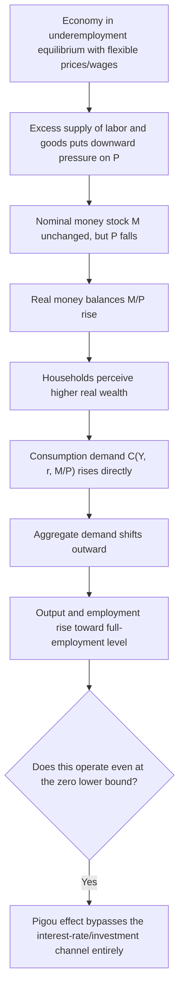

## The Pigou Effect and Real Balance Effects

### Overview

The **Pigou effect** (Pigou, 1943, 1947) and the broader concept of **real balance effects** describe the channel through which changes in the real value of money holdings — driven by changes in the price level — directly affect aggregate consumption and, more generally, aggregate demand. This mechanism was developed principally as a classical/neoclassical rebuttal to the Keynesian claim that a market economy could become trapped in an underemployment equilibrium: even if the interest-rate mechanism fails (as in a liquidity trap), Pigou argued that falling prices raise the real value of the public's money balances, generating a wealth effect on consumption that restores full employment through a channel entirely independent of the interest rate. The concept is also central to Don Patinkin's broader theoretical program of "integrating monetary and value theory."

### The Real Balance Effect: General Definition

A **real balance effect** exists whenever real money holdings $M/P$ enter an agent's **decision-making directly as a component of wealth or as an argument of the utility/demand functions** — so that a change in $M/P$ (whether from a change in nominal $M$ or a change in $P$) has a first-order effect on consumption, labor supply, or other real choices, over and above any effect operating through the interest rate.

Formally, if consumption demand is written as:

$$C = C\left(Y, r, \frac{M}{P}\right), \qquad \frac{\partial C}{\partial (M/P)} > 0$$

then a real balance effect is present: holding income $Y$ and the interest rate $r$ constant, an increase in real money balances directly raises desired consumption, because agents perceive higher real money holdings as an increase in net wealth.

### The Pigou Effect Specifically

The **Pigou effect** is the real balance effect operating **through a falling price level** in the context of a depressed, underemployed economy: as $P$ falls (e.g., due to deflationary pressure during a slump with flexible prices/wages), the real value of the *fixed nominal* money stock $M/P$ rises, even if $M$ itself is unchanged. This increase in real wealth induces households to consume more, shifting the aggregate demand (or IS) curve outward, and — crucially — this works **even at the zero lower bound**, where the conventional interest-rate channel (falling $r$ stimulating investment) is inoperative, because the Pigou effect operates through the **consumption** function directly, not through the interest-rate/investment channel.

### Diagram: The Pigou Effect Transmission Mechanism

### Formal IS-LM Representation

In the standard IS-LM framework augmented with a real balance effect, the IS curve is modified from the standard $Y = C(Y,r) + I(r) + G$ to include real balances directly:

$$Y = C\left(Y, r, \frac{M}{P}\right) + I(r) + G$$

A fall in $P$ (holding $M$ fixed) raises $M/P$, which — via $\partial C/\partial(M/P) > 0$ — **shifts the IS curve outward** (to the right) at any given interest rate. This stands in contrast to the standard textbook IS-LM treatment, where a fall in $P$ shifts only the **LM curve** (by raising real money balances $M/P$, which lowers the interest rate for any given level of income, via the standard Keynes-effect liquidity/money-demand channel) — the **Keynes effect** operates via $r$ and hence via investment demand, while the **Pigou effect** operates directly on consumption without requiring any interest-rate movement at all. This distinction is precisely why Pigou's mechanism was seen as decisive against the liquidity-trap critique: even if $r$ is stuck at its floor and the Keynes effect is inoperative (LM shifts have no effect on $r$), the Pigou effect via the IS curve can still restore full employment.

### The Keynes Effect vs. the Pigou Effect: A Critical Distinction

| Mechanism | Channel | Curve Affected | Operative at Zero Lower Bound? |
| --- | --- | --- | --- |
| **Keynes effect** | Falling P raises M/P, lowering r via money-market equilibrium (liquidity preference), which stimulates investment | LM curve shifts (or equivalently, movement along it) | **No** — becomes inoperative once r hits the floor, since further falls in r are impossible |
| **Pigou effect** | Falling P raises M/P, directly raising perceived real wealth, which stimulates consumption | IS curve shifts outward | **Yes** — this is precisely its theoretical significance; it does not rely on r falling further |

### Patinkin's Integration of Money and Value Theory

Don Patinkin's *Money, Interest, and Prices* (1956) formalized and generalized the real balance effect beyond Pigou's specific consumption-based mechanism, embedding real money balances $M/P$ as a direct argument in **both** the utility function (affecting consumption/labor-supply choices) **and** in general-equilibrium excess-demand functions for goods, making the real balance effect the theoretical device by which **classical monetary theory is rendered internally consistent** (recall from the classical dichotomy discussion: naive dichotomization can be invalid unless real excess demands are homogeneous of degree zero in money prices alone — Patinkin showed that explicitly incorporating $M/P$ as an argument of excess-demand functions, rather than assuming its complete absence, resolves this "invalid dichotomy" problem while still allowing the system to converge to a unique, determinate price level).

**Key Points**

- Patinkin's framework demonstrates that the real balance effect is not merely an *ad hoc* addition to restore full employment (as sometimes caricatured), but is a **theoretically necessary** component for a fully consistent general-equilibrium treatment of a monetary economy — without it, Walrasian general-equilibrium theory with money faces internal inconsistencies (the "homogeneity postulate" problem).
- In Patinkin's system, the real balance effect operates as an **equilibrating "stabilizer"**: any disequilibrium between aggregate money holdings and the amount the public *wishes* to hold at prevailing prices generates excess demand or supply in the goods market via the real-balance channel, which in turn drives price adjustment until real balances return to their desired level — providing a coherent story for how the absolute price level is uniquely pinned down in a barter-plus-money general equilibrium system.

### The Pigou Effect as a Rebuttal to the Keynesian Underemployment Equilibrium

**Key Points**

- Keynes's *General Theory* argued that nominal wage/price rigidity, combined with a possible liquidity trap, could leave an economy stuck in an underemployment equilibrium indefinitely, with **no automatic market mechanism to restore full employment** — a profound challenge to the classical self-correcting view.
- Pigou's rejoinder: **even granting Keynes's assumptions about wage/price stickiness being relaxed (i.e., allowing prices to eventually fall in response to persistent excess supply of labor/goods)**, the resulting deflation — rather than being contractionary (as Keynes and Fisher's debt-deflation logic suggested) — would eventually **restore full employment via the wealth effect on consumption**, **without requiring any change in the interest rate at all.**
- This became known as the **"Pigou effect" argument for the theoretical possibility of automatic full-employment restoration** even in a liquidity trap, provided prices are sufficiently flexible (even if slow to adjust) and provided deflation does not itself trigger offsetting contractionary forces.

### Empirical and Theoretical Qualifications

**Key Points**

- **Quantitative magnitude:** most economists, including Pigou himself, and subsequent empirical estimates, generally regard the **Pigou effect as quantitatively very small** in practice — the fraction of household wealth typically held as narrow money balances (relative to total wealth, including housing, equities, and other assets) is usually modest, implying that even a substantial price-level decline produces only a small percentage change in total wealth and hence a small effect on consumption. [Inference: the exact empirical magnitude is sensitive to the wealth measure and monetary aggregate used, and precise consensus estimates are not settled in the literature, but the qualitative judgment that the effect is "small" relative to output fluctuations in severe recessions is widely shared.]
- **Debt-deflation offset (Fisher, 1933):** a falling price level simultaneously **redistributes wealth from debtors to creditors** (since debt is fixed in nominal terms, its real burden rises as $P$ falls) — if debtors have a higher marginal propensity to consume than creditors (a standard and empirically plausible assumption), this **debt-deflation channel works in the opposite (contractionary) direction** from the Pigou effect, and in severe deflationary episodes (e.g., the Great Depression), the debt-deflation/balance-sheet channel is generally considered to have dominated, overwhelming any stabilizing Pigou effect — this is Irving Fisher's own celebrated critique, developed independently of but closely related to the Pigou-effect debate.
- **Banking-sector and net-wealth considerations (the "outside money" vs. "inside money" distinction):** the real balance effect is theoretically strongest for **outside money** (base money/government-issued fiat currency, which represents net wealth to the private sector as a whole) and **weaker or absent for inside money** (bank deposits backed by private-sector debt, e.g., loans), since for every dollar of inside money held as an asset by one private agent, there is a corresponding dollar of nominal liability owed by another private agent — a fall in $P$ raising the real value of inside-money assets *simultaneously* raises the real value of the offsetting private debt by the same amount, implying **no net real balance effect on aggregate private-sector wealth from inside money** (this distinction, developed by Gurley and Shaw, 1960, and Pesek and Saving, 1967, substantially narrows the scope and expected magnitude of any realistic real balance effect, since most of the broad money supply in modern economies consists of inside money/bank deposits rather than pure outside money).
- **Wealth effects operating through channels beyond simple consumption:** some modern treatments incorporate real balance effects into labor supply decisions as well (higher real wealth reducing desired labor supply, offsetting some of the output-stabilizing consumption effect), and into asset-pricing/portfolio-rebalancing channels more broadly, complicating the simple Pigou-effect story. [Inference: the net real-economy effect once labor-supply wealth effects, debt-deflation, and inside/outside money distinctions are all accounted for is theoretically ambiguous in sign and is generally regarded as a second-order consideration relative to nominal-rigidity-driven business cycle dynamics in most modern macroeconomic modeling.]

### Worked Example

Suppose a household holds outside money balances of $M = \$50{,}000$ and total wealth (including other assets) of $W = \$500{,}000$. The economy experiences a price-level decline of 20% during a prolonged slump (from $P_0=100$ to $P_1=80$).

**Step 1 — Compute the change in real money balances:**

$$\frac{M}{P_0} = \frac{50{,}000}{100} = 500 \ (\text{index units}), \qquad \frac{M}{P_1} = \frac{50{,}000}{80} = 625$$

Real money balances rise by $625/500 - 1 = 25\%$.

**Step 2 — Translate to a change in real wealth:** assume all other real assets/wealth are unaffected in real terms by the price decline (a simplification — in practice, nominal assets like bonds would also see real-value changes, while real assets like housing/equities may adjust differently). The dollar increase in real money-balance wealth (in $t=0$ purchasing-power terms) corresponds to a proportional increase of $\$12{,}500$ nominal-equivalent wealth (25% of the original $50,000 balance) relative to a total wealth base of $500,000, i.e., roughly a $2.5\%$ increase in total household wealth.

**Step 3 — Apply an illustrative marginal propensity to consume out of wealth ($mpc_W \approx 0.05$, a commonly cited order-of-magnitude estimate for wealth effects on consumption):**

$$\Delta C \approx 0.05 \times 12{,}500 = \$625$$

**Step 4 — Interpretation:** the Pigou-effect-induced increase in consumption from this substantial 20% deflation is modest ($625, against a $500,000 wealth base and presumably a much larger annual consumption flow) — **illustrating quantitatively why the Pigou effect is generally regarded as too weak to be a reliable, quantitatively significant stabilizer during a severe slump**, reinforcing the "small in practice" qualification noted above. [Inference: this stylized numerical example uses illustrative parameter values for demonstration; actual empirical wealth-effect elasticities and the composition of real money balances vary substantially across households, countries, and time periods.]

### Illustration: IS Curve Shift via the Pigou Effect

<svg xmlns="http://www.w3.org/2000/svg" viewBox="0 0 640 380" font-family="Helvetica, Arial, sans-serif">
<title>Pigou Effect: Outward IS Shift at the Zero Lower Bound (svg_diagram)</title>
<line x1="70" y1="340" x2="600" y2="340" stroke="black" stroke-width="2" />
<line x1="70" y1="340" x2="70" y2="30" stroke="black" stroke-width="2" />
<text x="610" y="345" font-size="14">Y (output)</text>
<text x="30" y="30" font-size="14">r</text>
<line x1="70" y1="300" x2="600" y2="300" stroke="#c1272d" stroke-dasharray="4,3" />
<text x="600" y="295" font-size="12" text-anchor="end" fill="#c1272d">Zero lower bound on r</text>
<path d="M 130 50 Q 300 220 480 300" stroke="#1f77b4" stroke-width="2.5" fill="none" />
<text x="150" y="70" font-size="12" fill="#1f77b4">IS (original)</text>
<path d="M 230 50 Q 400 220 580 300" stroke="#2ca02c" stroke-width="2.5" fill="none" />
<text x="420" y="70" font-size="12" fill="#2ca02c">IS' (after Pigou-effect shift)</text>
<line x1="480" y1="300" x2="480" y2="340" stroke="#888" stroke-dasharray="3,2" />
<text x="480" y="358" font-size="12" text-anchor="middle">Y₀</text>
<line x1="580" y1="300" x2="580" y2="340" stroke="#888" stroke-dasharray="3,2" />
<text x="580" y="358" font-size="12" text-anchor="middle">Y₁</text>
<text x="330" y="320" font-size="12" fill="#555">At the floor on r, Pigou effect still raises Y via</text>
<text x="330" y="335" font-size="12" fill="#555">direct wealth effect on consumption</text>
</svg>

### Relation to Other Wealth-Effect Channels

**Key Points**

- **The real balance effect is a specific case of a broader class of "wealth effects on aggregate demand,"** which also includes effects operating through housing wealth, equity wealth, and other asset classes — the Pigou effect is distinguished by its specific focus on *money* balances and its historical role in the interest-rate-versus-wealth-channel debate about liquidity traps.
- **Contrast with the Mundell-Tobin effect:** both involve real money balances affecting real variables, but the Mundell-Tobin effect concerns the *portfolio-substitution* consequence of *changes in trend inflation* on the *capital stock* in a growth-model steady state, whereas the Pigou effect concerns the *direct wealth-effect* consequence of a *change in the price level* on *current consumption* in a short-run, cyclical (often underemployment) context — different mechanisms, different time horizons, and different model classes (growth theory vs. business-cycle/IS-LM theory).
- **Modern DSGE treatment:** contemporary New Keynesian models generally do **not** feature a Pigou effect prominently, since most such models use representative-agent frameworks with Ricardian equivalence-consistent government debt and abstract from the inside/outside money distinction that limits the effect's real-world relevance; where real balance effects appear, they are typically calibrated to be quantitatively small, consistent with the broader profession's assessment of the Pigou effect's limited practical importance. [Inference: the muted role of the Pigou effect in modern mainstream macro modeling reflects both the theoretical inside/outside money critique and the empirical judgment of its small quantitative magnitude, though this remains an area where model specification choices significantly affect the result.]

### Related Topics / Next Steps

- Patinkin's integration of monetary and value theory
- The Keynes effect and the liquidity-trap critique of monetary policy
- Fisher's debt-deflation theory and its tension with the Pigou effect
- Inside money versus outside money (Gurley-Shaw, Pesek-Saving)
- The classical dichotomy and monetary neutrality
- The IS-LM model and the zero lower bound
- Ricardian equivalence and government debt as net wealth
- Wealth effects on consumption: housing and equity channels
- The Mundell-Tobin effect and superneutrality
- Say's Law and classical monetary equilibrium