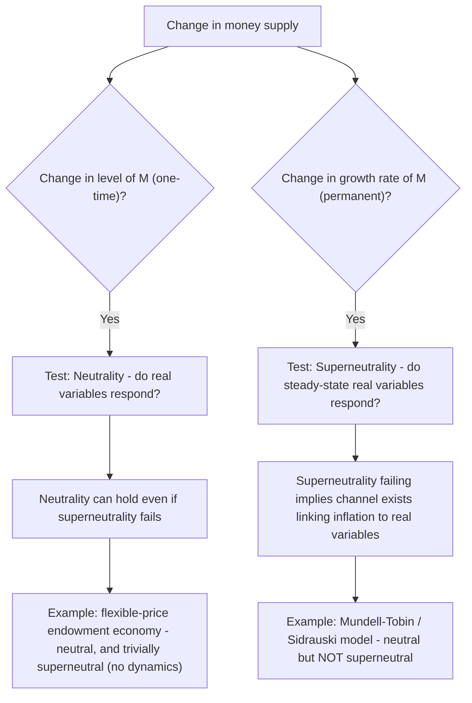

## Neutrality and Superneutrality of Money

### Overview

**Neutrality of money** and **superneutrality of money** are two related but analytically distinct properties describing whether monetary variables affect real economic outcomes. Neutrality concerns whether a one-time change in the *level* of the money supply affects real variables; superneutrality concerns the stronger question of whether the *growth rate* of money (and hence the steady-state inflation rate) affects real variables. While closely tied to the classical dichotomy and often introduced alongside it, these concepts merit deeper independent treatment because their conditions for validity, channels of failure, and empirical implications differ substantially — a model can exhibit neutrality without superneutrality, but not the reverse.

### Formal Definitions

**Neutrality of Money**

An economy exhibits **monetary neutrality** if a change in the level of the nominal money stock, from $M$ to $\lambda M$ (for any $\lambda > 0$), leaves all real equilibrium quantities unchanged and causes all nominal prices to scale by exactly $\lambda$:

$$M \to \lambda M \implies P \to \lambda P, \quad w \to \lambda w, \quad \text{(all real variables unchanged)}$$

Equivalently, the real equilibrium (output $Y$, employment $L$, real wage $w/P$, real interest rate $r$, relative prices) is **homogeneous of degree zero** in $M$ and the vector of nominal prices, considered jointly.

**Superneutrality of Money**

An economy exhibits **superneutrality** if a change in the **growth rate** of the money supply $\mu = \hat{M}$ leaves all real variables unchanged in the steady state, even though it changes the steady-state inflation rate $\pi^* \approx \mu - \hat{Y}$ (per the quantity theory) and the steady-state nominal interest rate $i^* = r^* + \pi^*$ (per the Fisher equation):

$$\mu \to \mu' \implies \pi^* \to \pi^{*\prime}, \ i^* \to i^{*\prime}, \quad \text{but } Y^*, K^*, L^*, C^*, r^* \ \text{unchanged}$$

**Key distinction:** neutrality is a **static/comparative-statics** property about the *level* of money; superneutrality is a **dynamic/steady-state** property about the *growth rate* of money. Superneutrality is logically the stronger and more demanding condition.

### Diagram: Relationship Between the Two Properties

### Why Neutrality Can Hold Without Superneutrality

**Key Points**

- **Neutrality** requires only that a *proportional rescaling* of the nominal money stock, holding its growth rate/trend unchanged, leaves real allocations unaffected — this is a comparatively weak requirement, satisfied by essentially any model with flexible prices and homogeneity of excess-demand functions in nominal variables (subject to the Patinkin caveats discussed in the classical dichotomy content).
- **Superneutrality** additionally requires that the **opportunity cost of holding money** (approximately the nominal interest rate, which moves one-for-one with trend inflation under the Fisher relation) has **no effect on any real decision** — but if real money balances are a genuine input into utility, production, or portfolio decisions (as in most modern monetary models), then a change in the *opportunity cost* of holding those balances (driven by a change in $\pi^*$ and hence $i^*$) will generally induce a *portfolio reallocation* between money and other assets (notably capital), which has real consequences even though the mere *level* of $M$ remains neutral.

### The Sidrauski Model: A Canonical Test Case

The Sidrauski (1967) money-in-the-utility-function optimal growth model is the standard vehicle for formally examining neutrality and superneutrality. The representative agent maximizes:

$$\sum_{t=0}^{\infty} \beta^t u(c_t, m_t)$$

subject to the resource constraint (combining the goods-market and money-market budget constraints):

$$k_{t+1} = f(k_t) + (1-\delta)k_t - c_t + \frac{m_t}{1+\pi_t} - m_t \cdot \frac{1+\pi_t}{1+\pi_t} + \text{transfers}$$

(a standard capital-accumulation equation with real money balances entering both utility and the real budget constraint via seigniorage/inflation-tax terms).

**Key steady-state first-order conditions:**

$$u_c(c^*, m^*) = \beta(1+r^*)\, u_c(c^*, m^*) \implies 1+r^* = 1/\beta \quad \text{(the "modified golden rule" condition)}$$

$$f'(k^*) - \delta = r^* = \rho \quad \text{(pins down the capital stock via the standard MPK = time preference condition)}$$

**Critical result:** in the *baseline Sidrauski model*, the steady-state capital stock $k^*$ is determined **entirely by the condition $f'(k^*) - \delta = \rho$**, which involves **only real variables** (the production function and the rate of time preference) — **inflation, money growth, and $m^*$ do not enter this equation at all.** This is because the two first-order conditions (for consumption/saving and for money holdings) are **separable**: the marginal-utility-of-consumption/capital-accumulation condition does not depend on $m$, given standard **additive separability** between $c$ and $m$ in the utility function, or more generally, given that $u_{cm} = 0$ (the cross-partial derivative is zero).

**This is the celebrated Sidrauski superneutrality result:** under separability, **money is superneutral** — the steady-state capital stock, consumption, and output are entirely independent of the trend inflation rate/money growth rate, even though the steady-state values of $m^*$, $i^*$, and $\pi^*$ all move together as governed by money demand and the Fisher equation.

### The Condition for Superneutrality to Fail: Non-Separability

**Key Points**

- Superneutrality in the Sidrauski framework depends **critically on the separability assumption** $u_{cm} = 0$. If instead $u_{cm} \neq 0$ (real money balances and consumption are **non-separable** in utility — e.g., money and consumption are complements or substitutes in generating utility, which is plausible if money facilitates transactions that are complementary with consumption), then the marginal utility of consumption **depends on the level of real money balances**, and the capital-accumulation/consumption Euler equation **is no longer independent of $m^*$** — a change in trend inflation, by altering $m^*$, now **feeds back into the steady-state capital stock**, breaking superneutrality even though simple neutrality (response to a one-time level change in $M$) can still hold.
- **The direction of the effect under non-separability is theoretically ambiguous** and depends on the sign of $u_{cm}$: if money and consumption are complements ($u_{cm} > 0$), higher inflation (which reduces $m^*$ via the higher opportunity cost of holding money) reduces the marginal utility of consumption, which can *reduce* desired saving and the steady-state capital stock; the reverse holds if $u_{cm} < 0$ (money and consumption are substitutes). [Inference: the empirically relevant sign and magnitude of $u_{cm}$ is difficult to identify directly from data and is typically treated as a free calibration parameter in quantitative monetary DSGE models, so the sign of any superneutrality-breaking effect from this specific channel is not robustly pinned down empirically.]

### The Mundell-Tobin Effect: A Distinct Channel Breaking Superneutrality

**Key Points**

- The **Mundell-Tobin effect** (Mundell, 1963; Tobin, 1965) provides an *independent* channel breaking superneutrality, arising even in models where money does not enter the utility function directly, via a **portfolio-choice/monetary-growth-model** framework (Tobin's original 1965 model) in which households allocate savings between money and physical capital as **alternative stores of value**.
- Higher trend inflation raises the (real) opportunity cost of holding money relative to capital, inducing households to **substitute their portfolio away from money and toward capital** — raising desired saving/capital accumulation and thus the steady-state capital stock $k^*$, which in turn **lowers** the marginal product of capital and the steady-state real interest rate $r^*$ (since $f'(k^*)$ is decreasing in $k^*$ under standard neoclassical production function assumptions).
- **This is the classic "Tobin effect":** $\partial k^*/\partial \pi > 0$, i.e., **higher trend inflation raises the long-run capital stock** — the opposite-signed prediction from some non-separable-utility Sidrauski specifications, illustrating that different microfoundations for money demand can generate **superneutrality violations of opposite sign**, which is a notable source of theoretical and policy ambiguity regarding the real effects of trend inflation.
- Under the Mundell-Tobin channel, the Fisher effect is also modified: since part of the rise in trend inflation is absorbed by a *fall* in $r^*$ (as $k^*$ rises), the nominal interest rate rises by **less than one-for-one** with inflation ($\partial i^*/\partial \pi^* < 1$), a testable deviation from strict Fisherian neutrality of the real rate.

### Summary Comparison: Channels and Their Predictions

| Model / Channel | Superneutral? | Effect of Higher Trend Inflation on k* | Effect on r* |
| --- | --- | --- | --- |
| **Sidrauski, separable utility** ($u_{cm}=0$) | Yes | No effect | No effect |
| **Sidrauski, non-separable, money-consumption complements** ($u_{cm}>0$) | No | Decreases (ambiguous sign in general, ex.: this case decreases) | Increases |
| **Sidrauski, non-separable, money-consumption substitutes** ($u_{cm}<0$) | No | Increases | Decreases |
| **Mundell-Tobin portfolio-substitution model** | No | Increases | Decreases |
| **Cash-in-advance models (basic Lucas-Stokey/Svensson type)** | Often Yes (under specific timing conventions) | No effect (in many baseline specifications) | No effect |

Note: the CIA result depends importantly on whether the "cash-in-advance" timing convention is a Svensson (1985) "money-in-advance decided before shocks" or a Lucas-Stokey (1983) "money chosen simultaneously" specification — different timing assumptions can generate different superneutrality implications. [Inference: the CIA superneutrality result summarized here reflects standard textbook treatments; specific quantitative CIA models with additional frictions (working-capital channels, financial intermediation costs) can generate superneutrality violations even under otherwise standard cash-in-advance timing.]

### Empirical Evidence on Superneutrality

**Key Points**

- Cross-country growth regressions examining the relationship between average inflation and average long-run real GDP growth have found **mixed and generally weak evidence** for a significant negative (or positive) relationship at low-to-moderate inflation rates, though some studies find a more robust **negative** relationship at high inflation rates (above some threshold, often cited in the range of 10–40% depending on the study and sample), consistent with a "threshold effect" where superneutrality (approximately) holds at low inflation but breaks down (in the negative-growth-effect direction) at high inflation (Bruno and Easterly, 1998; Khan and Senhadji, 2001, among others). [Unverified: the exact threshold level and the robustness of any such nonlinearity vary considerably across studies, samples, and econometric specifications, and causal identification (versus reverse causality, where poor growth performance itself contributes to inflationary pressures via fiscal channels) remains a significant methodological challenge in this literature.]
- Direct calibration exercises using DSGE/monetary growth models (following the Sidrauski/Mundell-Tobin frameworks above) generally find the **quantitative magnitude of superneutrality violations to be small** for empirically plausible calibrations of preference and production parameters, at least for moderate inflation-rate changes (e.g., comparing 2% vs. 4% trend inflation) — the effects become more economically significant only when comparing very different inflation regimes (e.g., low-inflation vs. high-inflation/hyperinflationary economies). [Inference: this "small at moderate inflation rates" conclusion is a commonly cited qualitative summary across the calibration literature, though it is sensitive to the specific model, calibrated cross-partial utility parameters, and production function assumptions used in any given study.]

### Worked Example: Quantifying the Mundell-Tobin Effect

Consider a Tobin-style monetary growth model with a Cobb-Douglas production function $f(k) = k^{0.35}$ (capital share $\alpha=0.35$), depreciation $\delta = 0.05$, and a simplified portfolio-allocation rule where the desired capital-to-money ratio responds to the nominal interest rate: $k/m = \gamma \cdot i^{0.5}$ for some calibration constant $\gamma$.

**Step 1 — Baseline steady state** at $\pi_0 = 2\%$, $r_0 \approx 3\%$ (approximating from a separable-utility baseline), giving $i_0 \approx 5\%$. The modified golden-rule condition would normally pin down $k^*$ purely from $f'(k^*) = r^* + \delta$; with $\alpha=0.35$: $0.35 (k^*)^{-0.65} = 0.03+0.05=0.08 \implies (k^*)^{-0.65} = 0.2286 \implies k^* \approx (0.2286)^{-1/0.65} \approx 9.78$.

**Step 2 — Introduce a rise in trend inflation** to $\pi_1 = 6\%$, raising $i_1 \approx 9\%$ under an initial-pass Fisher-equation approximation.

**Step 3 — Apply the Mundell-Tobin portfolio-substitution logic qualitatively:** the higher opportunity cost of money ($i_1 > i_0$) induces portfolio substitution toward capital, so $k^*$ **rises above** the level implied by the unmodified modified-golden-rule calculation — the *exact* new $k^{*\prime}$ requires solving the full model jointly (beyond this illustrative sketch), but the **qualitative direction** is unambiguous under the Tobin portfolio-substitution mechanism: $k^{*\prime} > k^* \approx 9.78$.

**Step 4 — Consequent fall in r*:** since $f'(k)$ is decreasing in $k$, the rise in $k^*$ implies $r^{*\prime} < r_0 = 3\%$ — so the "true" new steady-state interest rate is **somewhat below** the naive Fisher-equation prediction of $r_1 = r_0 = 3\%$ (which assumed unchanged $r^*$), illustrating the less-than-one-for-one nominal rate response to inflation predicted by the Mundell-Tobin channel. [Inference: this worked example illustrates the qualitative direction and mechanics of the Tobin effect using stylized functional forms; precise quantitative magnitudes require full simultaneous solution of the model's steady-state equations, which is beyond this illustrative sketch.]

### Illustration: Superneutrality Violation Channels

<svg xmlns="http://www.w3.org/2000/svg" viewBox="0 0 640 360" font-family="Helvetica, Arial, sans-serif">
<title>Channels Linking Trend Inflation to the Steady-State Capital Stock (svg_diagram)</title>
<rect x="20" y="30" width="280" height="130" rx="8" fill="#eef4fb" stroke="#1f77b4" stroke-width="1.5" />
<text x="160" y="55" font-size="14" text-anchor="middle" fill="#1f77b4">Higher trend inflation π</text>
<text x="160" y="80" font-size="12" text-anchor="middle">Sidrauski non-separable utility</text>
<text x="160" y="100" font-size="12" text-anchor="middle">(u_cm ≠ 0)</text>
<text x="160" y="122" font-size="12" text-anchor="middle" fill="#555">Sign of effect on k* depends</text>
<text x="160" y="140" font-size="12" text-anchor="middle" fill="#555">on sign of cross-partial u_cm</text>
<rect x="340" y="30" width="280" height="130" rx="8" fill="#fff3e6" stroke="#d95f02" stroke-width="1.5" />
<text x="480" y="55" font-size="14" text-anchor="middle" fill="#d95f02">Higher trend inflation π</text>
<text x="480" y="80" font-size="12" text-anchor="middle">Mundell-Tobin portfolio</text>
<text x="480" y="100" font-size="12" text-anchor="middle">substitution model</text>
<text x="480" y="122" font-size="12" text-anchor="middle" fill="#2ca02c">Unambiguous: k* rises,</text>
<text x="480" y="140" font-size="12" text-anchor="middle" fill="#2ca02c">r* falls</text>
<rect x="180" y="220" width="280" height="110" rx="8" fill="#f0f9ee" stroke="#2ca02c" stroke-width="1.5" />
<text x="320" y="250" font-size="14" text-anchor="middle" fill="#2ca02c">Superneutrality fails:</text>
<text x="320" y="275" font-size="13" text-anchor="middle">Steady-state real variables (k*, Y*, r*)</text>
<text x="320" y="295" font-size="13" text-anchor="middle">depend on trend inflation</text>
<text x="320" y="315" font-size="11" text-anchor="middle" fill="#555">Direction/magnitude channel-dependent</text>
<line x1="160" y1="160" x2="280" y2="220" stroke="#555" stroke-width="1.5" />
<line x1="480" y1="160" x2="400" y2="220" stroke="#555" stroke-width="1.5" />
</svg>

### Policy Relevance

**Key Points**

- The theoretical possibility that superneutrality fails (in either direction) is part of the broader case for why central banks target **low but positive** inflation rates (commonly around 2% in many advanced economies) rather than zero or negative inflation — the Friedman rule's prescription of deflation is weighed against practical, financial-stability, and (in some theoretical treatments) superneutrality-based considerations about the potential real costs or benefits of alternative trend inflation rates, alongside the more prominently cited zero-lower-bound and price-stickiness considerations.
- Because superneutrality violations are generally judged to be **quantitatively small at the moderate inflation-rate differentials relevant to actual monetary policy choices** (e.g., 2% vs. 3% target), most mainstream monetary policy analysis treats **approximate superneutrality as a reasonable working assumption for policy rate-setting purposes** in the relevant range, while still acknowledging its theoretical failure at a formal level and its potential greater relevance when comparing low-inflation to high-inflation or hyperinflationary regimes. [Inference: this characterization reflects a broad professional consensus regarding the practical (as opposed to purely theoretical) relevance of superneutrality violations for conventional monetary policy calibration, rather than a claim that superneutrality is believed to hold exactly.]

### Related Topics / Next Steps

- The Sidrauski money-in-the-utility-function model
- The Mundell-Tobin effect and portfolio-substitution monetary growth models
- The classical dichotomy and monetary neutrality
- The optimum quantity of money and the Friedman rule
- The Fisher equation and real versus nominal interest rates
- Cash-in-advance models and monetary timing conventions
- Cross-country evidence on inflation and long-run growth
- Optimal steady-state inflation targets in modern central banking
- The Pigou effect and real balance effects
- Modified golden rule and optimal capital accumulation