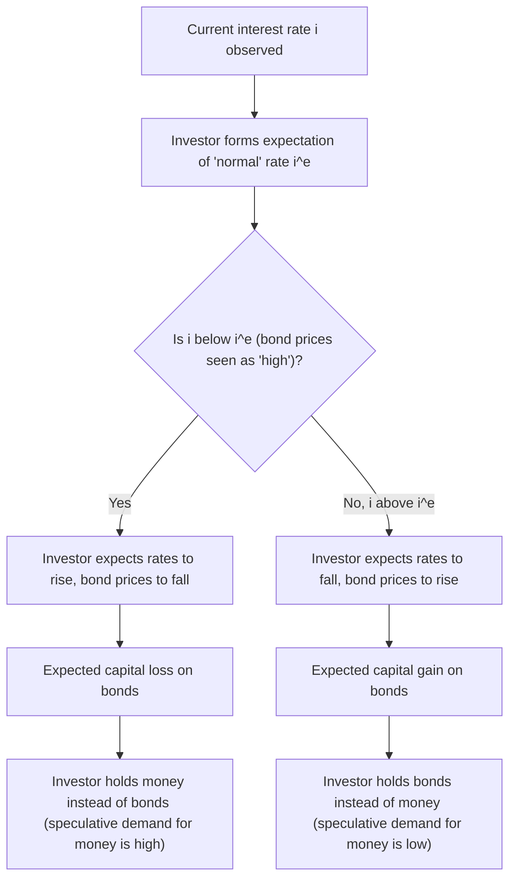
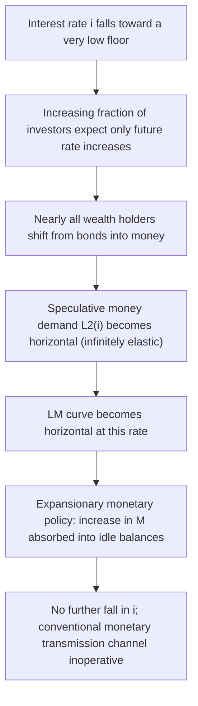

## Liquidity Preference and the Speculative Demand for Money

### Overview

**Liquidity preference theory**, introduced by John Maynard Keynes in *The General Theory of Employment, Interest and Money* (1936), provides a theory of the demand for money grounded in the choice between holding wealth as money (liquid, no default risk, but no interest return) versus holding it as interest-bearing bonds (illiquid, subject to capital-gain/loss risk, but yielding a return). Keynes decomposed money demand into three motives — **transactions**, **precautionary**, and **speculative** — with the **speculative demand for money** being his most theoretically novel contribution: the idea that money is held as an asset specifically because of uncertainty about future bond prices (equivalently, future interest rates), providing the theoretical bridge between money demand and the determination of the interest rate itself, and offering a direct challenge to the classical view that money demand depends only on the transactions/income motive.

### The Three Motives for Holding Money

**Key Points**

1. **Transactions motive:** money held to bridge the gap between the receipt of income and its disbursement on planned expenditures — a function primarily of the level of income/transactions volume, closely related to the classical Cambridge $k$ concept.
2. **Precautionary motive:** money held as a buffer against unforeseen expenditures or opportunities, also primarily a function of income (and, in more elaborate treatments, of income uncertainty).
3. **Speculative motive:** money held as an alternative to bonds specifically because of **uncertainty about the future price of bonds** (equivalently, uncertainty about future interest-rate movements) — this is the motive that introduces the **interest rate** as a direct determinant of money demand, breaking from the classical view that velocity/money demand is interest-inelastic.

Combined, Keynes's total money demand (liquidity preference) function is:

$$\frac{M^d}{P} = L(Y, i) = L_1(Y) + L_2(i)$$

where $L_1(Y)$ (transactions + precautionary) is increasing in income $Y$, and $L_2(i)$ (speculative) is **decreasing** in the interest rate $i$.

### The Speculative Motive: Formal Mechanics

**Bond Prices and Interest Rates**

Consider a simple perpetuity (consol) bond paying a fixed coupon $C$ per period forever. Its price $P_B$ is related to the market interest rate $i$ by:

$$P_B = \frac{C}{i}$$

This relationship is central to the speculative-demand mechanism: **bond prices and interest rates move inversely.** If an investor expects the interest rate to **rise** in the future, they expect the bond price to **fall**, implying an expected **capital loss** on bonds — this creates an incentive to hold **money instead of bonds** today, to avoid the anticipated capital loss and to be positioned to buy bonds later at the lower (post-rate-rise) price.

**The Individual Speculator's Decision**

Each individual investor holds a view on the "normal" or expected future interest rate $i^e$. The expected return from holding a bond over one period combines the coupon yield and the expected capital gain/loss:

$$E[\text{return on bond}] = i + \frac{E[\Delta P_B]}{P_B} \approx i - \frac{i^e - i}{i^e}\ \text{(approximately, for a consol)}$$

More precisely, for a consol, the expected percentage capital gain/loss from a change in the interest rate from $i$ to $i^e$ is approximately:

$$g \approx \frac{i - i^e}{i^e}$$

so the total expected return on holding the bond is:

$$E[\text{return}] \approx i + \frac{i-i^e}{i^e}$$

**Key decision rule:** the investor holds **bonds** if the expected total return exceeds the return on money (normalized to zero, or to the money-market rate in more general treatments), and holds **money** otherwise. There exists a **critical interest rate** $i_c$ such that the investor is indifferent between money and bonds; below $i_c$, the investor holds only money (since expected capital losses on bonds outweigh the coupon return); above $i_c$, the investor holds only bonds.

### Diagram: The Speculative Demand Mechanism

### Aggregation: From Individual Bimodal Choice to a Smooth Downward-Sloping Demand Curve

**Key Points**

- At the **individual level**, Keynes's original formulation implies a **bimodal (all-or-nothing) choice**: each investor holds either all money or all bonds, depending on whether the current rate $i$ is above or below their personal critical rate $i_c$.
- **Aggregating across many investors with heterogeneous expectations** about the "normal" interest rate $i^e$ (i.e., differing views on what rate level is unsustainably low or high) produces a **smooth, continuous, downward-sloping aggregate speculative money demand function**: as $i$ falls, progressively more investors find their individual critical threshold crossed and shift from bonds into money, so aggregate speculative money demand rises continuously as $i$ falls, even though each *individual* investor's demand is bimodal. This heterogeneous-expectations aggregation argument is the standard textbook mechanism (attributed in modern form to interpretations following Keynes, and formalized by economists such as Tobin) for deriving a smooth $L_2(i)$ from discrete individual behavior.
- **Tobin's (1958) alternative derivation** — "Liquidity Preference as Behavior Toward Risk" — provides a *different*, risk-aversion-based microfoundation for a smooth, downward-sloping speculative money demand curve, **without requiring heterogeneous expectations at all**: even a single representative risk-averse investor with **correct, unbiased expectations** about future bond returns (zero expected capital gain/loss) will hold a **diversified portfolio of money and bonds** (rather than corner solutions) if bond returns are risky and money is treated as the safe (zero-return, zero-variance) asset — this is a direct application of mean-variance portfolio theory, and generates a smooth $L_2(i)$ as a *risk-diversification* motive rather than a pure speculative-expectations motive. Tobin's approach is generally regarded as the more theoretically rigorous and widely adopted modern microfoundation for smooth aggregate money demand, complementing (and in modern textbooks often supplanting) Keynes's original heterogeneous-expectations story.

### The Liquidity Trap

**Key Points**

- The speculative demand for money becomes **theoretically important at very low interest rates**: as $i$ approaches some very low floor, **virtually all investors** come to expect that rates can only rise (and bond prices only fall) from such a low level, so **everyone** shifts into money, making the aggregate speculative demand for money **infinitely (or near-infinitely) interest-elastic** — i.e., the $L_2(i)$ curve becomes **horizontal (flat)** at very low $i$.
- This is the **liquidity trap**: a situation in which the demand for money becomes perfectly (or near-perfectly) elastic with respect to the interest rate at some low positive (or zero) rate, meaning that **any additional increase in the money supply is entirely absorbed into idle speculative balances** without further lowering the interest rate — **monetary policy loses its traditional transmission channel** (via lowering $i$ to stimulate investment) once the economy is in this region.
- **This is precisely the theoretical justification for the claim that the LM curve becomes horizontal at very low interest rates** in the standard IS-LM diagram — a region in which further rightward shifts of the LM curve (via expansionary monetary policy) have no effect on $i$ and hence no effect on aggregate demand through the conventional interest-rate channel, motivating the Keynesian case for **fiscal policy** as the more effective stabilization tool in such circumstances, and providing the historical/theoretical backdrop for the modern **zero lower bound (ZLB)** literature and unconventional monetary policy tools (quantitative easing, forward guidance) developed in response to the 2008 financial crisis and its aftermath, and again during the COVID-19 pandemic period.

### Diagram: The Liquidity Trap in the L2(i) Function

### The Full Liquidity Preference Function and LM Curve Derivation

Combining all three motives, the money-market equilibrium condition is:

$$\frac{M}{P} = L_1(Y) + L_2(i), \qquad \frac{\partial L_1}{\partial Y} > 0, \ \frac{\partial L_2}{\partial i} < 0$$

Holding $M/P$ fixed, an increase in $Y$ raises transactions demand $L_1(Y)$, requiring a rise in $i$ to reduce speculative demand $L_2(i)$ correspondingly to keep total money demand equal to the fixed supply $M/P$ — this generates the standard **upward-sloping LM curve** in $(Y, i)$ space. **The slope of the LM curve depends directly on the interest-elasticity of speculative money demand:** a highly interest-elastic $L_2(i)$ (flat demand curve, as near the liquidity trap) produces a **flat LM curve** (monetary policy relatively ineffective, fiscal policy relatively effective, in the standard IS-LM comparative-statics sense), while a steep, interest-inelastic $L_2(i)$ produces a **steep LM curve** (monetary policy relatively effective, closer to the classical/monetarist case where money demand depends essentially only on income).

### Illustration: Speculative Demand Curve and the Liquidity Trap

<svg xmlns="http://www.w3.org/2000/svg" viewBox="0 0 640 380" font-family="Helvetica, Arial, sans-serif">
<title>Speculative Money Demand: L2(i) with a Liquidity Trap (svg_diagram)</title>
<line x1="70" y1="340" x2="600" y2="340" stroke="black" stroke-width="2" />
<line x1="70" y1="340" x2="70" y2="30" stroke="black" stroke-width="2" />
<text x="610" y="345" font-size="14">L2 (speculative money demand)</text>
<text x="30" y="30" font-size="14">i</text>
<path d="M 100 60 Q 250 90 350 200 Q 420 280 560 300 L 560 300" stroke="#1f77b4" stroke-width="2.5" fill="none" />
<line x1="70" y1="300" x2="600" y2="300" stroke="#1f77b4" stroke-width="2.5" />
<text x="150" y="80" font-size="12" fill="#1f77b4">Normal downward-sloping region</text>
<text x="420" y="290" font-size="12" fill="#c1272d">Liquidity trap: flat, infinitely elastic</text>
<line x1="70" y1="303" x2="600" y2="303" stroke="#c1272d" stroke-dasharray="4,3" />
<text x="600" y="298" font-size="12" text-anchor="end" fill="#c1272d">i_min (floor rate)</text>
</svg>

### Empirical Evidence and Historical Context

**Key Points**

- Keynes's speculative-demand theory was developed in the context of the **Great Depression**, when nominal interest rates in major economies fell to very low levels, and monetary expansion appeared largely ineffective at stimulating investment — providing the motivating real-world backdrop for the liquidity-trap concept.
- Modern empirical money-demand studies generally confirm **some** interest-rate sensitivity of money demand (consistent with a downward-sloping $L(Y,i)$), though the strict "all-or-nothing" individual bimodal-choice mechanism of Keynes's original exposition is not taken literally in modern empirical work, which instead relies on **Baumol-Tobin inventory-theoretic models** (for transactions demand) and **Tobin's mean-variance portfolio model** (for the interest-sensitive/speculative-like component) as the standard modern microfoundations.
- The **2008-2009 financial crisis and subsequent near-zero interest-rate policies** across major advanced economies (and again during 2020-2021) renewed substantial academic and policy interest in liquidity-trap dynamics, motivating the development and use of **unconventional monetary policy tools** — large-scale asset purchases (quantitative easing), forward guidance about future policy rates, and negative interest rate policy — specifically designed to influence economic activity through channels **other than** the conventional short-term interest-rate lever that becomes ineffective in a liquidity trap. [Inference: the degree to which observed post-2008 monetary policy conditions constituted a "true" liquidity trap in the strict Keynesian sense, versus reflecting other constraints (e.g., effective lower bound considerations, term-premium and portfolio-balance channel effects operating even near the ZLB), remains a subject of ongoing research and is not a fully settled empirical question.]

### Worked Example

Suppose the transactions/precautionary component of money demand is $L_1(Y) = 0.2Y$, and the speculative component is (for $i > i_{min}=1\%$) $L_2(i) = 500 - 4000(i - 0.01)$, becoming perfectly flat (infinite elasticity) below $i=1\%$.

**Step 1 — Total money demand at $Y = 10{,}000$, $i = 5\%$:**

$$L = L_1(10{,}000) + L_2(0.05) = 2{,}000 + [500 - 4000(0.04)] = 2{,}000 + 340 = 2{,}340$$

**Step 2 — Suppose real money supply $M/P = 2{,}340$.** The money market clears exactly at $i=5\%$ — this is the LM-curve point corresponding to $(Y,i) = (10{,}000, 0.05)$.

**Step 3 — Central bank increases $M/P$ to $2{,}500$ at unchanged $Y$.** Solve for new $i$:

$$2{,}500 = 2{,}000 + 500 - 4000(i-0.01) \implies 0 = -4000(i-0.01) \implies i = 0.01 = 1\%$$

The increase in money supply has driven the rate down exactly to the liquidity-trap floor $i_{min} = 1\%$.

**Step 4 — Further monetary expansion:** if the central bank increases $M/P$ further, to $2{,}700$, the interest rate **cannot fall below** $i_{min}=1\%$ (by the model's construction, $L_2$ becomes flat there), so the additional $200$ in real money balances is simply absorbed into idle speculative holdings, with **no further change in $i$** — this is the liquidity-trap outcome, illustrating why, in this regime, expansionary monetary policy alone cannot further stimulate investment demand via the interest-rate channel, and why the IS-LM framework predicts fiscal policy would need to shift the IS curve directly to raise output in this region. [Inference: this worked example uses simple linear functional forms purely for pedagogical illustration of the mechanics; real-world money demand functions and liquidity-trap thresholds are considerably more complex and are estimated empirically rather than assumed.]

### Contrast with Classical/Monetarist Money Demand

| Feature | Classical/Quantity Theory | Keynesian Liquidity Preference |
| --- | --- | --- |
| Determinants of money demand | Income/transactions only (Cambridge k) | Income (transactions + precautionary) AND interest rate (speculative) |
| Interest elasticity of money demand | Zero (or near-zero) | Negative, potentially very large (near liquidity trap) |
| Velocity | Stable/constant | Can vary substantially with interest-rate movements |
| Role of interest rate | Determined in loanable-funds (saving-investment) market | Determined in money market via liquidity preference (supply and demand for money) |
| Implication for monetary policy effectiveness | Strong link from M to nominal income (steep LM) | Potentially weak link if near liquidity trap (flat LM) |

### Related Topics / Next Steps

- Tobin's mean-variance portfolio theory of liquidity preference
- The Baumol-Tobin inventory-theoretic model of transactions demand
- The zero lower bound and unconventional monetary policy (QE, forward guidance)
- The IS-LM model and the effectiveness of monetary versus fiscal policy
- Say's Law and classical monetary equilibrium (contrasting theories of interest rate determination)
- The quantity theory of money and velocity stability
- The Fisher equation and real versus nominal interest rates
- Historical liquidity traps: the Great Depression and post-2008 monetary policy
- The Pigou effect as a rebuttal to liquidity-trap pessimism
- Modern empirical estimates of the interest elasticity of money demand