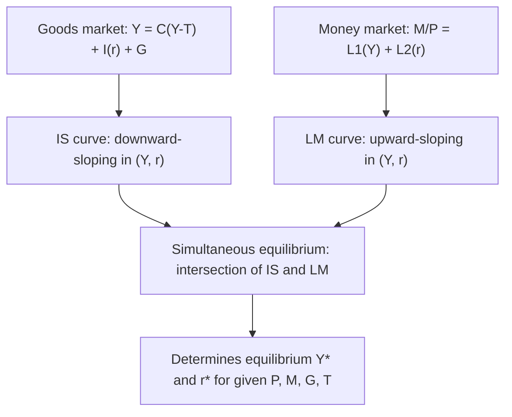
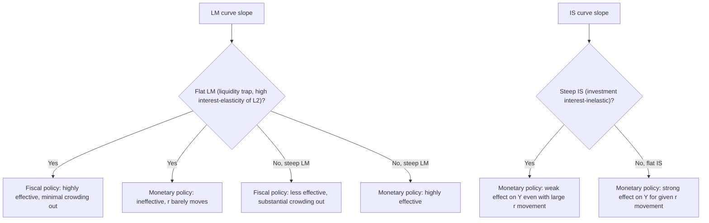

## The IS-LM Model of Goods and Money Markets

### Overview

The **IS-LM model**, developed by John Hicks (1937) as a formalization of Keynes's *General Theory*, and later elaborated by Alvin Hansen (giving rise to the "Hicks-Hansen synthesis"), is the canonical short-run macroeconomic framework depicting simultaneous equilibrium in the **goods market** (the **IS curve**, "Investment-Saving") and the **money market** (the **LM curve**, "Liquidity preference-Money supply"). It determines the equilibrium combination of the real interest rate $r$ and real output $Y$ for a given price level, and remains the standard pedagogical bridge between Keynesian income-expenditure analysis and modern dynamic macroeconomic models, as well as the organizing framework for comparing the relative effectiveness of monetary versus fiscal policy under alternative assumptions.

### The IS Curve: Goods-Market Equilibrium

**Derivation**

The goods market clears when planned aggregate expenditure equals output:

$$Y = C(Y-T) + I(r) + G$$

where $C(\cdot)$ is the consumption function (increasing in disposable income $Y-T$, with marginal propensity to consume $0 < MPC < 1$), $I(r)$ is investment demand (decreasing in the real interest rate $r$), $G$ is government spending, and $T$ is taxes (here treated as exogenous/lump-sum for simplicity).

**The IS Curve** is the locus of $(Y, r)$ combinations for which the goods market clears:

$$Y = C(Y-T) + I(r) + G \quad \Longrightarrow \quad r = r(Y)$$

Since $I(r)$ is decreasing in $r$, and a higher $Y$ requires higher planned expenditure to be consistent with market clearing (via the multiplier process), **the IS curve slopes downward in $(Y, r)$ space**: a lower interest rate stimulates investment, raising equilibrium output via the multiplier.

**The Multiplier and IS Curve Slope**

Totally differentiating the goods-market equilibrium condition:

$$dY = MPC \cdot dY + I'(r)\, dr + dG - MPC \cdot dT$$

$$\frac{dr}{dY}\bigg|_{IS} = \frac{1 - MPC}{I'(r)} < 0$$

The **steepness of the IS curve** depends on: (a) the marginal propensity to consume (higher $MPC$ → flatter IS curve, since a given fall in $r$ generates a larger multiplied output response), and (b) the interest-sensitivity of investment $I'(r)$ (more negative/elastic $I'(r)$ → flatter IS curve, since investment responds more strongly to interest-rate changes).

### The LM Curve: Money-Market Equilibrium

**Derivation**

The money market clears when real money supply equals real money demand (liquidity preference, per Keynes's theory covered separately):

$$\frac{M}{P} = L(Y, i)$$

where $L(Y,i) = L_1(Y) + L_2(i)$ combines transactions/precautionary demand (increasing in $Y$) and speculative demand (decreasing in the nominal interest rate $i$). In the basic closed-economy IS-LM model, it is standard to abstract from the distinction between nominal $i$ and real $r$ rates (i.e., assume $\pi^e = 0$ or work in terms of a single "the" interest rate), so $i \approx r$ for graphical purposes.

**The LM Curve** is the locus of $(Y, r)$ combinations for which the money market clears, holding $M/P$ fixed:

$$\frac{M}{P} = L_1(Y) + L_2(r) \quad \Longrightarrow \quad r = r(Y)$$

Since $L_1(Y)$ is increasing in $Y$, a rise in $Y$ raises transactions demand for money; to keep total money demand equal to the fixed real money supply, speculative demand $L_2(r)$ must fall, which requires $r$ to **rise**. **The LM curve therefore slopes upward** in $(Y, r)$ space.

**The Slope of the LM Curve**

$$\frac{\partial r}{\partial Y}\bigg|_{LM} = -\frac{\partial L_1/\partial Y}{\partial L_2/\partial r} > 0$$

The steepness depends on the interest-elasticity of money demand: a highly interest-elastic $L_2(r)$ (as near the liquidity trap) produces a **flat LM curve**; a highly interest-inelastic $L_2(r)$ (closer to the classical/monetarist case) produces a **steep LM curve**.

### Diagram: IS-LM Equilibrium

### Graphical Representation

<svg xmlns="http://www.w3.org/2000/svg" viewBox="0 0 640 420" font-family="Helvetica, Arial, sans-serif">
<title>IS-LM Equilibrium (svg_diagram)</title>
<line x1="70" y1="360" x2="600" y2="360" stroke="black" stroke-width="2" />
<line x1="70" y1="360" x2="70" y2="30" stroke="black" stroke-width="2" />
<text x="610" y="365" font-size="14">Y (output)</text>
<text x="30" y="30" font-size="14">r</text>
<path d="M 550 80 Q 350 180 100 340" stroke="#1f77b4" stroke-width="2.5" fill="none" />
<text x="480" y="100" font-size="13" fill="#1f77b4">IS</text>
<path d="M 130 340 Q 300 200 560 90" stroke="#d95f02" stroke-width="2.5" fill="none" />
<text x="520" y="100" font-size="13" fill="#d95f02">LM</text>
<circle cx="320" cy="205" r="5" fill="#c1272d" />
<text x="335" y="200" font-size="13" fill="#c1272d">E (equilibrium)</text>
<line x1="320" y1="205" x2="320" y2="360" stroke="#888" stroke-dasharray="4,3" />
<line x1="70" y1="205" x2="320" y2="205" stroke="#888" stroke-dasharray="4,3" />
<text x="320" y="378" font-size="12" text-anchor="middle">Y*</text>
<text x="55" y="209" font-size="12" text-anchor="end">r*</text>
</svg>

### Fiscal Policy in the IS-LM Model

**Key Points**

- An increase in government spending $G$ (or a cut in taxes $T$) **shifts the IS curve rightward**, raising equilibrium $Y$ and $r$ simultaneously.
- **Crowding out:** the rise in $r$ that accompanies fiscal expansion **reduces investment** $I(r)$, partially offsetting the direct expansionary effect on output — this is the standard IS-LM mechanism for "crowding out" of private investment by government spending, operating through the interest-rate channel.
- **The degree of crowding out depends on the slope of the LM curve:** with a **steep LM curve** (interest-inelastic money demand, closer to the classical/monetarist case), a given rightward IS shift produces a **large rise in $r$**, causing substantial crowding out and a relatively small net increase in $Y$ — fiscal policy is relatively ineffective. With a **flat LM curve** (as in a liquidity trap, where $L_2(r)$ is nearly infinitely elastic), the same IS shift produces **little to no rise in $r$**, so crowding out is minimal and fiscal policy is highly effective at raising $Y$ — this is the standard Keynesian argument for the particular effectiveness of fiscal stimulus during liquidity-trap conditions.

### Monetary Policy in the IS-LM Model

**Key Points**

- An increase in the money supply $M$ **shifts the LM curve rightward** (a given level of $Y$ can now be supported at a lower $r$, since more real balances are available to satisfy the same total money demand), lowering $r$ and raising equilibrium $Y$ (via the interest-rate channel: lower $r$ stimulates investment $I(r)$).
- **The effectiveness of monetary policy depends on the slope of the IS curve and the LM curve jointly:** with a **flat LM curve** (liquidity trap), a rightward LM shift produces **little to no fall in $r$** (since the money market is already saturated with idle balances at the prevailing near-zero rate), so monetary expansion has **little to no effect on $Y$** — monetary policy is ineffective in this region, the classic liquidity-trap conclusion.
- With a **steep IS curve** (investment relatively interest-inelastic), even a substantial fall in $r$ produces only a small increase in investment/output — monetary policy is relatively weak through this channel as well, independent of the liquidity-trap consideration.
- Conversely, with a **steep LM curve** and a **flat IS curve** (investment highly interest-elastic), monetary policy is comparatively powerful, and fiscal policy is comparatively weak (strong crowding out) — this is the classical/monetarist-favored configuration.

### Diagram: Policy Effectiveness Under Different Slopes

### The IS-LM Model and the Price Level: Deriving Aggregate Demand

**Key Points**

- The basic IS-LM model as presented takes the price level $P$ as **fixed** (a short-run, Keynesian assumption reflecting nominal price/wage stickiness) — it determines $Y$ and $r$ **conditional on** a given $P$.
- To extend the model to a framework where $P$ is endogenous, IS-LM is embedded within the **Aggregate Demand-Aggregate Supply (AD-AS)** framework: varying $P$ (holding $M$ fixed) traces out an **Aggregate Demand (AD) curve** in $(Y,P)$ space — a **fall in $P$ raises real money balances $M/P$, shifting the LM curve rightward** (the "Keynes effect," covered separately alongside the Pigou effect), lowering $r$ and raising $Y$ — hence **AD slopes downward in $(Y,P)$ space**, with the slope/steepness of AD inherited from the underlying IS-LM slopes and the money-demand/investment elasticities.
- This IS-LM-to-AD-AS extension is the standard modern textbook route to reconciling the short-run Keynesian IS-LM apparatus with a longer-run framework in which prices eventually adjust, output returns to its natural/potential level, and the classical dichotomy/monetary-neutrality results reassert themselves asymptotically.

### Algebraic (Linear) IS-LM Solution

For a standard linear specification:

$$\text{IS:} \quad Y = a - b\,r + \alpha(G - T), \qquad a, b, \alpha > 0$$

$$\text{LM:} \quad \frac{M}{P} = c\,Y - d\,r, \qquad c, d > 0$$

Solving the LM equation for $r$: $r = \frac{cY - M/P}{d}$. Substituting into the IS equation:

$$Y = a - b\left(\frac{cY - M/P}{d}\right) + \alpha(G-T)$$

$$Y\left(1 + \frac{bc}{d}\right) = a + \frac{b}{d}\cdot\frac{M}{P} + \alpha(G-T)$$

$$Y^* = \frac{d}{d+bc}\left[a + \frac{b}{d}\cdot\frac{M}{P} + \alpha(G-T)\right]$$

**Fiscal multiplier:** $\dfrac{\partial Y^*}{\partial G} = \dfrac{\alpha d}{d+bc}$ — smaller than the "naive" simple-multiplier value $\alpha$ alone, precisely because of the crowding-out effect captured by the $d/(d+bc)$ term (which approaches 1, i.e., no dampening, as $d \to \infty$, i.e., as the LM curve becomes perfectly flat/liquidity-trap-like; and approaches 0 as $d \to 0$, i.e., as the LM curve becomes perfectly vertical/classical-like).

**Monetary multiplier:** $\dfrac{\partial Y^*}{\partial (M/P)} = \dfrac{b}{d+bc}$ — approaches 0 as $d \to \infty$ (liquidity trap: monetary policy ineffective) and is maximized in relative terms as $d \to 0$ (steep LM: monetary policy most effective).

### Worked Example

Given: $a=3000$, $b=100$, $\alpha=2$ (simple multiplier before crowding-out adjustment), $c=0.5$, $d=200$, $G-T=500$, $M/P=1000$.

**Step 1 — Compute the composite denominator:**

$$d + bc = 200 + (100)(0.5) = 200+50=250$$

**Step 2 — Compute equilibrium output:**

$$Y^* = \frac{200}{250}\left[3000 + \frac{100}{200}(1000) + 2(500)\right] = 0.8 \times [3000+500+1000] = 0.8 \times 4500 = 3600$$

**Step 3 — Compute equilibrium interest rate:** from the LM equation, $r^* = \frac{cY^*-M/P}{d} = \frac{0.5(3600)-1000}{200} = \frac{1800-1000}{200}=4$.

**Step 4 — Fiscal policy experiment:** suppose $G-T$ rises by $100$ (to $600$). New $Y^{*\prime} = 0.8\times[3000+500+1200]=0.8\times4700=3760$ — an increase of $160$, **less than** the "naive" multiplier prediction of $\alpha \times \Delta(G-T) = 2\times100=200$ absent crowding out, illustrating the dampening effect of the rise in $r$ (which can be verified to have risen from $r^*=4$ to a higher level, reducing investment and partially offsetting the fiscal expansion). [Inference: this worked example uses illustrative linear parameter values purely for pedagogical demonstration of the algebraic mechanics; actual empirical multiplier magnitudes are estimated from data and vary substantially by country, time period, and prevailing monetary/fiscal regime.]

### Limitations and the Transition to Modern Macroeconomics

**Key Points**

- **Static, comparative-statics framework:** IS-LM is fundamentally a static model of a single "short run" — it lacks explicit dynamics, expectations formation, or intertemporal optimization, all of which are central to modern DSGE/New Keynesian analysis.
- **No explicit microfoundations:** consumption, investment, and money demand functions are specified in reduced form rather than derived from optimizing household/firm behavior — a key motivation for the later development of microfounded New Keynesian models (which replace the IS curve with a forward-looking dynamic IS equation derived from the consumption Euler equation, and typically replace the LM curve with an interest-rate rule such as a Taylor rule, since most modern central banks target interest rates directly rather than monetary aggregates).
- **No supply side/inflation dynamics in the basic version:** the basic IS-LM model takes $P$ as fixed and says nothing about inflation dynamics — this gap motivated the integration with the Phillips curve and the AD-AS framework, and ultimately the fully dynamic New Keynesian three-equation model (dynamic IS, New Keynesian Phillips curve, monetary policy rule).
- **Despite these limitations, IS-LM remains widely used pedagogically** as an accessible entry point for understanding the qualitative logic of monetary/fiscal policy transmission and the classic monetary-versus-fiscal-policy-effectiveness debates, and its core comparative-statics intuitions (crowding out, the liquidity-trap policy implications, the Keynes-effect/Pigou-effect distinction) continue to inform applied policy discussion even though formal academic macroeconomic research has largely moved to explicitly dynamic, microfounded frameworks.

### Summary Table: IS-LM Comparative Statics

| Shock | IS Shift | LM Shift | Effect on Y* | Effect on r* |
| --- | --- | --- | --- | --- |
| Increase in G | Right | None | Increases | Increases |
| Decrease in T | Right | None | Increases | Increases |
| Increase in M | None | Right | Increases | Decreases |
| Increase in autonomous investment | Right | None | Increases | Increases |
| Increase in money demand (shift in L) | None | Left | Decreases | Increases |
| Liquidity trap (flat LM) + increase in G | Right | None | Increases substantially | Little/no change |
| Liquidity trap (flat LM) + increase in M | None | Right (but ineffective) | Little/no change | Little/no change |

### Related Topics / Next Steps

- Liquidity preference and the speculative demand for money
- The Pigou effect, Keynes effect, and real balance effects
- The AD-AS framework and derivation of the aggregate demand curve
- The Phillips curve and inflation-output tradeoffs
- Crowding out and Ricardian equivalence debates
- The Mundell-Fleming model (open-economy extension of IS-LM)
- Microfoundations of the New Keynesian dynamic IS equation
- The Taylor rule and modern interest-rate-based monetary policy
- The zero lower bound and unconventional monetary policy
- Say's Law and classical monetary equilibrium (contrasting frameworks)