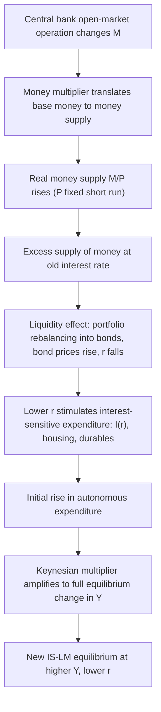
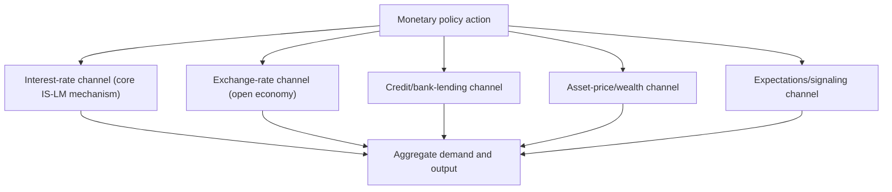

## Monetary Policy Transmission in the IS-LM Framework

### Overview

Monetary policy transmission within the IS-LM apparatus describes the causal chain through which a central bank action — typically modeled as a change in the money supply $M$ — propagates through the money market to the interest rate, and from the interest rate through the goods market to aggregate output and employment. While the previous IS-LM content established the comparative-statics of the model broadly, this content focuses specifically and in depth on the **transmission mechanism itself**: the sequential channels, the role of expectations and the transactions/speculative demand split, the empirical transmission lags, and the specific frictions and elasticities that determine how strongly (and how quickly) a monetary impulse ultimately affects real economic activity.

### The Canonical Transmission Chain

**Key Points**

The standard IS-LM transmission mechanism proceeds through four sequential links:

1. **Money supply change:** the central bank alters $M$ (in the basic model, typically via open-market operations affecting the monetary base, with the money multiplier translating base-money changes into changes in the broader money stock).
2. **Money-market adjustment:** with $P$ fixed in the short run, real money supply $M/P$ changes. Given money demand $L(Y,i)$, the interest rate adjusts to restore money-market equilibrium — this is the **liquidity effect**: an increase in $M$ creates an initial excess supply of money at the prevailing rate, inducing portfolio rebalancing into bonds, bidding up bond prices and **lowering** the interest rate.
3. **Investment response:** the change in $r$ affects interest-sensitive components of aggregate expenditure — principally business fixed investment $I(r)$, but in richer versions also residential investment, durable-goods consumption, and inventory investment.
4. **Multiplier/output response:** the initial change in autonomous expenditure is amplified through the standard Keynesian expenditure multiplier, generating the full equilibrium change in $Y$.

### Diagram: The Transmission Chain

### The Liquidity Effect in Detail

The **liquidity effect** is the specific money-market mechanism by which an increase in $M/P$ lowers $i$. Formally, from the LM equilibrium condition $M/P = L_1(Y) + L_2(i)$, holding $Y$ momentarily fixed (the short-run "impact" effect, before output has time to adjust):

$$\Delta \frac{M}{P} = \frac{\partial L_2}{\partial i} \Delta i \implies \Delta i = \frac{\Delta(M/P)}{\partial L_2/\partial i} < 0 \quad (\text{since } \partial L_2/\partial i < 0)$$

**The magnitude of the liquidity effect depends inversely on the interest-elasticity of speculative money demand** $|\partial L_2/\partial i|$: the more elastic (flatter) $L_2(i)$, the smaller the fall in $i$ for a given increase in $M/P$ — this is precisely why the liquidity effect (and hence the entire transmission chain) becomes attenuated to zero as the economy approaches a **liquidity trap**, where $\partial L_2/\partial i \to -\infty$ (perfectly elastic), making $\Delta i \to 0$ regardless of the size of $\Delta(M/P)$.

### The Investment Channel: Interest-Sensitivity of Expenditure Components

**Key Points**

- **Business fixed investment** is the traditionally emphasized channel in the basic IS-LM textbook exposition, following the neoclassical investment logic that firms invest up to the point where the marginal product of capital equals the user cost of capital (which rises with $r$) — a fall in $r$ lowers the user cost, raising desired capital stock and hence current investment spending.
- **Residential investment (housing)** is empirically one of the **most interest-sensitive** components of aggregate expenditure, since mortgage borrowing costs are directly and immediately tied to prevailing interest rates — many empirical studies of monetary transmission find housing investment responds faster and more strongly to policy-rate changes than business fixed investment. [Inference: the relative speed and magnitude of the housing versus business-investment channels vary across countries depending on mortgage-market structure (e.g., prevalence of fixed- versus adjustable-rate mortgages) and are not uniform across all economies or time periods.]
- **Durable-goods consumption** (automobiles, appliances) also exhibits interest-rate sensitivity through the cost-of-credit channel for consumer financing, providing an additional transmission channel beyond the strict $I(r)$ term of the basic textbook IS curve.
- **Inventory investment** can respond to interest-rate changes via the cost of carrying inventory (financed via short-term credit), providing a channel that operates on a shorter time horizon than fixed investment.
- The **aggregate interest-sensitivity of expenditure** — the slope of the IS curve — is therefore best understood as a composite of these several distinct channels, each potentially varying in strength and speed of response, and each subject to separate empirical estimation.

### The Role of Expectations: Beyond the Static IS-LM

**Key Points**

- The basic static IS-LM model implicitly treats the interest-rate/investment relationship as depending on the **current** interest rate alone, but modern treatments (and richer dynamic extensions) emphasize that **investment decisions depend on the expected future path of interest rates and the associated cost of capital over the relevant investment horizon**, not merely the current spot rate — this is a significant limitation of the static IS-LM apparatus relative to modern forward-looking models.
- This has direct relevance for understanding **forward guidance** as a monetary policy tool: even when the current policy rate is constrained (e.g., at the zero lower bound), central bank communication about the *expected future path* of rates can still influence long-term rates (via the expectations hypothesis of the term structure) and hence current investment/consumption decisions — a transmission channel that operates **outside** the mechanics of the basic static IS-LM model but is a natural extension of its underlying logic once expectations are made explicit.
- Similarly, the distinction between the **nominal** rate $i$ (directly targeted/affected by monetary policy in the money market) and the **real** rate $r$ (relevant for investment decisions, per the Fisher equation) means that monetary policy's real effects depend on how policy actions affect **inflation expectations** $\pi^e$ as well as the nominal rate — a policy action that lowers $i$ by less than any accompanying fall in $\pi^e$ could, in principle, leave $r$ unchanged or even raise it (this is the theoretical crux of the "Neo-Fisherian" debate discussed in the Fisher-equation content, and is a channel entirely outside the basic static IS-LM framework's scope).

### Transmission Lags: "Long and Variable Lags"

**Key Points**

- Milton Friedman's famous characterization of monetary policy's effects as operating with **"long and variable lags"** reflects the empirical observation that the full transmission chain — from policy action, through the liquidity effect, through the investment/expenditure response, through the multiplier process, to the ultimate effect on output and (further downstream) inflation — **does not operate instantaneously**, and the lag length is not precisely predictable in advance.
- Empirical VAR-based studies of monetary policy shocks (e.g., Christiano, Eichenbaum, and Evans, 1999, and the broader "monetary VAR" literature) typically find that the **peak effect of a monetary policy shock on real output occurs with a lag of roughly one to two years**, with effects on inflation typically lagging even further behind the output response — a "hump-shaped" impulse-response pattern is the standard empirical finding, rather than instantaneous full adjustment. [Inference: precise lag estimates vary meaningfully across studies, identification strategies, sample periods, and countries, and should not be treated as a single universally agreed-upon number; the qualitative "long and variable lag" characterization is the more robust and widely shared empirical conclusion.]
- This lag structure is a central practical justification for central banks conducting policy in a **forward-looking** manner (responding to *forecasts* of future inflation/output gaps rather than only current data), since by the time a policy action's full effects materialize, economic conditions may have already changed substantially from those prevailing at the time the decision was made.

### Channels Beyond the Basic Interest-Rate Channel

**Key Points**

While the core IS-LM apparatus emphasizes the interest-rate/investment channel, the broader monetary-transmission literature (extending beyond the strict static IS-LM model, but conventionally taught alongside it) identifies several additional channels:

- **Exchange-rate channel** (relevant in an open-economy extension, e.g., Mundell-Fleming): a fall in domestic $r$ relative to foreign rates induces capital outflows, depreciating the domestic currency, which stimulates net exports — an additional channel through which monetary expansion raises aggregate demand, operating alongside (and, in a small open economy with high capital mobility, potentially dominating) the domestic investment channel.
- **Credit channel / bank lending channel:** monetary policy can affect the **supply** of bank credit directly (via effects on bank reserves and lending capacity), independent of the pure interest-rate/price-of-credit channel — a contraction in reserves can force banks to curtail lending even to borrowers willing to pay the prevailing interest rate, particularly affecting bank-dependent borrowers (small firms, households without direct capital-market access) who lack alternative funding sources (Bernanke and Blinder, 1988; Bernanke and Gertler, 1995, on the "broad credit channel"/balance-sheet channel, which operates via the effect of monetary policy on borrower net worth and collateral values, amplifying the direct interest-rate effect through financial-accelerator dynamics).
- **Asset-price/wealth channel:** monetary policy affects equity and housing prices (via discount-rate effects on asset valuation), which in turn affect consumption via wealth effects (distinct from, though conceptually related to, the Pigou effect's focus specifically on real money balances) — a fall in $r$ raises the present value of future asset cash flows, raising asset prices and household wealth, stimulating consumption.
- **Expectations/signaling channel:** a policy action can itself convey information about the central bank's assessment of the economic outlook or its future policy intentions, shifting private-sector expectations in ways that go beyond the mechanical liquidity effect (this channel is central to modern forward-guidance policy design).

**These additional channels are not part of the basic closed-economy static IS-LM model as originally formulated, but are standard extensions taught to contextualize the model's core interest-rate channel within the fuller modern transmission-mechanism literature.**

### Diagram: The Broader Transmission Channel Map

### Factors Governing Transmission Strength: A Synthesis

| Factor | Effect on Transmission Strength | Mechanism |
| --- | --- | --- |
| Interest-elasticity of speculative money demand | Weaker transmission if highly elastic | Liquidity effect attenuated (approaching liquidity trap) |
| Interest-elasticity of investment (IS slope) | Weaker transmission if inelastic (steep IS) | Given fall in r produces small change in I |
| Marginal propensity to consume | Stronger transmission if higher | Larger multiplier amplifies initial expenditure change |
| Degree of capital mobility (open economy) | Can strengthen transmission via exchange-rate channel | Interest-rate differentials induce capital flows and currency movements |
| Bank dependence of borrowers | Stronger transmission if higher bank dependence | Credit channel operates alongside price-of-credit channel |
| Degree of price/wage stickiness | Determines size of real effects versus pure price adjustment | More stickiness → larger, more persistent real effects; less stickiness → faster convergence to neutrality |

### Worked Example: Tracing an Expansionary Shock

Using the linear IS-LM specification from the companion IS-LM content: $\text{IS: } Y=3000-100r+2(G-T)$; $\text{LM: } M/P = 0.5Y - 200r$.

**Step 1 — Initial equilibrium** at $M/P=1000$, $G-T=500$: solving jointly gives $Y^*=3600$, $r^*=4$ (as derived in the companion content).

**Step 2 — Central bank raises $M/P$ to $1200$ (a monetary expansion), holding $G-T=500$ fixed.**

$$Y^{*\prime} = \frac{200}{250}\left[3000+\frac{100}{200}(1200)+2(500)\right]=0.8\times[3000+600+1000]=0.8\times4600=3680$$

**Step 3 — New equilibrium interest rate:**

$$r^{*\prime}=\frac{0.5(3680)-1200}{200}=\frac{1840-1200}{200}=3.2$$

**Step 4 — Decompose the transmission:** the interest rate fell from $r^*=4$ to $r^{*\prime}=3.2$ (a decline of $0.8$ percentage points — the liquidity effect), and output rose from $Y^*=3600$ to $Y^{*\prime}=3680$ (an increase of $80$ — the combined investment-response-plus-multiplier effect). **The ratio of the output change to the interest-rate change** ($80/0.8=100$) reflects the product of the investment's interest-sensitivity ($b=100$ in the IS specification) and the multiplier amplification embedded in the reduced-form solution — illustrating how the two links in the transmission chain (liquidity effect, then investment/multiplier effect) combine multiplicatively to produce the total output response. [Inference: this decomposition uses the specific stylized linear parameters of the worked example; real-world transmission strength estimates require empirical estimation of the analogous elasticities from actual data.]

### Illustration: Impulse-Response Shape (Stylized)

<svg xmlns="http://www.w3.org/2000/svg" viewBox="0 0 640 340" font-family="Helvetica, Arial, sans-serif">
<title>Stylized Impulse Response of Output to a Monetary Policy Shock (svg_diagram)</title>
<line x1="70" y1="290" x2="600" y2="290" stroke="black" stroke-width="2" />
<line x1="70" y1="290" x2="70" y2="40" stroke="black" stroke-width="2" />
<text x="610" y="295" font-size="13">Quarters after shock</text>
<text x="30" y="30" font-size="13">Deviation of Y</text>
<path d="M 70 290 Q 200 260 320 130 Q 420 60 500 110 Q 560 150 600 220" stroke="#1f77b4" stroke-width="2.5" fill="none" />
<line x1="70" y1="290" x2="600" y2="290" stroke="#888" stroke-dasharray="3,2" />
<line x1="320" y1="290" x2="320" y2="130" stroke="#888" stroke-dasharray="3,2" />
<text x="320" y="308" font-size="12" text-anchor="middle">Peak effect: ~4-8 quarters</text>
<text x="150" y="320" font-size="11" fill="#555" text-anchor="middle">Gradual buildup</text>
<text x="550" y="320" font-size="11" fill="#555" text-anchor="middle">Gradual fade</text>
</svg>

### Attenuating Factors and Model Extensions

**Key Points**

- **Liquidity trap:** as discussed, an interest-elastic (flat) $L_2(i)$ attenuates the liquidity effect to zero, breaking the transmission chain at its first link — motivating unconventional monetary tools (quantitative easing, forward guidance, negative rates) that attempt to operate through channels other than the conventional short-rate liquidity effect.
- **Investment interest-inelasticity:** even with a strong liquidity effect (large fall in $r$), if $I'(r)$ is small in magnitude (steep IS curve), the second link in the transmission chain is weak — some business-cycle research has questioned the empirical magnitude of interest-sensitivity of aggregate investment, particularly over short/medium horizons, suggesting this link may be weaker than the textbook IS-LM narrative implies. [Unverified: the empirical magnitude of aggregate investment's interest elasticity is a long-debated and not fully settled question in applied macroeconomics, with estimates varying by methodology, time period, and the specific investment category examined.]
- **Bank balance-sheet constraints:** if banks themselves are capital- or liquidity-constrained (particularly relevant during financial crises), the credit channel can partially or wholly substitute for, amplify, or in some cases dominate the conventional interest-rate channel, complicating simple IS-LM-based predictions during periods of financial stress.

### Related Topics / Next Steps

- The IS-LM model of goods and money markets
- Liquidity preference and the speculative demand for money
- The bank lending channel and the financial accelerator (Bernanke-Gertler)
- Forward guidance and unconventional monetary policy at the zero lower bound
- The Mundell-Fleming model and the exchange-rate transmission channel
- Empirical identification of monetary policy shocks (structural VARs)
- The term structure of interest rates and the expectations hypothesis
- Quantitative easing: theory and empirical evidence
- The Taylor rule and forward-looking monetary policy
- Friedman's "long and variable lags" and the case for policy rules