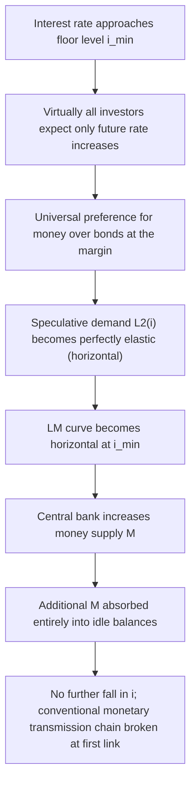
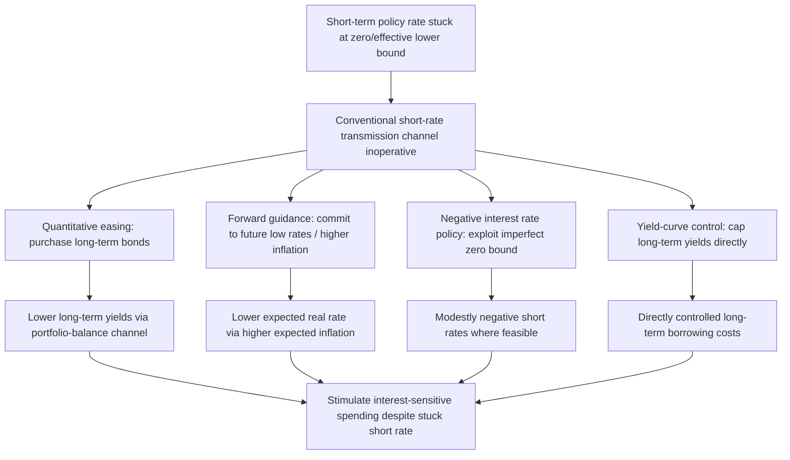

## The Liquidity Trap

### Overview

The **liquidity trap** describes a situation in which the interest rate has fallen to a level — historically theorized as some positive floor, and in modern applications closely tied to the **zero lower bound (ZLB)** — at which the demand for money becomes perfectly (or near-perfectly) elastic with respect to the interest rate, rendering conventional monetary policy (expansion of the money supply) powerless to lower interest rates further or stimulate aggregate demand. First articulated by Keynes (1936) as a theoretical possibility and developed formally within the IS-LM apparatus by Hicks and later economists, the liquidity trap became a central organizing concept for understanding the Great Depression, Japan's prolonged stagnation from the 1990s, and the post-2008 and post-2020 experience of near-zero policy rates across most advanced economies — motivating the modern development of unconventional monetary policy tools.

### Formal Definition Within the IS-LM/Liquidity Preference Framework

Recall the liquidity preference money-demand function $L(Y,i) = L_1(Y) + L_2(i)$, where $L_2(i)$ is the speculative demand component. A liquidity trap exists at some interest rate $i_{min}$ if:

$$\lim_{i \to i_{min}^+} \frac{\partial L_2}{\partial i} \to -\infty$$

i.e., the speculative demand curve becomes **perfectly horizontal** at $i_{min}$: any additional money supplied to the economy at this rate is absorbed entirely into idle balances, with **no further decline in the interest rate**, because virtually every investor believes rates can only rise from such a low level (and hence bond prices can only fall), so all wealth-holders prefer to hold money rather than bonds at the margin.

### Diagram: The Liquidity Trap Mechanism

### Graphical Representation: Horizontal LM Segment

<svg xmlns="http://www.w3.org/2000/svg" viewBox="0 0 640 380" font-family="Helvetica, Arial, sans-serif">
<title>The Liquidity Trap: Horizontal LM Segment (svg_diagram)</title>
<line x1="70" y1="330" x2="600" y2="330" stroke="black" stroke-width="2" />
<line x1="70" y1="330" x2="70" y2="40" stroke="black" stroke-width="2" />
<text x="610" y="335" font-size="13">Y (output)</text>
<text x="30" y="30" font-size="13">i</text>
<path d="M 550 60 Q 350 150 220 300 L 70 300" stroke="#d95f02" stroke-width="2.5" fill="none" />
<text x="480" y="85" font-size="12" fill="#d95f02">LM</text>
<text x="140" y="290" font-size="11" fill="#d95f02">Flat segment: liquidity trap</text>
<path d="M 550 90 Q 350 170 100 320" stroke="#1f77b4" stroke-width="2.5" fill="none" />
<text x="470" y="105" font-size="12" fill="#1f77b4">IS</text>
<circle cx="220" cy="300" r="5" fill="#c1272d" />
<text x="235" y="298" font-size="12" fill="#c1272d">Equilibrium in the trap</text>
<path d="M 220 300 L 340 300" stroke="#2ca02c" stroke-width="2" stroke-dasharray="4,3" marker-end="url(#arr2)" />
<text x="280" y="316" font-size="10" fill="#2ca02c">LM shift: no effect on i</text>
</svg>

### Why Conventional Monetary Policy Fails in the Trap

**Key Points**

- With the LM curve horizontal at $i_{min}$, a rightward shift of the LM curve (from expansionary monetary policy) produces **no change in equilibrium $Y$**, since the intersection with the IS curve simply slides along the flat segment.
- This is the direct IS-LM formalization of the **breakdown of the liquidity effect** (the first link in the monetary transmission chain, covered separately): the interest rate cannot fall further, so the entire subsequent chain (investment response, multiplier effect) never gets triggered.
- **Open-market purchases of short-term government bonds** in this regime effectively just **swap one zero/near-zero-yielding asset (short-term bonds) for another (money)** from the perspective of investors already treating short bonds and money as near-perfect substitutes at the floor rate — providing the core intuition for why conventional monetary policy is considered powerless in the strict liquidity-trap case.

### The Zero Lower Bound: The Modern Reformulation

**Key Points**

- The **zero lower bound (ZLB)** is the modern, more precise articulation of essentially the same underlying phenomenon: nominal interest rates cannot fall meaningfully below zero, because at negative nominal rates, holding physical currency (which pays a nominal return of exactly zero and involves no default/counterparty risk) dominates holding any asset with a negative nominal yield — investors would simply convert deposits/bonds into cash rather than accept a guaranteed nominal loss.
- **The ZLB is not identical to the classical Keynesian liquidity trap concept**, though they are closely related and often used interchangeably in modern discussions: the ZLB is a **hard institutional/arbitrage constraint** on how low nominal rates can go (given the option to hold zero-yielding cash), whereas Keynes's original liquidity-trap concept was framed more in terms of **investor expectations** about future capital gains/losses on bonds, which could in principle occur at a positive interest rate if investors uniformly believed that rate to be unsustainably low. In practice, since the mid-2010s several central banks (ECB, Bank of Japan, Swiss National Bank, Danish Nationalbank, Sveriges Riksbank) have implemented **modestly negative** policy rates, demonstrating that the "hard" zero bound is not perfectly rigid — storage, insurance, and transaction costs of holding physical cash in bulk create some room for mildly negative rates before the cash-arbitrage constraint fully binds — but the bound remains **effectively close to zero** in practice, hence the common modern terminology of the **effective lower bound (ELB)** rather than a strictly literal zero bound.

### Historical Episodes

**Key Points**

- **The Great Depression (1930s):** Keynes's original liquidity-trap concept was motivated directly by the observed ineffectiveness of monetary expansion in stimulating recovery in several major economies during the 1930s, with nominal interest rates falling to very low levels without a correspondingly strong recovery in investment and output — though later economic historians have debated the precise extent to which a "true" liquidity trap (as opposed to other contemporaneous factors like banking-sector collapse, debt-deflation per Fisher, and policy missteps including premature fiscal/monetary tightening) was the dominant explanatory factor. [Inference: the relative weight of the liquidity-trap mechanism versus alternative explanations for the severity/persistence of the Great Depression remains a subject of ongoing historical/economic debate rather than a fully settled consensus.]
- **Japan (1990s–2010s):** following the collapse of Japan's asset-price bubble in the early 1990s, the Bank of Japan lowered policy rates to near zero by the late 1990s and maintained them there for an extended period (often termed Japan's "lost decade(s)"), providing the most prominent and extensively studied modern real-world example of a prolonged liquidity-trap/ZLB episode, and motivating substantial theoretical work (notably Krugman, 1998, "It's Baaack: Japan's Slump and the Return of the Liquidity Trap") on the theoretical conditions for escaping such a trap via credible commitments to future inflation.
- **Global Financial Crisis (2008–2015) and aftermath:** major central banks (Federal Reserve, Bank of England, European Central Bank, and others) lowered policy rates to near zero in the wake of the 2008 crisis and maintained near-zero or (in Europe/Japan) negative rates for an extended period, prompting widespread adoption of unconventional monetary tools.
- **COVID-19 pandemic (2020–2021):** major central banks again lowered policy rates to near zero (or maintained already-low rates) in response to the pandemic-induced economic contraction, followed by a subsequent period of rapid rate increases from 2022 onward as inflation rose sharply — this rapid subsequent normalization is itself notable as a departure from the more prolonged near-zero-rate episodes of the prior two examples. [Note: for current policy rate levels as of any specific recent date, consult up-to-date central bank data, as rates have moved substantially since the pandemic-era lows.]

### Krugman's Solution: Managing Expectations of Future Inflation

**Key Points**

- Paul Krugman's influential analysis of the Japanese liquidity trap argued that **conventional current-period monetary expansion is ineffective specifically because it does nothing to raise expected future inflation** — but if the central bank could **credibly commit** to maintaining an expansionary monetary stance even after the economy recovers (i.e., commit to being "irresponsible" by allowing future inflation above what would otherwise be chosen once the trap is exited), this would raise **expected inflation** $\pi^e$, and via the Fisher equation, **lower the real interest rate** $r = i - \pi^e$ even while the nominal rate $i$ remains stuck at its zero/near-zero floor.
- This is the theoretical foundation for **forward guidance** as an unconventional monetary policy tool: communicating a credible commitment to future policy actions (e.g., keeping rates low even after inflation/output targets are met, or explicitly targeting a higher future price level or inflation rate) can stimulate current spending by lowering the *expected real* interest rate, operating through a channel that bypasses the stuck nominal rate entirely.
- **The core difficulty Krugman identified is the "credibility problem":** a central bank promising future inflation faces a time-consistency problem, since once the economy has recovered, the central bank would (absent binding commitment devices) prefer to renege on the promise and pursue low inflation as usual — making such commitments difficult to make credible to forward-looking private agents. This connects the liquidity-trap-exit literature directly to the broader time-consistency/credibility literature in monetary economics (Kydland-Prescott, Barro-Gordon).

### Unconventional Monetary Policy Tools

**Key Points**

- **Quantitative easing (QE):** large-scale central bank purchases of longer-maturity government bonds (and, in some programs, private-sector assets such as mortgage-backed securities or corporate bonds), aiming to lower **longer-term** interest rates and compress term/risk premia even when the **short-term** policy rate is stuck at its floor — operating through the **portfolio-balance channel** (reducing the available supply of long-duration/risky assets, inducing investors to accept lower yields on remaining holdings) as well as a signaling channel (QE announcements themselves can convey information about the future path of short rates).
- **Forward guidance:** explicit central bank communication about the expected future path of policy rates (e.g., "rates will remain low until inflation reaches X% and unemployment falls below Y%"), aiming to influence longer-term rates via the expectations hypothesis of the term structure and to raise expected future inflation per the Krugman mechanism above.
- **Negative interest rate policy (NIRP):** setting policy rates modestly below zero, exploiting the fact that the zero bound is not perfectly hard (given storage/transaction costs of physical cash), implemented by several central banks (ECB, Bank of Japan, Swiss National Bank, and Scandinavian central banks) in the 2010s, though with debated effectiveness and some concern about adverse effects on bank profitability and financial-sector functioning at sufficiently negative rates. [Unverified: the net effectiveness of NIRP, and the extent to which its transmission to the real economy differs materially from conventional rate cuts at positive rate levels, remains an actively debated empirical question, with some evidence suggesting diminished or even reversed effectiveness — the "reversal rate" hypothesis (Brunnermeier and Koby) — at sufficiently negative rate levels due to bank-profitability constraints.]
- **Yield-curve control:** explicit central bank commitment to cap longer-term government bond yields at a specified level (implemented notably by the Bank of Japan from 2016), combining elements of QE and forward guidance into an explicit yield target.

### Illustration: Unconventional Policy Tools Bypassing the Trap

### Fiscal Policy in the Liquidity Trap

**Key Points**

- As established in the IS-LM comparative-statics analysis, **fiscal policy is theoretically at its most powerful precisely in the liquidity-trap region**, since the horizontal LM curve implies that a rightward IS shift (from higher $G$ or lower $T$) produces its **full multiplier effect on output with essentially no crowding out** (the interest rate does not rise to choke off the fiscal expansion, since it was already sitting at its floor and the LM curve is flat).
- This theoretical result underlies the widely cited Keynesian policy prescription that discretionary fiscal stimulus is the preferred/most reliable stabilization tool during severe liquidity-trap episodes (as opposed to relying primarily on monetary policy), a prescription that gained renewed prominence during both the post-2008 and post-2020 policy debates.
- **Fiscal multipliers are also generally estimated to be larger during liquidity-trap/ZLB episodes** in the broader empirical literature (relative to normal-times estimates), consistent with the theoretical IS-LM prediction, though the precise magnitude of this "ZLB multiplier premium" varies across studies and identification approaches. [Inference: while the qualitative direction of this result (larger multipliers near the ZLB) is broadly supported across a range of empirical approaches, the exact quantitative magnitude remains sensitive to model specification, sample period, and the specific empirical methodology employed.]

### Worked Example: Fiscal vs. Monetary Policy in the Trap

Using a stylized IS-LM setup where the LM curve is **perfectly horizontal** at $i_{min}=0$ (i.e., $d \to \infty$ in the linear notation from the companion IS-LM content, so the LM curve is $r=0$ for all $Y$ up to the point where the trap ends):

**Step 1 — IS equation:** $Y = 3000 - 100r + 2(G-T)$. With $r=0$ fixed (LM horizontal): $Y = 3000+2(G-T)$.

**Step 2 — Baseline at $G-T=500$:** $Y^* = 3000+1000=4000$.

**Step 3 — Monetary policy experiment:** increase $M/P$ by any amount. Since the LM curve remains horizontal at $r=0$ regardless of $M/P$ (within the trap region), **equilibrium $Y$ is completely unaffected**: $Y^{*\prime}=4000$ still. **Monetary policy has zero effect on output in this stylized trap scenario.**

**Step 4 — Fiscal policy experiment:** increase $G-T$ by 100, to 600. New equilibrium: $Y^{*\prime\prime}=3000+2(600)=4200$ — an increase of **200**, exactly equal to the **full, undamped multiplier** ($\alpha \times \Delta(G-T) = 2 \times 100 = 200$), since with $r$ fixed at the floor, there is **no crowding out at all** (contrast with the non-trap worked example in the companion IS-LM content, where the same-sized fiscal expansion produced a smaller-than-full-multiplier effect of 160 due to partial crowding out). [Inference: this stylized example assumes a perfectly and permanently horizontal LM curve for illustrative clarity; real-world liquidity-trap episodes exhibit more nuanced dynamics, including eventual trap-exit dynamics and expectational effects not captured in this simplified static comparison.]

### Critiques and Qualifications

**Key Points**

- Some economists (notably in the "Neo-Fisherian" and related literatures, and more broadly some New Classical/Monetarist-influenced perspectives) have questioned whether a "true" liquidity trap in the strict Keynesian sense — where monetary policy is *entirely* powerless — actually occurs in practice, as opposed to monetary policy simply being **less effective** (but not completely ineffective) at very low rates, or effects operating with a **longer lag** than at conventional rate levels. [Speculation: the degree to which historical near-zero-rate episodes represent "true" liquidity traps (zero marginal effectiveness) versus merely "weakened but positive" monetary policy effectiveness remains a genuinely disputed empirical and theoretical question, and the answer likely depends on which specific unconventional tools are considered part of "monetary policy" broadly construed.]
- The empirical success of unconventional tools (QE, forward guidance) in producing measurable effects on long-term yields and, to varying degrees, on output and inflation during the post-2008 period is sometimes cited as evidence that monetary policy retains **some** effectiveness even at the ZLB, provided sufficiently unconventional tools are deployed — suggesting the strict "monetary policy is completely powerless" characterization of the classical liquidity trap may be too strong a description of real-world ZLB episodes, even if the *conventional* short-rate channel specifically is indeed inoperative. [Inference: assessments of the overall real-economy effectiveness of QE and forward guidance vary considerably across empirical studies, with some finding modest but statistically significant effects and others finding effects concentrated primarily in financial-market variables (yields, asset prices) with more limited or delayed pass-through to real output and inflation.]

### Related Topics / Next Steps

- Liquidity preference and the speculative demand for money
- The IS-LM model of goods and money markets
- Monetary policy transmission in the IS-LM framework
- Quantitative easing and the portfolio-balance channel
- Forward guidance and central bank credibility/time-consistency
- The Fisher equation, real rates, and the Neo-Fisherian debate
- Japan's lost decade(s): case study in prolonged liquidity-trap dynamics
- Fiscal multipliers at the zero lower bound
- Negative interest rate policy and the "reversal rate" hypothesis
- Debt-deflation dynamics (Fisher 1933) and their interaction with the liquidity trap