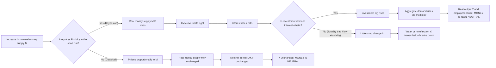

## Keynesian Critique of Monetary Neutrality

### Definition and Core Claim

Monetary neutrality is the classical/neoclassical proposition that changes in the money supply affect only nominal variables (price level, nominal wages, nominal exchange rates) in the long run, leaving real variables (output, employment, real wages, relative prices) unchanged. The Keynesian critique rejects this proposition, at minimum in the short-to-medium run, and in some strands of Post-Keynesian thought, in the long run as well. The critique holds that money is *non-neutral*: changes in the money supply, or more precisely in monetary conditions, can and do alter real output and employment, not merely the price level.

This critique is foundational to Keynesian macroeconomics because it justifies the core policy claim: monetary (and fiscal) policy can be used to manage aggregate demand and close output gaps, rather than the economy self-correcting to full employment through price and wage flexibility alone.

### The Classical Dichotomy Being Attacked

Classical monetary theory rests on the **classical dichotomy**: the separation of the real economy (determined by real forces — technology, preferences, factor endowments) from the nominal economy (determined by the quantity of money). This is formalized in the **Quantity Theory of Money**:

$$MV = PY$$

where $M$ is the money supply, $V$ is velocity of circulation, $P$ is the price level, and $Y$ is real output. Under classical assumptions, $V$ and $Y$ are determined independently of $M$ (by institutional payment habits and by the production function/labor market respectively). A change in $M$ therefore passes through proportionally to $P$, leaving $Y$ untouched. This is the doctrine of neutrality, and in its stronger form, when *relative* prices are also unaffected by a change in the *absolute* price level, it is called the **classical dichotomy** proper, with the special case of exact proportionality between $M$ and $P$ termed the **Neutrality of Money**, and the stronger long-run/short-run equivalence sometimes called **superneutrality** (where even the rate of growth of money doesn't affect real growth).

Keynes, and Keynesians after him, attacked this at multiple levels: the labor market clearing mechanism, the stability of velocity, the transmission channel from money to spending, and the presence of nominal rigidities.

### Keynes's Original Argument (General Theory, 1936)

#### 1. Rejection of Say's Law and Automatic Full Employment

Classical theory assumed that supply creates its own demand (Say's Law), so that the economy always tends toward full employment; unemployment, if it existed, would be eliminated by falling money wages and prices restoring real balances and clearing the labor market. Keynes denied that money-wage flexibility restores full employment, for two interlinked reasons:

- **Nominal wage rigidity (downward)**: workers resist nominal wage cuts even when they would passively accept real wage cuts brought about via price inflation. Keynes called this the "money illusion" in labor supply behavior — workers bargain over money wages, not real wages, because relative wage comparisons matter to them (a purely relative-position/fairness argument, not simple irrationality).
- **Even with wage flexibility, no guarantee of full employment**: Keynes argued in Chapter 19 of the *General Theory* that falling wages and prices, even if they occurred, would not reliably restore full employment. Falling prices raise the real value of debt (debt-deflation, later formalized by Fisher 1933), depress expected future prices (encouraging postponement of spending), and could destabilize expectations, offsetting any expansionary real-balance effect.

#### 2. The Liquidity Preference Theory and the Transmission Mechanism

Keynes replaced the quantity theory's mechanical link between money and prices with a **liquidity preference theory of interest**, in which the interest rate is determined by the supply of money relative to the demand to hold money as an asset (not just for transactions). Money demand $L$ depends on income $Y$ (transactions/precautionary motive) and the interest rate $r$ (speculative motive):

$$\frac{M}{P} = L(Y, r)$$

An increase in $M$, at a given price level, lowers $r$ to re-equilibrate money demand. This is the crucial break: money affects the interest rate, and the interest rate affects investment via the marginal efficiency of capital, and investment affects aggregate demand, output, and employment through the multiplier. Money is non-neutral because it operates through a *real* channel (investment spending), not merely inflating prices.

#### 3. The Liquidity Trap

Keynes noted a special case undermining monetary policy effectiveness at very low interest rates: if $r$ approaches some floor, money demand becomes infinitely elastic (speculative demand absorbs any addition to $M$ without $r$ falling further), so monetary expansion fails even to lower interest rates, let alone stimulate investment. This is not, strictly, an argument for non-neutrality — it is an argument that money can become *impotent* even though it is *non-neutral in principle*. It matters to the broader critique because it shows the transmission mechanism from $M$ to $Y$ can break down at specific points, which a simple quantity-theoretic neutrality claim cannot accommodate or explain.

#### 4. Interest-Inelastic Investment

A second qualification: even if $M$ succeeds in lowering $r$, if investment demand is highly interest-inelastic (a common Keynesian empirical claim, especially during depressions when business expectations/"animal spirits" dominate investment decisions), the change in $r$ fails to generate a meaningful change in investment and hence output. Both the liquidity trap and interest-inelastic investment became central to the **IS-LM** formalization (Hicks 1937) of when monetary policy is weak, reinforcing fiscal policy's relative importance in the Keynesian system.

### Formal Representation via IS-LM

The IS-LM model (Hicks-Hansen synthesis) is the standard graphical/algebraic device for showing non-neutrality in the Keynesian short run.

**IS curve** (goods market equilibrium):

$$Y = C(Y-T) + I(r) + G$$

**LM curve** (money market equilibrium):

$$\frac{M}{P} = L(Y, r)$$

An increase in nominal $M$, holding $P$ fixed in the short run (the key non-classical assumption), shifts LM rightward, lowers $r$, raises $I(r)$, and raises equilibrium $Y$. Money is non-neutral precisely *because* $P$ is sticky in the short run — if $P$ adjusted instantaneously and proportionally, the real money supply $M/P$ would be unchanged, LM would not shift in real terms, and $Y$ would be unaffected (neutrality restored). The entire Keynesian non-neutrality result in this framework hinges on **price stickiness**.

### Why Prices/Wages Are Sticky: Microfoundations of Non-Neutrality

The original Keynesian critique was often criticized (by New Classical economists in the 1970s) for *assuming* nominal rigidity rather than deriving it from rational behavior. Subsequent New Keynesian economics supplied microfoundations for sticky prices/wages, strengthening the non-neutrality case against the Lucas Critique and rational expectations challenges:

- [Inference — standard New Keynesian synthesis, not literally Keynes's own argument] **Menu costs** (Mankiw 1985; Akerlof & Yellen 1985): small fixed costs of changing posted prices make firms individually rational to leave prices unchanged even after a monetary shock, and these individually small distortions can have large aggregate effects (second-order individual loss, first-order aggregate effect).
- **Staggered contracts** (Fischer 1977; Taylor 1979): overlapping, staggered nominal wage or price contracts mean that even with rational expectations, the aggregate price level adjusts sluggishly because not all prices reset simultaneously.
- **Calvo pricing** (Calvo 1983): a stochastic, exogenous probability that any given firm resets its price in a period, widely used in New Keynesian DSGE models to generate a New Keynesian Phillips Curve in which current inflation depends on expected future inflation and the output gap:

$$\pi_t = \beta E_t[\pi_{t+1}] + \kappa (Y_t - Y_t^*)$$

This equation is itself a formal statement of non-neutrality: if $Y_t \neq Y_t^*$ (output gap nonzero), inflation dynamics are linked to *real* output deviations, meaning nominal shocks (including monetary shocks) that move $Y_t$ away from $Y_t^*$ have real consequences until prices fully adjust.

- **Efficiency wages and insider-outsider models**: explain why nominal (and real) wages fail to fall to clear the labor market even under persistent unemployment, reinforcing Keynes's original labor-market argument with microfounded reasons (worker effort/productivity linkage, incumbent bargaining power).

### Money Illusion

A concept central to both Keynes and later behavioral economics: agents (workers, consumers) respond to *nominal* changes in a way not fully justified by rational optimization over *real* variables. If money illusion is present, a change in $M$ that changes $P$ without changing real balances can still alter real behavior (consumption, labor supply), directly violating the classical dichotomy at the level of individual decision-making, not merely at the level of aggregate frictions.

### Post-Keynesian Extensions: Non-Neutrality Even in the Long Run

Mainstream (New) Keynesian economics generally concedes long-run neutrality (once prices fully adjust) while insisting on short-run non-neutrality. **Post-Keynesian** economists (following Kaldor, Davidson, Minsky, and the endogenous money tradition) go further, arguing money is non-neutral even in the long run:

- **Endogenous money theory**: in a modern credit economy, the money supply is not an exogenous policy lever set by the central bank; it is created endogenously by bank lending in response to demand for credit ("loans create deposits"). If money creation is endogenous and tied to real investment/production decisions, it cannot be treated as a "veil" separable from the real economy — a change in credit conditions *is* a change in the pace of real capital accumulation.
- **Historical time and irreversibility (Davidson, following Keynes's own emphasis on fundamental uncertainty)**: decisions made under monetary contracts (debt, wage contracts) in calendar/historical time have real, irreversible consequences. Because production and investment decisions are made in a monetary economy under uncertainty, using money contracts to bridge time, monetary factors are woven into the determination of real output at every horizon — there is no meaningful "long run" in which this influence washes out.
- **Minsky's Financial Instability Hypothesis**: extends non-neutrality to the *financial structure* of the economy: monetary/credit expansion during booms shifts firms from hedge to speculative to Ponzi financing positions, so monetary conditions shape the trajectory and stability of real output growth over the cycle, not merely its level at a point in time.

### Debt-Deflation as a Non-Neutrality Channel

Irving Fisher's **debt-deflation theory** (1933), absorbed into the Keynesian critique, shows how falling prices — the classical "cure" for unemployment via real balance effects — can be contractionary rather than expansionary:

1. Overindebtedness triggers distress selling.
2. Distress selling contracts deposit currency (via bank credit contraction) and slows velocity.
3. These cause a fall in the price level $P$.
4. If debts are fixed in nominal terms, falling $P$ raises the *real* value of debt, causing further distress selling — a debt-deflation spiral.
5. Falling output, trade, and confidence follow, alongside falling nominal interest rates but *rising* real interest rates (since $r_{real} = r_{nominal} - \pi$, and $\pi$ is negative and possibly falling faster than $r_{nominal}$).

This channel demonstrates non-neutrality operating through balance-sheet effects rather than through the labor market or the standard IS-LM interest rate channel, and heavily influenced Bernanke's later "financial accelerator" work on the Great Depression.

### Empirical Evidence Cited in Support of Non-Neutrality

- **Friedman and Schwartz (1963)**, *A Monetary History of the United States*: though associated with Monetarism rather than Keynesianism, their finding that monetary contraction (1929-33) *caused* rather than merely accompanied the Great Depression's output collapse is widely cited by Keynesians as evidence that money is not neutral, since a purely neutral money supply contraction should only have altered $P$, not $Y$.
- **VAR studies of monetary policy shocks** (e.g., Christiano, Eichenbaum, and Evans 1999; Romer and Romer 2004, using narrative identification of Fed policy shifts): find that identified monetary policy shocks produce hump-shaped, persistent responses in real output and employment lasting several quarters to years before dying out, consistent with short/medium-run non-neutrality and eventual (but not immediate) return toward trend.
- **Sticky-price evidence from micro price data** (Bils and Klenow 2004; Nakamura and Steinsson 2008): median price durations of several months to about a year in the US, empirically grounding the New Keynesian non-neutrality mechanism rather than treating it as an ad hoc assumption.

### Key Points

- Monetary neutrality (classical/quantity theory) claims $M$ affects only $P$, not $Y$; the Keynesian critique claims $M$ affects $Y$, at least in the short-to-medium run.
- The critique rests on: (1) rejection of automatic labor-market clearing via wage flexibility, (2) the liquidity preference theory linking $M$ to $r$ to $I$ to $Y$, (3) nominal price/wage stickiness, and (4) money illusion.
- Formal expression: IS-LM shows non-neutrality is conditional on price stickiness; New Keynesian models (Calvo/Taylor pricing) provide microfounded reasons for that stickiness.
- Two important qualifications *within* the Keynesian framework itself (liquidity trap, interest-inelastic investment) show that non-neutrality does not guarantee *effective* monetary policy — money can be non-neutral in principle yet weak in practice.
- Post-Keynesians (endogenous money, historical time, Minsky) extend non-neutrality to the long run, going beyond the mainstream New Keynesian concession of eventual long-run neutrality.
- Debt-deflation (Fisher) is a distinct non-neutrality channel operating through balance sheets and real debt burdens rather than the interest-rate/investment channel.

### Related Topics

- IS-LM model and the Hicks-Hansen synthesis
- Liquidity preference theory and the speculative demand for money
- New Keynesian Phillips Curve and Calvo pricing
- Neoclassical Synthesis vs. New Keynesian economics
- Rational expectations and the Lucas Critique (the main rival challenge to Keynesian non-neutrality)
- Real Business Cycle theory (the modern heir to classical neutrality)
- Endogenous money theory and Post-Keynesian monetary economics
- Fisher's debt-deflation theory and Minsky's Financial Instability Hypothesis
- Money illusion in behavioral macroeconomics
- Monetary policy transmission mechanisms (interest rate, credit, exchange rate, asset price channels)