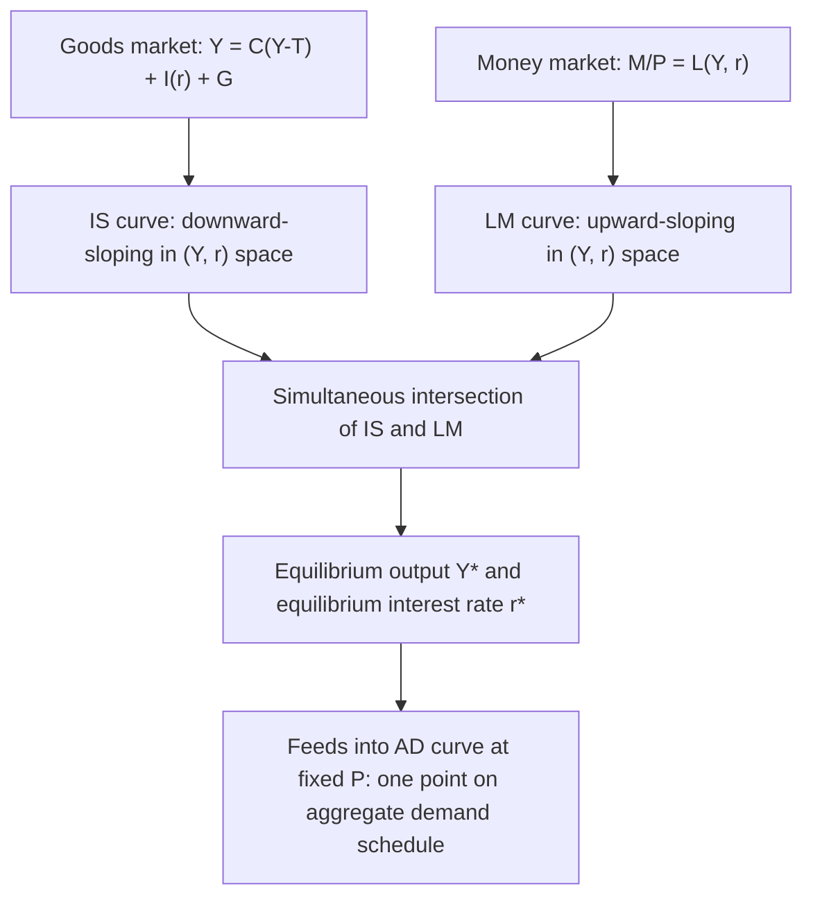
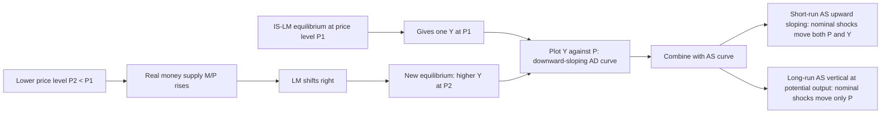

## The Hicksian Synthesis

### Definition and Origin

The Hicksian synthesis refers to John Hicks's 1937 paper "Mr. Keynes and the 'Classics': A Suggested Interpretation," published in *Econometrica*, which translated the verbal, literary argument of Keynes's *General Theory* (1936) into a compact formal apparatus now known as the **IS-LM model**. Hicks's stated goal was to represent both the "classical" system and Keynes's system as special or general cases of a single diagram, so that the dispute between them could be located precisely: not as two incommensurate worldviews, but as differing assumptions about the shape and position of two curves in $(Y, r)$ space. The model was later popularized and extended by Alvin Hansen (hence sometimes called the **Hicks-Hansen model**), and became the workhorse of the **Neoclassical Synthesis** associated with Samuelson, Modigliani, and Tobin from the 1950s onward.

### The Two Curves

#### IS Curve (Investment-Saving): Goods Market Equilibrium

The IS curve traces combinations of the interest rate $r$ and income $Y$ for which planned expenditure equals output, i.e., where injections (investment $I$, government spending $G$) equal leakages (saving $S$, taxes $T$), given a fixed price level.

$$Y = C(Y - T) + I(r) + G$$

- $C(Y-T)$: consumption as a function of disposable income, with $0 < C' < 1$ (marginal propensity to consume).
- $I(r)$: investment as a decreasing function of the interest rate, $I' < 0$ — the "marginal efficiency of capital" schedule from Keynes.
- Because $I' < 0$, and higher $r$ reduces $I$, which reduces $Y$ via the multiplier, the **IS curve slopes downward** in $(Y, r)$ space.
- The **steepness of IS** depends on the interest-sensitivity of investment ($I'$) and the size of the multiplier $1/(1 - MPC)$: flatter IS = more interest-elastic investment or larger multiplier; steeper IS = less interest-elastic investment.

#### LM Curve (Liquidity-Money): Money Market Equilibrium

The LM curve traces combinations of $r$ and $Y$ for which the demand for real money balances equals the fixed real money supply.

$$\frac{M}{P} = L(Y, r)$$

- $L(Y, r)$ is Keynes's liquidity preference function: money demand rises with income $Y$ (transactions/precautionary motive, $L_Y > 0$) and falls with the interest rate $r$ (speculative motive, $L_r < 0$), since bonds are the opportunity-cost alternative to holding idle cash.
- Because higher $Y$ raises money demand, requiring a higher $r$ to choke demand back down to the fixed real supply $M/P$, the **LM curve slopes upward**.
- The **steepness of LM** depends on the interest-elasticity of money demand: flatter LM = highly interest-elastic money demand (near-liquidity-trap conditions); steeper LM = low interest-elasticity (closer to the classical quantity-theory case).

### Simultaneous Equilibrium

The intersection of IS and LM determines the unique pair $(Y^*, r^*)$ that clears both the goods market and the money market simultaneously, for a *given* price level $P$ and *given* fiscal stance $(G, T)$.

### The IS-LM Diagram

$(r,\ Y)$ diagram (svg_diagram): downward-sloping IS, upward-sloping LM, intersecting at equilibrium $(Y^*, r^*)$.

<svg xmlns="http://www.w3.org/2000/svg" viewBox="0 0 640 460" font-family="Helvetica, Arial, sans-serif">
<text x="320" y="24" text-anchor="middle" font-size="16" font-weight="bold">IS-LM Equilibrium (svg_diagram)</text>

<line x1="80" y1="400" x2="580" y2="400" stroke="black" stroke-width="2" />
<line x1="80" y1="400" x2="80" y2="60" stroke="black" stroke-width="2" />
<text x="590" y="405" font-size="14">Y (Income/Output)</text>
<text x="45" y="55" font-size="14">r (Interest Rate)</text>

<path d="M 120 100 C 250 180, 400 260, 540 370" stroke="#1f6fb2" stroke-width="3" fill="none" />
<text x="545" y="365" font-size="14" fill="#1f6fb2" font-weight="bold">IS</text>

<path d="M 150 380 C 280 300, 420 180, 520 90" stroke="#c0392b" stroke-width="3" fill="none" />
<text x="525" y="88" font-size="14" fill="#c0392b" font-weight="bold">LM</text>

<circle cx="333" cy="228" r="5" fill="black" />
<line x1="333" y1="228" x2="333" y2="400" stroke="gray" stroke-dasharray="4,3" />
<line x1="333" y1="228" x2="80" y2="228" stroke="gray" stroke-dasharray="4,3" />
<text x="325" y="418" font-size="13">Y*</text>
<text x="55" y="232" font-size="13">r*</text>
<text x="345" y="218" font-size="13" font-weight="bold">E</text>
</svg>

### Comparative Statics: Fiscal Policy

An increase in $G$ (or a cut in $T$) shifts the IS curve rightward (more expenditure demanded at every $r$). Equilibrium moves to higher $Y$ and higher $r$. The rise in $r$ **crowds out** some private investment, so the net increase in $Y$ is less than the simple multiplier $\Delta G / (1 - MPC)$ would predict in the absence of a money market — this is the model's formal statement of the **crowding-out effect**.

- **Degree of crowding out** depends on the slope of LM: if LM is very steep (money demand interest-inelastic, close to the classical case), a given rightward IS shift produces a *large* rise in $r$ and *heavy* crowding out — fiscal policy is weak.
- If LM is very flat (as in a liquidity trap), the same IS shift produces *little or no* rise in $r$, so crowding out is minimal — fiscal policy is powerful.

### Comparative Statics: Monetary Policy

An increase in $M$ (with $P$ fixed) raises real balances $M/P$, shifting LM rightward. Equilibrium moves to lower $r$ and higher $Y$.

- **Effectiveness depends on two elasticities**: the interest-elasticity of money demand (LM slope) and the interest-elasticity of investment (IS slope).
- If money demand is highly interest-elastic (**liquidity trap**, Keynes's polar case), LM is flat; expanding $M$ fails to lower $r$ meaningfully, so monetary policy is impotent.
- If investment is interest-inelastic (steep IS), even a successful fall in $r$ fails to raise $I$ and $Y$ much — a second, independent way monetary policy can be weak.
- Conversely, in the **classical polar case**, LM is vertical (money demand purely transactions-based, no speculative/interest sensitivity — the "Cambridge k" case), so any change in $M$ maps one-for-one into $Y$ with monetary policy at maximum effectiveness, and fiscal policy produces *full* crowding out (IS shifts right, but since LM is vertical, $Y$ cannot change — only $r$ rises).

### The Two Polar Cases as a Unification Device

This is precisely Hicks's stated contribution: showing that "classical" and "Keynesian" conclusions are limiting cases of the same general model, determined by the empirical slopes of IS and LM, not by irreconcilable theoretical premises.

| Case | LM shape | IS shape | Fiscal policy | Monetary policy |
| --- | --- | --- | --- | --- |
| Classical polar case | Vertical (money demand independent of $r$) | Normal | Fully crowded out (no effect on $Y$) | Maximally effective |
| Keynesian polar case (liquidity trap) | Horizontal (infinitely elastic money demand) | Normal | Fully effective (no crowding out) | Completely ineffective |
| General/intermediate case | Upward-sloping | Downward-sloping | Partially effective, partial crowding out | Partially effective |

### Extension to Aggregate Demand and Aggregate Supply

IS-LM determines $(Y, r)$ for a *given* $P$. Tracing out equilibrium $Y$ as $P$ varies (a falling $P$ raises real balances $M/P$, shifting LM right, raising $Y$) generates the downward-sloping **AD curve**. Pairing AD with an **AS curve** (upward-sloping in the short run due to sticky wages/prices, vertical in the long run at potential output) completes the **AD-AS synthesis**, which became the standard textbook apparatus for showing:

- Short run: nominal shocks (money supply changes) shift AD and move real $Y$ — Keynesian non-neutrality.
- Long run: AS is vertical, so nominal shocks only move $P$, restoring the classical neutrality result asymptotically — hence "synthesis," reconciling Keynesian short-run non-neutrality with classical long-run neutrality within one coherent framework.

### The Neoclassical Synthesis

Hicks's model became the technical backbone of the broader **Neoclassical Synthesis** (a term due to Samuelson), which sought to integrate Keynesian short-run demand-determined output with the neoclassical long-run growth and equilibrium framework. Under this synthesis:

- In the short run, with sticky prices, the economy behaves as IS-LM describes: demand-determined, monetary and fiscal policy non-neutral.
- In the long run, prices/wages fully adjust, the AS curve is vertical at the "natural rate" of output, and classical neutrality reasserts itself.
- Policy's role is to manage short-run deviations of $Y$ from potential, while the long-run growth path is governed by neoclassical (Solow-type) determinants — capital accumulation, technology, labor force growth.

### Criticisms of the Hicksian Synthesis

- **Loss of Keynesian substance**: Post-Keynesians (Robinson, Davidson, Leijonhufvud) argue IS-LM strips out Keynes's central themes — fundamental uncertainty, the non-neutrality of money in historical (not just cyclical) time, the instability of expectations and "animal spirits," and the role of money as a store of value against uncertainty — reducing a rich behavioral theory to a static, mechanical general-equilibrium exercise. Leijonhufvud (1968) specifically argued "Keynesian economics" (the IS-LM textbook version) diverged substantially from "the economics of Keynes."
- **Static, single-period model**: IS-LM is a comparative-static snapshot; it does not model dynamic adjustment paths, expectations formation over time, or the sequence of disequilibrium trading that Keynes emphasized (false trading, quantity signals).
- **Treats expectations as exogenous/fixed**: the model largely suppresses the role of expected future income, expected inflation, and animal spirits in shifting IS, treating investment as a stable function of current $r$ alone — later critiqued heavily once rational expectations became standard (Lucas Critique: the parameters of IS and LM are not policy-invariant if expectations respond to policy regime changes).
- **No explicit treatment of the labor market/supply side** in the basic version: the original Hicks apparatus is a demand-side model bolted onto an assumed-fixed $P$; the labor market and wage determination are addressed only via the later AD-AS extension.
- **Superseded in modern research by DSGE/New Keynesian models**: contemporary central-bank and academic macro models (New Keynesian DSGE, three-equation model: IS curve, Phillips curve, monetary policy rule) retain an "IS-LM-like" logical skeleton but replace ad hoc functional forms with microfounded, intertemporally optimizing households and firms, and typically replace the LM curve with a central bank interest-rate rule (Taylor rule), since modern central banks target interest rates rather than money supply aggregates directly. [Inference — describes prevailing practice, not literal universal law]

### Key Points

- Hicks's IS-LM model (1937) formalized Keynes's *General Theory* as the simultaneous solution of a goods-market equilibrium condition (IS) and a money-market equilibrium condition (LM) in $(Y, r)$ space.
- IS is downward-sloping (higher $r$ → lower $I$ → lower $Y$); LM is upward-sloping (higher $Y$ → higher money demand → higher $r$ needed to clear a fixed money supply).
- The model's power lies in unifying "classical" and "Keynesian" conclusions as two polar cases (vertical LM vs. horizontal/liquidity-trap LM) of one general framework, with fiscal and monetary policy effectiveness determined by empirically observable elasticities rather than by dogma.
- Extending IS-LM across varying price levels generates the AD curve, which combined with AS produces the full Neoclassical Synthesis: short-run non-neutrality, long-run neutrality.
- The synthesis was influential for decades but was criticized, both by Post-Keynesians for discarding Keynes's emphasis on uncertainty and by New Classical/rational-expectations economists for lacking dynamic, forward-looking microfoundations — criticisms that motivated the shift toward DSGE and New Keynesian modeling.

### Related Topics

- Keynesian critique of monetary neutrality (liquidity preference, sticky prices, transmission mechanism)
- Liquidity trap and its modern relevance (zero lower bound, quantitative easing)
- Crowding-out effect and Ricardian equivalence debates
- AD-AS model and the short-run/long-run Phillips Curve
- Neoclassical Synthesis (Samuelson, Modigliani, Tobin)
- Leijonhufvud's "On Keynesian Economics and the Economics of Keynes"
- Lucas Critique and the rational expectations revolution
- New Keynesian DSGE models and the three-equation New Keynesian model
- Taylor rule and modern central bank interest-rate targeting
- Mundell-Fleming model (open-economy extension of IS-LM)