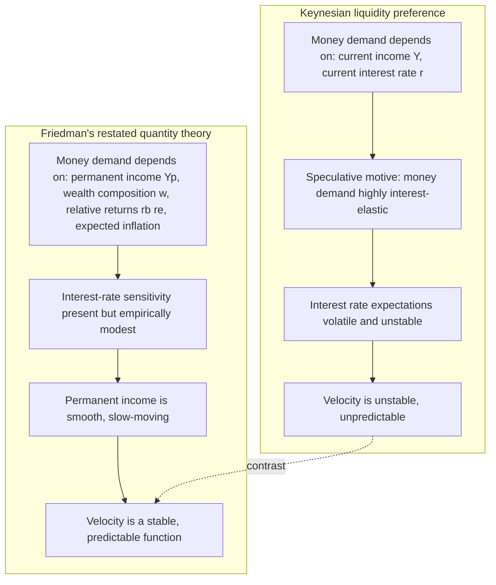
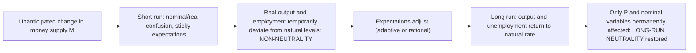

## Friedman's Modern Quantity Theory Framework

### Overview and Historical Positioning

Milton Friedman's "The Quantity Theory of Money: A Restatement" (1956), introducing the essay collection *Studies in the Quantity Theory of Money*, reformulated the older, mechanical Fisherine/Cambridge quantity theory as a theory of the **demand for money**, explicitly modeled on the neoclassical theory of demand for a durable asset/capital good, rather than as a crude, constant-velocity transactions identity. Friedman presented it as the continuation of an oral tradition at the University of Chicago (Simons, Mints, Knight, Viner), distinguishing it from Irving Fisher's mechanical version and positioning it as a rival research program to Keynesian liquidity preference theory. This restatement became the theoretical foundation of **Monetarism** and underwrote Friedman's policy conclusions in *A Monetary History of the United States, 1867-1960* (with Anna Schwartz, 1963) and in his later work on inflation and central banking.

### From Fisher's Equation to a Demand-for-Money Theory

The older quantity theory used the equation of exchange as an accounting identity:

$$MV = PY$$

where $M$ = money stock, $V$ = income velocity of circulation, $P$ = price level, $Y$ = real output. As an identity it is tautological; it becomes a *theory* only once behavioral assumptions pin down $V$ (or equivalently, money demand) independently of $M$. The older, crude quantity theory assumed $V$ was institutionally fixed (payment habits, payment periods) and $Y$ was determined independently at full employment by real forces, so any change in $M$ mapped proportionally into $P$ — this is the mechanical neutrality result. Friedman's restatement replaced the assumption of a *constant* $V$ with a *money demand function* in which $V$ is the reciprocal of desired money holdings relative to a wealth/income concept, and $V$ is allowed to vary systematically with a specified set of arguments, rather than being either constant or a free residual.

### The Restatement: Money as an Asset in a Portfolio

Friedman treated money as one of several forms in which wealth-holders can hold their wealth, analogous to durable consumer goods theory: households derive a flow of "services" (liquidity, security, convenience) from holding real money balances, and choose how much money to hold by weighing this service flow against the return sacrificed by not holding alternative assets. The generalized real money demand function is:

$$\frac{M^d}{P} = f\left(Y_p,\ w,\ r_b,\ r_e,\ \frac{1}{P}\frac{dP}{dt},\ u\right)$$

Where the key arguments are:

- **$Y_p$ — Permanent income**: not current/measured income, but Friedman's concept of the discounted present value of expected future income flows (or equivalently, expected average long-run income). This is the central departure from both the crude quantity theory (current $Y$) and from Keynes's liquidity preference (current $Y$ in the transactions motive). Money demand is a stable function of *permanent* income because money, like other durable assets, is held based on long-run wealth position rather than transitory income fluctuations.
- **$w$ — Ratio of human to non-human wealth**: the division of total wealth between human capital (future labor income) and non-human wealth (financial and physical assets). Since human wealth is illiquid (labor income cannot easily be capitalized/borrowed against), a higher share of wealth in human capital form increases desired money holdings as a substitute liquid buffer.
- **$r_b$ — Expected return on bonds**, $r_e$ — **expected return on equities**: the opportunity costs of holding money instead of alternative financial assets; a rise in either reduces desired money holdings.
- **$\frac{1}{P}\frac{dP}{dt}$ — Expected rate of change of the price level (expected inflation)**: the return on holding real goods/physical assets relative to money; higher expected inflation reduces desired money holdings by raising the opportunity cost of holding a nominally fixed asset.
- **$u$ — Tastes and other variables**: institutional factors (technology of payments, financial innovation, uncertainty) affecting the utility derived from liquidity services.

The essential Monetarist claim is that this money demand function is **stable** — not necessarily constant, but a *predictable* function of a small number of identifiable variables, particularly permanent income — in sharp contrast to the Keynesian claim that speculative money demand is unstable and highly sensitive to volatile interest-rate expectations (liquidity trap conditions).

### Velocity Reinterpreted, Not Assumed Constant

Because $V \equiv PY/M$, and money demand $M^d/P = f(\cdot)$ can be rearranged:

$$V = \frac{Y}{f(\cdot)/P} \quad\text{(schematically)}$$

Friedman's velocity is not a fixed institutional constant (as in the crude quantity theory) but a *systematic, predictable function* of the same variables that determine money demand — permanent income, wealth composition, relative asset returns, and expected inflation. This distinction matters because it reframes the entire Monetarist claim: the quantity theory is an empirical proposition that velocity (or equivalently, money demand) *moves predictably*, not that it is literally fixed — a nuance often lost in simplified textbook presentations of "Monetarism assumes constant velocity."

### Contrast with Keynesian Liquidity Preference

Friedman's framework does not deny that interest rates enter the money demand function (they do, via $r_b$ and $r_e$), so it is not, strictly, a rejection of liquidity preference theory on functional-form grounds. The dispute is empirical and about degree: Friedman argued that the interest-elasticity of money demand is low relative to the stability contributed by permanent income, so that shifts in $M$ dominate movements in $V$ over any policy-relevant horizon, whereas Keynesians (especially in the wake of the liquidity trap) argued that money demand's interest-sensitivity could be large and unstable enough to swamp the quantity-theoretic relationship, especially at low interest rates.

### Empirical Program: A Monetary History and the Transmission Mechanism

Friedman and Schwartz's *A Monetary History of the United States, 1867-1960* (1963) is the primary empirical vehicle for the modern quantity theory, using historical monetary data (including the "natural experiment" of the Great Depression) to argue:

- Changes in the money stock **precede** and **cause** changes in nominal income, not the reverse — supported by their identification of episodes where monetary policy actions (some accidental, e.g., Federal Reserve System-related gold sterilization and bank-panic-driven contractions of the 1930s) were plausibly exogenous to contemporaneous output movements ("natural experiments").
- The Great Depression is reinterpreted as fundamentally a *monetary* phenomenon: the Federal Reserve permitted (through policy passivity and failure to act as lender of last resort during banking panics) a roughly one-third contraction in the money stock between 1929 and 1933, which caused, rather than merely accompanied, the collapse in output and prices — directly contesting the Keynesian emphasis on collapsing investment/autonomous spending as the primary causal driver.
- This empirical work established the **transmission mechanism** claim central to Monetarism: money affects nominal income with "long and variable lags" (a famous Friedman phrase), operating through a broad portfolio-rebalancing channel (not merely the narrow interest-rate/investment channel of IS-LM) — changes in $M$ disturb the *entire* portfolio equilibrium across money, bonds, equities, durable goods, and real assets, so the effects of monetary policy are pervasive across the whole economy rather than confined to interest-sensitive investment spending.

### Policy Implications

#### 1. Long and Variable Lags → Rules over Discretion

Because Friedman argued the lag between a monetary policy action and its effect on nominal income is long (estimated at many months to over a year) and variable (unpredictable in length), discretionary countercyclical monetary policy risks being destabilizing — a policy action calibrated to today's conditions may hit the economy only after conditions have changed, amplifying rather than dampening cycles. This motivated Friedman's famous proposal of a **fixed monetary growth rule** (the "k-percent rule"): the central bank should commit to expanding the money supply at a constant rate, roughly matching the long-run growth rate of real output, rather than attempting fine-tuned discretionary countercyclical adjustment.

#### 2. Distinction Between Nominal and Real Interest Rates: The Fisher Effect Applied to Policy

Friedman argued that a central bank attempting to hold *nominal* interest rates low via persistent monetary expansion would, after an initial liquidity effect (lower nominal rates), eventually generate rising expected inflation, which raises nominal rates via the Fisher relation:

$$r_{nominal} = r_{real} + \pi^e$$

Attempting to keep nominal rates low is therefore self-defeating over time and can produce an inflationary spiral — a direct rebuttal of the (then-common) Keynesian-influenced policy of targeting low interest rates as an end in itself.

#### 3. Natural Rate of Unemployment and the Expectations-Augmented Phillips Curve

Friedman's 1968 AEA presidential address "The Role of Monetary Policy" extended the quantity-theory framework's implications for the short-run/long-run distinction, arguing that a **short-run** Phillips Curve tradeoff between inflation and unemployment exists only while inflation is unanticipated (workers/firms confused between nominal and real wage changes — a variant of the money-illusion argument, here applied by Friedman to argue *against* any long-run tradeoff), but that once expectations adjust, the economy returns to the **natural rate of unemployment** regardless of the (fully anticipated) inflation rate:

$$\pi = \pi^e + \phi(u^* - u)$$

This is the direct monetarist analog to (and rejection of) the naive Keynesian policy implication that permanently higher inflation could buy permanently lower unemployment — restoring a form of long-run monetary neutrality (with respect to *real* unemployment) even though Friedman's short-run framework, like Keynes's, allows real, non-neutral effects during the adjustment/confusion period.

### Formal Summary of the Non-Neutrality/Neutrality Split in Friedman's Framework

This positions Friedman's framework as accepting *short-run* non-neutrality (similar in kind, though different in mechanism, from the Keynesian critique) while reasserting *long-run* neutrality (via the natural rate hypothesis) — a synthesis distinct from, but comparable in structure to, the Neoclassical Synthesis's short-run/long-run split achieved via IS-LM/AD-AS.

### Key Points

- Friedman's 1956 restatement reframes the quantity theory as a stable money **demand** function, not a mechanical identity with constant velocity.
- Central argument: money demand depends primarily on **permanent income** (plus wealth composition and relative asset returns), making it stable and predictable — the basis for treating $M$ as the dominant driver of nominal income over the business cycle.
- Empirically grounded via Friedman and Schwartz's *Monetary History*, which argues monetary contraction *caused* the Great Depression, establishing money as causally prior to nominal income movements.
- Policy implications: skepticism of discretionary fine-tuning due to "long and variable lags," preference for a fixed money growth rule, rejection of interest-rate pegging as a policy target, and — via the natural rate hypothesis / expectations-augmented Phillips Curve — a rejection of any *permanent* inflation-unemployment tradeoff.
- Structurally, the framework preserves short-run non-neutrality (during periods of unanticipated inflation/expectational confusion) while reasserting long-run neutrality once expectations fully adjust — a different transmission mechanism from Keynes's interest-rate/investment channel, but a broadly parallel short-run/long-run resolution.

### Related Topics

- Equation of exchange and the Fisherine quantity theory (older mechanical version)
- Keynesian critique of monetary neutrality (contrast in transmission mechanism)
- Friedman-Schwartz *A Monetary History of the United States* and the Great Depression debate
- Natural rate of unemployment and the expectations-augmented Phillips Curve
- Adaptive expectations vs. rational expectations in monetarist and new classical models
- k-percent money growth rule and rules-versus-discretion debate
- Permanent Income Hypothesis (Friedman 1957) as the underlying consumption-theoretic parallel
- Fisher equation and the distinction between nominal and real interest rates
- Monetarist counter-revolution and its influence on 1980s central bank practice (Volcker disinflation)
- Modern New Keynesian synthesis of monetarist and Keynesian elements (interest-rate rules, natural rate hypothesis)