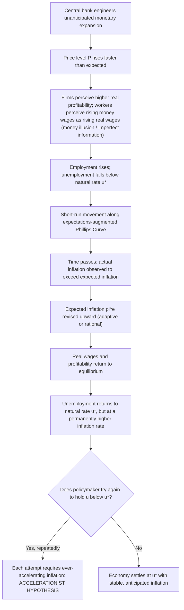

## The Natural Rate of Unemployment Hypothesis

### Definition and Origin

The natural rate of unemployment hypothesis holds that there exists a rate of unemployment, determined by real (non-monetary) structural and institutional features of the labor market, toward which the economy tends in the long run, regardless of the rate of inflation. It was introduced independently and near-simultaneously by **Milton Friedman**, in his 1968 American Economic Association presidential address "The Role of Monetary Policy" (published in *American Economic Review*), and by **Edmund Phelps**, in his 1967/1968 papers on the "expectations-augmented" wage-price dynamics. The hypothesis is the central labor-market pillar of Monetarism and constitutes a direct rejection of the notion of a stable, exploitable, long-run trade-off between inflation and unemployment.

Friedman's own definition: the natural rate is "the level that would be ground out by the Walrasian system of general equilibrium equations, provided there is imbedded in them the actual structural characteristics of the labor and commodity markets, including market imperfections, stochastic variability in demands and supplies, the cost of gathering information about job vacancies and labor availabilities, the costs of mobility, and so on." In other words, it is not zero unemployment; it is the unemployment rate consistent with all real, structural frictions in the economy — frictional and structural unemployment — once nominal variables (money supply, inflation) are netted out.

### The Target: The Original Phillips Curve

The hypothesis was formulated as a direct challenge to the **Phillips Curve**, the empirical relationship documented by A.W. Phillips (1958) between wage inflation and unemployment in the UK, later reformulated by Samuelson and Solow (1960) as a trade-off between price inflation and unemployment, and widely used in the 1960s as a policy "menu": governments could choose a point along a stable, downward-sloping curve, accepting somewhat higher inflation in exchange for lower unemployment.

$$\pi = f(u), \quad f' < 0 \quad \text{(naive/original Phillips Curve — assumed stable and exploitable)}$$

Friedman and Phelps argued this relationship, while it might hold in short-run cross-sectional or business-cycle data, could not be a stable structural relationship usable for permanent policy exploitation, because it omitted the role of **expected inflation** and the distinction between nominal and real wages.

### The Expectations-Augmented Phillips Curve

The core theoretical device is the augmentation of the Phillips Curve with expected inflation $\pi^e$:

$$\pi = \pi^e + \phi(u^* - u), \quad \phi > 0$$

or equivalently, solving for unemployment:

$$u = u^* - \frac{1}{\phi}(\pi - \pi^e)$$

Where:

- $u^*$ is the **natural rate of unemployment**.
- $\pi^e$ is the publicly expected rate of inflation.
- $\phi(u^* - u)$ captures the short-run response of inflation to the **unemployment gap** ($u^* - u$): unemployment below the natural rate (an overheated labor market) puts upward pressure on inflation relative to what was expected; unemployment above the natural rate exerts downward pressure.

The critical insight: unemployment can only differ from $u^*$ when actual inflation *differs from expected* inflation ($\pi \neq \pi^e$). Once expectations fully adjust so that $\pi^e = \pi$, unemployment returns to $u^*$ irrespective of the level of $\pi$ — there is no long-run trade-off, only a short-run one that exists purely because of expectational error or lag.

### The Mechanism: Money Illusion and Real vs. Nominal Wages

The behavioral mechanism generating the short-run non-neutrality mirrors, but formally rejects the permanence of, the Keynesian money-illusion argument:

1. Suppose the central bank engineers unanticipated monetary expansion, raising aggregate demand and the price level $P$.
2. Firms, observing higher prices for their own output rising faster than they perceive general costs rising, perceive higher real profitability and expand output and hiring — **firms are assumed to observe their own prices immediately but perceive economy-wide inflation with a lag** (Friedman's asymmetric-information/confusion story) or workers accept jobs at money wages that seem attractive relative to *expected* (not yet updated) prices.
3. Workers, whose expected inflation $\pi^e$ has not yet adjusted, perceive rising *money* wages as rising *real* wages and increase labor supply — unemployment falls below $u^*$.
4. Over time, workers (and price-setters generally) observe that actual inflation exceeds what they expected; they revise $\pi^e$ upward.
5. As $\pi^e$ rises to match $\pi$, workers demand compensating nominal wage increases, real wages and profitability return to their equilibrium levels, and firms lay off the workers hired only due to the perceived (illusory) real wage decline — unemployment returns to $u^*$.

This produces a **vertical long-run Phillips Curve** at $u = u^*$: any given inflation rate is consistent with the natural rate once expectations catch up, so a policymaker cannot achieve a permanently lower unemployment rate by tolerating permanently higher inflation — attempting to do so via persistent monetary expansion only produces ever-accelerating inflation as the public's expectations continually chase realized inflation (giving rise to the alternative name **NAIRU** — Non-Accelerating Inflation Rate of Unemployment — for essentially the same concept, emphasized in later literature, e.g., Modigliani and Papademos, and in the New Keynesian Phillips Curve tradition).

### The Accelerationist Hypothesis

A direct corollary: if a policymaker persistently attempts to hold unemployment below $u^*$, each round of unanticipated stimulus produces only a temporary reduction in unemployment followed by an inflation increment that becomes anticipated, requiring the next round of stimulus to be even larger (in terms of *surprise* inflation) to reproduce the same employment effect. This generates **accelerating inflation** rather than a stable high-inflation/low-unemployment equilibrium — a central prediction distinguishing the natural rate hypothesis from the naive stable Phillips Curve, and one widely regarded as empirically vindicated by the **stagflation** of the 1970s (simultaneous high inflation and high unemployment, which a stable downward-sloping Phillips Curve could not accommodate at all).

### Distinction Between Adaptive and Rational Expectations Versions

- **Friedman's original (1968) version** relied on **adaptive expectations**: $\pi^e$ adjusts gradually based on past forecast errors, e.g., $\pi^e_t = \pi^e_{t-1} + \lambda(\pi_{t-1} - \pi^e_{t-1})$. This implies a temporary trade-off can persist for as long as expectations lag actual inflation, and disinflation is costly (requires a period of unemployment above $u^*$ to bring $\pi^e$ back down) — the basis of the **sacrifice ratio** concept in disinflation policy.
- **Robert Lucas and the New Classical school** (1972 onward) replaced adaptive with **rational expectations**: agents use all available information, including knowledge of the policy rule itself, to form $\pi^e$, implying systematic, anticipated monetary policy cannot move unemployment from $u^*$ even in the short run (the **Policy Ineffectiveness Proposition**, Sargent and Wallace 1975) — only *unanticipated* shocks have real effects, and even those are believed to dissipate quickly. This represents a more radical version of the natural rate hypothesis than Friedman's own, since it removes even the *short-run*, adaptive-expectations-based, systematic trade-off.

### Determinants of the Natural Rate Itself

Because $u^*$ is defined as arising from real, structural labor-market characteristics, it is explicitly *not* a monetary phenomenon and is expected to shift only with changes in these structural forces:

- Labor market frictions: search and matching costs, information imperfections about job vacancies and worker availability (formalized later in **search-and-matching models**, e.g., Mortensen and Pissarides).
- Labor mobility costs (geographic, occupational).
- Demographic composition of the labor force (age, gender, and education composition affect average frictional unemployment).
- Unemployment insurance generosity and duration (affects reservation wages and job-search intensity).
- Minimum wage laws and other labor-market regulations.
- Union power and collective bargaining structures (insider-outsider dynamics, wage-setting institutions).
- Degree of product-market competition and structural/technological change (mismatch/structural unemployment from sectoral shifts).

Because these determinants can themselves change over time, the natural rate is **not treated as a fixed constant** — it is understood to be time-varying, which subsequently created substantial applied-econometric difficulty in estimating $u^*$ in real time (a major theme in later empirical monetary economics, e.g., Staiger, Stock, and Watson 1997 on the imprecision of NAIRU estimates).

### Formal Summary Table: Short Run vs. Long Run

| Aspect | Short run (expectations lag) | Long run (expectations adjust) |
| --- | --- | --- |
| Phillips Curve shape | Downward-sloping, but shifts with $\pi^e$ | Vertical at $u^*$ |
| Effect of unanticipated monetary expansion | Unemployment temporarily falls below $u^*$ | No effect on unemployment; only raises $\pi$ |
| Policy implication | Temporary trade-off exists, exploitable only via *surprise* | No permanent trade-off; monetary policy cannot target $u$ below $u^*$ sustainably |
| Consistent with money neutrality? | No (short-run non-neutrality via expectational confusion) | Yes (long-run neutrality of money w.r.t. real unemployment) |

### Policy Implications

- Monetary policy cannot be used to permanently lower unemployment below the natural rate; attempts to do so generate accelerating inflation rather than a stable trade-off.
- The appropriate objective for monetary policy, in this framework, is price stability (or a low, stable, and credible inflation rate) rather than attempting to fine-tune unemployment via demand management — reinforcing Friedman's broader monetarist case for rules over discretion.
- Disinflation (reducing $\pi^e$ once embedded) is costly in the adaptive-expectations version because it requires a period of unemployment above $u^*$ (illustrated historically by the Volcker disinflation of the early 1980s in the US, where unemployment rose sharply as inflation was brought down) — though the rational-expectations version suggests a *credible, announced* disinflation could in principle be less costly if expectations adjust immediately upon a credible policy announcement.
- The hypothesis underlies the theoretical justification for **inflation targeting** as a central bank framework: since monetary policy cannot durably affect real unemployment, the nominal anchor (inflation) is the appropriate target, with unemployment/output stabilization treated as a secondary, short-run objective (formalized later in dual-mandate and flexible inflation-targeting frameworks).

### Key Points

- The natural rate hypothesis (Friedman 1968; Phelps 1967-68) asserts unemployment tends, in the long run, toward a rate $u^*$ determined by real labor-market structure, independent of the inflation rate.
- It is formalized via the expectations-augmented Phillips Curve, $\pi = \pi^e + \phi(u^* - u)$, which collapses to a vertical long-run curve at $u^*$ once $\pi^e = \pi$.
- The mechanism generating temporary non-neutrality is expectational lag/confusion between nominal and real wages, not a permanent structural trade-off.
- Persistent attempts to hold $u < u^*$ produce accelerating, not merely elevated, inflation (the accelerationist hypothesis) — the theoretical explanation offered for 1970s stagflation.
- Later work split the hypothesis into an adaptive-expectations version (temporary trade-off, costly disinflation) and a rational-expectations version (Policy Ineffectiveness Proposition — no systematic short-run trade-off at all).
- $u^*$ itself is time-varying, determined by frictional/structural/institutional labor-market factors, not a fixed number — a major source of applied estimation difficulty (often discussed today under the modern label NAIRU).

### Related Topics

- Friedman's modern quantity theory framework (theoretical parent of the natural rate hypothesis)
- Original Phillips Curve (Phillips 1958; Samuelson and Solow 1960) and its empirical breakdown in the 1970s
- Adaptive expectations vs. rational expectations
- Lucas Critique and the Policy Ineffectiveness Proposition (Sargent-Wallace)
- NAIRU estimation and its econometric challenges (Staiger, Stock, and Watson)
- Search-and-matching models of unemployment (Mortensen-Pissarides)
- Stagflation of the 1970s and the Volcker disinflation
- Sacrifice ratio in disinflation policy
- Inflation targeting as a monetary policy framework
- New Keynesian Phillips Curve (forward-looking, rational-expectations reformulation)