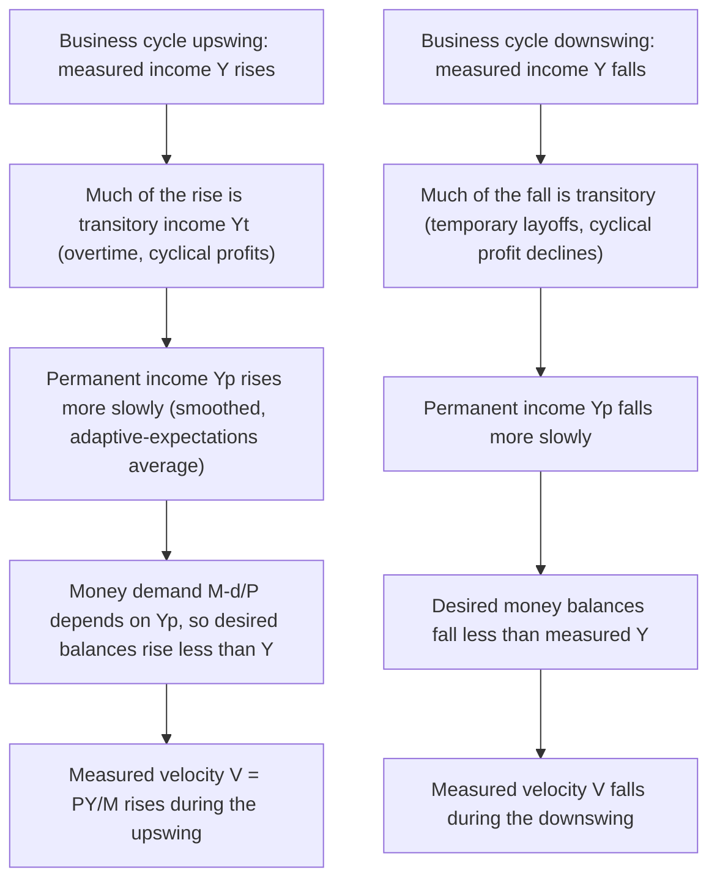

## Permanent Income Hypothesis and Money Demand

### Overview and Purpose

The Permanent Income Hypothesis (PIH), developed by Milton Friedman in *A Theory of the Consumption Function* (1957), is a theory of household consumption behavior that Friedman subsequently used as the microfoundation for the money demand function in his 1956 "Restatement" of the quantity theory. The two works are intellectually inseparable in the Monetarist research program: the PIH explains why money demand is a stable function of *permanent* rather than *current* income, which is the load-bearing empirical claim underlying Monetarism's assertion that velocity is predictable and that changes in the money supply reliably drive changes in nominal income.

### The Permanent Income Hypothesis: Core Theory

Friedman's PIH decomposes measured (current) income $Y$ and measured consumption $C$ into permanent and transitory components:

$$Y = Y_p + Y_t$$

$$C = C_p + C_t$$

Where:

- $Y_p$ (**permanent income**) is the income a household expects to earn on average over a long planning horizon — conceptually, the annuity value of the household's total wealth (human and non-human), or equivalently the sustainable, riskless flow of income implied by the household's expected lifetime resources.
- $Y_t$ (**transitory income**) is the deviation of current measured income from $Y_p$ due to temporary, unanticipated factors (a bonus, an overtime shift, a bumper harvest, a temporary layoff) — assumed to average to zero over time and to be uncorrelated with $Y_p$.
- $C_p$ (**permanent consumption**) is proportional to permanent income: $C_p = k(r, w, u) \cdot Y_p$, where $k$ depends on the interest rate $r$, the ratio of human-to-nonhuman wealth $w$, and tastes $u$.
- $C_t$ (**transitory consumption**) is assumed uncorrelated with both $Y_p$ and $Y_t$, essentially random measurement/timing noise in consumption.

The central behavioral claim: households smooth consumption relative to *permanent* income, not current income, because rational, forward-looking agents do not want consumption to fluctuate with income changes they know to be temporary. A one-time bonus (transitory income) is largely saved, not consumed; a durable change in career/wages (permanent income) is largely consumed. This directly explained empirical puzzles of the era — notably why the cross-sectional marginal propensity to consume out of current income appeared much lower than the long-run, time-series average propensity to consume — by showing both were consistent with a stable, high marginal propensity to consume out of *permanent* income once transitory components were properly separated out.

### Estimating Permanent Income: The Adaptive Expectations Formulation

Since $Y_p$ is not directly observable, Friedman operationalized it using an adaptive/distributed-lag formulation, treating permanent income as a weighted average of past (and implicitly expected future) income realizations, with geometrically declining weights on more distant past income:

$$Y_{p,t} = \lambda \sum_{i=0}^{\infty} (1-\lambda)^i Y_{t-i}$$

or in its common recursive form:

$$Y_{p,t} = \lambda Y_t + (1-\lambda) Y_{p,t-1}$$

where $0 < \lambda < 1$ is an adjustment parameter reflecting how quickly perceived permanent income responds to new income observations. This is structurally identical to an adaptive-expectations updating rule (the same mathematical device later used for expected inflation in the natural rate hypothesis), reflecting Friedman's broader methodological preference for parsimonious, backward-looking proxies for unobservable expectational variables that nonetheless perform well empirically.

### Transplanting the PIH into Money Demand Theory

In the 1956 Restatement, Friedman explicitly modeled the demand for real money balances using the same conceptual apparatus as the PIH's treatment of consumption: money is a **durable asset** yielding a flow of liquidity services, and the appropriate scale variable for the demand for any durable asset is the wealth-holder's long-run resource position — permanent income (or, more generally, total wealth) — not volatile current income.

$$\frac{M^d}{P} = f(Y_p,\ w,\ r_b,\ r_e,\ \pi^e,\ u)$$

The role of $Y_p$ here mirrors its role in the PIH precisely:

- If money demand depended on **current** income $Y$ (as in simple Keynesian transactions-demand formulations, or the crude quantity theory), it would be volatile and difficult to forecast, since current income fluctuates with the business cycle and includes large transitory components (overtime, layoffs, bonuses, cyclical profit swings).
- Because money demand depends on **permanent** income instead, and permanent income is, by construction, a smoothed, slow-moving weighted average of past income realizations, money demand — and hence **velocity** ($V = Y/(M^d/P)$, evaluated at actual measured $Y$) — becomes systematically more stable and more predictable than a naive current-income-based theory would suggest, but also exhibits a specific, testable cyclical pattern distinct from what current-income theories predict.

### The Key Empirical Implication: Velocity Behaves Counter-Cyclically Relative to Measured Income

This linkage generates one of Friedman's most distinctive and testable predictions, differentiating the PIH-based money demand theory from both the crude quantity theory and Keynesian liquidity preference:

- During a cyclical **upswing**, measured (current) income $Y$ rises faster than permanent income $Y_p$ (since much of the rise is transitory — overtime pay, cyclical profits). Since money demand depends on $Y_p$, which rises more sluggishly, desired real money balances rise less than proportionally to measured income. Given a roughly fixed money stock in the short run, this manifests as **measured velocity ($V = PY/M$) rising during booms** — because $Y$ (the numerator, measured income) is outrunning the demand for money based on the more slowly adjusting $Y_p$.
- During a cyclical **downswing**, the reverse: measured income $Y$ falls faster than $Y_p$ (again because much of the decline is transitory), so desired money balances (tied to the more stable $Y_p$) fall by less than measured income, and **measured velocity falls during recessions**.
- This produces the empirically observed **pro-cyclical pattern of velocity** — a systematic pattern Friedman and Schwartz documented extensively in *A Monetary History* and *Monetary Statistics of the United States* — which a theory based on current income alone would not straightforwardly predict, and which Friedman used as corroborating evidence for the permanent-income specification of money demand specifically (not merely for "some" stable money demand function).

### Why This Matters for the Broader Monetarist Framework

1. **Stability of the money demand function, correctly specified**: the apparent instability of velocity when measured against *current* income (which fueled Keynesian skepticism about the quantity theory in the interwar and immediate postwar period) is, in Friedman's account, an artifact of using the wrong scale variable. Once money demand is properly specified against permanent income, the underlying function is empirically stable — reviving the quantity theory as a workable, estimable behavioral relationship rather than the discredited mechanical doctrine Keynes had criticized.
2. **Reinforces the "long and variable lags" doctrine**: because money demand adjusts to slow-moving permanent income rather than jumping with current income, the economy's adjustment to a monetary disturbance is itself gradual and drawn out — consistent with, and partially explanatory of, Friedman's broader claim that monetary policy affects nominal income only after a long and variable lag.
3. **Distinguishes Monetarism from the crude quantity theory it superseded**: this is the crucial technical mechanism by which Friedman could claim continuity with the classical quantity theory tradition while explicitly rejecting the naive assumption of a *constant* velocity — replacing it with velocity that is *variable but predictable*, moving systematically (and specifically pro-cyclically relative to measured income) rather than randomly.
4. **Parallel structure to the natural rate hypothesis**: both the PIH-based money demand theory and the natural rate/expectations-augmented Phillips Curve share Friedman's characteristic theoretical architecture — distinguishing a durable, structurally-determined "permanent"/"natural" magnitude from a volatile, transitory/"unanticipated" deviation, and attributing short-run economic dynamics to the gap between the two, with adaptive-expectations-style updating as the common mathematical mechanism linking them.

### Formal Comparison: Three Money Demand Specifications

| Theory | Scale variable | Predicted stability of $V$ | Cyclical pattern of $V$ |
| --- | --- | --- | --- |
| Crude/mechanical quantity theory | None (V assumed institutionally fixed) | Constant | None (flat) |
| Keynesian liquidity preference | Current income $Y$, current interest rate $r$ | Unstable (speculative motive volatile) | No clear systematic prediction; can be highly erratic, especially near liquidity trap |
| Friedman's PIH-based restatement | Permanent income $Y_p$, wealth composition, relative returns | Stable, predictable function | Pro-cyclical: $V$ rises in booms, falls in recessions |

### Key Points

- The Permanent Income Hypothesis (Friedman 1957) decomposes income and consumption into permanent and transitory components, with consumption smoothed relative to the (unobservable, adaptively-estimated) permanent component.
- Friedman's 1956 money demand restatement borrows this exact logic: money, as a durable asset, is demanded relative to permanent income $Y_p$, not volatile current income.
- Because $Y_p$ is a smoothed, adaptively-updated weighted average of past income, it rises and falls more sluggishly than measured current income over the business cycle.
- This generates the testable and empirically observed prediction that measured velocity is **pro-cyclical**: rising in booms (when current income outruns permanent income) and falling in recessions (when current income falls faster than permanent income).
- This mechanism is the technical foundation for Monetarism's claim that money demand is a *stable* function despite velocity appearing volatile when measured naively against current income — rehabilitating the quantity theory as an estimable, non-mechanical behavioral relationship.
- The same adaptive-expectations/permanent-transitory architecture reappears in Friedman's natural rate of unemployment hypothesis, reflecting a consistent methodological approach across his consumption, money demand, and labor-market theories.

### Related Topics

- Friedman's modern quantity theory framework (the money demand function this hypothesis underpins)
- Friedman-Schwartz *A Monetary History of the United States* and empirical velocity patterns
- Adaptive expectations as a modeling device (shared with the natural rate hypothesis)
- Life-Cycle Hypothesis (Modigliani-Brumberg, a contemporaneous rival/complementary consumption theory)
- Random Walk Hypothesis of consumption (Hall 1978, the rational-expectations reformulation of PIH)
- Velocity of money and its empirical measurement
- Long and variable lags in monetary policy transmission
- Rules versus discretion debate in monetary policy design
- Human capital theory and wealth composition in asset demand