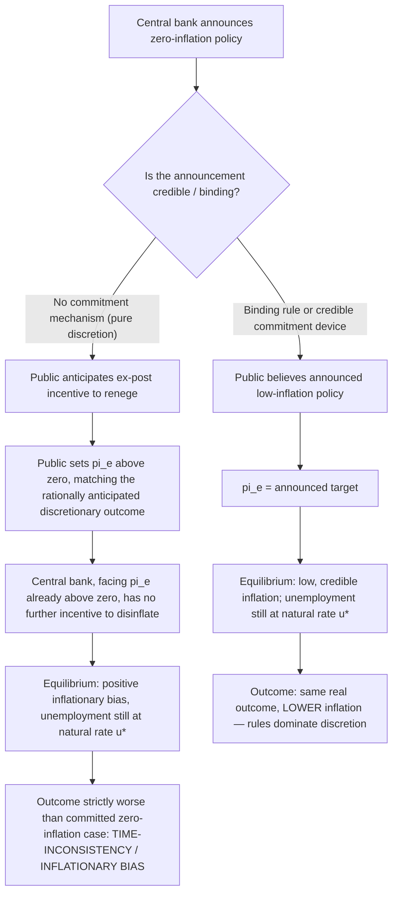

## Rules Versus Discretion in Monetary Policy

### Definition of the Debate

The rules-versus-discretion debate concerns whether a central bank should conduct monetary policy by committing in advance to a pre-announced, mechanical policy rule (a fixed formula relating policy instruments to observable variables), or whether it should retain full discretion to adjust policy period-by-period based on the judgment of policymakers responding to evolving economic conditions. The debate spans Monetarism, New Classical macroeconomics, and modern central-bank design, and is one of the most consequential applied controversies to emerge from the broader dispute over monetary neutrality, expectations, and the credibility of policy commitments.

### The Case for Discretion (Pre-Monetarist / Keynesian Fine-Tuning View)

The dominant postwar view, associated with the Neoclassical Synthesis and Keynesian demand management, held that skilled policymakers, equipped with econometric models and real-time data, could actively adjust monetary (and fiscal) policy to offset cyclical fluctuations — "fine-tuning" aggregate demand to keep output near potential and unemployment near a low, stable level. This view presumes:

- Policymakers can accurately diagnose the current and near-future state of the economy.
- The structural relationships in the economy (e.g., the Phillips Curve, the IS and LM relationships) are sufficiently stable and well-understood to be used for active stabilization.
- Policy actions transmit to the economy quickly enough, and with sufficiently known lags, that discretionary countercyclical timing is feasible.

### Friedman's Case Against Discretion: Long and Variable Lags

Milton Friedman's core objection, developed across his Monetarist writings and forcefully in *A Monetary History of the United States* and his 1968 AEA address, is not that policymakers are ill-intentioned but that discretionary fine-tuning is **technically infeasible** given the actual structure of the economy's response to policy:

- The lag between a monetary policy action and its effect on nominal income is **long** (empirically, many months to well over a year in Friedman's estimation).
- This lag is also **variable** — its length is not itself predictable or stable across episodes, differing with prevailing financial conditions, expectations, and other contextual factors.
- Combined, these two properties mean a policymaker calibrating today's policy to today's diagnosed economic conditions risks having that policy's effects materialize only after the underlying conditions have already changed — potentially reinforcing the wrong phase of the cycle (expanding into an already-recovering economy, or tightening into an already-slowing one), thereby *amplifying* rather than dampening fluctuations.
- Friedman buttressed this argument empirically by attributing several historical instances of monetary-policy-induced instability (including, in his interpretation, aspects of the Great Depression's severity) to discretionary policy errors rather than to inherent market instability.

### Friedman's Proposed Rule: The k-Percent Rule

Friedman's practical policy proposal was a **fixed monetary growth rule**: the central bank commits, publicly and unconditionally, to expanding the money supply (in Friedman's formulation, typically a monetary aggregate such as M1 or M2) at a constant annual percentage rate $k$, chosen to approximate the long-run trend growth rate of real output (so as to deliver roughly stable prices in the long run, given a roughly stable long-run velocity trend).

$$\frac{\Delta M}{M} = k \quad \text{(constant, announced in advance, held regardless of current cyclical conditions)}$$

Rationale:

- Eliminates the risk of destabilizing discretionary timing errors, since the rule does not attempt to respond to (imperfectly forecast, lagging) current conditions at all.
- Provides a stable, predictable nominal anchor around which private agents can form expectations, reducing policy-induced uncertainty.
- Removes the temptation toward political manipulation of monetary policy for short-term electoral gain (the **political business cycle** problem, later formalized by Nordhaus 1975).

### The Time-Inconsistency Problem: Kydland and Prescott (1977)

The theoretical case against discretion was substantially deepened by Finn Kydland and Edward Prescott's 1977 paper "Rules Rather Than Discretion: The Inconsistency of Optimal Plans" (*Journal of Political Economy*), which shifted the argument from Friedman's *lags-and-forecasting* critique to a *game-theoretic credibility* critique — a distinct and, in modern monetary economics, now more influential line of reasoning.

The core logic:

1. Suppose a central bank announces it will pursue zero inflation, and the public, believing this announcement, sets $\pi^e = 0$.
2. Given $\pi^e = 0$, the central bank now faces a short-run incentive to renege: by generating a surprise inflation ($\pi > \pi^e = 0$), it can, via the expectations-augmented Phillips Curve mechanism, temporarily push unemployment below the natural rate, which is attractive if the policymaker's objective function values lower unemployment (or higher output) in addition to low inflation.
3. A **rational, forward-looking public**, however, anticipates this incentive to renege and does not believe the zero-inflation announcement in the first place; the public instead expects the inflation rate the policymaker will find optimal to deliver *given* the public's expectations — the rational-expectations equilibrium.
4. The result is a self-consistent, but suboptimal, outcome: inflation ends up systematically positive (an **inflationary bias**), *without any corresponding gain in average output or employment*, since in equilibrium the public correctly anticipates the inflation and unemployment remains at the natural rate regardless. The economy ends up strictly worse off than under the (unattainable, absent commitment) zero-inflation outcome — this is the **time-inconsistency** of the discretionary optimal plan: the policy that is optimal to *announce* ex ante (zero inflation) is not the policy that is optimal to *implement* ex post once expectations are fixed, and rational agents see through this.

This result — formalized by Barro and Gordon (1983) in a tractable reduced-form model — became the canonical theoretical justification for **rules or rule-like commitment devices** in monetary policy, distinct from, though complementary to, Friedman's older lags-based argument: even with perfect information and instantaneous policy transmission (assumptions that address Friedman's lags critique), discretion still produces an inefficient inflationary bias purely from the strategic interaction between policymaker incentives and rational private expectations.

### Barro-Gordon Model: Formal Loss-Function Framework

The Barro-Gordon framework specifies a policymaker loss function penalizing both inflation and deviations of unemployment from a *target* $u^T$ below the natural rate $u^*$ (capturing a political preference for higher-than-natural employment, e.g., due to labor-market distortions like taxes or union power that make $u^*$ itself inefficiently high from the policymaker's perspective):

$$L = \frac{1}{2}\pi^2 + \frac{b}{2}(u - u^T)^2, \quad u^T < u^*$$

Minimizing this loss subject to the expectations-augmented Phillips Curve $u = u^* - \phi(\pi - \pi^e)$ yields, under discretion, an equilibrium inflation rate:

$$\pi_{discretion} = \phi b (u^* - u^T) > 0$$

while under a credible, binding zero-inflation rule, $\pi_{rule} = 0$, with **unemployment identical in both cases** ($u = u^*$ in equilibrium either way, since the public's rational expectations neutralize any systematic attempt to exploit the Phillips Curve). This delivers the sharp normative conclusion: a credible rule achieves the same real outcome as discretion but with strictly lower and more stable inflation — discretion is dominated.

### Responses to the Inflationary-Bias Problem: Alternatives to Rigid Rules

Because a literal, rigid k-percent (or zero-inflation) rule can be excessively costly when it prevents *any* short-run stabilization response to genuine real shocks (e.g., a supply shock or financial crisis where some discretionary flexibility is valuable), subsequent literature developed intermediate solutions retaining most of the credibility benefit of rules while preserving some flexibility:

- **Conservative central banker (Rogoff 1985)**: delegate monetary policy to an independent central banker known to place a higher weight on inflation aversion than society's true preferences (a higher effective $b$ or lower implicit weight on the output-gap term), reducing the equilibrium inflationary bias without requiring a literal rule, at some cost in the central bank's flexibility to stabilize against large real shocks — the "conservatism" trade-off.
- **Central bank independence**: institutional insulation of monetary policymakers from short-run political pressure (the political business cycle problem), empirically associated with lower average inflation across countries (Alesina and Summers 1993; Cukierman et al.).
- **Inflation targeting**: an explicit, numerically specified inflation target (often with an accountability/reporting framework), functioning as a public commitment device that anchors expectations while still permitting some discretionary judgment in how the target is achieved and over what horizon — the dominant modern compromise adopted by many central banks from the 1990s onward.
- **Taylor rules (Taylor 1993)**: rather than fixing a money growth rate, specify the policy interest rate as a systematic, publicly known function of the inflation gap and the output gap:

$$i_t = r^* + \pi_t + \alpha(\pi_t - \pi^*) + \beta(Y_t - Y_t^*)$$

Taylor rules represent "**rule-like discretion**" or "**constrained discretion**" — a middle path explicitly designed to retain systematic, predictable, rule-based responsiveness to economic conditions (addressing the time-inconsistency/credibility problem) while still allowing the policy instrument to respond to the current state of the economy (addressing the rigidity critique of Friedman's literal money-growth rule), and is the framework most commonly used to describe actual central bank behavior in modern macroeconomics. [Inference — describes a widely used descriptive/prescriptive framework, not a claim that any specific central bank mechanically follows this formula]

### Comparison Table: Major Positions in the Debate

| Position | Advocate(s) | Mechanism of concern | Proposed solution |
| --- | --- | --- | --- |
| Discretionary fine-tuning | Keynesian/Neoclassical Synthesis economists (1950s-60s) | None (assumes discretion works well) | Active countercyclical demand management |
| Rejection of discretion (lags-based) | Friedman | Long and variable policy transmission lags | Fixed k-percent money growth rule |
| Rejection of discretion (credibility-based) | Kydland-Prescott, Barro-Gordon | Time-inconsistency, inflationary bias from strategic interaction with rational expectations | Binding rule or credible commitment device |
| Constrained/rule-like discretion | Rogoff (conservative central banker), Taylor (interest-rate rule), modern inflation targeters | Both lags and credibility, but rigid rules too costly against real shocks | Delegation, independence, transparent systematic rules with some flexibility |

### Key Points

- The debate originates in Friedman's Monetarist critique of discretionary fine-tuning, grounded in the empirical claim of long and variable policy transmission lags, leading to his proposed fixed k-percent money growth rule.
- Kydland and Prescott (1977) reframed the case against discretion using time-inconsistency: even with perfect information, a discretionary policymaker's ex-post incentive to generate surprise inflation is rationally anticipated by the public, producing an inflationary bias with no offsetting gain in real output or employment.
- The Barro-Gordon model formalizes this result, showing discretion is strictly dominated by a credible rule in terms of average inflation, with identical equilibrium unemployment either way.
- Because rigid rules sacrifice useful short-run flexibility against real shocks, the modern consensus favors "constrained discretion" — central bank independence, explicit inflation targets, and systematic policy rules (e.g., Taylor rules) — as a practical compromise combining most of the credibility benefits of rules with retained responsiveness to economic conditions.
- The debate is a direct applied extension of the natural rate hypothesis and rational expectations: it is precisely because a systematic attempt to exploit the Phillips Curve is neutralized by rational expectations that discretion offers no durable real benefit, leaving only its inflationary cost as the salient consequence.

### Related Topics

- Friedman's modern quantity theory framework and the k-percent rule
- The natural rate of unemployment hypothesis (the expectations-augmented Phillips Curve underlying time-inconsistency)
- Rational expectations and the Lucas Critique
- Kydland-Prescott time-inconsistency and the Barro-Gordon model
- Central bank independence and its empirical relationship to inflation outcomes
- Inflation targeting frameworks (flexible vs. strict)
- Taylor rule and interest-rate-based monetary policy design
- Political business cycle theory (Nordhaus)
- Conservative central banker model (Rogoff)
- Credibility and reputation in dynamic policy games