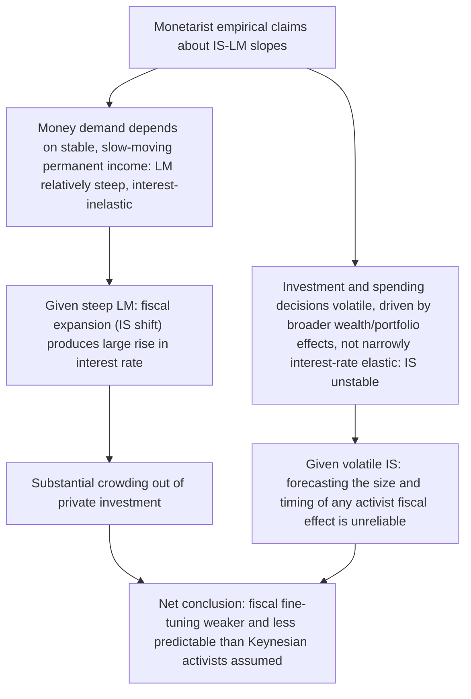

## Monetarist Critique of Keynesian Activism

### Framing the Debate

Keynesian activism refers to the postwar policy consensus, built on the IS-LM/Neoclassical Synthesis apparatus, that fiscal and monetary policy should be actively and continuously adjusted by government to stabilize aggregate demand, close output gaps, and maintain low unemployment — the "fine-tuning" philosophy dominant in the US and UK from roughly the 1940s through the late 1960s. The Monetarist critique, developed principally by Milton Friedman and Anna Schwartz from the 1950s onward and reaching peak influence in the 1970s and early 1980s, challenges this activist program on empirical, theoretical, and institutional grounds simultaneously. It is best understood not as a single argument but as a cluster of related critiques, several of which reinforce one another.

### 1. Empirical Critique: Money, Not Fiscal Policy, Drives Nominal Income

Friedman and Schwartz's *A Monetary History of the United States, 1867-1960* (1963) is the central empirical document of the Monetarist challenge. Its core claims:

- Historically, changes in the money stock **precede** changes in nominal income and output, and this timing relationship is robust across many episodes, not confined to a single period.
- The Great Depression is reinterpreted as caused primarily by a *monetary contraction* — the Federal Reserve's passivity during the banking panics of 1930-33 allowed the money stock to fall by roughly a third — rather than by a collapse in autonomous investment/animal spirits, as emphasized in the standard Keynesian account.
- This directly attacks the Keynesian activist premise that fiscal policy is the primary, or even a necessary, lever for demand management: if money is the dominant driver of nominal income historically, fiscal multipliers used in Keynesian policy models are, at minimum, overstated, and monetary policy (even if conducted via a fixed rule rather than fiscal-style activism) is the more powerful and more historically validated instrument.

### 2. The Instability of Fiscal Multipliers: Crowding Out

Within the shared IS-LM apparatus, Monetarists argued that Keynesian activists systematically understated the degree of **crowding out** — the extent to which government spending increases raise interest rates and displace private investment, weakening the net effect of fiscal expansion on output. In the IS-LM framework:

$$Y = C(Y-T) + I(r) + G$$

$$\frac{M}{P} = L(Y,r)$$

An increase in $G$ shifts IS right; if the LM curve is relatively steep (money demand not very interest-elastic — the Monetarist empirical claim, following the PIH-based, wealth/permanent-income-driven money demand function), the resulting rise in $r$ is large, and the crowding-out of private investment is correspondingly large, blunting the fiscal multiplier. Monetarists argued the empirical evidence supported a steep LM curve (low interest-elasticity of money demand once properly measured against permanent income) and a flat, unstable IS curve (investment demand more volatile and less closely tied to current interest rates than the Keynesian framework implied), the opposite combination from what maximizes fiscal-policy effectiveness — directly undermining the empirical basis for activist fiscal fine-tuning.

### 3. Long and Variable Lags: The Core Stabilization-Policy Critique

Friedman's most enduring objection is procedural rather than purely parametric: even granting that *some* multiplier effect exists for both fiscal and monetary policy, activist demand management requires policymakers to correctly diagnose current conditions, correctly forecast the economy's trajectory in the absence of intervention, choose the correct-sized intervention, and have that intervention take effect at the correct time — a sequence of requirements Friedman argued was empirically unmet because:

- **Recognition lag**: economic data arrives with delay and is subject to substantial revision, so policymakers often misjudge the economy's *current* state.
- **Decision/implementation lag**: particularly severe for fiscal policy, which requires legislative action — often many months from diagnosis to enacted policy change.
- **Transmission lag**: the effect of a policy action on nominal income, once implemented, operates with a long lag (Friedman's estimates ranged widely, often cited as 6 to 18+ months for monetary policy) that is *itself variable* across episodes and difficult to forecast in advance.

The compounded effect of these lags is that activist stabilization policy, even when well-intentioned and technically competent, risks being **procyclically destabilizing** — arriving after the relevant phase of the cycle has already passed, and thereby reinforcing rather than offsetting fluctuations. This is Friedman's central case for policy rules (the k-percent money growth rule) over discretionary activism, independent of any dispute over the *size* of multipliers.

### 4. Critique of the Phillips Curve as a Stable, Exploitable Menu

A major pillar of 1960s Keynesian activism was the belief in a stable, exploitable trade-off between inflation and unemployment (the original Phillips Curve), which policymakers could use to select a preferred combination via demand management. Friedman's 1968 natural rate of unemployment hypothesis directly attacked this foundation of activist policy:

- The Phillips Curve trade-off is not structural but exists only during periods when actual inflation diverges from *expected* inflation (a short-run, expectational phenomenon).
- Persistent activist attempts to hold unemployment below the natural rate via demand expansion produce **accelerating inflation**, not a stable high-inflation/low-unemployment equilibrium — a prediction widely regarded as vindicated by the **stagflation** of the 1970s, when high inflation and high unemployment occurred simultaneously, a combination the naive Phillips Curve framework used by activist policymakers could not accommodate.
- This critique is doubly damaging to Keynesian activism: it removes a key *policy target* (a favorable inflation-unemployment trade-off point) that activist fine-tuning had been designed to select, and it explains a real-world empirical anomaly (stagflation) that the activist framework had failed to anticipate or explain.

### 5. Critique of Fiscal Activism's Institutional and Political Realism

Beyond the technical lags argument, Monetarists (and later Public Choice economists building on similar premises, e.g., Buchanan and Wagner) argued that activist fiscal policy is politically asymmetric in practice: expansionary fiscal actions (tax cuts, spending increases) are politically popular and easy to enact, while the contractionary actions theoretically required during booms (tax increases, spending cuts) are politically unpopular and routinely delayed or avoided. This asymmetry, if real, produces a **structural deficit bias** over the cycle rather than the symmetric, self-correcting stabilization envisioned by activist theory — a critique of the *political economy* of activism distinct from, but complementary to, the purely technical lags argument.

### 6. Theoretical Reinforcement: Time-Inconsistency and Rational Expectations

Later theoretical work, associated with the New Classical school (Lucas, Sargent, Wallace, Kydland, Prescott) but building directly on Monetarist premises, deepened the case against activism:

- **Lucas Critique (1976)**: the parameters of the large-scale econometric models used to design activist Keynesian policy (including estimated IS-LM/Phillips Curve relationships) are not structural, policy-invariant constants but are themselves functions of the prevailing policy regime, because rational agents' behavior depends on expected future policy. Using historically estimated relationships to design new, different policy interventions is therefore methodologically unreliable — the very models activists relied on could not validly predict the effects of the regime change their own use implied.
- **Policy Ineffectiveness Proposition (Sargent-Wallace, 1975)**: under rational expectations, only *unanticipated* monetary policy actions have real effects, and any systematic, rule-like activist policy (once its rule becomes known/anticipated) is neutralized by rational private-sector adjustment — a more radical claim than Friedman's own (which allowed short-run non-neutrality via adaptive-expectations lags), but sharing the same conclusion that *systematic* activism cannot reliably deliver real gains.
- **Time-inconsistency (Kydland-Prescott, 1977)**: even setting aside forecasting/lag problems entirely, discretionary activist policy is shown to generate a persistent inflationary bias relative to a credible rule, with no compensating gain in average output or employment — reframing the entire debate from a forecasting-competence question to a strategic-credibility question.

### Summary Comparison: Keynesian Activism vs. Monetarist Critique

| Dimension | Keynesian activist position | Monetarist critique |
| --- | --- | --- |
| Primary policy lever | Fiscal policy (with monetary policy in a supporting/accommodative role) | Monetary policy (via a fixed rule, not activist fine-tuning) |
| View of IS-LM slopes | Interest-elastic money demand (flat LM), interest-elastic investment (flat IS) → strong fiscal multipliers | Interest-inelastic money demand (steep LM, permanent-income-based), volatile investment (unstable IS) → weak, unreliable fiscal multipliers, substantial crowding out |
| View of policy lags | Manageable; policymakers can diagnose and time interventions effectively | Long and variable; activist timing is unreliable and can be destabilizing |
| Phillips Curve | Stable, exploitable long-run trade-off available for policy selection | Only a temporary, expectations-driven relationship; no long-run trade-off; persistent exploitation causes accelerating inflation |
| Preferred policy regime | Continuous discretionary adjustment ("fine-tuning") | Fixed rule (k-percent money growth) or, in later extensions, credible rule-like commitment (inflation targeting, Taylor rules) |
| Historical touchstone | Great Depression as failure of private investment/aggregate demand | Great Depression as failure of monetary policy (Fed passivity during banking panics) |

### Historical and Institutional Impact

The Monetarist critique achieved substantial real-world influence during the **stagflation crisis of the 1970s**, which was widely interpreted as an empirical failure of the activist Keynesian consensus (unable to explain simultaneous high inflation and high unemployment) and a corroboration of Monetarist predictions (natural rate hypothesis, accelerationist dynamics). This contributed to major shifts in central bank practice, most notably the **Volcker disinflation** at the US Federal Reserve beginning in 1979, which explicitly adopted monetary-aggregate targeting influenced by Monetarist doctrine to break entrenched inflationary expectations, at the cost of a sharp recession and elevated unemployment consistent with the theory's own predicted transitional costs of disinflation. [Inference — widely-cited historical interpretation in monetary economics, not a claim of unanimous consensus on causal weighting]

### Later Qualifications and the Emergence of a New Synthesis

The Monetarist critique did not go unanswered, and the subsequent evolution of macroeconomics (New Keynesian economics from the 1980s-90s onward) absorbed several Monetarist and New Classical insights (rational expectations, the natural rate hypothesis, skepticism of raw discretionary fine-tuning) while retaining a role for activist *countercyclical* stabilization, conducted primarily through **systematic, rule-like monetary policy** (interest-rate rules such as the Taylor rule) rather than either pure Friedman-style fixed money growth rules or unconstrained 1960s-style fiscal fine-tuning — the "constrained discretion" or "rules-based discretion" compromise that dominates contemporary central banking. Fiscal policy, in this modern synthesis, is generally viewed as most useful for exceptional circumstances (e.g., when interest rates are constrained near the zero lower bound) rather than as the primary, continuously-active stabilization tool the original Keynesian activist program envisioned.

### Key Points

- The Monetarist critique of Keynesian activism combines empirical evidence (Friedman-Schwartz's monetary interpretation of the Great Depression and business cycles generally), IS-LM parameter disputes (steep LM, volatile IS → weak fiscal multipliers and substantial crowding out), a procedural critique (long and variable policy lags making discretionary fine-tuning unreliable or destabilizing), and a labor-market critique (rejection of a stable, exploitable Phillips Curve via the natural rate hypothesis).
- The critique's practical policy alternative was a fixed money growth rule, later supplemented by theoretical reinforcements from the New Classical school (Lucas Critique, Policy Ineffectiveness Proposition, time-inconsistency) that attacked activism on credibility and expectations-formation grounds independent of forecasting competence.
- Stagflation in the 1970s is widely treated as the empirical episode that most damaged the Keynesian activist consensus and vindicated core Monetarist predictions, contributing to major shifts in central bank practice (Volcker disinflation).
- The debate's long-run resolution in mainstream macroeconomics is a hybrid: systematic, rule-like monetary policy (not rigid rules, but not unconstrained discretion either) as the primary stabilization tool, with activist fiscal policy retained mainly for exceptional circumstances rather than as routine fine-tuning.

### Related Topics

- Friedman's modern quantity theory framework
- The natural rate of unemployment hypothesis
- Rules versus discretion in monetary policy
- Friedman-Schwartz's monetary interpretation of the Great Depression
- Crowding-out effect and the IS-LM model
- Lucas Critique and rational expectations
- Kydland-Prescott time-inconsistency and the Barro-Gordon model
- Stagflation of the 1970s
- Volcker disinflation and monetary targeting
- New Keynesian synthesis and Taylor-rule-based central banking