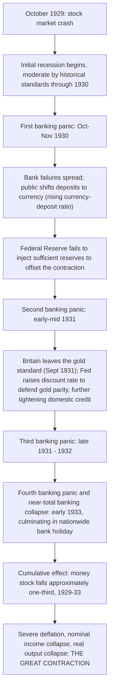

## The Great Depression as a Monetary Phenomenon

### Thesis and Origin

The claim that the Great Depression was fundamentally a **monetary phenomenon** is the central historical argument of Milton Friedman and Anna Schwartz's *A Monetary History of the United States, 1867-1960* (1963), particularly its extensively cited Chapter 7, "The Great Contraction, 1929-33" (later republished as a standalone volume). The thesis holds that the severity and duration of the 1929-33 US economic collapse was not an inevitable consequence of the 1929 stock market crash or of some inherent instability of unregulated capitalism, but was **caused, and substantially could have been prevented**, by the Federal Reserve's policy failures — specifically, its passivity in the face of a collapsing money stock. This directly challenges the standard Keynesian account, which emphasizes a collapse in autonomous investment/aggregate demand ("animal spirits") and treats monetary factors as largely passive or secondary.

### The Empirical Core: The Collapse of the Money Stock

Friedman and Schwartz document that the US money stock (M2, broadly currency plus commercial bank deposits) fell by approximately **one-third** between August 1929 and March 1933 — one of the largest monetary contractions in US history, occurring during peacetime and absent any deliberate contractionary policy intent by the monetary authorities.

$$\frac{\Delta M}{M} \approx -33\% \quad (1929\text{-}33)$$

Given the quantity-theory relationship $MV = PY$, a contraction of this magnitude, especially if velocity did not rise to offset it (and Friedman and Schwartz argue it in fact also fell, compounding the effect, as would be predicted by their permanent-income-based money demand theory during a severe downturn), implies a correspondingly severe contraction in nominal income $PY$ — consistent with the observed roughly 50% decline in nominal GNP and steep deflation (the price level fell by about 25%) over the same period.

### The Causal Mechanism: Banking Panics and Fed Passivity

The Monetary History's causal argument proceeds through a sequence of banking crises, each amplified by the Federal Reserve's failure to act as an effective lender of last resort:

At each panic stage, Friedman and Schwartz argue the Federal Reserve possessed the *technical capacity* to counteract the contraction — through open market purchases, discount window lending, or other reserve-injecting operations — but failed to deploy this capacity adequately, due to a combination of doctrinal confusion (adherence to the "real bills doctrine," which held that credit expansion was appropriate only to finance "legitimate" commercial transactions, not to offset panics), institutional leadership vacuum (the death of Benjamin Strong, President of the Federal Reserve Bank of New York, in 1928, removed the System's most forceful and monetarily sophisticated leader at a critical juncture), and a general misreading of low nominal interest rates as evidence that monetary policy was already "easy" (the **interest rate fallacy** — nominal rates were low, but this reflected collapsing demand for credit and deflationary expectations, not an accommodative monetary stance; *real* interest rates were, in fact, high and rising due to deflation).

### Interaction with Debt-Deflation

Friedman and Schwartz's monetary narrative is complementary to, though analytically distinct from, Irving Fisher's **debt-deflation theory** (1933), which explains how the price-level collapse driven by monetary contraction interacted with pre-existing private debt to deepen the real economic collapse:

1. Falling $M$ drives falling $P$ (deflation).
2. Debts are fixed in nominal terms; deflation raises the *real* burden of existing debt.
3. Debtors (farmers, businesses, households) respond with distress selling of assets and inventory to service debt, further depressing prices.
4. Rising real debt burdens trigger bankruptcies and further bank failures, feeding back into further monetary contraction (bank failures directly destroy deposit money) — closing a self-reinforcing contractionary loop.

This provides a real-economy transmission channel — separate from the standard interest-rate/investment channel — through which a monetary contraction produces a real output collapse of a magnitude disproportionate to what a simple, mechanical, IS-LM-type interest-rate channel alone would predict.

### The Counterfactual: Could the Fed Have Prevented the Depression's Severity?

The strongest form of the Monetary History's thesis is a **counterfactual claim**: had the Federal Reserve acted as a competent lender of last resort — as it (and its 19th-century central-bank predecessors/analogues, per Bagehot's classical dictum to "lend freely, at a penalty rate, against good collateral") had a documented capacity to do — the banking panics could have been contained, the money stock stabilized, and the depth and duration of the output collapse substantially reduced, even if some recession following the 1929 crash would still have occurred. Friedman and Schwartz explicitly do *not* claim the Fed caused the initial 1929 downturn (they treat the initial recession, through 1930, as comparable in severity to prior, more typical US recessions); their claim is that Fed *inaction* during 1930-33 is what transformed an ordinary recession into the Great Depression.

### Contrast with the Keynesian Account

| Dimension | Keynesian account (traditional) | Friedman-Schwartz monetary account |
| --- | --- | --- |
| Primary cause of severity | Collapse in autonomous investment and aggregate demand ("animal spirits"); inherent instability of a laissez-faire investment-driven economy | Federal Reserve policy failure; passive/inadequate response to banking panics allowing the money stock to collapse |
| Role of monetary policy | Largely impotent at the time (liquidity trap conditions; low nominal rates already "easy," little further monetary policy could achieve) | Central and causally decisive; low nominal rates were misleading (interest rate fallacy), real monetary contraction was severe and preventable |
| Implied lesson for policy | Fiscal policy (deficit spending) is the necessary tool during a depression, since monetary policy is trapped | Adequate monetary policy (lender-of-last-resort action, reserve injection) could have prevented or sharply moderated the collapse; underscores the case against discretionary passivity/error and for rule-based/countercyclical monetary competence |
| View of money's role in causing/curing depressions | Largely passive; money is not the central causal actor | Money is causally central; "the Great Depression is tragic testimony to the importance of monetary forces" (Friedman-Schwartz's own framing) |

### Reception, Refinements, and Later Consensus

The monetary interpretation was initially controversial against the dominant Keynesian historiography of the Depression but became increasingly influential in subsequent decades, incorporated and extended by later scholars:

- **Peter Temin** (*Did Monetary Forces Cause the Great Depression?*, 1976) offered an early skeptical challenge, arguing the initial 1929-30 downturn is better explained by an autonomous consumption/spending decline than by monetary contraction (though later scholarship, including Temin's own subsequent work, moved toward more synthetic positions).
- **Ben Bernanke** (1983, "Nonmonetary Effects of the Financial Crisis in the Propagation of the Great Depression," and subsequent work) extended the monetary account by emphasizing the **credit channel**/"financial accelerator": bank failures destroyed not just money but also the specialized lending relationships and information capital needed for efficient credit intermediation, independently deepening the real economic contraction beyond what the simple quantity-theoretic money-stock channel alone would predict — a synthesis explicitly building on, while extending, the Friedman-Schwartz monetary narrative. Bernanke's later career as Federal Reserve Chair (2006-2014) is frequently noted as reflecting the direct influence of this scholarship on his conduct of policy during the 2008 financial crisis, when the Fed pursued aggressive lender-of-last-resort and balance-sheet expansion policies explicitly informed by the lesson that passivity during a banking-system collapse is catastrophic. [Inference — widely reported and consistent with Bernanke's own public statements, but a characterization of stated motivation rather than a directly verifiable causal claim]
- **The gold standard as a transmission/amplification mechanism** (Eichengreen, *Golden Fetters*, 1992; Bernanke and colleagues in related work): the international gold standard's fixed-exchange-rate constraints forced central banks (including the Fed, particularly after Britain's September 1931 departure) to raise interest rates and tighten credit *precisely when* domestic conditions called for the opposite, transmitting and deepening the contraction internationally — countries that left the gold standard earlier (e.g., Britain in 1931) generally recovered sooner than those that adhered to it longer (e.g., the US, France), a cross-country empirical pattern widely cited as strong corroborating evidence for the centrality of monetary/exchange-rate policy in explaining the Depression's severity and timing.

### Significance for Monetarism and Monetary Neutrality Debates

The Great Depression episode functions as Monetarism's paradigmatic empirical case precisely because it appears to demonstrate **large-scale, sustained non-neutrality of money** over several years — a monetary contraction producing a real output collapse (real GNP fell roughly 30%) and mass unemployment (reaching approximately 25% at the trough), not merely a proportional fall in the price level as a naive neutrality doctrine would predict. Friedman reconciled this apparent long-duration non-neutrality with his broader theoretical commitment to long-run neutrality (via the natural rate hypothesis) by treating the episode as an extended, unusually severe instance of the same **short-run non-neutrality mechanism** operating in his framework — expectational confusion, sticky nominal wage/price adjustment, and (crucially, per the debt-deflation channel) financial/balance-sheet disruption — rather than as evidence against long-run neutrality itself; the "long run" over which neutrality reasserts, in Friedman's view, can itself be quite long when a monetary shock is severe enough to trigger cascading financial-system failure.

### Key Points

- Friedman and Schwartz's *A Monetary History* (1963) argues the Great Depression's severity was caused by a roughly one-third contraction of the US money stock between 1929 and 1933, driven by the Federal Reserve's passive/inadequate response to successive banking panics.
- The mechanism runs through banking-panic-induced deposit contraction, Fed failure to offset this via reserve injection (compounded by doctrinal confusion, leadership vacuum after Benjamin Strong's death, and the "interest rate fallacy" of mistaking low nominal rates for monetary ease), and gold-standard constraints forcing procyclical tightening.
- The thesis directly rivals the traditional Keynesian account emphasizing autonomous investment collapse and treats monetary policy as decisive rather than impotent, implying the Depression's severity was largely preventable with competent central bank action.
- The account complements Fisher's debt-deflation theory (nominal debt burdens rising in real terms as prices fell) and was later extended by Bernanke's credit-channel/financial-accelerator work and by gold-standard-focused international comparative scholarship (Eichengreen), both broadly reinforcing the centrality of monetary/financial factors.
- The episode serves as Monetarism's central empirical exhibit for money's non-neutrality, reconciled with Friedman's broader long-run-neutrality framework by treating it as an unusually severe and prolonged instance of short-run non-neutrality driven by financial-system collapse.

### Related Topics

- Friedman's modern quantity theory framework
- Monetarist critique of Keynesian activism
- Fisher's debt-deflation theory
- Rules versus discretion in monetary policy (lender-of-last-resort action as a case for rule-guided but responsive policy)
- Bernanke's financial accelerator / credit channel theory
- The international gold standard and its role in transmitting the Depression (Eichengreen)
- Bagehot's Rule and the classical theory of lender-of-last-resort central banking
- 2008 Global Financial Crisis and its policy parallels to 1929-33
- Keynesian critique of monetary neutrality (contrasting causal narrative)
- Velocity of money and its behavior during severe contractions