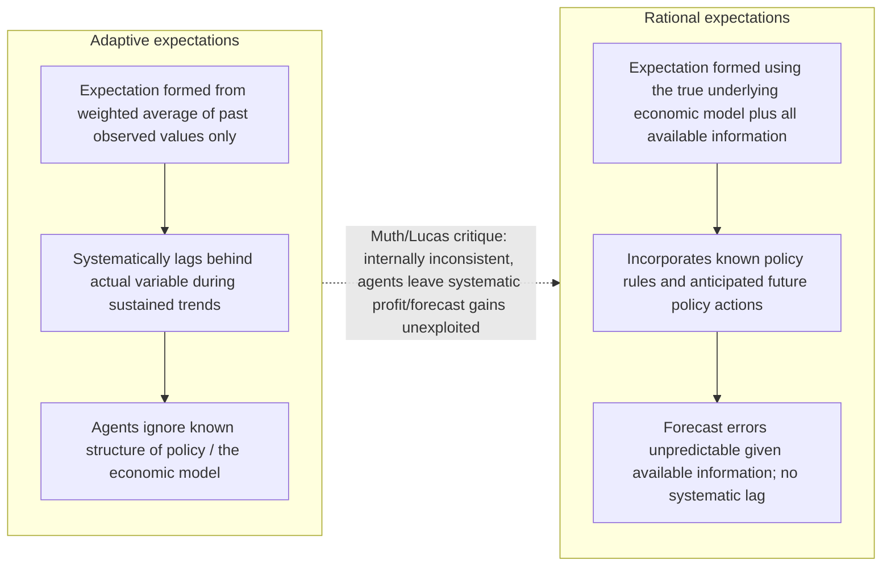
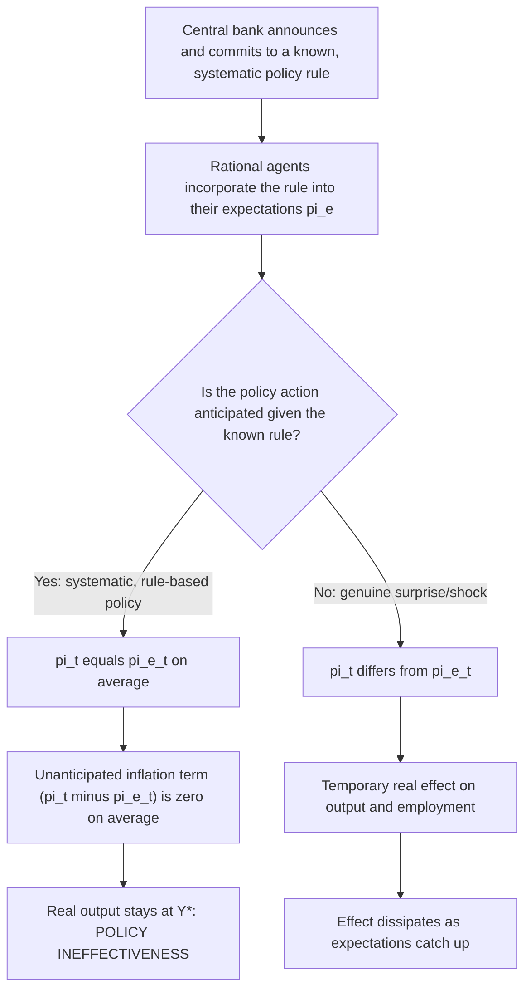

## Rational Expectations Hypothesis

### Definition

The Rational Expectations Hypothesis (REH), introduced by John F. Muth in his 1961 paper "Rational Expectations and the Theory of Price Movements" (*Econometrica*) and elevated to the center of macroeconomics by Robert Lucas, Thomas Sargent, and Neil Wallace in the 1970s, asserts that economic agents form expectations of future variables using **all available relevant information efficiently**, in a manner consistent with the true underlying economic model generating those variables — such that their subjective expectations coincide, on average, with the objective mathematical expectation conditional on that information set.

Formally, for a variable $X_{t+1}$, the rational expectation formed at time $t$ is:

$$X_{t+1}^e = E[X_{t+1} \mid \Omega_t]$$

where $\Omega_t$ is the full information set available at time $t$, including knowledge of the structure of the economy (the "true model") and the policy rules/regimes currently in effect. This implies forecast errors are **unpredictable given $\Omega_t$** — i.e., $X_{t+1} - X_{t+1}^e$ has a zero conditional mean and is uncorrelated with any variable known at time $t$:

$$E[(X_{t+1} - X_{t+1}^e) \mid \Omega_t] = 0$$

Agents can still be wrong ex post (rational expectations does not imply perfect foresight), but their errors are **systematically unbiased and non-predictable** — no consistent pattern of over- or under-prediction can persist, because agents who noticed such a pattern would incorporate it into their forecasts, eliminating it.

### Contrast with Adaptive Expectations

The REH was developed explicitly as a challenge to the previously dominant **adaptive expectations** hypothesis, used by Friedman (in the natural rate hypothesis) and in most 1960s-70s macro-econometric models, in which expectations are formed as a backward-looking weighted average of past values and past forecast errors:

$$X_{t+1}^e = X_t^e + \lambda(X_t - X_t^e), \quad 0 < \lambda < 1$$

Muth's foundational objection to adaptive expectations was one of internal theoretical consistency: adaptive expectations imply agents make **systematic, predictable forecast errors** (e.g., consistently underpredicting a variable during a sustained upward trend) without ever correcting for this known bias, which is inconsistent with the basic economic postulate that rational agents do not persistently leave exploitable, foreseeable information unused. If a pattern of forecast error is knowable in principle, a rational agent — or a competitive market process that punishes such errors — should eliminate it.

### The Lucas Critique (1976)

Robert Lucas's paper "Econometric Policy Evaluation: A Critique" applied the REH to attack the entire methodology of large-scale Keynesian macro-econometric models used for policy simulation:

- Such models (IS-LM-Phillips-Curve systems) estimate structural parameters (e.g., the sensitivity of consumption to income, or of inflation to unemployment) from historical data generated under a *particular* historical policy regime.
- These estimated parameters are, in general, **not policy-invariant** ("deep structural") constants — they are, in a rational-expectations world, themselves functions of agents' expectations about the policy regime, which will shift if the policy regime shifts.
- Therefore, using a model estimated under regime A to *simulate* the effects of a proposed *new* policy (regime B) is invalid: the model's parameters will change under regime B in ways the regime-A-estimated model cannot capture, because rational agents will alter their behavior in anticipation of the new, different policy.
- This became known as the **Lucas Critique**, and constitutes arguably the most influential single methodological argument in modern macroeconomics, motivating the shift toward models with genuinely structural, "deep" parameters (preferences, technology, market structure) presumed invariant to policy regime — the foundation of modern **Dynamic Stochastic General Equilibrium (DSGE)** modeling.

### The Policy Ineffectiveness Proposition (Sargent and Wallace, 1975/1976)

Thomas Sargent and Neil Wallace combined REH with the natural rate hypothesis and market-clearing (flexible-price) assumptions to derive the **Policy Ineffectiveness Proposition (PIP)**: *systematic* (rule-based, publicly known) monetary policy cannot affect real output or unemployment, even in the short run, because rational agents anticipate the policy's effects and adjust prices/wages/expectations accordingly before the policy operates. Only **unanticipated** ("surprise") policy shocks have real effects, and even these are typically modeled as short-lived.

Formally, in a Lucas-type "surprise" aggregate supply function:

$$Y_t = Y^* + \gamma(\pi_t - \pi_t^e) + \varepsilon_t$$

Real output deviates from potential $Y^*$ only in proportion to the **unanticipated** component of inflation, $(\pi_t - \pi_t^e)$. If the central bank follows any policy rule that is publicly known and incorporated into $\pi_t^e$ (i.e., $\pi_t^e$ is formed rationally, using knowledge of the rule), then in equilibrium $\pi_t = \pi_t^e$ on average, and systematic policy has **no systematic effect on $Y_t$** — a far more radical conclusion than Friedman's adaptive-expectations-based natural rate hypothesis, which still allowed a *temporary*, exploitable trade-off during the (backward-looking) expectational adjustment period.

### Key Implications for Macroeconomic Policy and Modeling

1. **Only surprises matter (in the strict New Classical/PIP version)**: systematic countercyclical demand management is theoretically futile under full REH plus market clearing; policy can only create real effects through unanticipated shocks, which policymakers cannot systematically and reliably engineer (since any systematic pattern of "surprises" would itself become anticipated).
2. **Time-inconsistency and the case for rules**: REH is the theoretical bedrock of the Kydland-Prescott (1977) time-inconsistency result — the reason a discretionary policymaker's announced low-inflation policy is not believed, and the reason discretionary policy generates an inflationary bias, is precisely that the public forms *rational* (not naively adaptive) expectations about the policymaker's future incentives.
3. **Credibility becomes paramount**: because rational agents' expectations depend on the *believed* future policy regime, not merely on past observed policy, the credibility and transparency of central bank commitments (rather than historical track record alone) becomes a first-order determinant of macroeconomic outcomes — underpinning the modern emphasis on central bank communication, forward guidance, and explicit, numerically specified inflation targets.
4. **Efficient markets hypothesis parallel**: REH is the macroeconomic analog of the Efficient Markets Hypothesis in finance (also influenced by Muth's original work); asset prices under REH should reflect all available information, implying that returns should not be systematically predictable from public information — a close conceptual and, in some models, literal application of the same rational-expectations logic.
5. **Foundation for modern DSGE modeling**: virtually all contemporary academic and central-bank macro models (New Keynesian DSGE models included) build in rational expectations as the default assumption for how agents form forecasts of future variables (inflation, income, interest rates) within an intertemporal optimization framework, even though most New Keynesian models retain nominal rigidities (sticky prices/wages) that reintroduce meaningful short-run non-neutrality despite rational expectations — showing REH is a hypothesis about expectations *formation*, not, by itself, a claim that money is neutral (that additional conclusion requires the further assumption of flexible, market-clearing prices, as in strict New Classical models, but not in New Keynesian ones).

### Rational Expectations Does Not, By Itself, Imply Monetary Neutrality

A common point of confusion worth making explicit: REH is a hypothesis about *how expectations are formed* — using all available information efficiently and consistently with the true model — and is logically separable from the *further* assumption of continuously market-clearing, flexible prices. The strict New Classical models (Lucas 1972's "islands" model; Sargent-Wallace) combine REH *with* flexible-price market clearing to derive short-run neutrality of *systematic* policy (the PIP). New Keynesian models retain REH but add **nominal rigidities** (sticky prices via Calvo or menu-cost mechanisms), and therefore derive substantial short-run non-neutrality of monetary policy — including of *systematic*, anticipated policy — despite fully rational expectations. The New Keynesian Phillips Curve,

$$\pi_t = \beta E_t[\pi_{t+1}] + \kappa(Y_t - Y_t^*)$$

is itself built on rational (model-consistent) expectations of future inflation $E_t[\pi_{t+1}]$, yet still implies systematic monetary policy has real effects on the output gap in the short run, because price stickiness (not merely expectational error) is the source of non-neutrality in this class of models. This distinction — REH as an expectations-formation assumption, separable from the market-clearing assumption that generates strict policy ineffectiveness — is essential to correctly situating REH within the broader Keynesian/Monetarist/New Classical/New Keynesian debates over monetary neutrality.

### Critiques and Limitations of REH

- **Extreme informational demands**: REH assumes agents effectively know the "true" structural model of the economy and can costlessly process all relevant information — a strong assumption relative to bounded rationality, limited information-processing capacity, and the well-documented empirical prevalence of systematic forecast biases and heuristics in survey-based expectations data (a major theme of subsequent **behavioral macroeconomics** and adaptive-learning literatures, e.g., Sargent's own later work on "bounded rationality" and learning dynamics as an alternative/complement to strict REH).
- **Model uncertainty**: REH presumes agents know the correct model; in reality, agents (and economists) often disagree about the structure of the economy itself, not merely about the realization of shocks within an agreed model — a critique developed in the **adaptive learning** literature (Evans and Honkapohja), which studies whether agents using statistical learning procedures (rather than full rational expectations) *converge* to rational-expectations equilibria over time.
- **Empirical testing difficulties**: rational expectations models are typically tested jointly with a specific structural model of the economy (a "joint hypothesis problem," analogous to the joint-hypothesis problem in testing market efficiency in finance) — empirical rejections can reflect either a failure of REH or a misspecification of the accompanying structural model, making REH difficult to test cleanly in isolation.
- **Survey evidence**: empirical survey data on inflation expectations (e.g., Michigan Survey of Consumers, Survey of Professional Forecasters) often shows patterns — persistent disagreement across forecasters, correlated forecast errors, sluggish adjustment — that are difficult to reconcile with a strict, homogeneous rational-expectations specification, motivating hybrid and heterogeneous-expectations modeling approaches in the subsequent literature. [Inference — reflects a broad, active area of ongoing empirical research rather than a single settled finding]

### Key Points

- The Rational Expectations Hypothesis (Muth 1961) holds that agents form expectations using all available information consistently with the true underlying economic model, implying forecast errors are unbiased and unpredictable given that information.
- It directly challenges adaptive expectations, which relies on backward-looking, mechanically lagged forecasts inconsistent with fully rational information use.
- REH underlies two of the most influential results in modern macroeconomics: the Lucas Critique (estimated policy-model parameters are not invariant to policy regime changes) and the Sargent-Wallace Policy Ineffectiveness Proposition (systematic monetary policy cannot affect real output under REH plus market clearing).
- REH is also the theoretical foundation of the Kydland-Prescott time-inconsistency result, reframing the rules-versus-discretion debate around credibility rather than forecasting competence.
- Crucially, REH alone does not imply monetary neutrality; that additional conclusion requires combining REH with flexible, market-clearing prices (strict New Classical models). New Keynesian models combine REH with sticky prices to generate substantial short-run non-neutrality even under fully rational expectations.
- Critiques center on REH's demanding informational and cognitive assumptions, motivating alternative frameworks such as adaptive learning and behavioral/heterogeneous-expectations macroeconomics.

### Related Topics

- Lucas Critique and its implications for econometric policy evaluation
- Sargent-Wallace Policy Ineffectiveness Proposition
- Kydland-Prescott time-inconsistency and rules versus discretion
- New Keynesian Phillips Curve and the role of rational expectations under sticky prices
- Adaptive expectations (Friedman's natural rate hypothesis) versus rational expectations
- Dynamic Stochastic General Equilibrium (DSGE) modeling
- Adaptive learning and bounded rationality in macroeconomics (Evans and Honkapohja)
- Efficient Markets Hypothesis (finance-theoretic parallel to REH)
- Real Business Cycle theory (Kydland-Prescott's own RBC modeling tradition)
- Central bank credibility, forward guidance, and inflation targeting