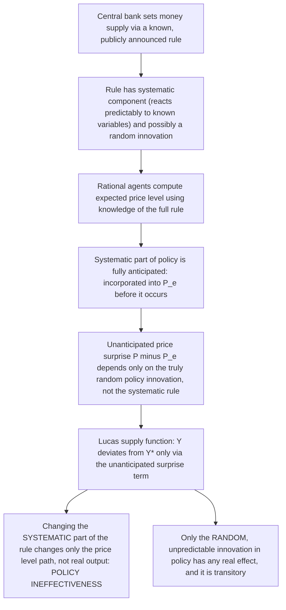

## The Policy Ineffectiveness Proposition

### Definition and Origin

The Policy Ineffectiveness Proposition (PIP) is the New Classical macroeconomics result, developed principally by Thomas Sargent and Neil Wallace in "'Rational' Expectations, the Optimal Monetary Instrument, and the Optimal Money Supply Rule" (*Journal of Political Economy*, 1975) and "Rational Expectations and the Theory of Economic Policy" (*Journal of Monetary Economics*, 1976), which states that **systematic, anticipated monetary policy has no effect on real output or employment**, even in the short run, once the rational expectations hypothesis (REH) is combined with continuously market-clearing (flexible) prices. Only unsystematic, genuinely surprising policy actions can move real variables away from their natural-rate equilibrium levels, and even these effects are transitory. This result formalizes and radicalizes Friedman's natural rate hypothesis by replacing its adaptive-expectations mechanism (which permits a temporary, backward-looking-expectations-driven trade-off) with rational expectations, eliminating even that temporary systematic trade-off.

### Theoretical Building Blocks

The PIP rests on the combination of three specific assumptions, each individually associated with earlier strands of monetary theory, but jointly producing a conclusion stronger than any one alone implies:

1. **The Lucas aggregate supply function** (Lucas 1972, 1973): output deviates from its natural/potential level only in response to *unanticipated* price-level or inflation surprises, reflecting imperfect information about whether an observed price change is a relative-price signal (calling for a real output response) or a purely nominal, economy-wide shock (calling for no real response) — the "signal extraction" problem facing individual, geographically or informationally dispersed agents ("Lucas islands" model).

$$Y_t = Y^* + \gamma(P_t - P_t^e) + \varepsilon_t, \quad \gamma > 0$$

2. **Rational expectations**: $P_t^e = E[P_t \mid \Omega_{t-1}]$, where $\Omega_{t-1}$ includes full knowledge of the money supply process/policy rule, so that any *systematic* component of monetary policy is, by construction, already incorporated into $P_t^e$ before it occurs.
3. **Continuous market clearing**: prices and wages are fully flexible and adjust instantaneously to clear all markets each period — there is no nominal rigidity of the New Keynesian (Calvo/menu-cost) type to slow this adjustment down.

### Derivation of the Result

Suppose the money supply follows a known, publicly announced policy rule (a feedback rule reacting systematically to observable variables, or even a simple deterministic rule):

$$m_t = \bar{m} + \rho_1 x_{t-1} + \dots + \eta_t$$

where $x_{t-1}$ represents lagged observable variables the rule responds to, and $\eta_t$ is a genuinely unpredictable, i.i.d. policy shock (a "surprise" component, if any). Because the rule itself — including its systematic, rule-based response coefficients $\rho_1, \dots$ — is assumed known to rational agents, they can compute $E[m_t \mid \Omega_{t-1}]$, and hence $E[P_t \mid \Omega_{t-1}] = P_t^e$, incorporating the *entire systematic part* of the rule. Only the truly unforecastable innovation $\eta_t$ can generate $P_t \neq P_t^e$.

Substituting into the Lucas supply function:

$$Y_t = Y^* + \gamma \cdot (\text{unanticipated part of } P_t) + \varepsilon_t$$

Since the systematic part of the money supply process maps only into the *anticipated* part of $P_t$ (which cancels out of $P_t - P_t^e$), **the systematic component of monetary policy has zero coefficient in its effect on $Y_t$** — changing the rule's systematic response coefficients ($\rho_1$, etc.) does not change the equilibrium behavior of real output at all, only the equilibrium behavior of the price level. Real output remains determined by $Y^*$ (real, supply-side determinants) plus purely random, policy-unrelated noise $\varepsilon_t$, plus any effect of the genuinely unforecastable monetary shock $\eta_t$.

### Distinction from Friedman's Natural Rate Hypothesis

It is essential to distinguish the PIP from Friedman's earlier (1968) natural rate hypothesis, since both conclude that money is neutral with respect to unemployment/output in some sense, but via meaningfully different mechanisms and with different strength:

| Feature | Friedman (adaptive expectations, 1968) | Sargent-Wallace (rational expectations, 1975-76) |
| --- | --- | --- |
| Expectations formation | Backward-looking, adaptive (weighted average of past values/errors) | Forward-looking, model-consistent (rational) |
| Short-run trade-off | Exists, and is *exploitable* for a time, because adaptive expectations lag behind actual inflation | Does not exist for *any* systematic/rule-based policy — expectations catch up instantly since the rule is known in advance |
| Source of temporary non-neutrality | Expectational lag: agents haven't yet updated $\pi^e$ to match realized $\pi$ | Pure informational surprise: only literally unpredictable shocks, never lagged adjustment to known rules |
| Policy implication | Even a predictable policy rule can generate short-run real effects, because it still takes time for adaptive expectations to catch up | A known, systematic policy rule generates *no* short-run real effects at all, however cleverly designed, because rational agents adjust instantly and correctly |
| Relative strength of claim | Moderate: short-run trade-off exists, only the long-run trade-off is denied | Radical: denies even the short-run systematic trade-off, not just the long-run one |

### Optimal Monetary Instrument Corollary (Poole Problem Reframed)

Sargent and Wallace's original 1975 paper is formally about a related but distinct question — whether the central bank should use the money supply or the interest rate as its policy instrument (the "Poole problem," originally posed by William Poole in a non-rational-expectations setting) — and their striking finding is that **under rational expectations and the PIP's assumptions, this choice is also irrelevant to the stochastic behavior of real output**: neither instrument choice, nor any systematic feedback rule built on either instrument, can alter the variance or path of real output, because real output is pinned to its natural rate plus unpredictable noise regardless of the systematic policy framework chosen. This is a stronger and more surprising companion result to the PIP's headline claim about the mean/level effects of systematic policy.

### Implications for the Rules-Versus-Discretion Debate

The PIP provides a distinctive, and in some respects more radical, theoretical foundation for policy rules than either Friedman's lags-based argument or the Kydland-Prescott time-inconsistency argument:

- Friedman's case for a k-percent rule rests on the *inability* of discretionary policymakers to correctly time interventions given long and variable lags — a claim about policymaker forecasting competence.
- Kydland-Prescott's case for rules rests on the *strategic credibility problem*: discretion generates an inflationary bias because rational agents anticipate the policymaker's ex-post incentive to renege on low-inflation promises.
- The PIP's case is different again: it claims that *even a perfectly credible, publicly announced, systematically followed rule* — one with no credibility problem and no forecasting/lag problem — **still cannot achieve any real stabilization benefit**, because rational agents neutralize any systematic policy response before it can affect real variables. Under the PIP's strict assumptions, the choice between rules and discretion becomes, in a sense, moot for real-variable stabilization purposes: neither can systematically move output away from $Y^*$; the debate's stakes shift entirely to which regime better manages the price level, inflation predictability, and avoids unnecessary policy-induced nominal noise.

### Critiques and the Limits of the Result

The PIP's strong conclusion depends critically on the joint assumption of continuous market clearing, and this assumption became the primary target of subsequent criticism, ultimately motivating the entire **New Keynesian** research program:

- **Fischer (1977) and Taylor (1979) — staggered/overlapping wage contracts**: even under full rational expectations, if nominal wage contracts are set in advance and staggered across firms/workers (not all resetting simultaneously), systematic monetary policy *can* have real effects, because contracts signed before a policy action cannot adjust to it even though the signing parties may have rationally anticipated the policy rule in expectation — the *contract itself*, not expectational error, is the source of non-neutrality. This decisively separates the REH assumption from the market-clearing assumption: rational expectations plus nominal rigidity (rather than plus market clearing) restores real effects of systematic policy, directly undermining the PIP's strict conclusion without abandoning rational expectations at all.
- **Empirical challenges**: VAR-based empirical studies identifying monetary policy shocks (Christiano, Eichenbaum, and Evans 1999; and narrative-approach studies such as Romer and Romer 2004) generally find that *anticipated, systematic* components of monetary policy, not merely surprise innovations, are associated with persistent, hump-shaped real output responses lasting several quarters — evidence broadly inconsistent with the strict PIP and more consistent with sticky-price New Keynesian mechanisms.
- **Mishkin (1982) and others**: empirical tests explicitly designed to discriminate between anticipated and unanticipated monetary policy effects on output found that anticipated money growth was *not* neutral in US postwar data, providing direct empirical evidence against the strict PIP.
- **Menu costs and the aggregate consequences of small frictions** (Mankiw 1985; Akerlof and Yellen 1985): even very small, individually rational pricing frictions (menu costs, "near-rational" behavior) can generate large aggregate non-neutrality, because the private cost of not adjusting prices immediately is second-order for an individual firm while the aggregate demand externality of many firms not adjusting is first-order — reinforcing that flexible-price market clearing, not rational expectations per se, is the assumption doing the real work in generating the PIP's strong conclusion.

### Legacy: From Policy Ineffectiveness to New Keynesian Synthesis

The eventual resolution of this debate in mainstream macroeconomics did **not** vindicate the strict PIP as an empirically accurate description of monetary policy's real effects; rather, it retained rational expectations as a standard, largely uncontroversial modeling assumption for expectations formation, while abandoning strict continuous market clearing in favor of New Keynesian nominal rigidities (Calvo pricing, staggered contracts). This produces modern **New Keynesian DSGE** models in which:

- Expectations are rational (following Muth/Lucas/Sargent-Wallace).
- Prices/wages are sticky (following Fischer/Taylor/Calvo/Mankiw), not continuously market-clearing.
- Systematic, anticipated monetary policy **does** have real effects on output and employment in the short run (contrary to the strict PIP), operating through the interaction of rational expectations with the specific timing/duration of price and wage stickiness — captured formally in the New Keynesian IS curve and New Keynesian Phillips Curve.
- Only in the *long run*, once all prices have had the opportunity to adjust, does neutrality reassert itself — restoring a short-run non-neutrality/long-run neutrality structure broadly analogous to (though built on very different microfoundations than) both the original Keynesian synthesis and Friedman's own natural rate framework.

### Key Points

- The Policy Ineffectiveness Proposition (Sargent-Wallace, 1975-76) claims that systematic, publicly known monetary policy cannot affect real output or employment, even in the short run, given rational expectations combined with continuous market clearing (the Lucas aggregate supply function).
- Only genuinely unanticipated ("surprise") policy shocks produce real effects, and these are transitory.
- The PIP is a stronger, more radical conclusion than Friedman's adaptive-expectations-based natural rate hypothesis, which still permitted a temporary, exploitable trade-off during the expectational-adjustment period.
- A companion result (the "instrument irrelevance" finding) shows that under the same assumptions, the choice between money-supply and interest-rate policy instruments (the Poole problem) also cannot affect the stochastic behavior of real output.
- The PIP's strong conclusion depends critically on the market-clearing assumption, not on rational expectations per se; Fischer's and Taylor's staggered-contract models showed that rational expectations combined with nominal rigidity (rather than with market clearing) restores real effects of systematic policy — a finding that, together with subsequent empirical rejections of strict policy ineffectiveness, motivated the New Keynesian research program.
- Modern mainstream macroeconomics retains rational expectations as standard but rejects the PIP's strict conclusion, embedding rational expectations within sticky-price New Keynesian models that restore meaningful short-run non-neutrality of systematic monetary policy.

### Related Topics

- Rational expectations hypothesis (the foundational assumption)
- Lucas aggregate supply function and the signal-extraction/islands model
- Friedman's natural rate of unemployment hypothesis (the adaptive-expectations precursor)
- Lucas Critique of econometric policy evaluation
- Kydland-Prescott time-inconsistency and the rules-versus-discretion debate
- Staggered wage/price contract models (Fischer 1977; Taylor 1979)
- Menu costs and near-rational pricing behavior (Mankiw; Akerlof-Yellen)
- New Keynesian Phillips Curve and DSGE modeling
- Poole problem: choice of monetary policy instrument
- Empirical identification of monetary policy shocks (VAR methods, narrative approach)