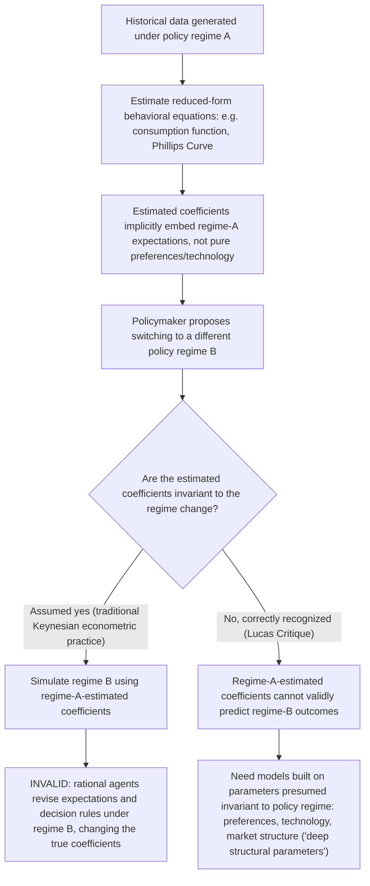

## The Lucas Critique of Policy Evaluation

### Definition and Origin

The Lucas Critique refers to Robert Lucas's argument, presented in "Econometric Policy Evaluation: A Critique" (1976, in Karl Brunner and Allan Meltzer's *The Phillips Curve and Labor Markets*, Carnegie-Rochester Conference Series), that the parameters of traditional large-scale macro-econometric models — estimated from historical data under one policy regime — cannot be reliably used to predict the effects of a *different*, proposed policy regime, because those parameters are not genuinely structural (policy-invariant) but are themselves functions of the private sector's expectations about policy, which change when the policy regime changes. This became one of the most influential methodological arguments in twentieth-century economics, fundamentally reshaping how macroeconomic models are built and used for policy analysis.

### The Target: 1960s-70s Keynesian Macro-Econometric Models

The models under attack were large systems in the tradition of the Cowles Commission/Klein-Goldberger/Brookings-model approach — dozens to hundreds of estimated behavioral equations (consumption functions, investment functions, a Phillips Curve relating inflation and unemployment, money demand functions) fit to historical time-series data using standard econometric techniques, and then used for **policy simulation**: plugging a hypothetical future policy path (e.g., a different path of government spending, tax rates, or money growth) into the estimated equations to forecast the economy's response.

The implicit methodological assumption was that the estimated coefficients (marginal propensities to consume, Phillips Curve slopes, interest-elasticities of investment, etc.) represented stable "deep" behavioral parameters of the economy — structural relationships that would remain the same regardless of which policy path was actually chosen.

### The Core Argument

Lucas's critique proceeds from optimizing behavior under (implicit or explicit) rational expectations:

1. Economic agents' decision rules — how much to consume, invest, or how to set wages/prices — are the *solutions* to dynamic optimization problems in which agents form expectations about relevant future variables (future income, future prices, future policy actions).
2. These decision rules therefore depend not only on current and past observable variables, but on the parameters of the **expected future policy process** itself — i.e., on the policy *regime*, not merely on realized historical policy actions.
3. A reduced-form econometric equation estimated from historical data (e.g., "consumption responds to income with coefficient $\hat{\beta}$") is therefore not a fixed structural parameter of preferences or technology; it is a **composite** that implicitly bakes in the historically prevailing policy regime and the expectations agents formed under it.
4. If a policymaker changes the policy regime (e.g., adopts a fundamentally different monetary rule, or announces a new fiscal regime), rational agents will, in general, revise their expectations and hence their decision rules, so the previously estimated coefficient $\hat{\beta}$ will **shift** under the new regime.
5. Therefore, using the historically estimated model to simulate the effects of the *new* regime is invalid: the model predicts the effect of the new policy *as if* the old behavioral relationships still held, when in fact those relationships are precisely what should be expected to change as a consequence of the policy shift being evaluated.

### Illustrative Example: The Phillips Curve

The clearest and most historically important illustration of the critique concerns the **Phillips Curve**. A reduced-form Phillips Curve estimated on 1960s US data (when inflation was low and inflation expectations were largely static/backward-looking) might show a stable, exploitable inflation-unemployment trade-off. A policymaker using this estimated relationship to simulate "what happens if we permanently run the economy at a higher-inflation, lower-unemployment point on this curve" would, per the critique, get a badly wrong answer: as the policymaker actually shifts to a persistently higher-inflation regime, rational (or even merely adaptive, over time) agents revise their inflation expectations upward, shifting the *entire* short-run Phillips Curve relationship — the trade-off that appeared stable in the historical data existed only because inflation *had been* low and inflation expectations well-anchored under the old regime; it was not a policy-invariant structural relationship exploitable at will. This is exactly the mechanism behind the **natural rate hypothesis** and the historical experience of 1970s stagflation, and it provided the clearest real-world vindication of Lucas's abstract methodological point.

### Formal Statement

Consider a reduced-form relationship estimated from historical data:

$$y_t = f(x_t, \theta)$$

where $\theta$ is a vector of estimated coefficients. The traditional policy-simulation approach treats $\theta$ as fixed and asks how $y_t$ responds as the policy-controlled component of $x_t$ is varied. Lucas's critique observes that, in a rational-expectations, optimizing-agent world, the true relationship is actually:

$$y_t = f(x_t,\ \theta(\Phi))$$

where $\Phi$ represents the parameters of the policy *rule/regime* itself (not merely the realized policy action), and $\theta(\cdot)$ is a function mapping the policy regime to the behavioral coefficients agents will rationally exhibit under that regime. Varying $x_t$ while holding $\theta$ fixed — the standard policy-simulation exercise — is valid only if $\theta$ does not, in fact, depend on $\Phi$; the critique's claim is that in general it does, so $\theta$ must be allowed to shift whenever $\Phi$ (the policy regime) shifts, and any credible policy evaluation must specify how $\theta(\Phi)$ changes, not merely simulate along the old, regime-A-specific $\theta$.

### Relationship to Rational Expectations and the Policy Ineffectiveness Proposition

The Lucas Critique is closely related to, but analytically distinct from, the Sargent-Wallace Policy Ineffectiveness Proposition (PIP):

- The **PIP** is a substantive claim about the real economy: under REH plus market clearing, systematic monetary policy has no real effects.
- The **Lucas Critique** is a *methodological* claim about how to validly do policy evaluation: whatever the true effects of a policy change turn out to be, they cannot be reliably estimated using reduced-form models whose parameters are not policy-invariant. The Lucas Critique would apply even in a world where systematic policy *does* have real effects (as in New Keynesian models) — the point is not that policy is ineffective, but that *naively estimated historical relationships* cannot be trusted to correctly forecast the size or nature of those effects when the policy regime itself is what is changing.

Both results share the same theoretical root (rational, forward-looking, optimizing behavior) but have different scope: the PIP is a claim about *outcomes*; the Lucas Critique is a claim about *methodology*, and is in this sense the more general and more durable of the two contributions, since it survives even in modern New Keynesian settings where the PIP's strict conclusion does not hold.

### Methodological Legacy: The Shift to Structural, Microfounded Models

The Lucas Critique's principal legacy is not a specific empirical finding but a **transformation of macroeconomic modeling methodology**:

1. **Demand for "deep" structural parameters**: the critique motivated a shift away from purely reduced-form, atheoretical time-series estimation toward models built explicitly from microeconomic foundations — utility functions, production functions, and market-clearing/price-setting mechanisms — whose parameters (risk aversion, discount rates, technology parameters) are, in principle, policy-invariant, because they describe tastes and technology rather than behavior contingent on a particular historical policy regime.
2. **Rise of Dynamic Stochastic General Equilibrium (DSGE) modeling**: this is the direct methodological descendant of the Lucas Critique, beginning with Real Business Cycle models (Kydland and Prescott 1982) and later incorporating New Keynesian nominal rigidities, in which agents solve explicit dynamic optimization problems under rational expectations, and policy experiments are conducted by literally re-solving the model under the new policy rule, rather than by holding old reduced-form coefficients fixed.
3. **Calibration and estimation practices**: DSGE models are typically calibrated or estimated using parameters intended to be structural (e.g., estimated from micro-level data on preferences or firm behavior where possible), explicitly in the spirit of avoiding Lucas-Critique-vulnerable parameter instability.
4. **Central bank practice**: the critique's influence extends to central-bank forecasting and policy-evaluation practice, where large-scale general-equilibrium models with explicit expectations formation (rather than purely reduced-form, historically-estimated systems) became the standard tool for evaluating counterfactual policy paths from the 1990s onward. [Inference — reflects a broad, widely documented shift in central-bank modeling practice, not a claim about every institution's specific internal methodology]

### Qualifications and Critiques of the Critique

- **Degree, not absolute, applicability**: not every econometric relationship is equally vulnerable to the Lucas Critique — relationships closer to genuine technological or biological constants (e.g., certain production-function parameters) are less exposed than relationships obviously mediated by expectations (e.g., consumption or investment responses to anticipated future policy). The critique is best understood as identifying a *risk* requiring case-by-case assessment, not as invalidating all econometric policy analysis universally.
- **Empirical magnitude debated**: some economists (e.g., in later empirical assessments) have argued that in practice, the degree of parameter instability induced by policy regime changes is often smaller than the theoretical critique might suggest, particularly for policy changes that are modest relative to historical variation already present in the estimation sample — an empirical question rather than one resolved purely by the theoretical argument itself. [Unverified — a matter of ongoing empirical dispute rather than settled consensus]
- **DSGE models are not immune in practice**: while DSGE models are designed in the spirit of the Lucas Critique, critics note that many of their "structural" parameters are still estimated using historical data and are themselves not necessarily invariant to sufficiently large regime changes, so the critique's underlying concern is mitigated in principle but not entirely eliminated in practice by the DSGE methodology.
- **Sims and VAR-based alternatives**: Christopher Sims's Vector Autoregression (VAR) approach (1980) offered a different methodological response to the critique — rather than imposing strong theoretical structure to identify policy-invariant parameters, VAR methods use minimal theoretical restrictions and instead focus on documenting the dynamic empirical response of the economy to *identified, exogenous* policy shocks (rather than simulating hypothetical whole-regime changes), sidestepping some Lucas-Critique concerns while sacrificing some of DSGE's structural interpretability.

### Key Points

- The Lucas Critique (1976) argues that econometric models' estimated behavioral parameters are not policy-invariant but are themselves shaped by the historically prevailing policy regime and the expectations agents formed under it; using such models to simulate a *different* policy regime is therefore methodologically unreliable.
- The clearest illustration is the Phillips Curve: a historically stable-looking inflation-unemployment relationship breaks down once policymakers attempt to exploit it, because doing so changes the inflation-expectations regime the relationship was estimated under.
- The critique is distinct from, though closely related to, the Sargent-Wallace Policy Ineffectiveness Proposition: the Lucas Critique is a methodological claim about model validity, while the PIP is a substantive claim about policy's real effects, and the critique's methodological force survives even in models (like New Keynesian DSGE) where the PIP's substantive conclusion does not hold.
- Its principal legacy is the shift in macroeconomic modeling toward microfounded, structural (DSGE) models with parameters intended to be policy-invariant, replacing purely reduced-form historical estimation as the standard methodology for policy evaluation.
- The critique's practical bite is a matter of degree and ongoing empirical assessment, and alternative methodological responses (notably Sims's VAR approach) offer different ways of managing the underlying concern without full structural microfoundations.

### Related Topics

- Rational expectations hypothesis (the foundational assumption underlying the critique)
- The policy ineffectiveness proposition (Sargent-Wallace)
- Friedman's natural rate of unemployment hypothesis and the breakdown of the historical Phillips Curve
- Kydland-Prescott time-inconsistency and rules versus discretion
- Dynamic Stochastic General Equilibrium (DSGE) modeling
- Real Business Cycle theory (Kydland-Prescott 1982)
- New Keynesian DSGE models and structural estimation
- Vector Autoregression (VAR) methodology (Sims 1980)
- Stagflation of the 1970s as an empirical illustration
- Central bank credibility and forward guidance