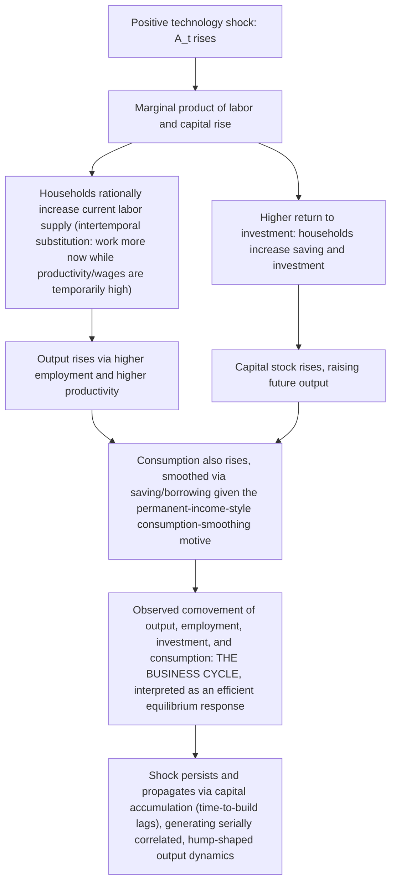

## Real Business Cycle Theory and Monetary Neutrality

### Definition and Origin

Real Business Cycle (RBC) theory is the branch of New Classical macroeconomics, founded by Finn Kydland and Edward Prescott in "Time to Build and Aggregate Fluctuations" (*Econometrica*, 1982), which explains business-cycle fluctuations in output, employment, and consumption as the **efficient, equilibrium response of optimizing agents to real (non-monetary) shocks** — principally shocks to total factor productivity (technology). RBC theory represents the most complete and uncompromising modern restatement of monetary neutrality: in its canonical form, money plays **no causal role whatsoever** in generating business cycles, and cycles are not, in the RBC framework, a market failure or disequilibrium phenomenon requiring correction, but the economy's optimal response to real disturbances.

### Core Theoretical Structure

RBC models are built as fully specified **Dynamic Stochastic General Equilibrium (DSGE)** models, directly in the methodological spirit motivated by the Lucas Critique, with a representative household maximizing expected lifetime utility over consumption and leisure, subject to a resource constraint and a stochastic technology process, and firms operating a standard neoclassical production function.

**Representative household's problem:**

$$\max E_0 \sum_{t=0}^{\infty} \beta^t \, U(C_t, 1 - N_t)$$

subject to

$$C_t + K_{t+1} = A_t F(K_t, N_t) + (1-\delta)K_t$$

where $C_t$ is consumption, $N_t$ is labor supply, $K_t$ is the capital stock, $\delta$ is the depreciation rate, $\beta$ is the discount factor, and $A_t$ is total factor productivity, following a stochastic process typically modeled as an autoregressive process:

$$\ln A_t = \rho \ln A_{t-1} + \varepsilon_t, \quad \varepsilon_t \sim \text{i.i.d.}(0, \sigma^2)$$

### The Business Cycle Mechanism: Technology Shocks and Intertemporal Substitution

In this framework, business cycles arise entirely from the economy's optimal response to realizations of the productivity shock $\varepsilon_t$:

The key micro-behavioral mechanism is **intertemporal labor substitution**: because the productivity shock is temporary (though persistent, given $\rho < 1$), the *current* real wage is temporarily higher relative to expected future wages, so rational, forward-looking workers optimally substitute leisure away from the present and toward the future — working more now, when the return to work is unusually high, and planning to work (relatively) less later. This produces employment fluctuations as a *voluntary, optimal* household choice, not as a symptom of labor-market disequilibrium or involuntary unemployment — a sharp philosophical departure from both Keynesian and (to a lesser extent) Monetarist treatments of cyclical unemployment.

### Monetary Neutrality in RBC Theory: The Strongest Form

RBC theory embodies the strongest and most complete form of monetary neutrality in the modern macroeconomic literature, exceeding even the strict Sargent-Wallace Policy Ineffectiveness Proposition in scope:

- **No money in the baseline model at all**: the canonical Kydland-Prescott RBC model contains **no monetary sector whatsoever** — no money demand function, no nominal prices, no central bank. Business cycles are fully explained by the real side of the economy (technology, preferences, capital accumulation) with money entirely absent from the causal structure.
- **Superneutrality, not merely neutrality**: where classical neutrality typically refers to the level of the money supply not affecting real variables, RBC theory (when a monetary sector is appended, e.g., via a cash-in-advance constraint or money-in-the-utility-function specification) generally implies **superneutrality** — not just the *level* but the *growth rate* of the money supply has no effect on real variables in equilibrium, since money in these extended models is typically a "veil" that scales all nominal prices proportionally without altering any real decision rule (given fully flexible prices and full information).
- **Reversal of the classical historical causal question**: RBC theorists directly reinterpret the empirical evidence Monetarists cited (money leading output over the business cycle — the very evidence Friedman and Schwartz used to argue money is causally central) as **reverse causation**: money is argued to be largely **endogenous**, with the money stock (particularly components like inside money/bank credit) responding to, and anticipating, real economic activity — banks and the public adjust money holdings in anticipation of future output movements — rather than money changes driving output. This directly inverts the Monetarist causal narrative while using much of the same underlying correlational evidence (money leading output in the data), a striking illustration of the identification difficulties in distinguishing correlation from causation in aggregate time series.

### Calibration Methodology

A methodologically distinctive feature of RBC theory, closely tied to its monetary-neutrality implications, is its use of **calibration** rather than traditional econometric estimation: rather than statistically estimating parameters ($\beta$, risk aversion, capital share, depreciation rate, the persistence $\rho$ and volatility $\sigma$ of the technology shock) from the same aggregate time series the model is meant to explain, RBC practitioners set these parameters using independent sources — micro-level studies, long-run growth-accounting averages, national accounts ratios — and then ask whether the resulting model, simulated purely off the calibrated technology-shock process, can reproduce the *observed statistical moments* of actual business cycles (relative volatilities of consumption, investment, and employment; their correlations with output; their persistence). Early RBC work (Kydland-Prescott 1982; Prescott 1986) claimed considerable success by this metric, arguing a large share of observed postwar US output volatility could be attributed to technology shocks alone, with no role for monetary or other nominal disturbances.

### Contrast Table: RBC Versus Keynesian/Monetarist/New Keynesian Views of the Cycle

| Feature | RBC theory | Keynesian view | Monetarist view | New Keynesian view |
| --- | --- | --- | --- | --- |
| Primary driver of cycles | Real (technology) shocks | Aggregate demand shocks (investment/animal spirits, fiscal changes) | Monetary shocks (money supply changes) | Both real and nominal (demand) shocks, propagated via sticky prices |
| Nature of unemployment over the cycle | Voluntary — optimal intertemporal labor substitution | Involuntary — demand-deficient, sticky wages prevent clearing | Involuntary in the short run only, due to expectational confusion | Involuntary in the short run, due to nominal rigidity |
| Role of money | None, or fully neutral/superneutral | Non-neutral, central causal channel via interest rate/investment | Non-neutral in the short run (real effects via unanticipated shocks), neutral in the long run | Non-neutral even for systematic/anticipated policy, due to sticky prices |
| Policy implication | Countercyclical stabilization policy is unnecessary or even counterproductive — cycles are efficient | Active demand management (fiscal, monetary) needed to correct market failure | Rule-based monetary policy to avoid destabilizing discretionary errors | Systematic, rule-like (Taylor-rule-style) monetary policy has genuine real stabilization value |
| Prices/wages | Fully flexible, continuous market clearing | Sticky, slow to adjust | Flexible in the long run, sticky/confused expectations in the short run | Sticky by explicit microfounded assumption (Calvo, menu costs) |

### Critiques of RBC Theory and Its Neutrality Claims

- **Implausibly large and correlated technology shocks required**: critics (notably Lawrence Summers 1986, and subsequent Solow-residual-based critiques) argued that reproducing observed output volatility purely from technology shocks requires implausibly large and frequent aggregate productivity disturbances — including, controversially, *negative* technology shocks (literal technological regress) to explain recessions — for which independent microeconomic or engineering evidence is scarce. [Unverified — a long-standing point of dispute in the empirical RBC literature rather than a settled finding]
- **Measurement of the Solow residual**: the standard empirical proxy for technology shocks, the Solow residual (output growth unexplained by measured input growth), is itself contaminated by cyclical variation in labor effort, capital utilization, and other omitted factors (Robert Hall's critique of the Solow residual as a measure of "true" exogenous technology), raising doubts about whether RBC's key driving variable is genuinely exogenous and real, rather than partly a symptom of the very cyclical fluctuations it purports to explain.
- **Intertemporal labor substitution elasticity too low in micro data**: labor-economics estimates of the elasticity of labor supply with respect to temporary wage changes are generally found to be small at the individual level, casting doubt on whether the RBC mechanism's central behavioral channel (large voluntary employment swings driven by intertemporal substitution) is empirically plausible, absent additional mechanisms (e.g., indivisible labor/extensive-margin models, Hansen 1985 and Rogerson 1988, which aggregate small individual responses into larger economy-wide employment swings via a lottery/extensive-margin reinterpretation).
- **Empirical rejection of strict monetary neutrality**: as discussed under the Lucas Critique and Policy Ineffectiveness Proposition entries, subsequent empirical work using identified monetary policy shocks (VAR studies, narrative-identification studies) broadly finds real, persistent output effects from monetary policy actions, difficult to reconcile with RBC's implication that money plays no meaningful causal role — evidence that contributed to the RBC research program's evolution into (rather than wholesale replacement by) New Keynesian DSGE modeling, which retains RBC's rigorous general-equilibrium, rational-expectations methodology while reintroducing nominal rigidities and a meaningful monetary transmission mechanism.
- **Comovement puzzle in models with multiple sectors**: some critics note that RBC models can struggle to generate the strong positive comovement of consumption, investment, and hours worked observed across sectors/industries in actual data without additional frictions, a technical challenge that spurred methodological refinements within the broader DSGE tradition.

### Legacy: RBC as Methodological Foundation for New Keynesian DSGE

Despite the substantive critiques of its strict monetary-neutrality conclusion, RBC theory's **methodological contribution** — fully specified, microfounded, general-equilibrium, stochastic dynamic models solved and calibrated/estimated with rational expectations throughout — became the common technical chassis for essentially all subsequent mainstream macroeconomic modeling, including the New Keynesian models that reject its substantive neutrality conclusions. Modern New Keynesian DSGE models are frequently described as "RBC models with nominal rigidities and monetary policy added" — retaining the household optimization, capital accumulation, and technology-shock machinery of RBC theory, while layering on Calvo/menu-cost price stickiness and (frequently) a Taylor-rule-following central bank, thereby reintroducing meaningful monetary non-neutrality within an RBC-style technical framework. In this sense, RBC theory's greatest lasting influence on the discipline is arguably methodological rather than substantive — it did not settle the debate over monetary neutrality in its own favor, but it permanently changed the technical standard for how *any* side of that debate is expected to be formally modeled.

### Key Points

- RBC theory (Kydland-Prescott 1982) explains business cycles as the optimal equilibrium response of rational agents to real (typically technology) shocks, with employment fluctuations interpreted as voluntary intertemporal labor substitution rather than involuntary unemployment.
- The canonical RBC model contains no monetary sector at all; when money is appended, it is typically modeled as fully neutral or superneutral, a "veil" with no effect on real allocations.
- RBC theory reinterprets the historical correlation between money and output (central to the Monetarist case) as reflecting money's endogenous response to anticipated real activity, reversing the Monetarist causal story using much of the same evidence.
- The theory's distinctive calibration methodology tests whether a model driven purely by technology shocks can reproduce observed business-cycle statistical moments, without traditional econometric estimation on the same data.
- Major critiques include the implausibility of the required technology shock process (including negative shocks), contamination of the Solow residual by cyclical factors, low micro-level labor-supply elasticities relative to what the mechanism requires, and broad empirical evidence of real monetary policy effects inconsistent with strict neutrality.
- RBC theory's lasting legacy is primarily methodological: its DSGE, rational-expectations, general-equilibrium framework became the standard technical foundation for New Keynesian models, even though those models explicitly reject RBC's strict monetary-neutrality conclusions by reintroducing nominal rigidities.

### Related Topics

- Rational expectations hypothesis and the Lucas Critique (shared methodological roots)
- The policy ineffectiveness proposition (a related but distinct neutrality claim)
- Dynamic Stochastic General Equilibrium (DSGE) modeling
- New Keynesian DSGE models and the reintroduction of nominal rigidities
- Solow residual and total factor productivity measurement
- Intertemporal substitution and labor supply elasticity debates
- Indivisible labor models (Hansen 1985; Rogerson 1988)
- Calibration versus estimation as a macroeconomic modeling methodology
- Endogenous money and reverse causation debates
- Friedman-Schwartz's monetary interpretation of business cycles (the rival causal narrative)