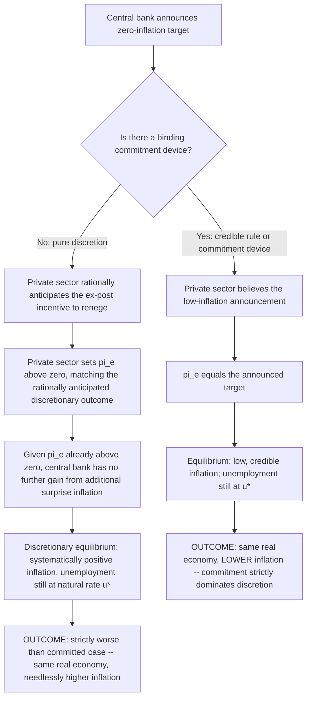

## Time Inconsistency and the Credibility Problem

### Definition and Origin

Time inconsistency describes a situation in which a policy that is **optimal to announce today, evaluated from today's perspective**, is no longer the policy the policymaker wants to actually **implement once the future arrives** and private agents have already acted on the basis of that announcement. The concept was formalized for monetary policy by Finn Kydland and Edward Prescott in "Rules Rather Than Discretion: The Inconsistency of Optimal Plans" (*Journal of Political Economy*, 1977), a paper that, together with their Real Business Cycle work, earned them the 2004 Nobel Memorial Prize in Economic Sciences. The credibility problem is the practical consequence: because rational, forward-looking private agents anticipate the policymaker's incentive to renege, they do not believe announcements that are not backed by some binding commitment mechanism, and this anticipated reneging becomes self-fulfilling in equilibrium.

### The General Logic of Time Inconsistency

Kydland and Prescott's original framing was deliberately general — applicable to any policy domain in which the policymaker's incentives change after private agents have committed to decisions based on an earlier announcement (their paper's illustrative examples included flood-plain building policy and patent policy, not only monetary policy). The essential structure:

1. At time $t$, a policymaker announces a policy plan for time $t+1$.
2. Private agents, believing the announcement, take actions at time $t$ (or form expectations $\Omega_t$) that are optimal *given* that believed future policy.
3. At time $t+1$, having observed that private agents have already acted/formed expectations based on the announcement, the policymaker now faces a **different** optimization problem: because the private-sector actions are now sunk/fixed, the policymaker's ex-post optimal policy, taking those fixed actions as given, generally differs from the policy that was ex-ante optimal to announce.
4. If the policymaker is purely discretionary (free to reoptimize at $t+1$ without cost), they will choose the ex-post optimal policy, deviating from the original announcement — the announced plan is **time-inconsistent**, meaning it is not itself a policy the policymaker will find it in their interest to carry out.
5. Rational private agents anticipate this ex-post incentive to renege *at the time they form expectations* ($t$), and therefore do not believe the original, ex-ante-optimal-looking announcement in the first place — they instead form expectations consistent with what they rationally predict the policymaker will *actually* do at $t+1$, given the policymaker's true incentives.

### Application to Monetary Policy: The Inflation Bias

The canonical monetary-policy illustration, developed by Kydland-Prescott and subsequently formalized in tractable reduced form by Robert Barro and David Gordon (1983), runs as follows:

1. Suppose the central bank announces a target of zero inflation, and the private sector, taking this announcement at face value, sets expected inflation $\pi^e = 0$.
2. Given that $\pi^e$ is now fixed at zero (wage and price contracts are set based on it), the central bank now faces a short-run temptation: because of the expectations-augmented Phillips Curve relationship $u = u^* - \phi(\pi - \pi^e)$, generating a **surprise** inflation ($\pi > \pi^e = 0$) would push unemployment below the natural rate $u^*$ — attractive to a policymaker whose loss function penalizes both inflation *and* unemployment (or, more specifically, penalizes unemployment above some *target* $u^T$ that may itself be below $u^*$ due to labor-market distortions such as taxes or union bargaining power).
3. A rational, forward-looking private sector, however, anticipates this exact incentive **before** committing to $\pi^e = 0$, and therefore does not believe the zero-inflation announcement; instead, the private sector sets $\pi^e$ at whatever level is consistent with the inflation rate the policymaker will actually find optimal to deliver, *given* that the private sector has rationally anticipated the policymaker's incentives.
4. The resulting **discretionary equilibrium** features systematically positive inflation — an **inflationary bias** — even though, in equilibrium, unemployment ends up at exactly the same level ($u^*$, the natural rate) as it would have under a credible zero-inflation policy, because rational expectations neutralize any *systematic* attempt to exploit the Phillips Curve. The economy is left strictly worse off than under a credible commitment: **the same real outcome, but higher, and purely wasteful, inflation.**

### The Barro-Gordon Formalization

Barro and Gordon (1983) provided the standard tractable loss-function model. The policymaker's period loss function penalizes both inflation and the deviation of unemployment from a target $u^T$ below the natural rate $u^*$:

$$L = \frac{1}{2}\pi^2 + \frac{b}{2}(u - u^T)^2, \quad u^T < u^*, \quad b > 0$$

Subject to the expectations-augmented Phillips Curve constraint:

$$u = u^* - \phi(\pi - \pi^e)$$

Solving this game under discretion (the policymaker chooses $\pi$ each period taking $\pi^e$ as given, and rational private agents correctly anticipate the policymaker's reaction function in equilibrium) yields:

$$\pi_{discretion} = \phi b (u^* - u^T) > 0$$

while a **credible, binding commitment** to $\pi = 0$ achieves $\pi_{rule} = 0$ with the *same* equilibrium unemployment $u = u^*$ in both cases (since rational expectations always ultimately pin unemployment at the natural rate regardless of the inflation regime; only the inflation *level* differs). The gap $\pi_{discretion} - \pi_{rule} = \phi b (u^* - u^T)$ is a pure, deadweight social cost of the credibility problem — inflation with no corresponding employment benefit — and is larger the greater the policymaker's relative weight on unemployment ($b$) and the larger the gap between the natural rate and the policymaker's unemployment target ($u^* - u^T$).

### Why the Problem Is Specifically About *Credibility*, Not Competence or Lags

It is essential to distinguish the time-inconsistency/credibility problem from Friedman's earlier "long and variable lags" critique of discretionary policy:

| Feature | Friedman's lags critique | Kydland-Prescott/Barro-Gordon credibility problem |
| --- | --- | --- |
| Source of the problem | Policymaker forecasting/timing errors given imperfectly known transmission lags | Rational anticipation of the policymaker's own future incentive to renege, even under perfect information and instantaneous transmission |
| Assumption about policymaker competence | Policymaker may be well-intentioned but technically unable to time interventions correctly | Policymaker may be perfectly competent and perfectly informed; the problem is purely strategic/game-theoretic |
| Assumption about private sector | Not central to the argument | Central: private sector must be forward-looking and rational, correctly anticipating the policymaker's ex-post incentives |
| Solution implied | Simple, mechanical rule (e.g., fixed k-percent money growth) removes the need for accurate timing/forecasting | Any solution must specifically address *credibility* — a rule must be genuinely binding or otherwise incentive-compatible, not merely mechanically simple |

This distinction matters because it shows the case against discretion survives even if one grants policymakers perfect knowledge of lags and perfect forecasting ability — the credibility problem is a *logically separate* and, in some respects, more fundamental critique, rooted entirely in the strategic interaction between a policymaker's incentives and rational private-sector anticipation of those incentives.

### Solutions to the Credibility Problem

Because a literal, permanently binding rule (Friedman's k-percent rule, or a constitutional zero-inflation mandate) can be excessively rigid — preventing any beneficial discretionary response to genuine real shocks (supply shocks, financial crises) where some flexibility has social value — subsequent literature developed several institutional mechanisms designed to restore most of the credibility benefit of commitment while preserving some flexibility:

1. **Reputation and repeated-game mechanisms** (Barro and Gordon 1983's own extension; Backus and Driffill 1985): in an infinitely repeated game between the policymaker and the private sector, the policymaker may find it privately optimal to maintain a reputation for low inflation, since reneging today would cause the private sector to revise $\pi^e$ upward in future periods, imposing a cost. Reputation can sustain low-inflation equilibria without an explicit binding rule, though the equilibrium built on reputation alone can, in general, be more fragile than one built on genuine institutional commitment (multiple equilibria are possible, and reputation can be lost through observed deviations).
2. **Conservative central banker delegation** (Kenneth Rogoff, 1985, "The Optimal Degree of Commitment to an Intermediate Monetary Target"): delegate monetary policy to an independent central banker known to place a *higher* weight on inflation aversion than society's true preferences (effectively, a policymaker with a higher implicit $b$-to-inflation-weight ratio, or one who simply does not share society's temptation to exploit $u^T < u^*$). This reduces the equilibrium inflationary bias without a literal rule, at the cost of some loss of optimal flexibility in responding to genuine real shocks — the "conservatism trade-off," since an excessively conservative central banker will also under-respond to legitimate stabilization needs.
3. **Central bank independence**: institutional insulation of monetary policymakers from short-run political pressure (removing susceptibility to the "political business cycle," Nordhaus 1975), empirically associated across countries with lower average inflation (Alesina and Summers 1993; Cukierman, Webb, and Neyapti and related work), consistent with the credibility-problem logic that independence reduces the perceived temptation to inflate for short-term political gain.
4. **Explicit inflation targeting with accountability**: a numerically specified, publicly announced inflation target, often paired with formal accountability mechanisms (mandated explanations for missing the target, parliamentary testimony requirements), functioning as a reputational and institutional commitment device that anchors private-sector expectations without requiring the rigidity of a literal fixed rule.
5. **Contracts and incentive-compatible central banker compensation** (Carl Walsh, 1995, "Optimal Contracts for Central Bankers"): formal proposals to structure central banker incentives (e.g., linking compensation or tenure to inflation outcomes) so that the central banker's *personal* incentives are aligned with delivering low, credible inflation — directly attacking the time-inconsistency problem at its source by changing the policymaker's own objective function.
6. **Taylor rules and rule-like, systematic policy** (Taylor 1993): rather than eliminating discretion entirely, specify the policy interest rate as a transparent, systematic function of observable variables (inflation gap, output gap), providing a public, verifiable commitment to a *predictable pattern of behavior* without the extreme rigidity of a fixed money-growth target — the dominant practical compromise in modern central banking, often described as "constrained discretion."

### Broader Applications Beyond Monetary Policy

Though most closely associated with the inflation-bias problem, the time-inconsistency logic generalizes to numerous other economic-policy domains, underscoring the generality of Kydland and Prescott's original contribution:

- **Capital taxation**: a government may announce it will not tax existing capital (to encourage investment), but once capital is installed (sunk), the government faces an ex-post temptation to tax it after all, since a tax on already-installed capital is, at that point, a non-distortionary lump-sum-like levy — rational investors anticipate this and under-invest relative to the announced-policy-optimal level.
- **Intellectual property/patent policy**: a government may wish to announce strong patent protection to encourage R&D investment, but once an invention exists, the ex-post socially optimal policy (given the R&D cost is now sunk) may favor weakening protection to maximize consumer access — inventors, anticipating this, may under-invest in R&D.
- **Sovereign debt and default**: a government may promise not to default or inflate away debt, but once debt is issued (and held by bondholders who paid a price reflecting that promise), an ex-post incentive to default or inflate can emerge — a direct link between the time-inconsistency literature and sovereign debt/fiscal credibility analysis.
- **Bank regulation and "too big to fail"**: regulators may announce they will not bail out failing financial institutions (to discourage excessive risk-taking, i.e., moral hazard), but ex post, once a large institution's failure threatens systemic stability, the regulator faces a strong incentive to bail it out anyway — banks, anticipating this, may take on more risk than the announced no-bailout policy was designed to discourage.

### Key Points

- Time inconsistency (Kydland-Prescott 1977) describes when a policy optimal to announce ex ante is not optimal to actually implement ex post, once private agents have acted on the announcement — rational agents anticipate this and refuse to believe non-credible announcements.
- Applied to monetary policy, this generates a persistent **inflationary bias** under discretion (Barro-Gordon 1983): equilibrium inflation is systematically positive, while equilibrium unemployment remains at the natural rate regardless — discretion produces strictly worse outcomes than credible commitment, with no offsetting real benefit.
- The credibility problem is distinct from Friedman's lags-based critique of discretion: it persists even under perfect information and perfect policymaker competence, arising purely from the strategic interaction between policymaker incentives and rational private-sector anticipation.
- Institutional solutions include reputation/repeated-game mechanisms, delegation to a "conservative" central banker (Rogoff), central bank independence, explicit inflation targeting with accountability, incentive-aligned central banker contracts (Walsh), and systematic, transparent policy rules (Taylor rules) — collectively the theoretical basis for the modern "constrained discretion" consensus in central banking.
- The time-inconsistency logic generalizes well beyond monetary policy to capital taxation, patent policy, sovereign debt, and "too big to fail" bank regulation, reflecting its status as a general problem in dynamic policy design rather than a monetary-policy-specific phenomenon.

### Related Topics

- Rules versus discretion in monetary policy
- Rational expectations hypothesis (the foundation of the credibility mechanism)
- Friedman's natural rate of unemployment hypothesis and the expectations-augmented Phillips Curve
- Barro-Gordon model and the inflation bias
- Conservative central banker model (Rogoff 1985)
- Central bank independence and cross-country inflation evidence
- Walsh's optimal central banker contracts
- Taylor rule and constrained discretion in modern central banking
- Political business cycle theory (Nordhaus 1975)
- Sovereign debt credibility and time-consistent fiscal policy