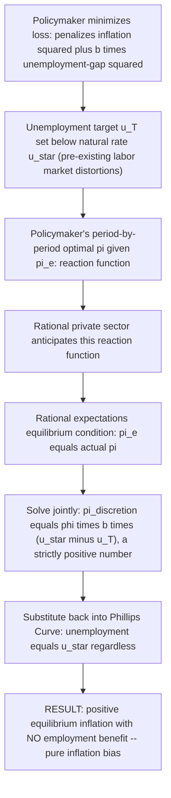
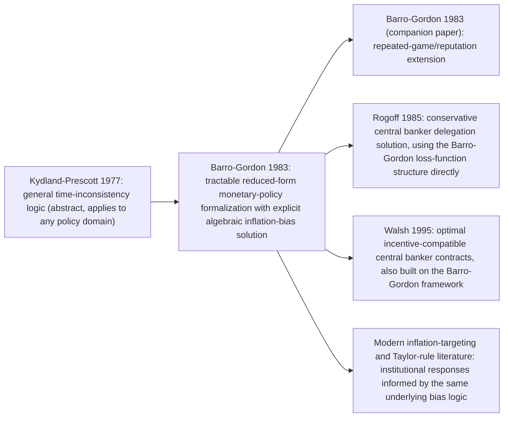

## The Barro-Gordon Model of Inflation Bias

### Origin and Purpose

The Barro-Gordon model, developed by Robert Barro and David Gordon in "A Positive Theory of Monetary Policy in a Natural Rate Model" (*Journal of Political Economy*, 1983) and its companion paper "Rules, Discretion and Reputation in a Model of Monetary Policy" (*Journal of Monetary Economics*, 1983), provides the standard, tractable reduced-form formalization of Kydland and Prescott's (1977) abstract time-inconsistency argument, applied specifically to monetary policy and inflation. Where Kydland-Prescott established the general logical structure of the credibility problem, Barro and Gordon supplied a simple loss-function/Phillips-Curve model that could be solved explicitly, generating a precise algebraic expression for the equilibrium "inflation bias" and enabling direct comparison of discretionary and rule-based regimes — making it the workhorse model used throughout the subsequent rules-versus-discretion and central-bank-design literature.

### Model Setup

#### The Policymaker's Loss Function

The central bank (or "policymaker") is assumed to minimize a period loss function penalizing both inflation and the deviation of unemployment from a **target** level $u^T$:

$$L(\pi, u) = \frac{1}{2}\pi^2 + \frac{b}{2}(u - u^T)^2, \quad b > 0$$

Two features of this specification are essential to the model's results:

- The loss function penalizes inflation symmetrically around zero (any inflation, positive or negative, is costly), reflecting costs such as menu costs, tax-system distortions from nominal bracket effects, and general inefficiencies of price-level uncertainty.
- Crucially, the unemployment **target** $u^T$ is assumed to be **below the natural rate** $u^*$: $u^T < u^*$. This is not an arbitrary assumption — it is typically justified by appeal to pre-existing real distortions in the labor market (income taxes, unemployment insurance generosity, union bargaining power, or other frictions that make the natural rate itself inefficiently high from a first-best social welfare perspective), giving the policymaker a genuine incentive to want unemployment lower than the natural rate would otherwise deliver, even though monetary policy cannot achieve this on a sustained basis.

#### The Expectations-Augmented Phillips Curve Constraint

The policymaker's loss minimization is constrained by the Friedman/Phelps expectations-augmented Phillips Curve:

$$u = u^* - \phi(\pi - \pi^e), \quad \phi > 0$$

Unemployment falls below the natural rate only when actual inflation $\pi$ exceeds expected inflation $\pi^e$ — the standard New Classical/Monetarist supply-side link between monetary surprises and real activity.

### Solving the Model Under Discretion

Under **discretion**, the policymaker chooses $\pi$ each period taking expected inflation $\pi^e$ as already fixed (since $\pi^e$ was formed by the private sector *before* the policymaker's current choice, based on rational anticipation of what the policymaker will do). Substituting the Phillips Curve constraint into the loss function:

$$L = \frac{1}{2}\pi^2 + \frac{b}{2}\left[u^* - \phi(\pi - \pi^e) - u^T\right]^2$$

Minimizing with respect to $\pi$ (first-order condition, setting $\partial L/\partial \pi = 0$):

$$\pi - b\phi\left[u^* - \phi(\pi - \pi^e) - u^T\right] = 0$$

Solving for the policymaker's optimal $\pi$ as a function of $\pi^e$ (the policymaker's **reaction function**):

$$\pi = \frac{b\phi^2}{1 + b\phi^2}\pi^e + \frac{b\phi(u^* - u^T)}{1+b\phi^2}$$

In **rational expectations equilibrium**, the private sector correctly anticipates this reaction function and sets $\pi^e$ equal to the policymaker's actual choice on average: $\pi^e = \pi$ in equilibrium. Imposing this consistency condition and solving:

$$\pi_{discretion} = \phi\, b\, (u^* - u^T)$$

Because $u^T < u^*$ and $\phi, b > 0$, this equilibrium inflation rate is **strictly positive** — the **inflation bias**. Substituting back into the Phillips Curve confirms that, in equilibrium, $\pi = \pi^e$, so $u = u^*$: **unemployment settles at exactly the natural rate**, identical to what it would be under any other inflation regime, since rational expectations always neutralize any systematic attempt to push unemployment away from $u^*$.

### Solving the Model Under a Credible Rule

Under a **credible, binding commitment** to zero inflation (a "rule"), the policymaker is constrained (by assumption of full credibility/commitment technology) to deliver $\pi = 0$ regardless of any period-by-period temptation to deviate. Because the rule is fully credible, the rational private sector believes it and sets $\pi^e = 0$ as well. Substituting into the Phillips Curve:

$$u = u^* - \phi(0 - 0) = u^*$$

$$\pi_{rule} = 0, \qquad u_{rule} = u^*$$

### The Comparison: Discretion Is Strictly Dominated

Comparing the two regimes directly:

| Variable | Discretion | Credible rule |
| --- | --- | --- |
| Equilibrium inflation | $\pi_{discretion} = \phi b (u^* - u^T) > 0$ | $\pi_{rule} = 0$ |
| Equilibrium unemployment | $u^*$ | $u^*$ |
| Loss $L$ | $\frac{1}{2}[\phi b(u^*-u^T)]^2 + \frac{b}{2}(u^*-u^T)^2$ | $\frac{b}{2}(u^* - u^T)^2$ |

Both regimes deliver **identical equilibrium unemployment** ($u^*$), but discretion delivers **strictly higher inflation** and, correspondingly, **strictly higher loss** — the extra loss under discretion, $\frac{1}{2}[\phi b(u^*-u^T)]^2$, is precisely the squared inflation term evaluated at the discretionary inflation rate, a pure deadweight cost with no offsetting benefit. This is the model's central, sharply stated policy conclusion: **a credible rule strictly dominates discretion**, in the specific sense that it achieves the same real outcome (unemployment at the natural rate) at strictly lower inflation cost.

### Comparative Statics: What Determines the Size of the Bias?

The inflation bias formula, $\pi_{discretion} = \phi\, b\, (u^* - u^T)$, yields clear, testable comparative-statics predictions:

- **Larger $\phi$** (steeper short-run Phillips Curve trade-off, i.e., inflation surprises are more effective at moving unemployment) → larger inflation bias, since a bigger short-run temptation to exploit the trade-off translates into a stronger equilibrium incentive that must be "priced in" by rational expectations.
- **Larger $b$** (policymaker places greater relative weight on unemployment versus inflation in the loss function) → larger inflation bias, since a policymaker who cares more about unemployment relative to inflation has a stronger temptation to attempt (unsuccessful) exploitation of the Phillips Curve.
- **Larger gap $(u^* - u^T)$** (a bigger pre-existing labor-market distortion pushing the natural rate above the policymaker's socially desired target) → larger inflation bias, since the underlying temptation to "correct" this gap via monetary surprise is proportionally larger.

These comparative statics directly motivate several of the institutional solutions developed in the subsequent literature: since the bias scales with $b$, **reducing the effective weight a policymaker places on unemployment** (Rogoff's conservative central banker) directly reduces the bias; since the bias scales with $(u^* - u^T)$, **reducing underlying labor-market distortions** (structural reforms lowering $u^*$ itself, or eliminating the rationale for $u^T < u^*$) also reduces the temptation and hence the equilibrium bias, even under discretion.

### Extension: Reputation and Repeated-Game Equilibria

Barro and Gordon's second 1983 paper extends the one-shot game above into an **infinitely repeated game** between the policymaker and the private sector, showing that reputational considerations can support inflation outcomes *between* the pure-discretion bias and the fully credible zero-inflation rule, without requiring an explicit, literally binding commitment technology:

- If the private sector adopts a "trigger strategy" — believing a low-inflation announcement as long as the policymaker has never previously reneged, but reverting to discretionary (high) expected inflation forever after any observed deviation — the policymaker faces an intertemporal trade-off: deviate today for a one-time surprise-inflation gain, versus maintain reputation for the discounted stream of future low-inflation-equilibrium loss reduction.
- If the policymaker's discount factor is sufficiently high (values the future enough relative to the present), a **reputational equilibrium** can sustain inflation below the one-shot discretionary bias $\pi_{discretion}$, though generally still above the fully credible-rule outcome $\pi_{rule} = 0$, since the reputational mechanism is generally imperfect (it relies on the punishment threat being credible and on there being no incentive for one final, unpunished-in-the-limit deviation).
- This result is important because it shows commitment/credibility can be *partially* achieved through purely non-institutional, game-theoretic means (reputation) even absent Rogoff-style delegation or explicit rules — though the resulting equilibrium is typically more fragile (subject to multiple equilibria, and vulnerable to reputational "resets" following observed deviations or exogenous shocks that temporarily raise the temptation to deviate) than a genuinely binding institutional commitment.

### Relationship to Other Models in the Rules-Versus-Discretion Literature

The Barro-Gordon model's specific algebraic tractability is what allowed it to become the common reference framework for essentially all subsequent institutional-design proposals addressing the credibility problem — Rogoff's conservative central banker and Walsh's optimal contracts are both typically presented and solved as direct modifications of the Barro-Gordon loss function or its underlying parameters ($b$, or the effective $u^T$), rather than as independent models built from scratch.

### Empirical Relevance and Critiques

- **Cross-country evidence on central bank independence and inflation**: the Barro-Gordon model's prediction that reducing effective policymaker discretion (or the effective weight on the output/unemployment objective) should lower average inflation is broadly consistent with empirical cross-country studies finding a negative association between central bank independence and average inflation (Alesina and Summers 1993; Cukierman et al.), often cited as indirect corroborating evidence for the model's mechanism, though such cross-country correlational evidence cannot fully isolate the specific time-inconsistency channel from other institutional or macroeconomic differences across countries. [Inference — the model's prediction is consistent with, but not uniquely confirmed by, this evidence, since alternative explanations for the independence-inflation correlation exist in the literature]
- **The assumption $u^T < u^*$ is doing significant work**: the entire inflation-bias result depends on the policymaker desiring unemployment below the natural rate; if $u^T = u^*$ (the policymaker's target coincides with the natural rate, i.e., no underlying temptation to exploit the Phillips Curve), the model predicts *zero* inflation bias even under full discretion — the bias is not an automatic feature of discretion per se, but specifically a consequence of the policymaker having a systematic incentive to push unemployment below its natural, efficient level.
- **Static, one-shot core model**: the baseline (non-reputational) Barro-Gordon model is a single-period game repeated identically without genuine dynamics or shocks; its stark, clean discretion-versus-rule dichotomy is a simplification relative to modern richer dynamic models incorporating stochastic shocks, in which some responsiveness (rather than a rigid zero-inflation rule) can be socially valuable — motivating the subsequent shift toward "flexible" or "constrained discretion" frameworks (Taylor rules, flexible inflation targeting) rather than literal adoption of the model's own rigid zero-inflation-rule prescription.

### Key Points

- The Barro-Gordon model (1983) formalizes Kydland-Prescott's time-inconsistency logic specifically for monetary policy, using a quadratic loss function over inflation and an unemployment gap, combined with the expectations-augmented Phillips Curve.
- The critical assumption generating the result is that the policymaker's unemployment target $u^T$ lies below the natural rate $u^*$, reflecting pre-existing labor-market distortions.
- Solving under rational-expectations discretion yields $\pi_{discretion} = \phi b (u^* - u^T) > 0$ — a positive equilibrium inflation bias — while equilibrium unemployment remains exactly at the natural rate $u^*$, identical to the outcome under a credible zero-inflation rule.
- Because the real outcome is identical either way, a credible rule strictly dominates discretion: it achieves the same unemployment at zero, rather than positive, inflation.
- Comparative statics show the bias grows with the steepness of the Phillips Curve ($\phi$), the policymaker's relative weight on unemployment ($b$), and the size of the underlying distortion ($u^* - u^T$) — directly motivating institutional remedies (conservative central bankers, independence, incentive contracts) that target these specific parameters.
- The companion reputation/repeated-game extension shows partial credibility can be sustained without formal commitment devices, though generally less robustly than genuine institutional commitment.

### Related Topics

- Time inconsistency and the credibility problem (Kydland-Prescott, the model's theoretical origin)
- Rules versus discretion in monetary policy
- Friedman's natural rate of unemployment hypothesis and the expectations-augmented Phillips Curve
- Rational expectations hypothesis
- Conservative central banker model (Rogoff 1985)
- Walsh's optimal contracts for central bankers
- Central bank independence and cross-country inflation evidence
- Reputation and repeated games in monetary policy
- Taylor rule and constrained discretion
- Political business cycle theory (Nordhaus)