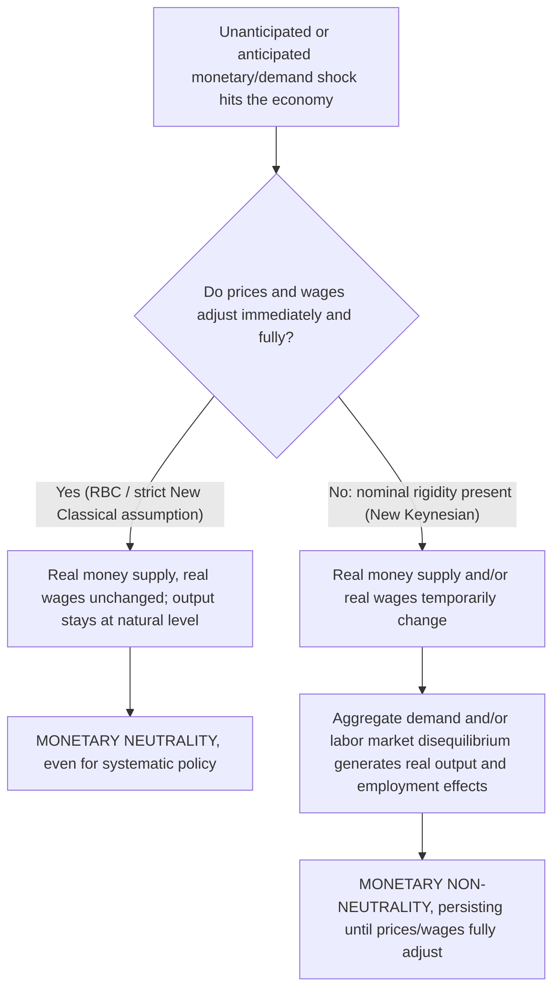

## Nominal Price and Wage Rigidities

### Definition and Theoretical Role

Nominal rigidities — the sluggish, incomplete, or delayed adjustment of prices and/or wages in response to shocks — are the central microfounded mechanism through which New Keynesian economics restores meaningful monetary non-neutrality within an otherwise rational-expectations, optimizing-agent framework. Where the original Keynesian tradition largely *assumed* sticky wages and prices as a stylized empirical fact, and Real Business Cycle/New Classical theory assumed continuous market clearing to derive strict neutrality, the New Keynesian research program (from the late 1970s onward) sought to **derive** nominal rigidity from the explicit, rational optimizing behavior of individual price- and wage-setters, thereby making it robust to the Lucas Critique and compatible with rational expectations. This closes the central theoretical gap left by the New Classical rebuttal of Keynesian economics: showing *why* rational agents would ever choose not to adjust prices/wages immediately and fully in response to a nominal shock.

### Why This Matters: The Non-Neutrality Result Requires Rigidity

Recall the basic logic established across the Keynesian and New Classical debates: in the IS-LM/AD-AS framework, monetary non-neutrality in the short run depends entirely on the price level $P$ not adjusting instantaneously and proportionally to a change in $M$. If $P$ is fully flexible, a change in nominal $M$ leaves the real money supply $M/P$, and hence the LM curve and equilibrium $Y$, unchanged — the classical neutrality result. New Keynesian theory's entire non-neutrality conclusion — including its contradiction of the strict Sargent-Wallace Policy Ineffectiveness Proposition — rests on providing a rigorous microfoundation for why $P$ (and nominal wages $W$) do *not* adjust immediately, even when all agents are fully rational and form expectations rationally.

### Categories of Nominal Rigidity

#### Price Stickiness (Goods Market)

Firms do not continuously re-optimize their posted prices in response to every shock; instead, prices remain fixed for some interval, or adjust only probabilistically or on a staggered schedule.

#### Wage Stickiness (Labor Market)

Nominal wages, similarly, are not continuously renegotiated; they are typically set via contracts (explicit union agreements or implicit understandings) that fix the nominal wage for a period, or adjust only gradually.

Both categories can independently generate monetary non-neutrality, and modern New Keynesian DSGE models typically incorporate both simultaneously, since empirical evidence supports meaningful stickiness in each market.

### Microfoundations of Price Stickiness

#### 1. Menu Costs (Mankiw 1985; Akerlof and Yellen 1985)

The **menu cost** theory posits a small, fixed real cost of changing a posted price (literally reprinting a menu, or more generally the managerial, informational, and customer-relations costs of a price change). The key theoretical insight, formalized by Mankiw, is that this individually small cost can generate **first-order aggregate effects from second-order individual losses**:

- For an individual firm facing a small nominal demand shock, the profit loss from *not* adjusting its price optimally is second-order (approximately zero, by the envelope theorem, near the firm's optimum) — so a small menu cost, even smaller than this small loss, can rationally deter the firm from adjusting.
- However, when *many* firms simultaneously fail to adjust for this reason, the *aggregate* consequence — a shortfall of aggregate demand relative to what fully flexible prices would have delivered — is first-order, because the externality each non-adjusting firm imposes on the rest of the economy (via the aggregate demand/aggregate price level channel) is not internalized in the individual firm's private menu-cost calculation.
- This is the theoretical justification for why apparently tiny frictions (menu costs are empirically small) can generate economically significant aggregate non-neutrality — a result sometimes called the "near-rationality" or "small menu cost" argument.

#### 2. Staggered Price/Wage Contracts (Fischer 1977; Taylor 1979)

Rather than relying on an explicit adjustment cost, the **staggered contracts** approach assumes prices (or wages) are set for a fixed nominal duration (e.g., one year), but different firms/workers set and reset their contracts at different, staggered points in time (not all resetting simultaneously). Even though each individual price-setter is fully rational and, at the moment of setting, chooses the price optimally given expectations of future conditions, the fact that not all prices reset at once means the *aggregate* price level adjusts only gradually and sluggishly to a shock, since at any given moment some fraction of prices are still "old," reflecting stale information/conditions. This was historically important because it demonstrated that rational expectations *combined with* staggered nominal contracts (rather than combined with continuous market clearing) restores real effects of systematic, anticipated policy — directly refuting the strict Sargent-Wallace Policy Ineffectiveness Proposition without abandoning rational expectations at all.

#### 3. Calvo Pricing (Calvo 1983)

The most widely used modern formalization in quantitative DSGE modeling: each period, each firm faces a fixed, exogenous probability $(1-\theta)$ of being able to reset its price, independent of how long it has held its current price (a memoryless, Poisson-style adjustment process). Firms that get to reset choose their price optimally, taking into account the probability that this price will remain in effect for a stochastic (geometrically distributed) duration into the future — hence forward-looking, rational expectations of future demand and cost conditions matter directly in the pricing decision. This specification yields substantial analytical tractability and, via aggregation across the continuum of firms, generates the **New Keynesian Phillips Curve**:

$$\pi_t = \beta E_t[\pi_{t+1}] + \kappa (Y_t - Y_t^*)$$

where $\kappa$ is a decreasing function of price stickiness (a larger $\theta$, more sticky prices, implies a smaller $\kappa$, a flatter Phillips Curve — inflation responds less to a given output gap the stickier prices are).

#### 4. Rotemberg Quadratic Adjustment Costs (Rotemberg 1982)

An alternative, mathematically convenient formalization: rather than a discrete probability of resetting, firms face a continuous, quadratic cost of *changing* their price (proportional to the squared percentage price change), smoothly penalizing large or rapid price adjustments. Rotemberg pricing yields a New Keynesian Phillips Curve of essentially the same reduced form as Calvo pricing under a first-order (linearized) approximation, and the two are often treated as observationally near-equivalent in standard applications, though they differ in welfare implications and higher-order dynamics.

### Microfoundations of Wage Stickiness

#### 1. Staggered Wage Contracts (Taylor 1979, 1980)

Analogous to staggered price contracts: nominal wages are set via overlapping, staggered multi-period contracts (explicit union agreements or implicit labor-market norms), so the aggregate nominal wage index adjusts only gradually to shocks, even though each individual wage-setting decision is fully rational and forward-looking at the moment it is made.

#### 2. Calvo-Style Wage Setting (Erceg, Henderson, and Levin 2000)

The direct labor-market analog of Calvo price-setting: each period, a fraction of workers/unions has the opportunity to reset their nominal wage, chosen optimally given the expected duration the new wage will remain in effect; the rest continue at their previously set wage (often partially indexed to lagged or steady-state inflation). This generates an analogous **New Keynesian Wage Phillips Curve**, linking wage inflation to expected future wage inflation and the labor-market "wage markup gap" (analogous to the output gap in the price Phillips Curve), and is now standard in medium-scale New Keynesian DSGE models (e.g., the influential Smets-Wouters framework) alongside price stickiness.

#### 3. Efficiency Wages

A distinct microfoundation, not primarily about nominal rigidity per se but about *real* wage rigidity: firms may pay wages above the market-clearing level to elicit worker effort, reduce shirking, lower turnover, or attract higher-quality applicants (Shapiro and Stiglitz 1984; Akerlof 1982's "gift exchange" variant). While efficiency-wage theory is more directly a theory of *real* wage rigidity and equilibrium involuntary unemployment than of *nominal* stickiness specifically, it is frequently invoked alongside nominal contract theories to explain why observed nominal (and real) wages fail to fall sufficiently during downturns to clear the labor market.

#### 4. Insider-Outsider Models (Lindbeck and Snower 1986, 1988)

Incumbent employed workers ("insiders") possess bargaining power (via turnover costs, hiring/training costs, or union representation) that unemployed "outsiders" lack, allowing insiders to negotiate wages above the market-clearing level without being undercut by outsiders willing to work for less — providing an institutional/bargaining-power explanation for persistent real wage rigidity and involuntary unemployment, complementary to but distinct from the menu-cost/staggered-contract nominal-rigidity literature.

### Empirical Evidence on the Frequency of Price and Wage Adjustment

Micro-level price data studies, using detailed scanner and CPI micro-data, have directly measured price-change frequencies, providing empirical grounding for the theoretical stickiness assumed in New Keynesian models:

- Bils and Klenow (2004), using US CPI micro-data, found substantially more frequent price changes than earlier researchers had assumed, with a median price duration considerably shorter than the roughly one-year assumption common in earlier calibrated models — a finding that generated significant subsequent debate about the appropriate degree of price stickiness to assume in quantitative DSGE models.
- Nakamura and Steinsson (2008) refined this picture, distinguishing regular price changes from temporary sales/promotions, and finding that once sales are excluded, the *median duration of regular prices* is considerably longer (closer to 8-11 months), broadly consistent with the moderate stickiness assumed in standard Calvo-style New Keynesian models. [Inference — reflects a commonly cited finding in the price-rigidity empirical literature, subject to ongoing measurement debate over how to treat sales/promotions]
- Wage stickiness evidence (e.g., from survey and administrative payroll data) generally finds substantial **downward nominal wage rigidity** — a marked reluctance of nominal wages to fall even during recessions, more pronounced than the corresponding rigidity in the *upward* direction — a pattern consistent with behavioral/fairness-based theories of money illusion in wage-setting (echoing Keynes's own original argument) as well as with efficiency-wage and insider-outsider mechanisms.

### The New Keynesian Phillips Curve as the Formal Summary

The combination of price (and, in extended models, wage) stickiness with rational expectations produces the **New Keynesian Phillips Curve (NKPC)**, the central reduced-form equation summarizing how nominal rigidity generates non-neutrality:

$$\pi_t = \beta E_t[\pi_{t+1}] + \kappa \, \widetilde{Y}_t$$

where $\widetilde{Y}_t = Y_t - Y_t^*$ is the output gap, and $\kappa$ is a composite parameter decreasing in the degree of price stickiness. This differs fundamentally from the older, backward-looking, adaptive-expectations Phillips Curve: it is **forward-looking** — current inflation depends on *expected future* inflation, not lagged inflation — a direct consequence of the forward-looking optimization embedded in the Calvo/Rotemberg/staggered-contract microfoundations, and it links non-neutrality directly and formally to the *degree* of nominal rigidity ($\kappa$), rather than treating stickiness as a fixed, unexplained institutional fact.

### Comparison Table: Sources of Non-Neutrality Across Schools

| School | Source of short-run non-neutrality | Is rigidity derived from optimization? |
| --- | --- | --- |
| Original Keynesian | Assumed downward nominal wage rigidity (money illusion, fairness) | No — largely posited as stylized fact |
| Monetarist (natural rate hypothesis) | Expectational lag (adaptive expectations), not rigidity per se | No — mechanism is informational/expectational, not price-setting frictions |
| New Classical / RBC | None — continuous market clearing assumed | N/A — neutrality/superneutrality is the result |
| New Keynesian | Menu costs, staggered contracts, Calvo/Rotemberg price and wage stickiness | Yes — derived from explicit rational optimization under an adjustment friction |

### Key Points

- Nominal price and wage rigidities are the New Keynesian mechanism for restoring monetary non-neutrality within a fully rational-expectations framework, directly addressing the gap left by New Classical models' assumption of continuous market clearing.
- Price stickiness is microfounded via menu costs (Mankiw; Akerlof-Yellen), staggered contracts (Fischer; Taylor), Calvo random-reset pricing (Calvo 1983), and Rotemberg quadratic adjustment costs — with Calvo pricing the dominant workhorse in modern quantitative DSGE models.
- Wage stickiness is microfounded analogously (staggered/Calvo wage contracts, Erceg-Henderson-Levin), and separately reinforced by efficiency-wage and insider-outsider theories of real wage rigidity and equilibrium unemployment.
- Micro price data (Bils-Klenow; Nakamura-Steinsson) provides direct empirical grounding for the degree of stickiness assumed in these models, with an active literature debating measurement details (particularly the treatment of temporary sales).
- The combination of nominal rigidity with rational expectations produces the forward-looking New Keynesian Phillips Curve, the central formal expression linking the degree of price stickiness to the strength of monetary non-neutrality.

### Related Topics

- Keynesian critique of monetary neutrality (the original, non-microfounded rigidity assumption)
- The New Keynesian Phillips Curve
- Policy ineffectiveness proposition (the New Classical result these rigidities directly overturn)
- Calvo pricing model and Rotemberg adjustment costs
- Menu cost theory and near-rational pricing (Mankiw; Akerlof-Yellen)
- Staggered contract models (Fischer 1977; Taylor 1979)
- Efficiency wage theory and insider-outsider models of unemployment
- Smets-Wouters medium-scale DSGE model
- Downward nominal wage rigidity and behavioral money illusion
- New Keynesian DSGE modeling and the three-equation model