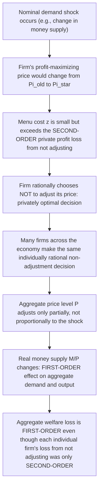
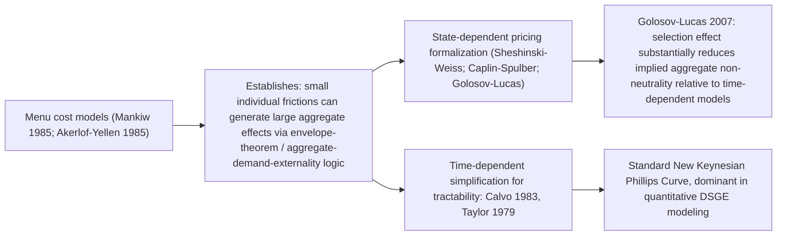

## Menu Cost Models of Price Stickiness

### Definition and Origin

Menu cost models formalize price stickiness by positing that firms face a small, fixed real cost of changing a posted nominal price — literally the cost of reprinting a menu, but more generally encompassing the managerial time, information-gathering, catalog reprinting, customer-communication, and administrative costs associated with a price revision. The term and its foundational formalization are due to N. Gregory Mankiw's "Small Menu Costs and Large Business Cycles: A Macroeconomic Model of Monopoly" (*Quarterly Journal of Economics*, 1985), developed contemporaneously with George Akerlof and Janet Yellen's "A Near-Rational Model of the Business Cycle, with Wage and Price Inertia" (1985). Together these papers supplied the first rigorous, optimization-based microfoundation for nominal price rigidity, directly answering the New Classical challenge (articulated via the Lucas Critique and the Policy Ineffectiveness Proposition) that Keynesian non-neutrality required an unexplained, ad hoc assumption of sticky prices.

### The Core Theoretical Insight: Second-Order Individual Losses, First-Order Aggregate Effects

The menu cost literature's central and most influential result is not merely that adjustment costs exist, but a specific argument about their **scale**: even a very *small* menu cost, far smaller than the welfare losses actually generated in the aggregate economy, can rationally deter individual price adjustment and produce economically significant, large-scale non-neutrality. This asymmetry between the size of the private friction and the size of its social consequence is the paper's key theoretical contribution.

#### The Envelope Theorem Argument

Consider a monopolistically competitive firm setting its price $P_i$ to maximize profit $\pi(P_i, P, Y)$, where $P$ is the aggregate price level and $Y$ is aggregate output/demand (both taken as given by the individual firm). At the firm's profit-maximizing price $P_i^*$, the first-order condition $\partial \pi/\partial P_i = 0$ holds. By the **envelope theorem**, a small deviation of the firm's actual price from its unconstrained optimum — for instance, because a nominal demand shock has shifted the optimal price slightly but the firm has not yet adjusted — produces only a **second-order** (i.e., proportional to the *square* of the deviation) loss in the firm's own profit:

$$\pi(P_i^*, P, Y) - \pi(P_i^{old}, P, Y) \approx \frac{1}{2}\pi''(P_i^*)(P_i^{old} - P_i^*)^2 = O(\varepsilon^2)$$

If the menu cost $z$ is small but still larger than this second-order private loss, it is **individually rational for the firm not to adjust its price** — the firm optimally tolerates a small private profit loss rather than pay even a small fixed cost to eliminate it.

#### The Aggregate Demand Externality

However, from the perspective of the aggregate economy, the firm's *failure to adjust* has a **first-order** effect: because the firm's price is now "too high" (or "too low") relative to the new aggregate price level consistent with market clearing, this contributes directly and proportionally (first-order) to a gap between actual and potential aggregate output — an **aggregate demand externality** the individual firm does not internalize in its private menu-cost calculation, since the firm cares only about its own profit function, not about the economy-wide consequence of its pricing decision for other firms' effective real prices and the resulting level of aggregate demand.

This is the paper's celebrated result: **"small menu costs can have large macroeconomic effects"** — the apparent puzzle of how tiny, empirically plausible adjustment costs could generate economically significant business-cycle non-neutrality is resolved by recognizing that the relevant comparison is not "is the menu cost small in absolute terms" but "is the menu cost small relative to the *individual* firm's loss from not adjusting" — a much lower bar than being small relative to the *aggregate* social loss.

### Formal Model Structure (Mankiw 1985)

Mankiw's original model considers a monopolist facing a downward-sloping demand curve, subject to an exogenous shift in nominal aggregate demand (e.g., via a money supply change). The monopolist's optimal response to the shock, absent adjustment costs, would be to change its price by some amount $\Delta P^*$. Given a menu cost $z$, the firm adjusts only if the profit gain from adjusting, $\Delta\pi = \pi(P^*) - \pi(P^{old})$, exceeds $z$:

$$\text{Adjust if and only if} \quad \Delta\pi > z$$

Because $\Delta\pi$ is approximately quadratic in the size of the underlying shock near the firm's optimum (per the envelope-theorem logic above), for **sufficiently small aggregate shocks**, $\Delta\pi < z$ even for small $z$, and the firm does not adjust — the price remains completely rigid in response to small nominal disturbances, while the same firm would adjust readily in response to a sufficiently large shock (since $\Delta\pi$ grows with the square of the shock size, eventually exceeding even a fixed $z$). This generates a natural **"zone of inaction"**: nominal price stickiness that is state-dependent — greater for small shocks, vanishing for large ones — a feature later formalized and extended in state-dependent pricing models (see below).

### Akerlof and Yellen's Near-Rationality Variant

Akerlof and Yellen's contemporaneous, complementary formalization emphasizes a related but distinct point: firms and workers need not be assumed to optimize with perfect, costless precision; **"near-rational"** behavior — failing to adjust prices or wages in response to small nominal shocks, even when a fully optimizing agent technically would benefit (by an amount smaller than any plausible cost of recalculation/attention) — can be individually optimal or near-optimal (costing the firm only a second-order amount) while still generating substantial, first-order aggregate business-cycle effects. This variant relaxes the requirement of a literal, explicit menu cost in favor of a broader argument about bounded rationality/costly optimization producing observationally similar aggregate stickiness — a precursor to later "rational inattention" approaches to nominal rigidity (e.g., Sims 2003; Mackowiak and Wiederholt 2009).

### State-Dependent Versus Time-Dependent Pricing

The menu cost literature is the origin of an important taxonomic distinction in New Keynesian price-setting theory:

| Pricing model type | Adjustment trigger | Representative models |
| --- | --- | --- |
| **Time-dependent pricing** | Price adjustment opportunities arrive on a fixed or exogenously random schedule, independent of the size of shocks | Calvo (1983): fixed probability of reset each period; Taylor (1979): fixed contract length |
| **State-dependent pricing** | Firms adjust precisely when the gap between actual and optimal price becomes large enough to justify paying the menu cost (an endogenous $(S,s)$-type trigger) | Original menu cost models (Sheshinski and Weiss 1977, applied to inflation; Caplin and Spulber 1987; Golosov and Lucas 2007 for multi-sector extensions) |

The original menu cost framework is inherently **state-dependent**: whether and when a firm adjusts depends on the size of the accumulated gap between its current price and its desired price, not on a fixed calendar schedule. This is theoretically more satisfying — it is derived directly from optimization rather than imposed as an exogenous probability — but is substantially more difficult to aggregate and solve in general equilibrium, which is a major reason the time-dependent Calvo framework became the dominant workhorse in quantitative DSGE modeling despite being less microfounded in this specific sense: Calvo pricing's fixed reset probability is a simplifying assumption *representing* the outcome of an underlying, unmodeled adjustment-cost process, whereas true state-dependent models derive the adjustment timing endogenously.

### The Golosov-Lucas Critique of Simple Menu Cost Models

Mikhail Golosov and Robert E. Lucas Jr., in "Menu Costs and Phillips Curves" (*Journal of Political Economy*, 2007), presented an influential quantitative challenge to the menu-cost literature's aggregate implications: in a fully specified, multi-sector state-dependent pricing model calibrated to match the *size and frequency* of individual price changes observed in micro data, the aggregate non-neutrality effects of monetary shocks turn out to be **quite small and short-lived** — much smaller than in equivalent time-dependent (Calvo) models calibrated to the same average price-change frequency. The intuition: in a state-dependent model, firms that happen to have accumulated the *largest* price gaps are precisely the ones most likely to adjust in any given period (a "selection effect" absent from time-dependent models, where the probability of adjustment is independent of how far a firm's price has drifted from optimal) — this selection effect means the aggregate price level adjusts much more responsively to an aggregate shock than a comparably calibrated time-dependent model would suggest, sharply reducing the model's implied monetary non-neutrality. This finding generated substantial subsequent debate and refinement (e.g., Midrigan 2011; Alvarez, Le Bihan, and Lippi 2016, incorporating multi-product firms and more realistic idiosyncratic shock processes to partially restore larger non-neutrality within richer state-dependent frameworks), and remains an active area of research regarding the correct quantitative magnitude of monetary non-neutrality implied by menu-cost-type microfoundations. [Inference — reflects an active, still-evolving area of the quantitative menu-cost literature rather than a fully settled consensus]

### Relationship to Other Nominal Rigidity Microfoundations

### Welfare Implications

Because menu cost models are explicitly optimization-based, they permit formal welfare analysis in a way that purely assumed rigidity cannot. The key results, broadly shared across the literature:

- Non-adjustment is **privately optimal but socially inefficient** — the aggregate demand externality means the market outcome (firms adjusting only when their own private menu-cost threshold is crossed) does not coincide with the socially optimal adjustment pattern, since firms do not internalize the effect of their pricing decisions on aggregate demand and on other firms' relative prices.
- This divergence between private and social optimality is the formal welfare-theoretic foundation for a role for **stabilization policy**: because the market failure (an uninternalized aggregate demand externality from staggered/incomplete price adjustment) is genuine, systematic monetary policy that stabilizes aggregate demand can, in principle, improve welfare relative to a purely passive policy — providing New Keynesian theory's formal justification for active stabilization policy, grounded in an actual, derived market failure rather than an assumed one.

### Key Points

- Menu cost models (Mankiw 1985; Akerlof-Yellen 1985) provide the founding rigorous microfoundation for New Keynesian price stickiness, based on a small, fixed cost of changing prices.
- The central theoretical result is that a small menu cost can rationally deter price adjustment because the individual firm's loss from not adjusting is only second-order (by the envelope theorem) near its profit-maximizing price, while the resulting aggregate effect on output, via an uninternalized aggregate demand externality, is first-order.
- This distinguishes menu cost models as inherently **state-dependent** (adjustment triggered by the size of the price gap) as opposed to the **time-dependent** Calvo/Taylor frameworks (adjustment triggered by an exogenous, size-independent probability or schedule) that became the dominant tractable workhorse in quantitative modeling.
- Golosov and Lucas's (2007) quantitative state-dependent model found a significant "selection effect" that substantially reduces the aggregate non-neutrality implied relative to comparably calibrated time-dependent models, spurring an active, ongoing literature refining state-dependent pricing's quantitative implications.
- Because menu cost models are derived from explicit optimization, they support formal welfare analysis, showing that the private-adjustment decision generates a genuine aggregate demand externality — the microfounded basis for a welfare-improving role for monetary stabilization policy.

### Related Topics

- Nominal price and wage rigidities (the broader category this model belongs to)
- Calvo pricing model and the time-dependent pricing tradition
- The New Keynesian Phillips Curve
- State-dependent versus time-dependent pricing models
- Golosov-Lucas selection effect in state-dependent pricing
- Near-rational behavior and rational inattention (Sims; Mackowiak-Wiederholt)
- Aggregate demand externalities and the welfare case for stabilization policy
- Sheshinski-Weiss (S,s) inventory/pricing models
- Multi-product firm pricing models (Midrigan 2011; Alvarez, Le Bihan, and Lippi)
- Lucas Critique and the demand for microfounded nominal rigidity