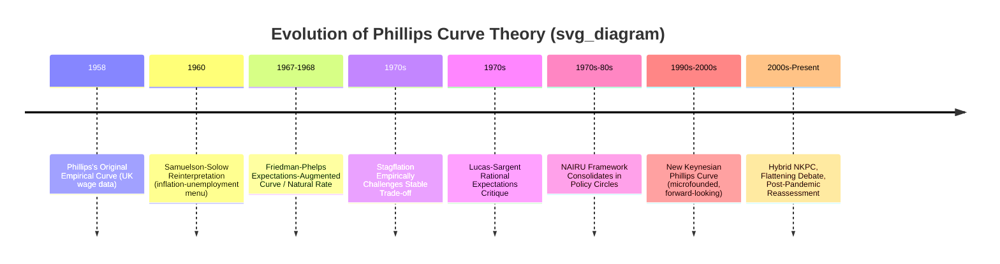

## The Phillips Curve and Its Historical Evolution

### Overview

The Phillips Curve describes the relationship between inflation and unemployment (or, in its original form, wage growth and unemployment), and its theoretical evolution over the past seven decades traces the broader development of macroeconomic thought — from a purely empirical regularity, through the monetarist and rational expectations critiques, to its modern microfounded incarnation in the New Keynesian Phillips Curve.

### Phase 1: Phillips's Original Empirical Finding (1958)

**Key Points**

- A.W. Phillips (1958) documented a stable, negative empirical relationship between the rate of change of nominal wages and the unemployment rate in UK data spanning roughly 1861-1957.
- The relationship was **not derived from any economic theory** — it was an atheoretical empirical regularity, observed from plotting historical data.
- The underlying intuition subsequently offered: low unemployment reflects a tight labor market, giving workers greater bargaining power to demand higher wages, and vice versa during high unemployment.

**Example**

- Samuelson and Solow (1960) reinterpreted and popularized Phillips's finding as a relationship between **price inflation** and unemployment (rather than wage inflation), suggesting policymakers faced a stable, exploitable **menu of choices**: they could choose a point along the curve, accepting somewhat higher inflation in exchange for lower unemployment, or vice versa.

### Phase 2: The Naive Policy Trade-off Era (1960s)

**Key Points**

- Throughout the 1960s, the Phillips Curve was widely treated by policymakers as a stable, structural, exploitable trade-off: governments could permanently lower unemployment by tolerating a somewhat higher, but stable, inflation rate.
- This view underpinned much Keynesian-influenced macroeconomic policy of the era, particularly in the United States and United Kingdom.

### Diagram: Original Phillips Curve (svg_diagram)

<svg xmlns="http://www.w3.org/2000/svg" viewBox="0 0 500 300">
\<style\>
.txt { font-family: Georgia, serif; font-size: 13px; fill: #222; }
.lbl { font-family: Georgia, serif; font-size: 11px; fill: #555; }
.axis { stroke: #333; stroke-width: 1.5; }
.curve { stroke: #333; stroke-width: 2; fill: none; }
\</style\>
<text x="10" y="20" class="lbl">Original (1960s) Phillips Curve: Stable Trade-off (svg_diagram)</text>
<line x1="60" y1="250" x2="60" y2="50" class="axis" />
<line x1="60" y1="250" x2="450" y2="250" class="axis" />
<text x="10" y="60" class="lbl">Inflation (π)</text>
<text x="390" y="270" class="lbl">Unemployment (u)</text>
<path d="M90,80 Q200,140 420,230" class="curve" />
<circle cx="150" cy="105" r="4" fill="#333" />
<text x="160" y="100" class="lbl">Low u, high π</text>
<circle cx="350" cy="200" r="4" fill="#333" />
<text x="290" y="220" class="lbl">High u, low π</text>
<text x="60" y="290" class="lbl">Policymakers viewed this as a stable menu of choices to exploit.</text>
</svg>

### Phase 3: The Monetarist Critique — Friedman and Phelps (1967-1968)

**Key Points**

- Milton Friedman (1968) and Edmund Phelps (1967) independently challenged the notion of a stable, exploitable long-run Phillips Curve trade-off.
- They introduced the concept of the **Natural Rate of Unemployment** (NRU): the unemployment rate consistent with stable inflation, determined by real structural labor market factors (frictions, institutions, demographics) rather than by monetary policy or the inflation rate.
- Central innovation: incorporating **inflation expectations** into the relationship, yielding the **expectations-augmented Phillips Curve**:

$$\pi_t = \pi_t^e - \alpha(u_t - u_n) + \nu_t$$

where $\pi_t^e$ is expected inflation, $u_n$ is the natural rate of unemployment, and $\nu_t$ is a supply shock term.

**Key Points**

- If expectations are formed **adaptively** (based on recently observed inflation), a temporary trade-off exists: policymakers can push unemployment below $u_n$ by generating inflation surprises, but only as long as actual inflation continues to exceed expected inflation.
- Crucially, **in the long run**, once expectations fully adjust ($\pi_t^e = \pi_t$), unemployment returns to $u_n$ regardless of the inflation rate — implying the **long-run Phillips Curve is vertical** at the natural rate.
- Attempting to permanently hold unemployment below $u_n$ via sustained monetary expansion leads only to **ever-accelerating inflation**, not a permanently lower unemployment rate — a result sometimes termed the **Non-Accelerating Inflation Rate of Unemployment (NAIRU)** framework.

### Phase 4: Empirical Vindication — The 1970s Stagflation

**Key Points**

- The 1970s experience of simultaneously rising inflation and rising unemployment (**stagflation**), driven substantially by oil price shocks (cost-push forces) combined with accommodative monetary policy, was widely interpreted as empirical vindication of the Friedman-Phelps critique.
- The apparent breakdown of the simple, stable 1960s-style Phillips Curve relationship in the data during this period severely undermined confidence in the naive exploitable trade-off view among both academics and policymakers.

### Phase 5: The Rational Expectations Revolution — Lucas, Sargent, Barro (1970s)

**Key Points**

- Robert Lucas, Thomas Sargent, and others extended the critique further by replacing **adaptive** expectations with **rational expectations**: agents use all available information (including knowledge of the policy rule itself) to form expectations, rather than mechanically extrapolating past inflation.
- Under rational expectations, even the **short-run** trade-off implied by Friedman-Phelps largely disappears for any **systematic, anticipated** monetary policy: if a policy rule is known and credible, agents will incorporate its effects into their expectations immediately, leaving no exploitable trade-off.
- Only **unanticipated** monetary policy shocks (surprises) can move unemployment away from the natural rate, and even then, only temporarily — a result known as the **Policy Ineffectiveness Proposition** (Sargent-Wallace, 1975).
- This was closely tied to the broader **Lucas Critique** (1976): reduced-form empirical relationships like the original Phillips Curve are not policy-invariant structural relationships, since the estimated correlation itself depends on the (potentially unstable) expectations-formation regime prevailing when the data were generated — a stable historical trade-off can break down entirely if policymakers attempt to exploit it, precisely because doing so changes agents' expectations.

### Diagram: Evolution Timeline (svg_diagram)

### Phase 6: The New Keynesian Phillips Curve (1990s-Present)

**Key Points**

- The modern **New Keynesian Phillips Curve (NKPC)** (see related topic) rebuilds the inflation-output relationship on explicit microfoundations, using Calvo pricing and rational, forward-looking expectations rather than backward-looking adaptive expectations:

$$\pi_t = \beta E_t[\pi_{t+1}] + \kappa \tilde{y}_t$$

- This resolves the Lucas Critique concern by deriving the relationship from deep structural parameters (price-setting frequency, discount factor) rather than treating it as an atheoretical correlation.
- **Hybrid versions** incorporating partial backward-looking indexation were developed to address the pure NKPC's empirical shortcomings in matching observed inflation persistence.

### The "Flattening" Phillips Curve Debate (2000s-Present)

**Key Points**

- A significant body of empirical research beginning in the 2000s and continuing since has documented an apparent **flattening** of the estimated (reduced-form, unemployment-based) Phillips Curve slope — inflation appears to respond much less to fluctuations in unemployment/output gaps than in earlier decades.
- Proposed explanations include: better-anchored inflation expectations (due to improved central bank credibility), increased globalization reducing the sensitivity of domestic inflation to domestic slack, and changes in labor market structure or firm pricing behavior.
- [Unverified] The degree, causes, and even the reality of Phillips Curve flattening remain actively debated in the empirical literature, with some studies finding a genuinely flatter slope and others attributing apparent flattening to measurement issues, nonlinearities (e.g., a flat curve at high unemployment but steeper near full employment), or sample-period sensitivity; any specific quantitative claim about the current slope should be checked against recent central bank research given the fast-evolving nature of this debate.
- This debate has direct implications for the amount of unemployment/output-gap variation central banks must tolerate or induce to achieve a given change in inflation, and became especially prominent again in analyses of both the pre-pandemic "missing inflation" puzzle and the post-pandemic 2021-2023 inflation surge and subsequent disinflation.

### Summary Table: Evolution of the Phillips Curve

| Era | Key Feature | Expectations | Long-Run Trade-off? |
| --- | --- | --- | --- |
| 1958 (Phillips) | Empirical, atheoretical | None modeled | Implicitly assumed stable |
| 1960s (Samuelson-Solow) | Policy menu interpretation | None modeled | Assumed exploitable |
| 1968 (Friedman-Phelps) | Expectations-augmented | Adaptive | No — vertical at $u_n$ |
| 1970s (Lucas-Sargent) | Rational expectations | Rational | No — even short-run, if anticipated |
| 1990s-present (NKPC) | Microfounded, forward-looking | Rational | No — vertical in steady state |

### Conclusion

The Phillips Curve's seven-decade evolution — from Phillips's atheoretical empirical wage-unemployment correlation, through the Samuelson-Solow policy-menu interpretation, the Friedman-Phelps natural rate and expectations-augmented critique, the Lucas-Sargent rational expectations revolution, and finally the microfounded New Keynesian Phillips Curve — represents one of the central narratives of modern macroeconomic theory. It illustrates the discipline's broader shift away from purely empirical, reduced-form relationships toward theoretically grounded, expectations-consistent structural models, while the ongoing "flattening" debate shows the relationship's empirical characterization remains an active and unsettled area of research.

**Related Topics**

- The New Keynesian Phillips Curve (detailed derivation)
- The Natural Rate of Unemployment and NAIRU
- Adaptive vs. rational expectations
- The Lucas Critique
- Demand-pull and cost-push inflation
- Stagflation and the 1970s oil shocks
- Sargent-Wallace Policy Ineffectiveness Proposition
- Central bank credibility and inflation expectations anchoring