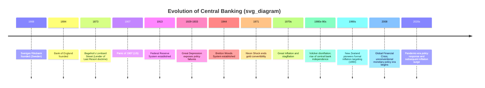

## History and Evolution of Central Banks

### Overview

The history of central banking traces the gradual transformation of institutions from narrow, often privately-owned entities serving government financing needs into the sophisticated, independent public institutions responsible for monetary policy, financial stability, and, in many cases, banking supervision that characterize the modern global financial system. This evolution reflects centuries of institutional learning, driven substantially by crises, wars, and the accumulated lessons of monetary mismanagement.

### Origins: Early Proto-Central Banks (17th-18th Centuries)

**Key Points**

- **Sveriges Riksbank** (Sweden, founded 1668) is widely credited as the world's oldest central bank still in existence, originally established to address problems arising from a preceding note-issuing bank's collapse (Stockholms Banco).
- **The Bank of England** (founded 1694) was established primarily to raise funds for King William III's war financing needs (against France) in exchange for granting the bank a monopoly on issuing government debt and, over time, an increasingly privileged position in the note-issuance business — the origin of the now-common central banking function of acting as the government's banker and debt manager.
- These early institutions were typically **privately owned, chartered corporations** granted specific privileges (note issuance, government banking business) by the state in exchange for financial services, rather than public institutions established explicitly to conduct monetary policy in the modern sense — the concept of active, discretionary monetary policy did not yet exist as a distinct institutional function.

### The 19th Century: Lender of Last Resort and the Gold Standard Era

**Key Points**

- Throughout the 19th century, many countries operated under the **classical gold standard**, under which domestic currency was convertible into a fixed quantity of gold, substantially constraining discretionary monetary policy, since money supply growth was tied to gold reserve flows (via the price-specie-flow mechanism).
- **Walter Bagehot's "Lombard Street" (1873)** articulated the influential doctrine of the central bank as **lender of last resort**: during a banking panic, the central bank should lend freely, against good collateral, at a penalty interest rate, to solvent but illiquid banks, in order to prevent a liquidity crisis from becoming a systemic banking collapse. This principle, developed from observing the Bank of England's evolving practice, remains a foundational element of modern central banking crisis-response doctrine.
- During this era, many central banks continued to be privately owned but increasingly took on public functions (crisis management, note issuance regulation) as governments recognized the systemic importance of a stable banking system.

### The Founding of the U.S. Federal Reserve (1913)

**Key Points**

- The United States notably lacked a permanent central bank for much of the 19th and early 20th centuries (following the expiration of the charters of the First and Second Banks of the United States in 1811 and 1836, respectively, amid political controversy over centralized financial power).
- A series of severe banking panics, most notably the **Panic of 1907**, exposed the fragility of the U.S. banking system in the absence of an institution capable of acting as lender of last resort, directly motivating Congress to establish the **Federal Reserve System** via the Federal Reserve Act of 1913.
- The Fed's original design reflected a distinctly American compromise between centralized authority and regional/private banking interests: a system of regional Federal Reserve Banks (partly owned by member commercial banks) overseen by a central Board, reflecting political concerns about concentrating monetary power in a single institution, whether public or private.

### The Interwar Period and the Great Depression

**Key Points**

- The interwar period exposed severe weaknesses in central bank policy coordination and crisis response, most dramatically during the onset of the **Great Depression** (1929-1933), when many economic historians (notably Friedman and Schwartz, in "A Monetary History of the United States") have argued the Federal Reserve's failure to act as an effective lender of last resort and its allowance of a sharp contraction in the money supply substantially deepened and prolonged the economic collapse.
- Widespread departure from the gold standard during the 1930s (the UK in 1931, the U.S. effectively in 1933-1934) granted central banks substantially greater discretionary monetary policy latitude, setting the stage for the more active policy role central banks would assume in subsequent decades.

### Diagram: Timeline of Central Banking Evolution (svg_diagram)

### Bretton Woods and the Post-War Era (1944-1971)

**Key Points**

- The 1944 **Bretton Woods Conference** established a system of fixed (but adjustable) exchange rates, with the U.S. dollar convertible into gold at a fixed rate and other major currencies pegged to the dollar, alongside the creation of the **International Monetary Fund (IMF)** and the **World Bank**.
- Under this system, central banks' primary role often centered on maintaining their currency's fixed exchange rate peg, constraining independent domestic monetary policy (the classic "impossible trinity" or "trilemma" of fixed exchange rates, free capital mobility, and independent monetary policy).
- The system collapsed in **1971** when the U.S., facing mounting gold outflows and inflationary pressures from Vietnam War and Great Society spending, suspended dollar-gold convertibility (the "Nixon Shock"), ushering in the modern era of floating exchange rates among major currencies.

### The Great Inflation and the Rise of Central Bank Independence (1970s-1980s)

**Key Points**

- The **Great Inflation** of the 1970s (driven by a combination of oil price shocks, accommodative monetary policy, and arguably inadequate theoretical understanding of the natural rate/expectations-augmented Phillips Curve at the time) severely damaged central bank credibility in many advanced economies.
- **Paul Volcker's** appointment as Federal Reserve Chair in 1979 and his subsequent aggressive monetary tightening (the "Volcker disinflation," involving a sharp, deliberate recession to break entrenched inflation expectations) is widely regarded as a pivotal episode demonstrating both the costs of, and the ultimate necessity for, credible anti-inflationary monetary policy.
- This experience, combined with academic developments in time-inconsistency theory (Kydland-Prescott, 1977; Barro-Gordon, 1983), which formally demonstrated that discretionary policy tends to produce an inflationary bias absent credible commitment mechanisms, substantially strengthened the intellectual and political case for **central bank independence** from short-term political pressure as an institutional solution to the time-inconsistency problem.
- Numerous countries subsequently granted their central banks greater legal independence and, in many cases, adopted explicit **inflation targeting** frameworks, beginning with **New Zealand in 1990**, followed by many other advanced and emerging economies through the 1990s and 2000s.

### The Great Moderation (Mid-1980s to 2007)

**Key Points**

- The period from roughly the mid-1980s to 2007 is often referred to as the **"Great Moderation,"** characterized by notably reduced volatility in output and inflation across many advanced economies, widely attributed (though not without ongoing debate regarding the relative contribution of good policy versus good luck/structural change) to improved monetary policy frameworks, greater central bank credibility, and better anchoring of inflation expectations.

### The 2008 Global Financial Crisis and Unconventional Monetary Policy

**Key Points**

- The 2008 financial crisis prompted central banks in major advanced economies to rapidly lower policy rates to (or near) the Zero Lower Bound, and subsequently to adopt a range of previously unconventional tools:
  - **Quantitative Easing (QE)**: large-scale asset purchases (government bonds, and in some cases other securities) aimed at lowering longer-term interest rates and easing broader financial conditions once conventional rate cuts were exhausted.
  - **Forward guidance**: explicit communication about the likely future path of policy rates, intended to shape expectations and ease financial conditions even without further immediate rate cuts.
  - **Expanded lender-of-last-resort facilities**, extending liquidity support well beyond traditional commercial banks to a broader range of financial institutions and markets during the acute phase of the crisis.
- This period also saw a significant expansion of central banks' **financial stability and macroprudential mandates**, reflecting lessons drawn from the crisis about the risks of focusing narrowly on price stability while neglecting broader financial system risks.

### The Post-Pandemic Period (2020s)

**Key Points**

- The COVID-19 pandemic prompted an unprecedented scale and speed of monetary (and fiscal) policy response, including renewed large-scale asset purchases and emergency lending facilities.
- The subsequent 2021-2023 global inflation surge — attributed by various analyses to a combination of pandemic-related fiscal stimulus, supply chain disruptions, and energy price shocks — prompted a rapid and substantial tightening cycle across many major central banks beginning in 2022, testing the credibility and communication frameworks built up over the preceding decades of central bank independence and inflation targeting.
- [Unverified] The current stance, policy frameworks, and institutional evolution of major central banks continue to develop; readers should consult current central bank publications and research for the latest developments given the rapidly evolving nature of this period.

### Key Institutional Themes Across the Historical Evolution

**Key Points**

1. **From private to public institutions**: A gradual shift from privately-owned, profit-motivated chartered banks toward publicly accountable institutions with explicit macroeconomic policy mandates.
2. **From passive to active policy**: A shift from central banks whose role was largely defined by note issuance and crisis lending toward institutions actively managing interest rates and the money supply to achieve macroeconomic objectives.
3. **From discretion to rules-based credibility**: A recurring institutional response to inflationary episodes has been the adoption of greater independence, transparency, and rules-based or target-based frameworks (inflation targeting) to solve the time-inconsistency problem inherent in purely discretionary policy.
4. **Expanding mandates**: Many central banks have progressively acquired broader responsibilities beyond pure price stability, including financial stability, banking supervision, and (in some cases and to varying degrees, subject to ongoing debate) employment objectives (e.g., the U.S. Federal Reserve's statutory dual mandate).

### Conclusion

The history of central banking reflects a centuries-long institutional evolution — from early, privately-chartered institutions serving government financing needs, through the development of lender-of-last-resort doctrine and gold standard constraints, to the modern era of independent, inflation-targeting central banks equipped with an expanding toolkit of conventional and unconventional policy instruments. Each major phase of this evolution has been substantially shaped by crises — banking panics, the Great Depression, the Great Inflation, the 2008 financial crisis, and the pandemic — that exposed the limitations of existing institutional arrangements and drove the adoption of new frameworks, doctrines, and degrees of independence.

**Related Topics**

- Central bank independence and the time-inconsistency problem
- Lender of last resort doctrine (Bagehot's principles)
- The Bretton Woods system and its collapse
- Inflation targeting frameworks
- The Volcker disinflation
- Quantitative easing and unconventional monetary policy
- The Great Moderation debate
- Central bank mandates: price stability vs. financial stability vs. employment