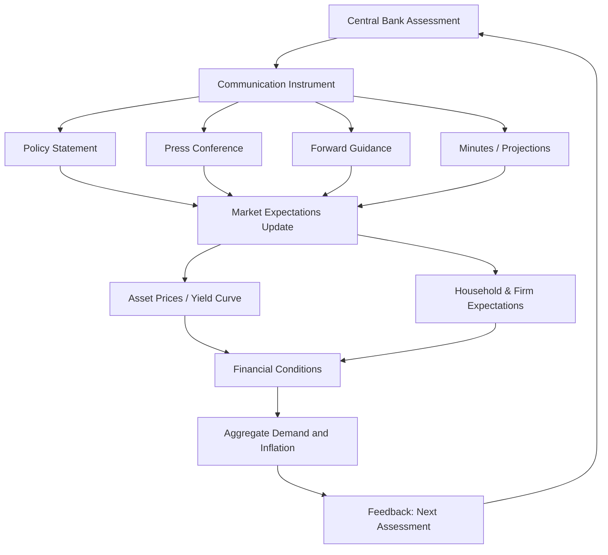

## Central Bank Communication Strategy

### Definition and Scope

Central bank communication strategy refers to the deliberate framework through which a monetary authority conveys information about its objectives, assessment of economic conditions, policy reaction function, and future intentions to financial markets, the public, and other stakeholders. It encompasses both the content of what is communicated and the channels, frequency, and format through which it is delivered.

Communication is treated as a monetary policy instrument in its own right, not merely as a byproduct of policy decisions. This shift, often summarized by the phrase "talk is monetary policy," reflects the recognition that central banks influence economic outcomes primarily through expectations, and that expectations are shaped as much by words as by actions.

### Theoretical Foundations

**Expectations channel**

Modern monetary policy transmission operates substantially through the expectations channel. Because most economically relevant interest rates are long-term or forward-looking (mortgage rates, corporate borrowing costs, asset prices), and because central banks directly control only a short-term policy rate, the effectiveness of policy depends on shaping expectations of the future path of that rate, of inflation, and of the central bank's reaction function.

$$i_t^{long} \approx \frac{1}{n}\sum_{k=0}^{n-1} E_t[i_{t+k}^{short}] + \text{term premium}$$

This expression, derived from the expectations hypothesis of the term structure, shows why communication about the expected future path of short rates directly affects long-term rates today, even absent any change in the current policy rate.

**Time consistency and credibility**

Communication strategy is closely tied to the time-inconsistency problem identified by Kydland and Prescott (1977) and Barro and Gordon (1983). A central bank that communicates a rule-like, predictable policy stance and adheres to it builds credibility, which lowers the sacrifice ratio (output cost) of disinflation. Communication is the mechanism by which a central bank demonstrates commitment to a stated framework rather than exercising discretion period-by-period.

**Social value of public information (Morris-Shin framework)**

Morris and Shin (2002) showed that public communication can, under certain conditions, be excessively weighted by agents relative to its informational precision (the "beauty contest" effect), potentially causing central bank statements to crowd out private information aggregation. [Inference] The practical implication debated in the literature is that central banks should calibrate the precision and clarity of their communication carefully, since ambiguous signals can be amplified rather than filtered by markets that place too much weight on public signals as a coordination device.

### Objectives of Central Bank Communication

- **Anchoring inflation expectations** — reducing the pass-through of transitory shocks into persistent inflation
- **Reducing policy uncertainty** — narrowing the distribution of market expectations about the future rate path, which lowers risk premia
- **Enhancing transmission efficiency** — allowing markets to price in policy changes before implementation, smoothing adjustment
- **Democratic accountability** — since most central banks operate with significant independence, communication substitutes for direct electoral accountability by explaining decisions to elected bodies and the public
- **Financial stability signaling** — conveying assessments of systemic risk, especially during crises

### Instruments and Channels of Communication

**Policy statements and rate announcements**

The formal statement accompanying a policy decision (e.g., the FOMC statement, ECB Governing Council statement) is the most immediate communication vehicle. Central banks calibrate specific language ("patient," "gradual," "data-dependent") as coded signals that markets parse closely; changes in wording between meetings are themselves informative even when the rate decision is unchanged.

**Press conferences**

Post-meeting press conferences (adopted by the Fed in 2011, standard at the ECB and BOE) allow real-time elaboration and Q&A, providing texture and context that a written statement cannot. This channel is higher-bandwidth but carries higher risk of unscripted remarks moving markets unexpectedly.

**Forward guidance**

A distinct and heavily studied sub-category, covered in depth as its own topic, but centrally a communication tool: guidance about the future path of the policy rate, typically taking one of three forms:

| Type | Description | Example |
| --- | --- | --- |
| Open-ended (qualitative) | General directional guidance without specific triggers | "Rates will remain low for an extended period" |
| Odyssean (state-contingent) | Commitment conditional on economic thresholds | "Rates will stay near zero until unemployment falls below 6.5%" |
| Delphic (forecast-based) | Central bank's own forecast of the economy and implied policy path | Fed's "dot plot" |

**Minutes and transcripts**

Publication of meeting minutes (with a lag, typically three to eight weeks) and, in some jurisdictions, full transcripts (released after five years, as with the Fed) provides deeper insight into the range of views and deliberation behind a decision, supporting the reaction-function-learning process for market participants.

**Monetary policy reports and economic projections**

Quarterly or semi-annual reports (e.g., the Fed's Summary of Economic Projections, ECB's Macroeconomic Projections) communicate the central bank's own forecasts for growth, inflation, and unemployment, often including a projected policy rate path.

**Speeches and testimony**

Individual policymaker speeches and legislative testimony (e.g., the Fed Chair's semiannual testimony to Congress under the Humphrey-Hawkins framework) allow for more nuanced or individualized communication, though they can introduce noise if speakers appear to disagree ("cacophony problem").

**Digital and simplified communication**

Increasingly, central banks use simplified public-facing materials (infographics, social media, plain-language summaries) to reach non-specialist audiences, reflecting a growing literature on the gap between expert and household inflation expectations.

### Communication Frameworks by Major Central Bank

**Federal Reserve**

The Fed's framework centers on the dual mandate (maximum employment, price stability) with an explicit 2% average inflation target under its 2020 Flexible Average Inflation Targeting (FAIT) framework, communicated via FOMC statements, the dot plot, and Chair press conferences.

**European Central Bank**

The ECB communicates via an introductory statement read by the President followed by a press conference, structured around its symmetric 2% medium-term inflation target (revised in the 2021 strategy review from "below, but close to, 2%").

**Bank of England**

Distinctive for its **Monetary Policy Report** and the historical requirement (since 1997) that the Governor write an open letter to the Chancellor if inflation deviates more than 1 percentage point from the 2% target, an explicit accountability mechanism embedded in communication design.

**Bank of Japan**

Historically associated with communication challenges around unconventional policy (Quantitative and Qualitative Monetary Easing, Yield Curve Control), including explicit commitments to overshoot its inflation target to escape deflationary expectations.

### Transparency Taxonomy (Geraats Framework)

Geraats (2002) decomposes central bank transparency into five dimensions, useful for classifying communication strategy comprehensively:

1. **Political transparency** — clarity of policy objectives (e.g., explicit inflation target)
2. **Economic transparency** — disclosure of data, models, and forecasts used
3. **Procedural transparency** — how decisions are made (voting records, minutes)
4. **Policy transparency** — prompt announcement of decisions and their rationale
5. **Operational transparency** — disclosure of implementation and transmission assessment

### Illustration: Communication Transmission Pathway

### Risks and Limitations

- **Overcommunication / cacophony** — multiple speakers with divergent emphasis can generate conflicting signals, increasing rather than decreasing uncertainty
- **Credibility loss from time inconsistency** — guidance that is later reversed (e.g., forced pivots after guidance-breaking shocks) can erode trust and raise term premia in subsequent cycles
- **Complexity vs. accessibility trade-off** — technically precise communication aimed at market professionals may be poorly understood by the general public, undermining the expectations-anchoring goal for households and firms
- **Market overreaction** — the Morris-Shin "beauty contest" effect means public signals can be overweighted relative to their true informational content, amplifying volatility around communication events
- **Zero lower bound complications** — when conventional rate cuts are exhausted, communication (forward guidance, QE signaling) must carry a disproportionate share of the easing burden, raising the stakes of clarity

### Measurement in Empirical Research

Researchers quantify communication's market impact using several methods:

- **Event-study methodology** — measuring high-frequency asset price changes in narrow windows around statement releases or press conferences to isolate the "surprise" component
- **Textual analysis / sentiment scoring** — applying natural language processing (dictionary-based or machine-learning classifiers) to statements and minutes to construct hawkish-dovish indices
- **Principal component decomposition of policy surprises** — separating a "target factor" (surprise in the current rate) from a "path factor" (surprise in the future guidance), following Gürkaynak, Sack, and Swanson (2005)

$$\Delta y_t = \beta_1 \cdot \text{TargetSurprise}_t + \beta_2 \cdot \text{PathSurprise}_t + \varepsilon_t$$

[Inference] This decomposition is widely used in the empirical literature to attribute yield curve movements specifically to the communication/guidance component of a policy announcement rather than to the contemporaneous rate action itself, though the precise factor loadings are estimation-method-dependent and vary across studies.

### Example: Interpreting a Coded Statement Change

**Example**

A stylized illustration of how a single word change is parsed by markets:

| Previous statement | Revised statement | Market interpretation |
| --- | --- | --- |
| "The Committee expects to raise rates at a gradual pace" | "The Committee expects to raise rates at an appropriate pace" | Removal of "gradual" often read as opening the door to faster tightening; short-end yields typically rise on the change |

[Unverified] The magnitude of market reaction to any specific wording change is highly context-dependent and cannot be generalized without examining the specific historical episode and prevailing market positioning at the time.

### Conclusion

Central bank communication strategy has evolved from an afterthought to a primary instrument of monetary policy, operating through the expectations channel to influence long-term rates, financial conditions, and ultimately inflation and output — often before any change in the policy rate itself takes effect. Its design involves balancing transparency against clarity, and predictability against necessary flexibility, all while maintaining credibility built through consistent alignment between words and subsequent actions.

**Related Topics**

- Forward guidance (Odyssean vs. Delphic)
- Inflation targeting frameworks
- Central bank independence and accountability
- Time inconsistency and the Kydland-Prescott critique
- Quantitative easing and unconventional monetary policy signaling
- Market-based measures of inflation expectations (breakevens, swaps)
- The Morris-Shin public information / beauty contest model
- Central bank credibility and reputation dynamics
- Textual analysis methods in monetary economics research