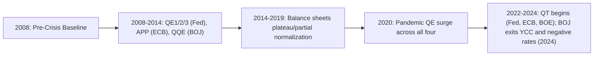

## Comparative Central Banking Across Major Economies

### Overview

Central banks share a common core mandate set — price stability, financial stability, and (variably) growth or employment support — but differ substantially in governance structure, instrument choice, target formulation, and accountability mechanisms. Comparative analysis of these institutions illuminates how legal mandates, historical crises, and political economy shape monetary policy transmission and credibility. This topic surveys the Federal Reserve System (US), European Central Bank (ECB), Bank of Japan (BOJ), Bank of England (BOE), People's Bank of China (PBOC), and briefly other systemically relevant central banks, focusing on structural comparison rather than any single institution's mechanics in isolation.

### Dimensions of Comparison

**Key Points**

- Legal mandate (single vs. dual vs. multiple objectives)
- Governance structure (centralized vs. federated/regional)
- Independence (goal independence vs. instrument independence)
- Policy target (inflation targeting, monetary targeting, exchange rate targeting, nominal GDP targeting)
- Primary and secondary policy instruments
- Accountability and transparency mechanisms
- Balance sheet size and composition relative to GDP

### Legal Mandates Compared

| Central Bank | Mandate Type | Statutory Objectives |
| --- | --- | --- |
| Federal Reserve | Dual mandate | Maximum employment, stable prices (and moderate long-term interest rates) |
| ECB | Hierarchical/primary | Price stability (primary); support general economic policies of the EU (secondary, without prejudice to price stability) |
| Bank of Japan | Price stability + financial system | Price stability, contributing to sound development of the national economy |
| Bank of England | Inflation target + financial stability | Price stability; subject to that, support government economic policy including growth and employment |
| PBOC | Multiple objectives | Currency stability (to promote economic growth), alongside financial stability and reform of the financial system |

The Federal Reserve's dual mandate is unusual among major central banks in giving employment formal, co-equal statutory weight alongside price stability. [Inference] Most economists characterize the ECB's mandate as more strictly hierarchical than the Fed's, since price stability is explicitly primary under the Treaty on the Functioning of the European Union, with other objectives subordinate to it. The PBOC's mandate is the most explicitly multi-objective, formally incorporating economic growth, employment, balance of payments, and financial reform alongside currency stability — reflecting its dual role as both a monetary authority and an instrument of state economic planning.

### Governance Structures

**Federal Reserve System**

A federated structure: the Board of Governors (7 members, Washington DC) sits atop 12 regional Federal Reserve Banks, each with its own president and board of directors drawn partly from local banking and business communities. Monetary policy is set by the Federal Open Market Committee (FOMC): the 7 Governors plus the New York Fed president (permanent voter) plus 4 of the remaining 11 regional presidents (rotating annually). This structure embeds regional representation directly into the policy-setting body, a design legacy of early-20th-century political compromise between centralized and decentralized banking models.

**European Central Bank**

A supranational structure atop 19 National Central Banks (NCBs) of the euro area, collectively the Eurosystem. The Governing Council (Executive Board of 6 members + governors of all euro-area NCBs) sets monetary policy. Since 2015, a rotation system limits voting rights among smaller-country governors as euro-area membership grows, to keep the Council operationally manageable. The ECB is unique among major central banks in operating monetary policy for a currency union without a corresponding fiscal or political union — a structural tension often termed the "incomplete union" problem.

**Bank of Japan**

A unitary structure with a Policy Board (Governor, 2 Deputy Governors, 6 other members) setting the Bank's monetary policy stance directly. Less federated than the Fed, more centralized in decision-making than the ECB's council of national governors.

**Bank of England**

Unitary, with the Monetary Policy Committee (MPC: Governor, 2 Deputy Governors, Chief Economist, and external members appointed by the Chancellor) responsible for the inflation target. Notably, the BOE's independence (1997) was explicitly instrument independence only — the government sets the inflation target; the MPC chooses how to hit it.

**People's Bank of China**

Operates under the State Council rather than as an independent body in the Western sense. The PBOC Monetary Policy Committee is advisory; ultimate policy authority rests with the State Council, and PBOC implements it. This is the clearest case of low goal and low instrument independence among the economies compared here.

```mermaid
flowchart TD
    subgraph FED["Federal Reserve (svg_diagram)"]
        FED_BOARD["Board of Governors (7)"] --> FED_FOMC["FOMC"]
        FED_REGIONAL["12 Regional Reserve Banks"] --> FED_FOMC
    end
    subgraph ECB["European Central Bank"]
        ECB_EXEC["Executive Board (6)"] --> ECB_GC["Governing Council"]
        ECB_NCB["19 National Central Banks"] --> ECB_GC
    end
    subgraph BOJ["Bank of Japan"]
        BOJ_PB["Policy Board (9)"] --> BOJ_DECISION["Monetary Policy Decision"]
    end
    subgraph BOE["Bank of England"]
        BOE_MPC["Monetary Policy Committee"] --> BOE_DECISION["Rate Decision"]
        BOE_GOV["HM Treasury sets inflation target"] --> BOE_MPC
    end
    subgraph PBOC["People's Bank of China"]
        PBOC_SC["State Council"] --> PBOC_MPC["PBOC Monetary Policy Committee (advisory)"]
        PBOC_MPC --> PBOC_IMPL["PBOC Implementation"]
    end
```

### Independence: Goal vs. Instrument

A standard analytic distinction (following Debelle and Fischer, and Fischer's later work) separates:

- **Goal independence**: the central bank itself defines the numerical target (e.g., "2% inflation")
- **Instrument independence**: the central bank is free to choose how to hit a target set externally

| Central Bank | Goal Independence | Instrument Independence |
| --- | --- | --- |
| Federal Reserve | High (Fed interprets "stable prices" itself; 2% target self-adopted in 2012) | High |
| ECB | High (Governing Council defines price stability operationally) | High |
| Bank of Japan | Moderate (2% target adopted jointly with government in 2013 accord) | High |
| Bank of England | Low on goal (Chancellor sets the inflation target annually) | High |
| PBOC | Low | Low-to-moderate |

[Inference] The Fed's and ECB's combination of high goal and high instrument independence is generally regarded by the central banking literature as the strongest form of legal independence among major economies, while the BOE represents a widely-cited "instrument independence without goal independence" model that other inflation-targeting central banks (e.g., New Zealand, Canada) have also adopted.

### Policy Targets and Frameworks

**Key Points**

- **Fed**: Flexible Average Inflation Targeting (FAIT, adopted 2020) around 2% PCE inflation, alongside "broad-based and inclusive" maximum employment goal
- **ECB**: Symmetric 2% HICP inflation target over the medium term (revised 2021 strategy review; previously "below, but close to, 2%")
- **BOJ**: 2% CPI target (since 2013 "Price Stability Target"), pursued via Yield Curve Control (YCC) from 2016 to March 2024, and quantitative/qualitative easing
- **BOE**: 2% CPI inflation target set annually by HM Treasury, with an explicit open letter requirement if inflation deviates more than 1 percentage point from target
- **PBOC**: Managed monetary aggregate and interest-rate corridor framework, with informal reference to money supply (M2) growth, credit aggregates (Total Social Financing), and a managed exchange rate band around the RMB central parity rate

$$\pi_t^{target} = 2\% \quad \text{(common nominal anchor across Fed, ECB, BOJ, BOE)}$$

The PBOC framework is structurally distinct: rather than a single nominal anchor, it manages multiple intermediate targets simultaneously (money supply growth, credit growth, exchange rate stability), reflecting the retained role of quantity-based and administrative tools (reserve requirement ratio changes, window guidance to banks) alongside price-based tools (the 7-day reverse repo rate, loan prime rate).

### Instrument Comparison

| Instrument | Fed | ECB | BOJ | BOE | PBOC |
| --- | --- | --- | --- | --- | --- |
| Primary policy rate | Federal Funds Rate (target range) | Deposit Facility Rate | Short-term policy rate (post-YCC exit) | Bank Rate | 7-day Reverse Repo Rate / Loan Prime Rate (LPR) |
| Reserve requirements | Rarely used (near-zero since 2020) | Minor role | Minor role | Not used as active tool | Actively used (Reserve Requirement Ratio, RRR) |
| Balance sheet tool | Large-Scale Asset Purchases (QE), Quantitative Tightening (QT) | Asset Purchase Programme (APP), Pandemic Emergency Purchase Programme (PEPP) | Massive QQE, ETF purchases, former YCC | QE via Asset Purchase Facility | Medium-term Lending Facility (MLF), targeted RRR cuts |
| Forward guidance | Dot plot (Summary of Economic Projections) | Explicit calendar/state-based guidance (varies by period) | Explicit commitment to overshoot 2% before tightening | Minutes-based guidance | Less formalized; policy signaled via state media and window guidance |

[Inference] The PBOC's heavier reliance on quantitative and administrative instruments (RRR, window guidance, credit quotas) relative to the price-based instruments dominant at the Fed, ECB, and BOE reflects both the shallower depth of Chinese capital markets historically and the PBOC's role in supporting state industrial policy objectives, rather than pure inflation-targeting logic.

### Balance Sheet Size Comparison (Illustrative, Post-2008 to Post-Pandemic Era)

The BOJ's balance sheet as a share of GDP has been the largest among G7 central banks for most of the post-2013 period, a direct consequence of prolonged Quantitative and Qualitative Monetary Easing (QQE) aimed at overcoming persistent deflationary pressure. [Unverified] Precise current balance-sheet-to-GDP ratios shift quarter to quarter and should be checked against each institution's latest published balance sheet data rather than treated as static figures.

### Exchange Rate Regime Interaction

- **Fed, ECB, BOJ, BOE**: Operate under floating exchange rate regimes; exchange rates are not policy targets, though they factor into inflation forecasts via import price channels
- **PBOC**: Operates a managed float (a "managed floating exchange rate regime based on market supply and demand with reference to a basket of currencies") with daily central parity rate fixing and permitted trading bands — meaning exchange rate management is a live, active instrument rather than an incidental byproduct of interest rate policy

This distinction matters for monetary policy autonomy under the classic **Impossible Trinity** (Mundell-Fleming trilemma): a country cannot simultaneously maintain free capital mobility, a fixed exchange rate, and independent monetary policy.

$$\text{Free Capital Mobility} + \text{Fixed Exchange Rate} + \text{Independent Monetary Policy} = \text{Impossible}$$

China manages this trilemma by retaining capital controls, allowing it to combine a managed exchange rate with a degree of independent monetary policy — a combination unavailable to the Fed, ECB, BOJ, or BOE, all of which have chosen full capital mobility and float their currencies (or, in the ECB's case, share one).

(svg_diagram) Impossible Trinity Triangle

<svg xmlns="http://www.w3.org/2000/svg" viewBox="0 0 500 460">
<text x="250" y="30" font-size="18" font-weight="bold" text-anchor="middle" fill="#1a1a1a">Impossible Trinity (svg_diagram)</text>
<polygon points="250,70 60,400 440,400" fill="none" stroke="#2b6cb0" stroke-width="3" />
<text x="250" y="60" font-size="14" text-anchor="middle" fill="#1a1a1a">Fixed Exchange Rate</text>
<text x="40" y="425" font-size="14" text-anchor="middle" fill="#1a1a1a">Free Capital Mobility</text>
<text x="460" y="425" font-size="14" text-anchor="middle" fill="#1a1a1a">Independent Monetary Policy</text>
<circle cx="150" cy="235" r="6" fill="#c53030" />
<text x="150" y="220" font-size="12" text-anchor="middle" fill="#c53030">PBOC (managed)</text>
<circle cx="350" cy="235" r="6" fill="#2f855a" />
<text x="350" y="220" font-size="12" text-anchor="middle" fill="#2f855a">Fed / BOE / BOJ</text>
<circle cx="250" cy="400" r="6" fill="#2f855a" />
<text x="250" y="418" font-size="12" text-anchor="middle" fill="#2f855a">ECB (shared currency)</text>
</svg>

### Accountability and Transparency Mechanisms

| Mechanism | Fed | ECB | BOJ | BOE | PBOC |
| --- | --- | --- | --- | --- | --- |
| Legislative testimony | Semi-annual Monetary Policy Report to Congress | European Parliament hearings (Quarterly Monetary Dialogue) | Diet testimony as requested | Treasury Select Committee hearings | Limited direct legislative testimony |
| Minutes publication | FOMC minutes (3-week lag) | ECB "Accounts" of monetary policy meetings | BOJ Policy Board minutes | MPC minutes published with rate decision | Not systematically published |
| Open letter/override mechanism | None formal | None | None | Governor's open letter to Chancellor if inflation misses target by >1pp | N/A (subordinate to State Council) |
| Individual member voting disclosed | Yes (dissents named) | No (single Council decision, no individual votes published) | Yes | Yes | No |

[Inference] The BOE's open-letter mechanism is often cited in the literature as one of the most explicit, codified accountability devices among major central banks, precisely because the BOE lacks goal independence — the mechanism functions as the visible enforcement channel for the externally-set target.

### Crisis Response Comparison (2008 GFC and 2020 Pandemic)

**Example**

During the 2008 Global Financial Crisis, the Fed moved first and most aggressively into unconventional policy, cutting the federal funds rate to the zero lower bound by December 2008 and launching large-scale asset purchases in 2008–2009. The ECB, constrained by a currency union spanning heterogeneous member-state fiscal positions, moved more cautiously and later faced a distinct second crisis (the 2010–2012 European sovereign debt crisis) that required bespoke tools such as Outright Monetary Transactions (OMT, announced 2012 but never activated) and later the Public Sector Purchase Programme (2015). The BOJ, already near the zero lower bound since the late 1990s, had comparatively little conventional room and leaned further into balance-sheet expansion. During the 2020 pandemic, all four institutions moved in close temporal alignment — rapid rate cuts (where room existed), emergency asset purchase programs, and expanded liquidity facilities — reflecting a globally synchronized shock in a way the 2008 and 2010–2012 episodes were not.

### Negative Interest Rate Policy (NIRP): A Divergence Point

The BOJ (2016–2024) and ECB (2014–2022) both adopted negative policy rates on excess reserves, a step the Fed and BOE deliberately avoided despite discussion during their own low-rate periods. [Inference] The Fed's reluctance is often attributed to concerns about money market fund viability and bank profitability transmission channels specific to the US financial structure, while the ECB's and BOJ's adoption reflected more acute and persistent deflationary/disinflationary pressure and a shallower conventional policy space. The BOJ's March 2024 exit from negative rates and yield curve control marked the end of the last major NIRP regime among the economies compared here.

### Comparative Table: Snapshot Summary

| Feature | Fed | ECB | BOJ | BOE | PBOC |
| --- | --- | --- | --- | --- | --- |
| Mandate | Dual | Price stability primary | Price stability | Price stability primary | Multiple |
| Structure | Federated | Supranational/federated | Unitary | Unitary | State-subordinate |
| Inflation target | 2% (flexible average) | 2% (symmetric, medium-term) | 2% | 2% (government-set) | No formal single target |
| Exchange rate regime | Free float | Free float (shared currency) | Free float | Free float | Managed float with capital controls |
| NIRP history | No | Yes (2014–2022) | Yes (2016–2024) | No | No |
| Instrument independence | High | High | High | High | Low-moderate |

### Conclusion

Comparative central banking reveals that "independent, inflation-targeting central bank" is not a single template but a family of institutional variants shaped by legal tradition (Fed's federated compromise vs. ECB's supranational treaty basis), historical crisis experience (BOJ's multi-decade deflation fight, ECB's sovereign debt crisis), and political economy (PBOC's integration into state economic planning). The trilemma framework, independence taxonomy (goal vs. instrument), and mandate structure (single vs. dual vs. multiple objectives) provide the core analytical tools for situating any additional central bank (e.g., the Reserve Bank of India, Bank of Canada, or Swiss National Bank) within this comparative space.

**Related Topics**

- The Impossible Trinity / Mundell-Fleming Trilemma in depth
- Central bank independence: theoretical foundations (Kydland-Prescott time inconsistency, Barro-Gordon model)
- Inflation targeting frameworks: strict vs. flexible vs. average inflation targeting
- Quantitative easing transmission channels and balance sheet normalization (QT)
- The Eurosystem's institutional design and the euro area's "incomplete union" debate
- Emerging market central banking and the "fear of floating" hypothesis
- Central Bank Digital Currencies (CBDCs) across jurisdictions (e-CNY, digital euro, FedNow distinction)
- Financial stability mandates and macroprudential policy tools by jurisdiction