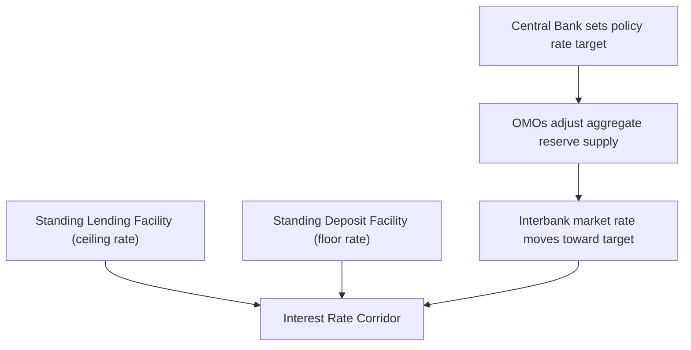
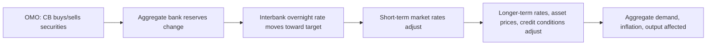

## Open Market Operations

### Definition and Role

Open market operations (OMOs) are the purchase and sale of securities — predominantly government securities — by a central bank in the open market, conducted to influence the level of reserves in the banking system and thereby steer short-term interest rates toward a policy target. OMOs are the primary and most flexible instrument of monetary policy implementation for most major central banks, preferred over reserve requirement changes or direct lending because they can be executed in precise, reversible, and frequently adjustable amounts.

### Mechanics: How OMOs Affect Reserves

**Key Points**

- A central bank purchase of securities credits the seller's bank with new reserves, increasing aggregate reserves in the banking system
- A central bank sale of securities debits the buyer's bank's reserve account, decreasing aggregate reserves
- Changes in aggregate reserve supply shift the equilibrium in the market for reserves, moving the short-term interbank interest rate
- The transaction is conducted with a central bank's balance sheet, so purchases expand the balance sheet (asset side: securities; liability side: reserves) and sales contract it

$$\Delta R = \Delta S_{CB}$$

where $\Delta R$ is the change in aggregate bank reserves and $\Delta S_{CB}$ is the change in central bank securities holdings from an OMO.

### Types of Open Market Operations

**Outright Operations**

Permanent purchases or sales of securities, with no agreement to reverse the transaction. Used for durable, longer-lasting adjustments to the securities portfolio and reserve base — for example, the large-scale asset purchase programs (quantitative easing) conducted by the Federal Reserve, ECB, and Bank of Japan involved outright purchases of government bonds (and in some cases other assets) held on the balance sheet for extended periods.

**Repurchase Agreements (Repos) and Reverse Repos**

Temporary operations with a built-in reversal date:

- A **repo** (repurchase agreement): the central bank purchases securities from a counterparty with an agreement that the counterparty will repurchase them at a specified future date and price — this *injects* reserves temporarily
- A **reverse repo**: the central bank sells securities with an agreement to repurchase them later — this *drains* reserves temporarily

Repos and reverse repos are the workhorse tools for **fine-tuning** operations — day-to-day or week-to-week adjustments that offset transient fluctuations in autonomous factors (e.g., currency in circulation, Treasury account balances) without altering the durable size of the balance sheet.

| Operation Type | Reserve Effect | Duration | Typical Use |
| --- | --- | --- | --- |
| Outright purchase | Increase (permanent) | Indefinite (held to maturity or sold) | Structural liquidity provision, QE |
| Outright sale | Decrease (permanent) | Indefinite | Structural liquidity absorption, QT |
| Repo | Increase (temporary) | Overnight to several months | Short-term reserve injection, fine-tuning |
| Reverse repo | Decrease (temporary) | Overnight to several months | Short-term reserve drain, fine-tuning |

### Classification by Objective

Central banks (following ECB terminology, broadly applicable across systems) typically classify OMOs into:

1. **Main refinancing operations**: Regular, typically weekly, operations that provide the bulk of liquidity to the banking system and signal the primary policy stance
2. **Longer-term refinancing operations**: Operations at longer maturities (e.g., 3-month, 1-year, or multi-year in the ECB's Targeted Longer-Term Refinancing Operations, TLTROs) providing more durable liquidity
3. **Fine-tuning operations**: Ad hoc operations executed as needed to manage unexpected liquidity fluctuations and keep short-term rates near target, especially around reserve maintenance period ends
4. **Structural operations**: Operations intended to adjust the central bank's structural liquidity position vis-à-vis the banking sector over the longer run

### Standing Facilities vs. Open Market Operations

**Key Points**

- OMOs are initiated at the central bank's discretion, at a time and size of its choosing
- Standing facilities (e.g., the Fed's discount window, the ECB's marginal lending facility and deposit facility) are initiated at counterparties' discretion, available on demand at a pre-announced rate
- Standing facilities typically set the **outer bounds (ceiling and floor)** of the interest rate corridor, while OMOs manage reserve supply to keep the market rate near the target within that corridor

### The Federal Reserve's Implementation Framework

**Pre-2008 (Scarce Reserves / Corridor System)**

The Fed targeted the federal funds rate by adjusting the aggregate quantity of reserves through frequent, small-scale repo and reverse repo operations conducted by the New York Fed's trading desk, exploiting a reserve demand curve that was steep (reserves were scarce relative to requirements) so small quantity changes produced meaningful rate movements.

**Post-2008 (Abundant Reserves / Floor System)**

Following large-scale asset purchases (QE1, QE2, QE3), the banking system moved to a regime of abundant reserves, where the traditional quantity-based approach to rate-setting became ineffective (the reserve demand curve became flat in the relevant region). The Fed shifted to primarily using administered rates — **Interest on Reserve Balances (IORB)** and the **Overnight Reverse Repo (ON RRP) facility rate** — to set a floor under short-term rates, with traditional OMOs now playing a smaller role in day-to-day rate-setting and a larger role in managing the *size* of the balance sheet (QE/QT) rather than fine-tuning the *rate*.

$$i_{FFR} \approx i_{IORB} \quad \text{(in an abundant-reserves regime, subject to spread and market frictions)}$$

[Inference] This shift from a quantity-based corridor system to a floor system with abundant reserves is generally regarded in the literature as a structural change in monetary policy implementation, not merely a temporary crisis response, given that the Fed has not returned to reserve scarcity as of recent years.

### Standard Operational Sequence (Illustrative)

**Example**

1. The central bank's trading desk estimates the day's autonomous factor flows (changes in currency in circulation, government deposits, foreign operations) that would otherwise move reserves away from the desired level
2. The desk calculates the size and direction of the OMO needed to offset these flows and keep reserves at the level consistent with the rate target
3. The desk announces an operation (e.g., "3-day repo operation, $50 billion") to a set of eligible counterparties (primary dealers, or in some systems, a broader set of counterparties)
4. Eligible counterparties submit bids specifying quantity and rate
5. The desk allocates the operation via auction (fixed-rate full allotment, or variable-rate/multiple-rate auction depending on regime) and settles the transaction, crediting or debiting counterparty reserve accounts accordingly

### Collateral and Eligible Counterparties

OMOs are typically collateralized by high-quality, liquid securities — predominantly domestic government debt, though eligible collateral has been expanded during crises to include agency mortgage-backed securities (Fed), covered bonds and corporate bonds (ECB), and even equity ETFs (Bank of Japan, as part of its broader asset purchase program, atypical relative to other major central banks). Eligible counterparties are usually a defined set of financial institutions (primary dealers in the US system, a broader set of eligible counterparties meeting capital and operational requirements under the ECB's framework) rather than the general public.

### Quantitative Easing and Tightening as Extended OMOs

**Key Points**

- **Quantitative Easing (QE)**: large-scale, sustained outright purchases of longer-dated securities, undertaken when the policy rate is at or near the zero (or effective) lower bound, aiming to lower longer-term yields and ease broader financial conditions via portfolio rebalancing and signaling channels
- **Quantitative Tightening (QT)**: the reverse process — allowing securities to mature without reinvestment (passive runoff) or actively selling securities (active QT), shrinking the balance sheet and draining reserves
- QE/QT operate through the same underlying transaction mechanics as conventional OMOs but are distinguished by scale, maturity focus (often longer-dated securities), and the explicit balance-sheet-size objective rather than short-term rate fine-tuning

[Inference] Most central bank communications distinguish balance-sheet policy (QE/QT) from conventional OMOs primarily by intent and scale rather than by any difference in the underlying transaction type, since both are executed as purchases or sales of securities in the open market.

### Transmission Channel Summary

### Comparative Note Across Central Banks

| Central Bank | Primary OMO Tool | Typical Frequency |
| --- | --- | --- |
| Federal Reserve | Repo/reverse repo operations, outright Treasury/MBS purchases | Daily (repo), periodic (outright) |
| ECB | Main refinancing operations (MROs), Longer-Term Refinancing Operations (LTROs), Asset Purchase Programme | Weekly (MRO), periodic (LTRO/APP) |
| Bank of Japan | Outright JGB purchases, funds-supplying operations | Frequent, large-scale during QQE era |
| Bank of England | Short-term repo operations, Asset Purchase Facility | Weekly/as needed |

### Conclusion

Open market operations remain the principal transmission mechanism through which central banks translate a policy rate decision into actual conditions in the banking system, whether through traditional reserve-scarcity fine-tuning, an abundant-reserves floor system anchored by administered rates, or large-scale balance sheet operations such as QE and QT. Understanding OMOs requires distinguishing the *type* of operation (outright vs. repo/reverse repo), its *objective* (structural vs. fine-tuning vs. balance-sheet-size), and the *operating regime* (corridor vs. floor) in which a given central bank currently implements policy.

**Related Topics**

- The corridor system vs. floor system of interest rate implementation
- Standing facilities: discount window, marginal lending facility, deposit facility
- Reserve requirements as a monetary policy instrument
- Quantitative easing transmission channels (portfolio rebalancing, signaling, duration extraction)
- The Fed's repo market operations and the September 2019 repo rate spike episode
- Central bank balance sheet normalization strategies (passive vs. active QT)
- The ECB's TLTRO program design and bank funding incentives
- Money market rate benchmarks (SOFR, €STR, TONAR) and their relationship to policy rates