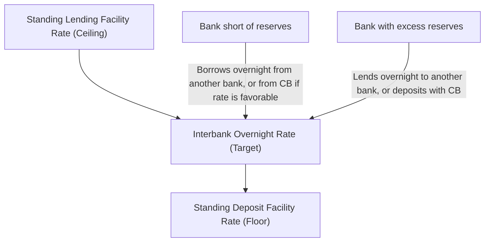

## Discount Window and Standing Lending Facilities

### Definition and Role

Standing lending facilities are central bank credit facilities that eligible counterparties (typically depository institutions) can access on demand, at their own initiative, against eligible collateral, at a pre-announced interest rate. Unlike open market operations — which the central bank initiates at a time and size of its choosing — standing facilities are counterparty-initiated, providing an always-available backstop source of liquidity. The Federal Reserve's version is termed the **discount window**; the ECB's equivalent is the **marginal lending facility**; the Bank of England's is the **Operational Standing Facility**; the Bank of Japan's is the **Complementary Lending Facility**. These facilities serve as the **ceiling** of the interest rate corridor within which the policy rate is meant to trade.

### Role in the Interest Rate Corridor

**Key Points**

- The **standing lending facility rate** sets an effective ceiling on the overnight interbank rate: no rational bank would borrow from another bank at a rate above what it could obtain from the central bank on demand
- The **standing deposit facility rate** sets a floor: no rational bank would lend reserves in the interbank market below what it could earn depositing with the central bank
- The gap between these two rates is the **interest rate corridor** (or "channel"), within which open market operations attempt to keep the market rate near the target
- A narrower corridor generally produces less interbank rate volatility but reduces the incentive for banks to trade in the interbank market at all, since the standing facilities become closer substitutes

$$i_{lending} \geq i_{target} \geq i_{deposit}$$

### The Federal Reserve Discount Window: Structure

The Fed's discount window offers three distinct credit programs, each with a different rate and eligibility purpose:

| Program | Rate (relative to target) | Purpose | Eligibility |
| --- | --- | --- | --- |
| **Primary Credit** | Set above the top of the federal funds target range (a penalty spread) | Very short-term (usually overnight) backup funding for generally sound depository institutions | Institutions in generally sound financial condition |
| **Secondary Credit** | Set above the primary credit rate | Institutions not eligible for primary credit, or facing more significant funding pressures | Institutions not qualifying for primary credit |
| **Seasonal Credit** | Market-based rate | Smaller institutions with regular seasonal swings in funding needs (e.g., agricultural or tourist-area banks) | Qualifying smaller institutions with documented seasonal patterns |

[Inference] The seasonal credit program is a comparatively minor, legacy-oriented facility relative to primary and secondary credit, reflecting its narrow original purpose of serving small community banks with predictable seasonal deposit and loan cycles.

### The Stigma Problem

**Key Points**

- Discount window borrowing in the US has historically carried significant **stigma** — banks are often reluctant to borrow, fearing that doing so signals financial weakness to supervisors, counterparties, or the market, even when the facility is priced and designed for routine use
- This stigma has been documented to persist even during periods when the Fed explicitly encourages usage (e.g., early in the 2007–2008 financial crisis, when discount window usage remained subdued despite the Fed lowering the primary credit spread and extending maximum maturities)
- Stigma undermines the facility's intended function as a reliable backstop, since banks facing genuine funding stress may avoid the window until conditions are severe, by which point the borrowing itself can trigger the negative signal it was meant to avoid — a form of self-fulfilling avoidance

[Inference] Stigma is widely discussed in central banking literature as a structural weakness of discount-window-style facilities specifically in jurisdictions where such borrowing has historically correlated with distress signals; the severity and persistence of this effect is debated and may vary by country, crisis context, and disclosure regime.

### Historical Reform: 2003 Discount Window Redesign

Prior to 2003, the Fed's discount rate was typically priced *below* the federal funds rate, and access required administrative justification, reinforcing stigma. The 2003 reform repriced primary credit *above* the federal funds target (initially by 100 basis points, later narrowed), explicitly removing the requirement to demonstrate inability to obtain funds elsewhere for primary credit borrowers, intending to make the window a pure backstop priced at a penalty rate rather than a subsidized, conditionally-accessed source of funds.

### The ECB's Marginal Lending Facility

Structurally parallel to the Fed's primary credit program: euro-area counterparties can obtain overnight liquidity against eligible collateral at the marginal lending facility rate, set as a fixed spread above the main refinancing rate. Historically, the spread has been symmetric with the deposit facility spread below the main refinancing rate, though the ECB has adjusted this symmetry at various points (e.g., narrowing the corridor during the post-2008 period to manage market rate volatility as excess liquidity conditions evolved).

### Bank of England: Operational Standing Facilities

The BOE offers standing deposit and lending facilities to reserve account holders on similar principles, with the lending rate set as a spread above Bank Rate and the deposit rate typically set at (or very close to) Bank Rate itself in the current floor-system operating framework — a design choice distinct from a fully symmetric corridor.

### Discount Window Collateral

**Example**

Eligible collateral for the Fed's discount window is broader than for typical open market operations, including not only Treasury and agency securities but also a wide range of other assets such as investment-grade corporate bonds, municipal securities, asset-backed securities, and (subject to specific program terms) certain loan portfolios pledged under standardized collateral margining. This broader collateral eligibility is intentional: the facility is meant to be usable precisely when an institution's access to conventional funding markets is impaired, so restricting collateral only to the highest-quality, most liquid instruments would undermine the facility's backstop purpose.

### Standing Facilities During Crises: The Bank Term Funding Program Example

**Example**

In March 2023, following the failure of Silicon Valley Bank, the Federal Reserve introduced the **Bank Term Funding Program (BTFP)** as a supplementary facility distinct from the standard discount window, offering loans of up to one year against Treasury, agency debt, and agency mortgage-backed securities collateral, valued at *par* rather than market value — a design explicitly intended to remove the incentive for banks to sell underwater securities at a loss to meet withdrawal demands, and to reduce the stigma associated with the traditional discount window by presenting a novel, crisis-specific facility. The BTFP stopped accepting new loan requests as scheduled in March 2024. [Unverified] Details of any successor or replacement facility should be checked against current Federal Reserve announcements, as crisis-response facilities of this kind are typically time-limited and subject to policy review.

### Standing Facilities vs. Open Market Operations vs. Lender of Last Resort

| Feature | Standing Lending Facility | Open Market Operations | Lender of Last Resort (Bagehot-style) |
| --- | --- | --- | --- |
| Initiator | Counterparty | Central bank | Central bank (in response to systemic distress) |
| Rate | Fixed, pre-announced (typically penalty) | Market/auction-determined | Penalty rate, per classical doctrine |
| Availability | On-demand within eligibility rules | At the central bank's discretion | Discretionary, crisis-triggered |
| Purpose | Individual institution backstop, corridor ceiling | Aggregate reserve/rate management | Systemic stability, preventing contagion |
| Collateral requirement | Yes, broad eligibility | Yes, typically high-quality | Yes, per Bagehot's dictum ("lend freely, against good collateral, at a penalty rate") |

[Inference] The conceptual overlap between standing lending facilities and lender-of-last-resort function is substantial — Bagehot's classical formulation (lend freely, against good collateral, at a penalty rate) essentially describes the design logic underlying the modern discount window — though standing facilities are also used routinely, in non-crisis conditions, as a corridor-bounding tool, whereas lender-of-last-resort action is specifically invoked during systemic stress.

### Conclusion

Discount windows and standing lending facilities function as the demand-driven complement to central banks' supply-driven open market operations, bounding the interbank rate from above and providing an always-available liquidity backstop for eligible institutions. Their practical effectiveness depends heavily on design details — pricing relative to the policy rate, collateral eligibility, and disclosure practices — because stigma can undermine a facility's intended backstop role even when it is well-designed on paper, a tension that has repeatedly prompted supplementary, crisis-specific facilities (such as the BTFP) rather than reliance on the standard discount window alone.

**Related Topics**

- The interest rate corridor/floor system design and reserve regime transitions
- Bagehot's Dictum and lender-of-last-resort theory
- Stigma effects in central bank lending facilities: empirical evidence and mitigation approaches
- The 2007–2008 Term Auction Facility (TAF) as a stigma-reduction innovation
- Standing Repo Facility (Fed, introduced 2021) and its role alongside the discount window
- Collateral frameworks and haircut policy across central bank facilities
- Deposit insurance and its interaction with lender-of-last-resort policy
- Comparative standing facility design: Fed, ECB, BOE, BOJ