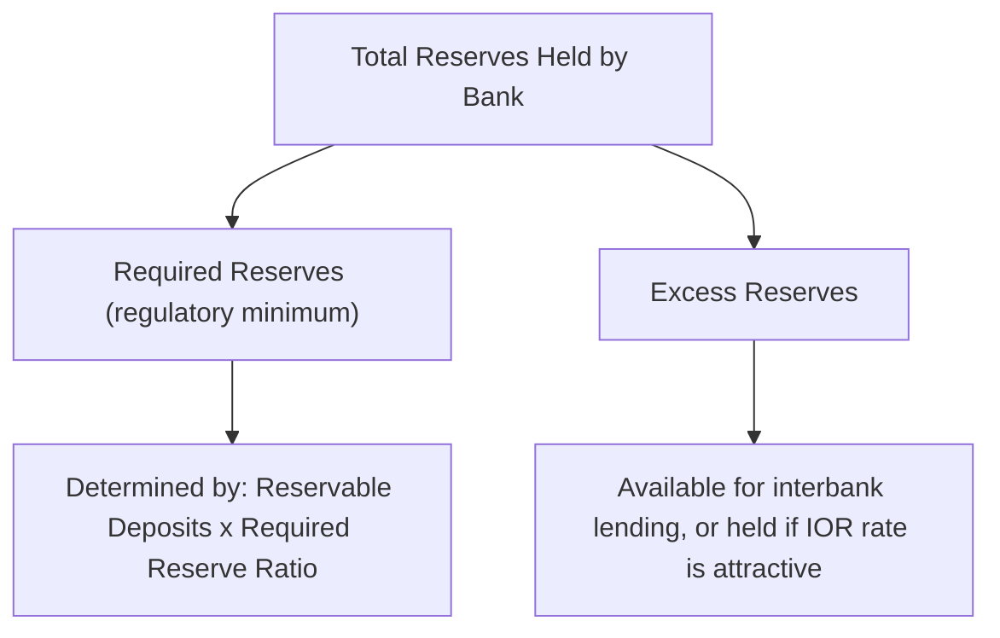

## Reserve Requirements

### Definition and Role

Reserve requirements are regulatory minimums specifying the fraction of certain deposit liabilities (or, in some frameworks, other specified balance sheet items) that depository institutions must hold as reserves — either as vault cash or as balances at the central bank — rather than lend out or invest. Historically classified as one of the three traditional monetary policy instruments alongside the discount rate and open market operations, reserve requirements directly constrain the money multiplier and the potential expansion of bank credit and deposits from a given base of reserves.

### The Money Multiplier Mechanism

**Key Points**

- In the traditional textbook money multiplier model, a required reserve ratio $r$ implies a maximum deposit expansion multiplier of $1/r$ for a given injection of reserves
- Raising $r$ reduces the multiplier, constraining deposit and credit creation from a given reserve base
- Lowering $r$ increases the multiplier, permitting more deposit and credit creation from the same reserve base

$$\Delta D_{max} = \frac{1}{r} \times \Delta R$$

where $\Delta D_{max}$ is the maximum change in deposits, $r$ is the required reserve ratio, and $\Delta R$ is the initial change in reserves.

[Inference] The simple money multiplier model is a standard pedagogical simplification; actual deposit and credit expansion in modern banking systems depends on additional factors including loan demand, bank capital constraints, and (in abundant-reserves regimes) the fact that reserves are not the binding constraint on lending, so the multiplier framework's predictive value for real-world credit creation is limited in contemporary floor-system operating regimes.

### Types of Reserve Requirement Systems

**Contemporaneous vs. Lagged Reserve Accounting**

- **Lagged Reserve Requirement (LRR)**: the reserve requirement for a given maintenance period is based on deposit levels from an earlier (lagged) period, giving banks certainty about their required reserve level in advance
- **Contemporaneous Reserve Requirement (CRR)**: the requirement is based on deposits in the same (or nearly the same) period, tightening the link between current deposit behavior and reserve needs but creating more uncertainty for reserve management

**Averaging Provisions**

Most systems allow banks to meet requirements as an *average* over a maintenance period (e.g., the Fed's and ECB's multi-week reserve maintenance periods) rather than a hard daily minimum, giving banks flexibility to run reserve deficits on some days offset by surpluses on others — a key liquidity management tool that reduces day-to-day interbank rate volatility.

### The Federal Reserve: From Positive Requirements to Zero

**Key Points**

- Historically, the Fed imposed graduated reserve requirement ratios on transaction deposits (checking accounts) above specified exemption thresholds, with no requirement on most time and savings deposits
- In March 2020, the Federal Reserve reduced all reserve requirement ratios to **zero percent**, effectively eliminating reserve requirements as an active US monetary policy tool
- This action was explicitly framed as a technical simplification consistent with the post-2008 "ample reserves" operating framework, where reserve requirements had already become non-binding for most institutions given the vast quantity of reserves in the system following QE

[Inference] The move to zero percent reserve requirements is generally interpreted as the formal conclusion of a de facto trend, since reserve requirements had already ceased to function as the binding constraint on bank lending well before the 2020 change, given the abundant-reserves environment established after the 2008 financial crisis.

### Reserve Requirements Elsewhere: Continued Active Use

Unlike the Fed, several major central banks continue to use reserve requirements as an active instrument:

| Central Bank | Reserve Requirement Status | Notes |
| --- | --- | --- |
| Federal Reserve | 0% (since March 2020) | Effectively retired as an active tool |
| ECB | Positive, currently unremunerated (as of the ECB's September 2023 policy change removing remuneration on minimum reserves) | Used more for liquidity management smoothing than active policy signaling |
| PBOC | Actively and frequently adjusted (Reserve Requirement Ratio, RRR) | A primary, frequently-used policy lever, including targeted RRR cuts for specific sectors (e.g., small business lending) |
| Bank of Japan | Minimal binding role | Reserve requirement system exists but is not the operative policy instrument |
| Reserve Bank of India | Cash Reserve Ratio (CRR), actively used | Significant, actively adjusted tool in the Indian monetary framework |

[Inference] The PBOC's continued heavy reliance on RRR adjustments as a primary policy lever, in contrast to the Fed's and BOJ's near-abandonment of the tool, reflects both China's historically less price-based transmission mechanism and the RRR's usefulness as a blunt but powerful instrument for influencing aggregate credit conditions and targeting specific categories of lending (e.g., differential RRR treatment for banks meeting small-business lending quotas).

### Why Major Central Banks Moved Away from Reserve Requirements

**Key Points**

- **Blunt instrument**: reserve requirement changes affect the entire banking system uniformly and are difficult to fine-tune relative to interest-rate-based tools
- **Competitive distortion**: unremunerated (non-interest-bearing) reserve requirements function as an implicit tax on banks, potentially disadvantaging domestic banks relative to foreign competitors not subject to the same requirement, or encouraging regulatory arbitrage (e.g., growth of unregulated shadow banking to avoid the requirement)
- **Reduced necessity in abundant-reserves regimes**: once reserves are abundant (post-QE), setting an interest rate on reserves (e.g., the Fed's IORB) is a more precise and flexible tool for rate control than a required reserve ratio, since the marginal reserve unit is remunerated directly rather than constrained by a binding minimum
- **Volatility in reserve demand**: reserve requirements historically introduced volatility in short-term rates around maintenance period settlement dates, motivating a shift toward reserve averaging provisions and eventually toward interest-on-reserves-based frameworks that reduce this volatility altogether

### Required Reserves vs. Excess Reserves

**Example**

Consider a depository institution with $1 billion in reservable deposit liabilities under a hypothetical 10% required reserve ratio. The institution must hold at least $100 million in reserves (vault cash plus central bank balances) against this deposit base. If the institution actually holds $150 million in reserves, the additional $50 million constitutes **excess reserves** — reserves held beyond the regulatory minimum, which the institution may choose to lend in the interbank market, invest, or simply hold (particularly if the central bank pays a competitive rate of interest on excess reserves, as under the Fed's IORB framework).

### Reserve Requirements as a Macroprudential Tool

**Key Points**

- Beyond monetary policy signaling, reserve requirements (and related instruments such as liquidity coverage ratios) are increasingly framed as **macroprudential** tools aimed at financial stability rather than pure monetary transmission
- Countercyclical or differentiated reserve requirements — higher requirements during credit booms, lower during downturns, or differentiated by currency denomination (relevant in emerging markets with significant foreign-currency lending) — have been used, particularly in emerging market economies, to dampen excessive credit growth or capital-flow-driven instability
- This macroprudential framing is distinct from, but related to, other post-2008 regulatory reserve-adjacent requirements such as the Basel III **Liquidity Coverage Ratio (LCR)** and **Net Stable Funding Ratio (NSFR)**, which impose their own liquid-asset-holding requirements independent of central-bank-administered reserve requirements

[Inference] The use of reserve requirements as a macroprudential rather than purely monetary tool is more prominent in emerging market central banking practice than among the Fed, ECB, or BOJ, where Basel III liquidity regulation has largely superseded reserve requirements as the primary regulatory lever for bank liquidity management.

### Reserve Requirements and the Interest Rate Corridor

In systems retaining active reserve requirements (e.g., the ECB, PBOC), the requirement interacts with the broader corridor framework: reserves held to satisfy the requirement may or may not be remunerated, and the treatment of required versus excess reserves (differential remuneration, if any) affects banks' incentives to manage their reserve positions actively within the maintenance period, feeding back into short-term interbank rate dynamics addressed under open market operations.

### Conclusion

Reserve requirements occupy a diminished but not uniformly abandoned role among the traditional trio of monetary policy instruments. Major advanced-economy central banks operating in ample-reserves regimes (the Fed, and to a lesser degree the BOJ) have effectively retired reserve requirements as an active policy lever in favor of interest-rate-based tools such as interest on reserve balances, while other systems — most notably the PBOC, and several emerging market central banks — continue to use reserve requirement adjustments, including targeted and differentiated variants, as a primary and frequently-deployed instrument for managing aggregate credit conditions and, increasingly, macroprudential objectives.

**Related Topics**

- The money multiplier model and its limitations in modern banking systems
- Interest on Reserve Balances (IORB) as a replacement mechanism for reserve-requirement-based rate control
- The PBOC's differentiated and targeted Reserve Requirement Ratio (RRR) policy
- Basel III liquidity regulation: LCR and NSFR compared to central-bank reserve requirements
- Macroprudential policy tools and countercyclical capital buffers
- Reserve maintenance periods and averaging provisions across central banks
- The shift from scarce-reserves (corridor) to abundant-reserves (floor) operating frameworks
- Shadow banking and regulatory arbitrage around reserve requirements