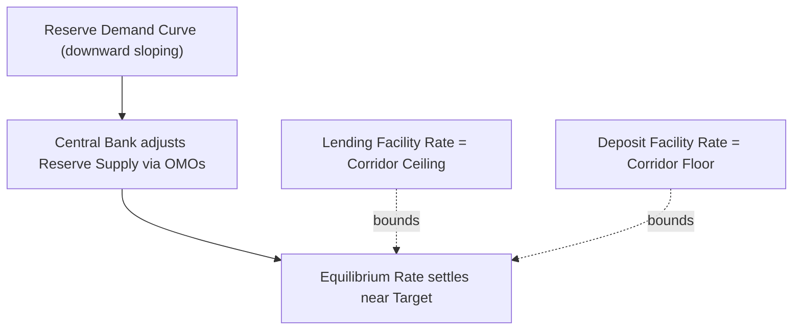
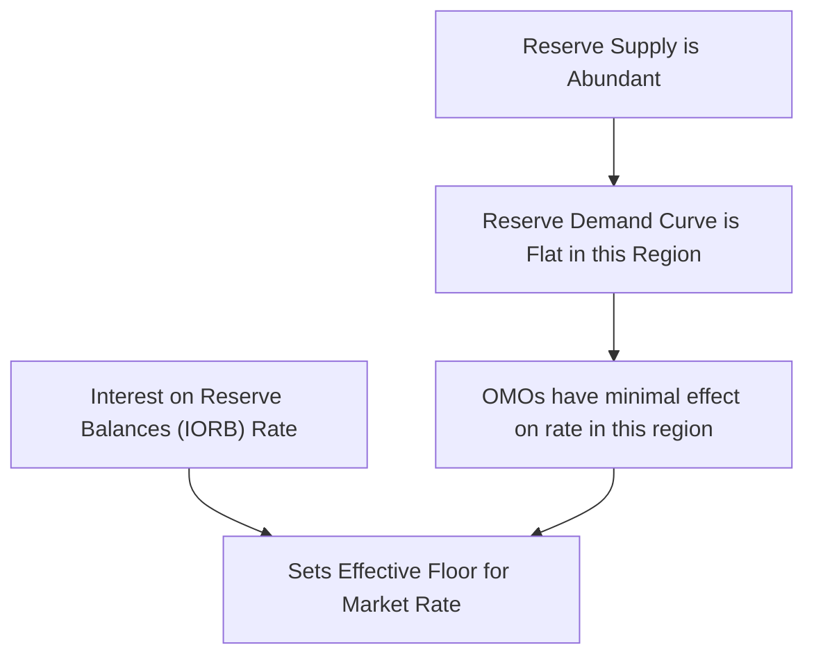
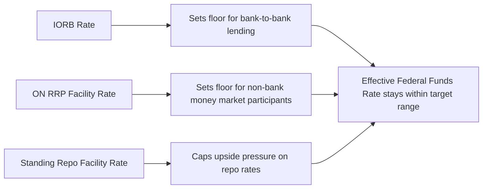

## Interest Rate Corridors and Floor Systems

### Definition and Role

Interest rate corridor and floor systems are alternative operational frameworks central banks use to steer short-term market interest rates toward a policy target, distinguished primarily by the level of reserves in the banking system relative to reserve demand, and by which instrument does the主要 work of anchoring the market rate. A **corridor system** relies on scarce reserves and active open market operations, bounded above and below by standing facility rates. A **floor system** relies on abundant reserves and an administered interest rate paid on reserve balances, which sets a floor beneath which the market rate is unlikely to fall due to arbitrage.

### The Corridor System: Structure and Logic

**Key Points**

- Reserves are kept relatively scarce, so the reserve demand curve is downward-sloping and reasonably steep in the region where the central bank operates
- The central bank uses open market operations to adjust the aggregate supply of reserves, moving the equilibrium point along the demand curve to hit the target rate
- The **standing lending facility rate** sets the ceiling: no bank would pay more than this rate to borrow overnight, since it can always borrow from the central bank at this rate against eligible collateral
- The **standing deposit facility rate** sets the floor: no bank would accept less than this rate to lend, since it can always deposit with the central bank at this rate
- The gap between the ceiling and floor rates is the **corridor width**, and the target rate is typically set at or near the corridor's midpoint

$$i_{deposit} \leq i_{target} \leq i_{lending}$$

### The Floor System: Structure and Logic

**Key Points**

- Reserves are abundant — well beyond what banks need or want to hold for transactional or regulatory purposes — so the reserve demand curve is flat (or nearly flat) in the relevant region
- In this flat region, changes in the *quantity* of reserves via open market operations have little to no effect on the market rate, because banks are already satiated with reserves
- Instead, the central bank sets the market rate primarily via an administered rate — **interest on reserve balances** — since no bank will lend reserves in the interbank market for materially less than what it can earn risk-free by holding them at the central bank
- This administered rate becomes an effective **floor** for the market rate, and the central bank's operational task shifts from managing reserve *quantity* to managing the *price* paid on reserves directly

$$i_{market} \approx i_{IOR} + \text{(small negative spread reflecting frictions and non-bank participation)}$$

### Comparative Diagram: Corridor vs. Floor

(svg_diagram) Corridor System vs. Floor System

<svg xmlns="http://www.w3.org/2000/svg" viewBox="0 0 700 380">
<text x="175" y="25" font-size="16" font-weight="bold" text-anchor="middle" fill="#1a1a1a">Corridor System (svg_diagram)</text>
<line x1="60" y1="300" x2="60" y2="50" stroke="#000" stroke-width="1.5" />
<line x1="60" y1="300" x2="300" y2="300" stroke="#000" stroke-width="1.5" />
<text x="30" y="60" font-size="11" fill="#1a1a1a">Rate</text>
<text x="270" y="320" font-size="11" fill="#1a1a1a">Reserves</text>
<path d="M 80 80 C 150 90, 220 220, 290 280" fill="none" stroke="#2b6cb0" stroke-width="2.5" />
<line x1="60" y1="100" x2="300" y2="100" stroke="#c53030" stroke-width="2" stroke-dasharray="6,3" />
<text x="305" y="103" font-size="10" fill="#c53030">Lending Rate (ceiling)</text>
<line x1="60" y1="230" x2="300" y2="230" stroke="#2f855a" stroke-width="2" stroke-dasharray="6,3" />
<text x="305" y="233" font-size="10" fill="#2f855a">Deposit Rate (floor)</text>
<circle cx="200" cy="165" r="4" fill="#1a1a1a" />
<text x="210" y="160" font-size="10">Target Rate</text>

<text x="525" y="25" font-size="16" font-weight="bold" text-anchor="middle" fill="`#1a1a1a`">Floor System</text>

<line x1="410" y1="300" x2="410" y2="50" stroke="#000" stroke-width="1.5" />

<line x1="410" y1="300" x2="650" y2="300" stroke="#000" stroke-width="1.5" />

<text x="380" y="60" font-size="11" fill="`#1a1a1a`">Rate</text>

<text x="620" y="320" font-size="11" fill="`#1a1a1a`">Reserves</text>

<path d="M 430 90 C 480 95, 520 250, 640 255" fill="none" stroke="`#2b6cb0`" stroke-width="2.5" />

<line x1="410" y1="240" x2="650" y2="240" stroke="`#2f855a`" stroke-width="2" stroke-dasharray="6,3" />

<text x="500" y="235" font-size="10" fill="`#2f855a`">IORB Rate (floor)</text>

<text x="500" y="270" font-size="10" fill="`#1a1a1a`">Abundant Reserves Region (flat curve)</text>

</svg>

### The Federal Reserve's Transition: Corridor to Floor

| Period | Regime | Primary Rate-Setting Mechanism |
| --- | --- | --- |
| Pre-2008 | Corridor (scarce reserves) | Frequent, small OMOs adjusting reserve quantity |
| 2008–2015 | Transitional (abundant reserves emerging, IOR introduced Oct 2008) | Interest on Excess Reserves (IOER) begins to anchor rate |
| 2015–present | Floor (ample/abundant reserves) | Interest on Reserve Balances (IORB) + Overnight Reverse Repo (ON RRP) facility |

[Inference] The Fed's 2008 introduction of interest on reserves is generally regarded as the pivotal structural change enabling the eventual floor-system transition, since it provided the administered-rate tool needed once large-scale asset purchases made reserves abundant; the full floor-system operating framework, however, is more commonly dated to the Fed's explicit 2019 "ample reserves" policy statement following its post-crisis operating framework review.

### The "Ample Reserves" Framework (Fed Terminology)

The Federal Reserve's current operating framework is officially termed an **ample reserves regime**, distinguished conceptually from a pure floor system in that reserves are kept "ample" — comfortably above the level associated with reserve scarcity, but not necessarily maximal — with small, frequent adjustments to the ON RRP facility rate and IORB rate used to keep the effective federal funds rate within the target range, supplemented by the **Standing Repo Facility (SRF)**, introduced in 2021, which caps upside pressure on repo rates by allowing eligible counterparties to borrow reserves on demand against Treasury and agency collateral.

### Why the ON RRP Facility Matters in a Floor System

**Key Points**

- IORB is only available to depository institutions with accounts at the Fed, but a significant share of overnight lending in short-term funding markets comes from non-bank participants (money market funds, GSEs) that cannot earn IORB directly
- Without a floor available to these non-bank lenders, they might be willing to lend at rates below IORB, since they have no arbitrage-free alternative — potentially causing the effective market rate to drift below the intended floor
- The **ON RRP facility** extends floor-setting to these non-bank counterparties by allowing them to invest overnight with the Fed directly at the ON RRP rate, closing this gap and reinforcing the floor across a broader set of market participants

### The ECB's Hybrid Approach

**Key Points**

- The ECB operates a corridor system in formal structure (marginal lending facility as ceiling, deposit facility as floor, main refinancing rate as the target/midpoint), but the *effective* operating point within that corridor has varied significantly depending on the level of excess liquidity in the euro-area banking system
- During periods of very high excess liquidity (e.g., following large-scale asset purchase programs and pandemic-era TLTROs), the overnight interbank rate has tended to trade very close to the **deposit facility rate** rather than near the main refinancing rate — a floor-like outcome emerging from an abundant-liquidity condition within a formally corridor-structured system
- In 2019, the ECB narrowed the corridor (reducing the spread between the marginal lending facility and main refinancing rate, and between the main refinancing rate and deposit facility rate) partly in response to this dynamic

[Inference] The ECB's experience illustrates that the corridor/floor distinction is not purely a matter of formal facility design but depends materially on the prevailing liquidity conditions — a corridor-structured system can behave like a de facto floor system when excess liquidity is sufficiently large, blurring the conceptual line between the two regime types in practice.

### Trade-offs Between Corridor and Floor Systems

| Consideration | Corridor System | Floor System |
| --- | --- | --- |
| Reserve scarcity required | Yes | No (abundant reserves) |
| Precision of rate control | Depends on active OMO management | Generally high, via administered rate |
| Interbank market activity | Encouraged (banks trade to manage reserve positions) | May be reduced (IORB reduces incentive to lend to other banks) |
| Central bank balance sheet size | Can remain smaller | Necessarily large (reserves must be abundant) |
| Operational complexity | Higher (frequent OMO calibration needed) | Lower for day-to-day rate control, but requires managing balance sheet size separately |
| Vulnerability to reserve demand shocks | Higher (steep demand curve amplifies quantity shocks into rate volatility) | Lower (flat demand curve absorbs quantity shocks with minimal rate effect) |

[Inference] The shift toward floor systems among several major central banks since the 2008 crisis is often attributed to the operational simplicity and rate-control reliability of administering a price (interest on reserves) directly, rather than relying on precise quantity calibration under a steep and potentially unstable reserve demand curve, though this trade-off comes at the cost of requiring and maintaining a permanently larger central bank balance sheet.

### Reserve Demand Curve: Conceptual Summary

**Example**

Consider a stylized reserve demand curve with three regions: (1) a "scarce reserves" region at low reserve quantities, where the curve is steep and small changes in supply produce large rate movements — characteristic of pre-2008 corridor operations; (2) a "transitional" region at intermediate reserve levels, where the curve begins to flatten but retains some slope; and (3) an "abundant/ample reserves" region at high reserve quantities, where the curve is essentially flat and the market rate is pinned near the administered floor rate regardless of modest quantity fluctuations. Central banks operating a floor system deliberately keep reserve supply within this third region.

### Conclusion

The choice between a corridor system and a floor system reflects a central bank's operating regime for reserve supply — scarce versus abundant — and correspondingly, whether short-term rate control is achieved primarily through active quantity management (open market operations bounded by standing facilities) or through direct price administration (interest on reserve balances, reinforced by facilities like the ON RRP for non-bank participants). The post-2008 shift toward floor systems among major advanced-economy central banks reflects both the practical consequence of large-scale asset purchase programs (which mechanically created abundant reserves) and a deliberate operational preference for the greater reliability of price-based rate control once reserves were already abundant.

**Related Topics**

- Interest on Reserve Balances (IORB) and its historical introduction (2008)
- The Overnight Reverse Repo (ON RRP) facility and its role for non-bank counterparties
- The Standing Repo Facility (SRF) and repo market stability
- The ECB's excess liquidity dynamics and effective operating point within its corridor
- Reserve demand curve estimation and the transition between scarce, abundant, and ample regimes
- The September 2019 US repo market rate spike as a case study in reserve scarcity misjudgment
- Central bank balance sheet size as a structural feature of floor-system operation
- Comparative operating frameworks across the Fed, ECB, BOE, and BOJ