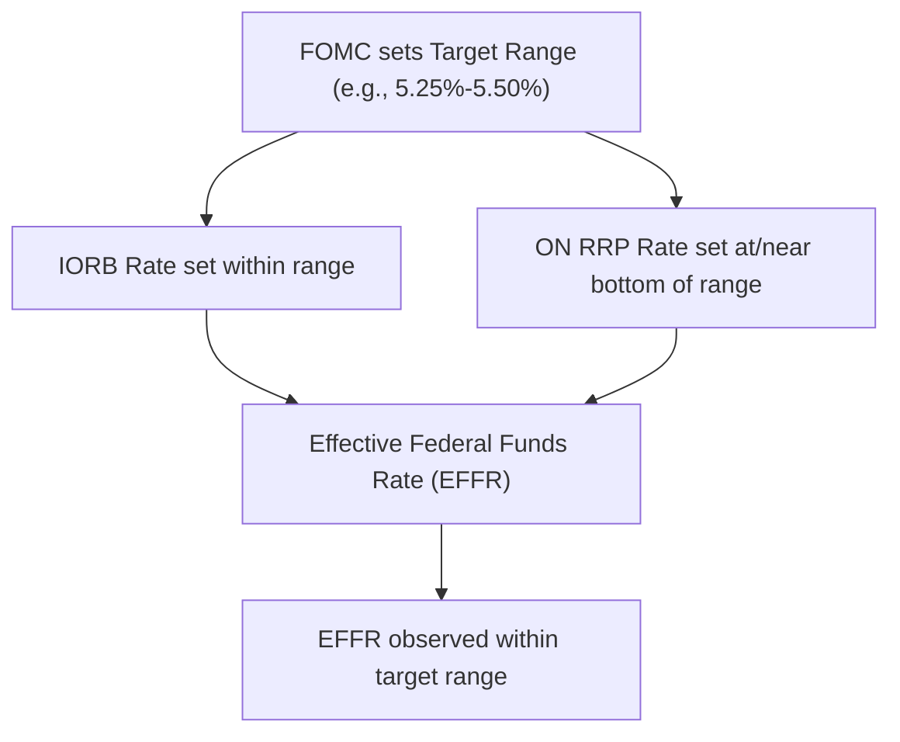
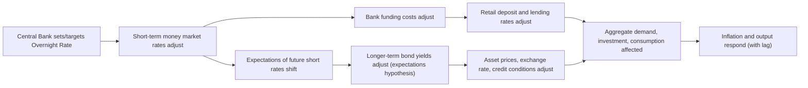

## Policy Rate Setting and the Overnight Rate

### Definition and Role

The **policy rate** is the short-term interest rate a central bank targets (or administers directly) as the primary lever through which it implements monetary policy. In most modern frameworks, the policy rate is anchored to the **overnight interbank rate** — the rate at which depository institutions lend reserve balances to one another for one business day — because this rate sits at the very front end of the yield curve and transmits, through arbitrage and expectations, to the broader structure of interest rates relevant to saving, investment, and borrowing decisions throughout the economy.

### Why the Overnight Rate is the Anchor

**Key Points**

- Depository institutions must settle payments and satisfy reserve or liquidity requirements on a daily basis; a well-functioning overnight interbank market allows institutions with a temporary reserve surplus to lend to institutions with a temporary shortfall
- Because overnight lending is nearly risk-free (very short maturity, generally to well-capitalized counterparties) and highly liquid, it is a natural point for a central bank to exert precise control via reserve supply or administered rates
- Arbitrage across the maturity spectrum links the overnight rate to expectations of future overnight rates, which in turn shapes term rates via the **expectations hypothesis** of the term structure — longer-term rates approximate the average expected path of short-term rates plus a term premium

$$i_{n} \approx \frac{1}{n}\sum_{t=1}^{n} E[i_{1,t}] + \phi_n$$

where $i_n$ is the $n$-period rate, $E[i_{1,t}]$ is the expected overnight rate at future date $t$, and $\phi_n$ is the term premium.

### Named Overnight Rate Benchmarks by Jurisdiction

| Jurisdiction | Policy Rate Target | Key Overnight Benchmark |
| --- | --- | --- |
| United States | Federal Funds Rate (target range) | Effective Federal Funds Rate (EFFR); Secured Overnight Financing Rate (SOFR) for secured markets |
| Euro Area | Deposit Facility Rate (DFR), post-2022 primary reference | Euro Short-Term Rate (€STR) |
| United Kingdom | Bank Rate | SONIA (Sterling Overnight Index Average) |
| Japan | Short-term policy rate (post-YCC exit, since March 2024) | Tokyo Overnight Average Rate (TONAR) |
| China | 7-Day Reverse Repo Rate (increasingly primary policy signal) | DR007 (Depository Institutions Repo Rate, 7-day) |

[Inference] The global shift away from LIBOR-style survey-based benchmarks toward transaction-based overnight rates (SOFR, €STR, SONIA, TONAR) following the 2012 LIBOR manipulation scandal is widely regarded as a structural improvement in benchmark rate integrity, since these replacement rates are derived from actual observed transactions rather than bank submissions subject to manipulation incentives.

### Federal Funds Rate: Mechanics and Terminology

**Key Points**

- The Federal Open Market Committee (FOMC) sets a **target range** (e.g., "5.25%–5.50%") rather than a single point value, reflecting the reality that the actual traded rate fluctuates within a band around the desired level
- The **Effective Federal Funds Rate (EFFR)** is a volume-weighted median of actual overnight federal funds transactions, published daily by the Federal Reserve Bank of New York
- The Fed's implementation tools — Interest on Reserve Balances (IORB), the Overnight Reverse Repo (ON RRP) facility rate, and the Standing Repo Facility (SRF) — are calibrated to keep the EFFR within the target range under the current ample-reserves operating framework

### Policy Rate Decision Process: General Sequence

**Example**

A typical policy rate decision cycle (illustrative, following the FOMC model but broadly generalizable) proceeds through: (1) staff economic projections and briefing materials distributed to committee members in advance; (2) a multi-day meeting during which members review current data on inflation, employment, and financial conditions, and each present their individual assessment; (3) a vote on the target rate level (and any accompanying balance sheet or forward guidance decisions); (4) a public statement announcing the decision and providing rationale; (5) in some frameworks, a press conference from the chair/governor elaborating on the committee's reasoning and outlook; and (6) a delayed release of detailed meeting minutes (e.g., three weeks later for the FOMC) providing further insight into the committee's deliberation and any dissenting views.

### Determinants of Policy Rate Decisions: The Taylor Rule Framework

A widely-used normative and descriptive benchmark for policy rate setting is the **Taylor Rule**, which expresses the appropriate nominal policy rate as a function of the deviation of inflation from target and the output gap:

$$i_t = r^* + \pi_t + \alpha(\pi_t - \pi^*) + \beta(y_t - y_t^*)$$

where $i_t$ is the nominal policy rate, $r^*$ is the equilibrium real interest rate, $\pi_t$ is current inflation, $\pi^*$ is the inflation target, $(y_t - y_t^*)$ is the output gap, and $\alpha, \beta > 0$ are response coefficients (Taylor's original specification used $\alpha = \beta = 0.5$).

[Inference] While no major central bank mechanically follows the Taylor Rule in setting policy, it is widely used by economists, market analysts, and even some central bank communications as a benchmark for assessing whether a given policy rate stance appears loose or tight relative to a systematic historical reaction function; actual policy decisions incorporate a substantially broader information set including financial stability considerations, forward-looking judgment, and factors not captured by the rule's simple inputs.

### Forward Guidance and Rate Path Communication

**Key Points**

- Beyond the current rate decision, central banks increasingly communicate the *expected future path* of the policy rate to shape market expectations and extend policy influence along the yield curve
- The Fed's **Summary of Economic Projections (SEP)**, including the "dot plot" of individual FOMC participants' rate expectations, is a prominent example of quantitative forward guidance
- **Odyssean forward guidance** refers to explicit commitments (e.g., "rates will remain low until inflation exceeds X% for Y period"), while **Delphic forward guidance** refers to simple forecasts of the likely future rate path conditional on the economic outlook, without a binding commitment
- The Bank of Japan's 2013 commitment to overshoot the 2% inflation target before considering tightening is a widely-cited example of Odyssean-style guidance

### Overnight Rate Transmission to the Broader Economy

### Secured vs. Unsecured Overnight Rates

**Key Points**

- **Unsecured overnight rates** (e.g., the historical Fed Funds market, or LIBOR historically) reflect interbank lending without collateral, embedding some counterparty credit risk premium
- **Secured overnight rates** (e.g., SOFR, based on Treasury repo transactions) reflect collateralized lending, generally trading closer to a risk-free rate since collateral mitigates counterparty risk
- The shift toward secured benchmarks (SOFR replacing LIBOR in the US, for example) reflects both integrity concerns with survey-based unsecured benchmarks and a preference for rates grounded in deep, liquid, and manipulation-resistant transaction volumes

[Unverified] The specific volume and composition of underlying transactions for any given benchmark rate changes over time as market structure evolves, so practitioners should consult the administering body's current methodology documentation (e.g., the New York Fed for SOFR) rather than relying on a static description of the underlying transaction base.

### Divergence Between Policy Rate and Overnight Market Rate

**Example**

Even under normal operating conditions, some divergence between the targeted policy rate and the observed overnight market rate can occur due to quarter-end reporting effects (banks temporarily reducing balance sheet activity to improve regulatory ratio snapshots), Treasury bill issuance fluctuations affecting repo collateral supply, or unexpected shifts in reserve levels from Treasury General Account movements. The September 2019 US repo market rate spike — where the overnight repo rate briefly surged well above the federal funds target range — is a widely-studied instance of such divergence, ultimately attributed to a confluence of reserve scarcity (from ongoing balance sheet runoff) and a large concurrent Treasury settlement and corporate tax payment date draining reserves simultaneously.

### Conclusion

Policy rate setting centers on the overnight interbank rate as the primary transmission point between central bank action and the broader economy, implemented through the operational tools described under open market operations, standing facilities, and reserve requirements, but ultimately guided by a broader analytical and communicative framework encompassing benchmark rate design, forward guidance, and normative reaction-function benchmarks such as the Taylor Rule. The credibility and effectiveness of policy rate transmission depend not only on the mechanical tools used to hit the target but on the clarity and consistency of communication about the intended future rate path.

**Related Topics**

- The Taylor Rule and alternative monetary policy reaction functions
- Forward guidance: Odyssean vs. Delphic approaches and central bank communication strategy
- The transition from LIBOR to SOFR/€STR/SONIA/TONAR benchmark rates
- The expectations hypothesis and term structure of interest rates
- The September 2019 US repo market rate spike as a case study
- Interest rate pass-through to retail deposit and lending rates
- The FOMC's Summary of Economic Projections and the "dot plot"
- Central bank credibility and time-inconsistency in policy rate commitments