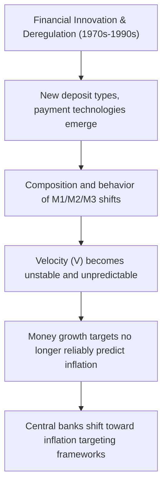

## Monetary Targeting

### Definition and Role

Monetary targeting is a monetary policy framework in which a central bank announces and pursues a numerical target for the growth rate of a monetary aggregate — typically a measure of the money supply such as M1, M2, or a monetary base — on the theoretical premise that stable control over money growth translates, via a stable money demand function, into predictable and controlled inflation over the medium term. Monetary targeting was the dominant policy framework among several major central banks from the 1970s through the 1980s and early 1990s, before being largely superseded by inflation targeting.

### Theoretical Foundation: The Quantity Theory of Money

Monetary targeting rests on the quantity theory of money, expressed in the equation of exchange:

$$MV = PY$$

where $M$ is the money supply, $V$ is the velocity of money (the average frequency with which a unit of currency is spent), $P$ is the price level, and $Y$ is real output. Rearranged in growth rates:

$$\hat{M} + \hat{V} = \hat{P} + \hat{Y}$$

If velocity growth ($\hat{V}$) is stable and predictable, and if the central bank has a reasonable estimate of sustainable real output growth ($\hat{Y}$), then controlling money supply growth ($\hat{M}$) directly determines inflation ($\hat{P}$):

$$\hat{P} = \hat{M} + \hat{V} - \hat{Y}$$

[Inference] The entire logical structure of monetary targeting depends critically on the assumption of stable, predictable velocity; this is not merely a technical detail but the load-bearing assumption of the framework, since if velocity is unstable, targeting money growth provides no reliable control over inflation regardless of how precisely the money supply target itself is hit.

### Monetarist Origins

Monetary targeting is closely associated with **monetarism**, particularly the work of Milton Friedman, who argued that "inflation is always and everywhere a monetary phenomenon" and advocated for a simple, rule-based approach — a constant, low growth rate for the money supply (the "k-percent rule") — as superior to discretionary policy, on the grounds that discretionary fine-tuning was subject to long and variable lags, imperfect information, and time-inconsistency problems.

$$\hat{M}_t = k \quad \text{for all } t \quad \text{(Friedman's k-percent rule)}$$

### Choice of Monetary Aggregate

**Key Points**

- **M0/Monetary Base**: currency in circulation plus bank reserves — most directly controllable by the central bank, but least closely linked to spending behavior
- **M1**: currency plus demand deposits (and similar highly liquid instruments) — closer to a "transactions" measure of money
- **M2**: M1 plus savings deposits, small time deposits, and retail money market funds — broader, often more stable in its relationship to nominal spending in some economies, but less directly controllable
- **M3**: M2 plus large time deposits, institutional money market funds, and other broader liquid liabilities — the broadest commonly-tracked aggregate

[Inference] The choice among aggregates reflects a trade-off central banks faced explicitly during the monetarist era: narrower aggregates are more precisely controllable via central bank operations but may have a less stable relationship to nominal income, while broader aggregates may relate more stably to spending but are harder to control directly, since they include instruments influenced by private financial innovation and portfolio behavior beyond the central bank's direct reach.

### Historical Practice: The Bundesbank Model

**Example**

The Deutsche Bundesbank is frequently cited as the most successful and disciplined historical practitioner of monetary targeting, announcing annual target ranges for central bank money growth (a variant close to M3) from 1975 through the introduction of the euro in 1999. The Bundesbank's framework combined a formal monetary target with a degree of pragmatic flexibility — target ranges (rather than point targets), explicit escape clauses referencing supply shocks, and a willingness to miss the announced target in a given year while maintaining medium-term credibility through consistent communication of the underlying rationale. [Inference] This blend of a nominally strict quantitative anchor with practical flexibility is often credited in the literature with the Bundesbank's reputation for anti-inflationary credibility, suggesting that the framework's disciplining effect on expectations may have derived as much from consistent communication and institutional reputation as from mechanical adherence to the numerical target itself.

### Historical Practice: The US Federal Reserve Under Volcker

**Example**

From October 1979 to 1982, under Chairman Paul Volcker, the Federal Reserve shifted operating procedures to emphasize control of non-borrowed reserves (and by extension, the money supply) rather than direct federal funds rate targeting, in an effort to break entrenched high inflation. This period saw the federal funds rate become highly volatile (a direct consequence of prioritizing quantity control over rate stability) and interest rates rose to historically high levels, contributing to a sharp recession but succeeding in substantially reducing US inflation by the mid-1980s. The Fed abandoned formal monetary targeting as its primary operating procedure in 1982, following growing recognition of unstable money demand relationships.

### Decline of Monetary Targeting: The Velocity Instability Problem

**Key Points**

- Financial innovation — the proliferation of new deposit types, money market instruments, and payment technologies — progressively destabilized the relationship between conventional monetary aggregates and nominal income from the 1970s onward
- Deregulation of deposit interest rate ceilings (e.g., in the US) altered the composition and behavior of monetary aggregates in ways not well captured by historical velocity relationships
- As velocity became increasingly unpredictable, the core theoretical premise of monetary targeting — that controlling $M$ growth reliably controls $P$ growth — broke down empirically, even where central banks successfully hit their announced money growth targets
- Central banks progressively found that money supply growth was becoming a poor short-to-medium-term predictor of inflation, undermining the practical rationale for the framework

### Monetary Targeting vs. Inflation Targeting

| Feature | Monetary Targeting | Inflation Targeting |
| --- | --- | --- |
| Intermediate target | Growth rate of a monetary aggregate | None (or implicit); targets inflation directly |
| Theoretical basis | Stable quantity-theory relationship (stable velocity) | Forward-looking inflation forecast as the operating target |
| Instrument | Reserve/base control, or interest rates used to hit money growth target | Policy interest rate, set via forecast-based reaction function |
| Communication anchor | Announced money growth range | Announced numerical inflation target (e.g., 2%) |
| Key vulnerability | Velocity instability | Forecast errors, communication credibility |
| Historical trajectory | Dominant 1970s-1980s; largely abandoned by advanced economies by mid-1990s | Adopted by New Zealand (1990) first; now dominant framework among advanced-economy central banks |

### Monetary Targeting in Contemporary Practice: China as a Partial Exception

**Key Points**

- The People's Bank of China has historically announced annual M2 growth targets alongside other intermediate targets (credit aggregates, exchange rate stability), representing a continued, though increasingly de-emphasized, role for monetary/credit aggregate targeting relative to the pure inflation-targeting frameworks of the Fed, ECB, BOE, and (post-2013) BOJ
- [Unverified] The precise current status and emphasis given to explicit M2 targets in PBOC communications should be checked against the PBOC's most recent monetary policy reports, as the relative weight given to monetary aggregates versus price-based signals (such as the 7-day reverse repo rate) in Chinese monetary policy communication has evolved over time

### Two-Pillar and Hybrid Frameworks: The ECB Example

**Example**

The European Central Bank's original monetary policy strategy (from 1999) incorporated a "monetary pillar" — a reference value for M3 growth — alongside an "economic pillar" of broader macroeconomic analysis, in a framework often described as retaining a partial monetary-targeting legacy within an overall inflation-targeting-oriented strategy. Successive ECB strategy reviews (notably 2003 and 2021) progressively reduced the prominence given to the monetary pillar in official communication, reflecting the broader post-1990s trend away from primary reliance on monetary aggregates, while the ECB has continued to monitor monetary and credit developments as one input among several in its overall assessment.

### Enduring Analytical Relevance

**Key Points**

- Despite the decline of monetary targeting as an operational framework, the underlying quantity-theory relationship remains a reference point in monetary economics, particularly for understanding extreme cases — hyperinflation episodes are near-universally associated with extremely rapid money supply growth, where the quantity-theory relationship reasserts itself empirically even if it is unreliable for fine-tuning inflation in normal conditions
- The debate over whether large-scale asset purchase programs ("quantitative easing") would prove inflationary in the 2009–2015 period partly revived quantity-theory-style reasoning in public discourse, though the muted inflation outcomes of that period are often cited as evidence of velocity's continued instability (excess reserves created by QE were largely held rather than circulated, consistent with a sharp fall in velocity)

[Inference] The relatively subdued inflation outcome following the large post-2008 expansion of central bank balance sheets is frequently interpreted as further empirical evidence against a mechanical, stable-velocity version of the quantity theory in normal economic conditions, reinforcing the profession's general move away from monetary targeting as an operational framework, although this interpretation is not universally accepted and remains a live topic of debate among some monetarist-oriented economists.

### Conclusion

Monetary targeting represents a historically significant but largely superseded monetary policy framework, resting on the quantity theory of money and the presumption of stable velocity. Its rise reflected monetarist critiques of discretionary policy and a search for a credible nominal anchor during the high-inflation 1970s, while its decline reflected the empirical breakdown of stable money-demand relationships amid financial innovation and deregulation. Its legacy persists in hybrid frameworks (such as the ECB's original two-pillar strategy), in continued but diminished use in some emerging economies, and as a conceptual touchstone for understanding extreme monetary phenomena such as hyperinflation.

**Related Topics**

- The quantity theory of money and velocity of circulation
- Milton Friedman's monetarism and the k-percent rule
- The Volcker disinflation (1979–1982) as a historical case study
- Inflation targeting frameworks and their rise as a successor paradigm
- Money demand function estimation and instability
- Hyperinflation case studies and the quantity theory
- The ECB's two-pillar strategy and its evolution
- Quantitative easing and debates over its inflationary potential