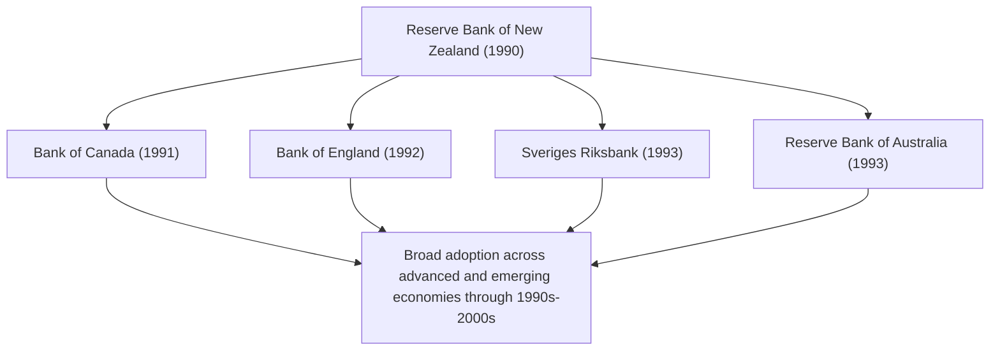
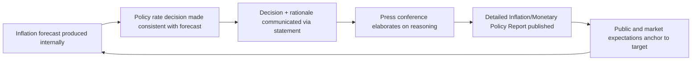

## Inflation Targeting

### Definition and Role

Inflation targeting is a monetary policy framework in which a central bank publicly announces a numerical target (or target range) for inflation over a specified horizon and conducts policy — primarily through adjustments to a short-term policy interest rate — with the explicit, transparent objective of achieving that target, using its own internal inflation forecast as the operational guide for policy decisions rather than an intermediate target such as a monetary aggregate or exchange rate. Inflation targeting has become the dominant monetary policy framework among advanced-economy central banks since its introduction in the early 1990s.

### Core Elements of Inflation Targeting

**Key Points**

- **A public numerical target**: an explicit inflation rate (or range) that the public, markets, and government can observe and hold the central bank accountable to
- **Instrument independence**: the central bank has freedom to adjust its policy rate as needed to pursue the target, without external interference in the tactical decision
- **The forecast as the intermediate target**: because monetary policy affects inflation with a lag, the central bank's own inflation forecast (rather than current inflation) functions as the effective day-to-day operating target — a framework sometimes described as "inflation-forecast targeting"
- **Transparency and communication**: regular publication of inflation forecasts, policy rationale, and (in many frameworks) explicit accountability mechanisms if the target is missed
- **Forward-looking, medium-term orientation**: most inflation-targeting central banks pursue the target over a multi-quarter to multi-year horizon rather than requiring inflation to sit exactly at target at every point in time

### Historical Origin: New Zealand, 1990

**Example**

The Reserve Bank of New Zealand is widely credited as the first central bank to formally adopt inflation targeting, doing so in 1990 under the Reserve Bank of New Zealand Act 1989, which established price stability as the RBNZ's primary statutory objective and created a Policy Targets Agreement between the Bank and the Minister of Finance specifying a numerical inflation target. This institutional innovation — combining a clear numerical target, instrument independence for the central bank, and an explicit accountability agreement — became the template subsequently adapted by Canada (1991), the United Kingdom (1992), Sweden (1993), Australia (1993), and numerous other economies over the following decade.

### Theoretical Rationale

**Key Points**

- **Nominal anchor**: a credible, publicly announced target anchors inflation expectations, which under most macroeconomic models directly influences actual inflation dynamics (through wage- and price-setting behavior that incorporates expected future inflation)
- **Addressing time inconsistency**: drawing on the Kydland-Prescott and Barro-Gordon literature on time-inconsistent monetary policy, a transparent, rule-guided (though not fully rule-bound) framework with public accountability helps address the temptation for discretionary policymakers to pursue short-term output gains at the cost of a long-term inflationary bias
- **Superior to monetary targeting**: unlike monetary targeting, inflation targeting does not require a stable relationship between an intermediate variable (money growth) and the ultimate objective (inflation), since the central bank targets the objective directly using its full information set and forecasting apparatus

$$\pi_t^e = \pi^* \quad \text{(credible target anchors expected inflation to the announced target)}$$

### Flexible vs. Strict Inflation Targeting

**Key Points**

- **Strict inflation targeting**: the central bank pursues the inflation target with no weight given to output or employment stabilization, adjusting policy solely to minimize deviations of inflation from target
- **Flexible inflation targeting** (the practically dominant variant among modern central banks): the central bank pursues the inflation target over the medium term while also giving weight to stabilizing output around its potential level, recognizing that pursuing the inflation target too aggressively in the short run can generate unnecessary output volatility
- This trade-off is commonly formalized via a central bank loss function:

$$L = (\pi_t - \pi^*)^2 + \lambda (y_t - y_t^*)^2$$

where $\lambda \geq 0$ represents the relative weight placed on output-gap stabilization versus inflation-gap stabilization; $\lambda = 0$ corresponds to strict inflation targeting.

[Inference] Nearly all inflation-targeting central banks in practice operate with $\lambda > 0$ (flexible inflation targeting), reflected in dual-mandate-like language even in formally single-mandate frameworks (e.g., the Bank of England's explicit secondary objective to support growth and employment, subject to meeting the inflation target), though the precise implicit weight given to output stabilization is not typically disclosed as an explicit numerical parameter by any central bank.

### Numerical Target Design Choices

| Design Choice | Options | Example |
| --- | --- | --- |
| Point target vs. range | Single point (e.g., "2%") vs. band (e.g., "1%–3%") | RBNZ initially used a band; Fed and ECB use point targets with symmetric tolerance |
| Target horizon | Fixed period (e.g., "within 2 years") vs. "medium term" (unspecified, flexible) | Most modern frameworks favor "medium term" language for flexibility |
| Price index used | Headline CPI vs. core CPI (excluding food/energy) vs. a specific deflator (e.g., US Personal Consumption Expenditures, PCE) | Fed targets headline PCE inflation, referencing core PCE as an analytical guide |
| Symmetry | Symmetric (equally averse to overshoots and undershoots) vs. asymmetric | ECB's 2021 strategy review explicitly adopted a symmetric 2% target, revising prior "below, but close to, 2%" asymmetric language |

### Accountability Mechanisms

**Example**

The Bank of England's inflation-targeting framework includes one of the most explicit accountability devices among major central banks: if inflation deviates from the 2% target by more than one percentage point in either direction, the Governor must write an open, published letter to the Chancellor of the Exchequer explaining the deviation, the policy response, and the expected timeline for returning to target. This mechanism functions as a visible, codified enforcement channel precisely because the BOE possesses instrument independence but not goal independence — the target itself is set by the government, and the letter mechanism holds the Bank publicly accountable for its use of the instruments it does control.

### Average Inflation Targeting: The Federal Reserve's 2020 Framework Revision

**Key Points**

- In August 2020, the Federal Reserve adopted **Flexible Average Inflation Targeting (FAIT)**, committing to seek inflation that averages 2% over time, implying that following periods of below-target inflation, the Fed would aim for inflation moderately above 2% for some time to compensate
- This represented a shift from a purely forward-looking point target toward a framework with an explicit make-up element, intended to prevent a downward drift in inflation expectations during periods of persistently low inflation, and to more symmetrically address the effective lower bound constraint on nominal interest rates
- The FAIT framework was formulated partly in response to the pre-pandemic decade's experience of persistently below-target inflation despite a low policy rate, a period during which conventional forward-looking inflation targeting was seen as potentially contributing to a self-reinforcing low-inflation, low-rate equilibrium

$$\bar{\pi}_{t-k,t} = \frac{1}{k+1}\sum_{j=0}^{k}\pi_{t-j} \approx \pi^* \quad \text{(average inflation targeting concept)}$$

[Unverified] The Fed conducted a further framework review with an announcement in 2025; the precise current status, any modifications to FAIT, and the framework's practical application should be verified against the Federal Reserve's most recent official framework statement rather than assumed static, since periodic strategic framework reviews (the Fed's own stated practice is every five years) can alter specific elements even while retaining an overall inflation-targeting orientation.

### Communication Tools Supporting Inflation Targeting

**Key Points**

- **Inflation Reports / Monetary Policy Reports**: regular (often quarterly) publications detailing the central bank's inflation forecast, the analytical basis for it, and the associated policy stance
- **Press conferences**: post-decision briefings (adopted by the Fed for every meeting since 2019, the ECB since its establishment, and most other major inflation-targeting central banks) providing real-time elaboration and Q&A
- **Fan charts**: probabilistic visual representations of the inflation forecast's uncertainty distribution around the central projection, pioneered by the Bank of England, now used by many inflation-targeting central banks to communicate forecast uncertainty explicitly rather than presenting a false impression of point-forecast precision

### Inflation Targeting and Exchange Rate Regimes

**Key Points**

- Inflation-targeting central banks generally operate under floating exchange rate regimes, since a simultaneously fixed exchange rate and an independent inflation target would generally violate the impossible trinity unless capital controls are also in place
- Emerging-market inflation targeters have historically faced a distinct challenge sometimes termed "fear of floating" — reluctance to allow full exchange rate flexibility due to concerns about pass-through effects on domestic inflation and balance-sheet effects from foreign-currency-denominated debt, leading some emerging-market inflation targeters to intervene in currency markets more actively than pure inflation-targeting theory would suggest

### Inflation Targeting vs. Alternative Frameworks

| Framework | Intermediate/Operating Target | Representative Adopters |
| --- | --- | --- |
| Inflation Targeting | Central bank's own inflation forecast | RBNZ, Bank of Canada, BOE, Sweden, Fed (FAIT variant), BOJ (since 2013) |
| Monetary Targeting | Growth rate of a monetary aggregate | Historical Bundesbank, historical Fed (1979–1982) |
| Exchange Rate Targeting | A fixed or crawling peg to a reference currency | Hong Kong Monetary Authority (USD peg), historical European Exchange Rate Mechanism participants |
| Nominal GDP Targeting | Level or growth rate of nominal GDP | Not formally adopted by any major central bank as of this writing; a prominent academic proposal |

### Criticisms and Limitations

**Key Points**

- **Neglect of financial stability**: pre-2008 inflation-targeting frameworks were criticized for focusing narrowly on consumer price inflation while asset price bubbles and financial imbalances built up largely unaddressed by the policy rate, contributing to post-crisis efforts to incorporate macroprudential tools alongside (rather than as a substitute for) inflation targeting
- **Effective lower bound constraint**: a low inflation target (2%, in most cases) combined with a low equilibrium real interest rate can leave limited conventional policy room during downturns, a concern that partly motivated the Fed's shift to average inflation targeting and broader discussion of raising inflation targets (though no major central bank has formally raised its numerical target as of this writing)
- **Measurement and index choice sensitivity**: the choice of price index (headline vs. core, CPI vs. PCE) can materially affect whether a given inflation reading is judged on-target, generating occasional public confusion or debate about which measure is the "true" policy-relevant one

[Inference] The financial-stability criticism of inflation targeting is generally regarded as having led to a broadening of central bank toolkits (macroprudential regulation, stress testing, and explicit financial stability mandates) alongside, rather than as a replacement for, the inflation-targeting core framework, since no major central bank has abandoned numerical inflation targeting as its central organizing framework post-2008.

### Conclusion

Inflation targeting represents the dominant contemporary monetary policy framework among advanced economies, distinguished from its predecessor (monetary targeting) by directly targeting the ultimate policy objective using the central bank's own forecast, rather than relying on an intermediate variable whose relationship to inflation may prove unstable. Its core design elements — a public numerical target, instrument independence, transparent communication, and explicit accountability mechanisms — address the time-inconsistency problem central to modern monetary policy theory, while ongoing refinements (average inflation targeting, greater attention to financial stability, and continued debate over the effective lower bound) reflect the framework's adaptation to challenges revealed by the 2008 financial crisis and the subsequent low-rate decade.

**Related Topics**

- Kydland-Prescott time inconsistency and the Barro-Gordon model
- The Reserve Bank of New Zealand's 1990 framework as the founding case study
- Flexible Average Inflation Targeting (FAIT) and the Fed's 2020 framework revision
- Central bank communication tools: fan charts, dot plots, forward guidance
- The effective lower bound and unconventional monetary policy
- Financial stability mandates and macroprudential policy integration
- Nominal GDP targeting as an alternative framework proposal
- "Fear of floating" in emerging-market inflation-targeting regimes